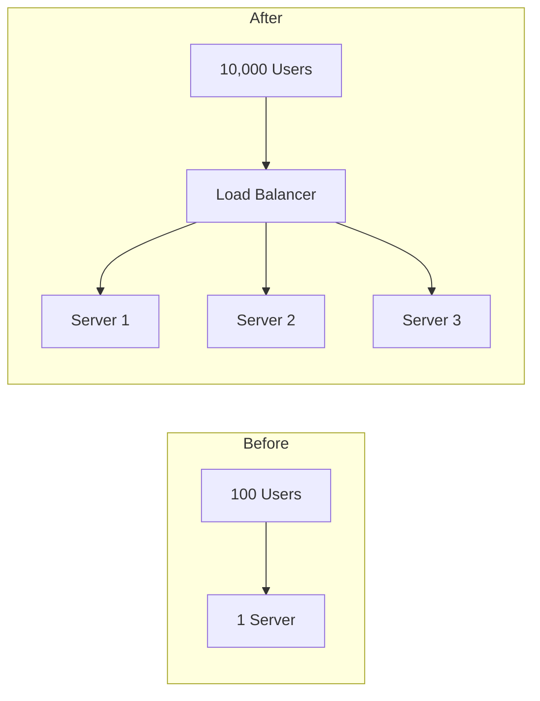
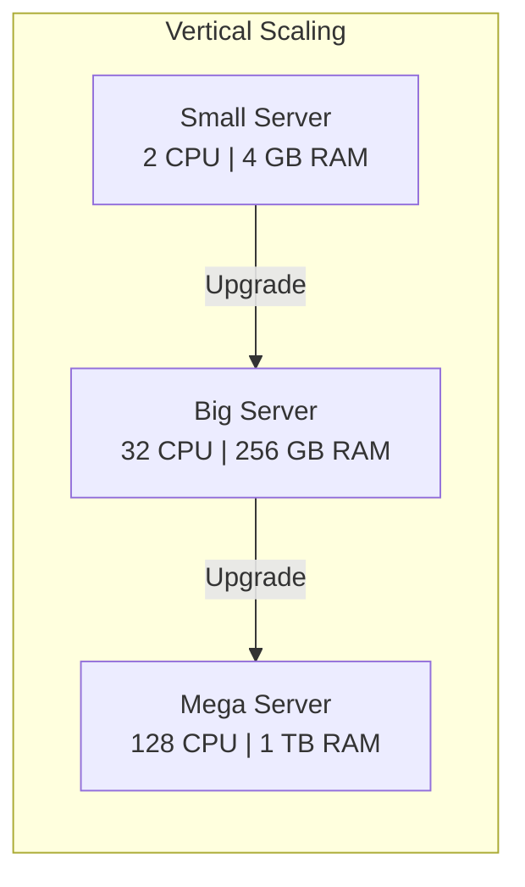
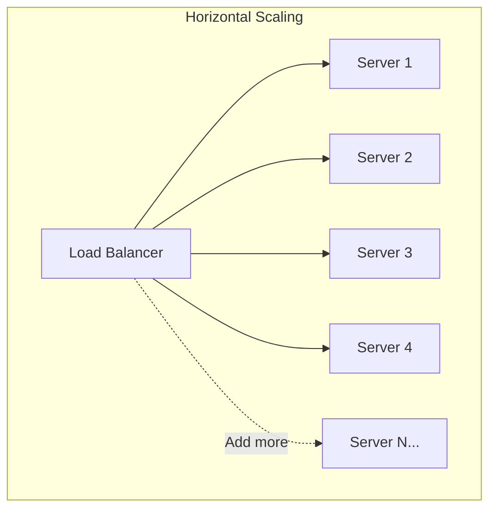
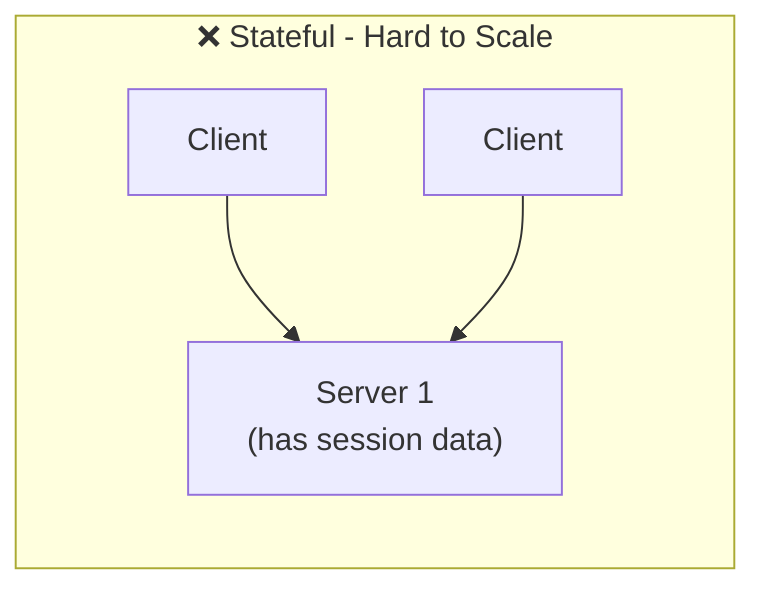
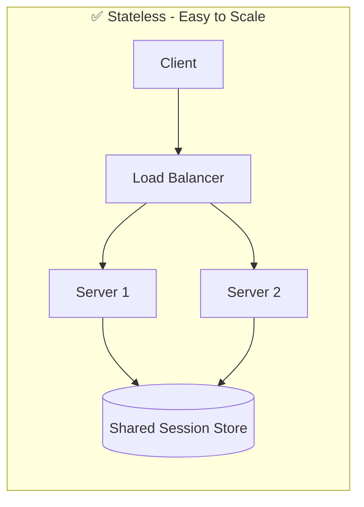
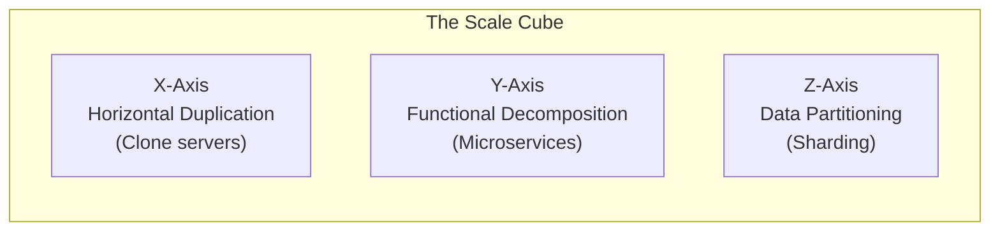
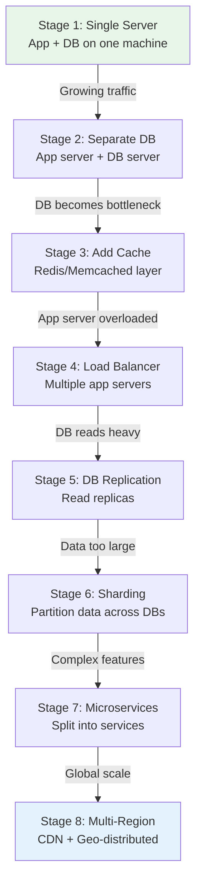

# Chapter 01  - Scalability Basics

> How do systems grow from serving 100 users to 100 million? Scalability is the foundation of every system design decision.

📖 [Read on Medium](#) · 🎬 [Watch on YouTube](#)

---

## What Is Scalability?

Scalability is a system's ability to handle **increased load**  - more users, more data, more requests  - without degrading performance.

A system is scalable if adding resources improves its capacity **proportionally**.



---

## Why Does Scalability Matter?

| Scenario | Without Scalability | With Scalability |
|----------|-------------------|-----------------|
| Traffic spike (viral post) | Site crashes | Auto-scales to handle load |
| User growth over years | Constant rewrites | Smooth capacity increase |
| Black Friday / sale event | Lost revenue | Handles peak seamlessly |
| Data growth | Queries slow down | Partitions absorb growth |

---

## Two Approaches to Scaling

### 1. Vertical Scaling (Scale Up)

Add more power to an **existing machine**  - more CPU, RAM, faster disks.



**Pros:**
- Simple  - no code changes needed
- No distributed system complexity
- Single point of data consistency

**Cons:**
- Hardware limits  - you can't infinitely upgrade a single machine
- Single point of failure  - one server dies, everything dies
- Expensive  - high-end hardware costs grow exponentially
- Downtime during upgrades

**Real-world analogy:** Making a single elevator faster and bigger vs. adding more elevators.

---

### 2. Horizontal Scaling (Scale Out)

Add **more machines** to distribute the load.



**Pros:**
- Near-unlimited growth  - just add more machines
- Fault tolerant  - one server dies, others continue
- Cost-effective  - use commodity hardware
- No downtime to add capacity

**Cons:**
- Complexity  - need load balancers, distributed state, data sync
- Data consistency challenges across nodes
- Network latency between machines
- More moving parts = more failure modes

**Real-world analogy:** Adding more checkout counters in a supermarket.

---

## Side-by-Side Comparison

```
┌──────────────────────────────────────────────────────────────────┐
│               VERTICAL vs HORIZONTAL SCALING                     │
├──────────────────────────────┬───────────────────────────────────┤
│       VERTICAL (Scale Up)    │     HORIZONTAL (Scale Out)        │
├──────────────────────────────┼───────────────────────────────────┤
│                              │                                   │
│    ┌──────────────────┐      │    ┌───┐ ┌───┐ ┌───┐ ┌───┐      │
│    │                  │      │    │ S │ │ S │ │ S │ │ S │      │
│    │   BIG SERVER     │      │    │ 1 │ │ 2 │ │ 3 │ │ 4 │      │
│    │                  │      │    └───┘ └───┘ └───┘ └───┘      │
│    │  128 CPU         │      │      ▲     ▲     ▲     ▲        │
│    │  1 TB RAM        │      │      └─────┴─────┴─────┘        │
│    │  10 TB SSD       │      │         Load Balancer             │
│    │                  │      │                                   │
│    └──────────────────┘      │    + Add more servers anytime     │
│                              │                                   │
│  Cost: $$$$$                 │  Cost: $ × N                      │
│  Limit: Hardware ceiling     │  Limit: Nearly unlimited          │
│  Failure: Total outage       │  Failure: Partial, graceful       │
│  Complexity: Low             │  Complexity: High                 │
└──────────────────────────────┴───────────────────────────────────┘
```

---

## Key Scalability Concepts

### Stateless vs Stateful Services

The **#1 rule** for horizontal scaling: make services **stateless**.





| Aspect | Stateful | Stateless |
|--------|----------|-----------|
| Session data | Stored in server memory | Stored externally (Redis, DB) |
| Scaling | Sticky sessions needed | Any server can handle any request |
| Failure recovery | Session lost if server dies | No data loss  - state is external |
| Load balancing | Constrained | Flexible |

---

### Amdahl's Law  - The Scaling Ceiling

Not all parts of a system can be parallelized. Amdahl's Law tells you the **maximum speedup** you can achieve.

```
                    1
Speedup = ─────────────────────
           (1 - P) + (P / N)

P = fraction that can be parallelized
N = number of processors/servers
```

```
Speedup vs Number of Servers
│
│          P = 95% ──────────────────────── 20x
│         /
│        / P = 90% ────────────────── 10x
│       / /
│      / /  P = 75% ──────────── 4x
│     / / /
│    / / /   P = 50% ──── 2x
│   / / / /
│  / / / /
│ / / / /
├─┴─┴─┴─┴──────────────────────────── Servers
1  2  4  8  16  32  64  128  256
```

**Takeaway:** If only 50% of your workload is parallelizable, adding 1000 servers still gives you at most **2x** speedup. Focus on reducing the sequential bottleneck.

---

### The Scale Cube  - Three Dimensions of Scaling



```
                        Z-Axis: Data Partitioning
                       /
                      /
                     /
                    /
    ┌──────────────┐
    │              │
    │   Scale      │ ──────── X-Axis: Cloning
    │   Cube       │          (Run N identical copies)
    │              │
    └──────────────┘
          │
          │
          Y-Axis: Functional Split
          (Split by service/function)
```

| Axis | Strategy | Example |
|------|----------|---------|
| **X** | Clone everything, run N copies behind load balancer | 10 identical API servers |
| **Y** | Split by function/service into microservices | Separate auth, orders, payments |
| **Z** | Split by data (sharding) | Users A-M → DB1, N-Z → DB2 |

---

### Capacity Planning  - The Numbers You Must Know

Every system designer should know these **latency numbers**:

```
┌──────────────────────────────────────────────────────┐
│          Latency Numbers Every Dev Should Know        │
├──────────────────────────────────────────┬───────────┤
│ L1 cache reference                       │     1 ns  │
│ L2 cache reference                       │     4 ns  │
│ Main memory (RAM) reference              │   100 ns  │
│ SSD random read                          │   16 μs   │
│ HDD random read                          │   2 ms    │
│ Round trip within same datacenter        │   0.5 ms  │
│ Round trip CA → Netherlands              │   150 ms  │
├──────────────────────────────────────────┼───────────┤
│ Read 1 MB sequentially from memory       │   3 μs    │
│ Read 1 MB sequentially from SSD          │   49 μs   │
│ Read 1 MB sequentially from HDD          │   825 μs  │
│ Send packet CA → Netherlands → CA        │   150 ms  │
└──────────────────────────────────────────┴───────────┘
```

**Back-of-the-envelope estimates:**

| Metric | Value |
|--------|-------|
| QPS for a web server | ~1,000 (single thread) |
| QPS for an in-memory cache (Redis) | ~100,000 |
| QPS for a database | ~5,000–10,000 |
| Daily active users → QPS | DAU × 50 requests / 86,400 sec |

---

### Scaling Patterns  - A Progression

Most systems evolve through these stages:



```
Stage 1          Stage 2           Stage 3          Stage 4
┌──────┐      ┌──────┐          ┌──────┐        ┌────────┐
│App+DB│      │ App  │          │ App  │        │   LB   │
│      │      │      │          │      │        ├────┬───┤
└──────┘      └──┬───┘          └──┬───┘        │App1│App2│
                 │                 │ │           └─┬──┴─┬─┘
              ┌──┴───┐        ┌───┘ └───┐         │    │
              │  DB  │        │Cache│   │      ┌──┴────┴──┐
              └──────┘        └────┘ ┌──┴──┐   │  Cache   │
                                     │ DB  │   └────┬─────┘
                                     └─────┘        │
                                                 ┌──┴──┐
                                                 │ DB  │
                                                 └─────┘
```

---

## Real-World Examples

| Company | Scale Challenge | Solution |
|---------|----------------|----------|
| **Netflix** | 200M+ users streaming simultaneously | Microservices, CDN (Open Connect), horizontal scaling on AWS |
| **Twitter** | 500K tweets/min during peak events | Fan-out on write for timelines, Redis caching, sharded DBs |
| **Uber** | Real-time matching in 600+ cities | Geospatial sharding, event-driven architecture, in-memory processing |
| **Instagram** | 2B+ monthly users, image-heavy | CDN for media, PostgreSQL sharding, Cassandra for feed |
| **WhatsApp** | 100B+ messages/day | Erlang for concurrency, minimal server footprint, efficient protocols |

---

## Common Pitfalls

| Pitfall | Why It's Bad | Fix |
|---------|-------------|-----|
| Premature optimization | Adds complexity before it's needed | Scale when metrics demand it |
| Ignoring the database | App scales but DB doesn't | Add read replicas, caching, sharding |
| Stateful servers | Can't add/remove servers freely | Externalize state to Redis/DB |
| No monitoring | You don't know where bottlenecks are | Add metrics, logging, alerting |
| Single points of failure | One component dies = total outage | Add redundancy at every layer |

---

## Key Takeaways

1. **Scalability ≠ Performance**  - Performance is speed for one user; scalability is maintaining speed as users grow
2. **Start simple, scale when needed**  - Don't build for 1M users on day one
3. **Horizontal > Vertical** for long-term growth, but vertical is simpler short-term
4. **Stateless services** are the foundation of horizontal scaling
5. **Amdahl's Law** sets the ceiling  - find and eliminate sequential bottlenecks
6. **Measure first**  - never scale blindly; use metrics to find the real bottleneck

---

## What's Next?

- **Chapter 02:** [Networking Essentials](../02-networking-essentials/)  - TCP/IP, HTTP, DNS, and the plumbing that connects everything
