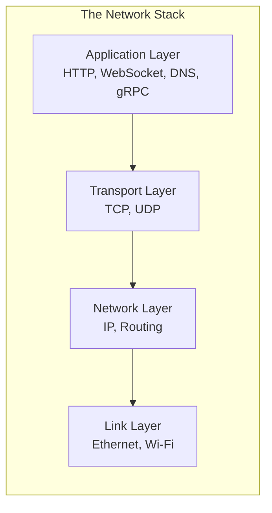
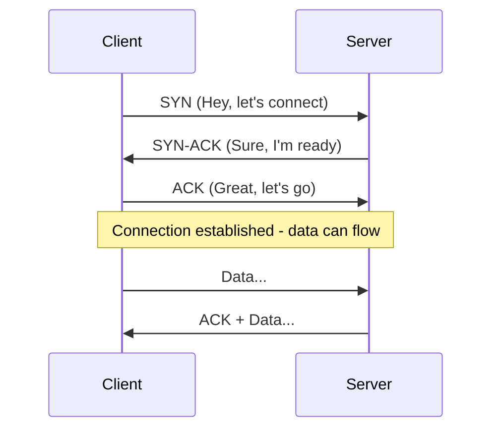
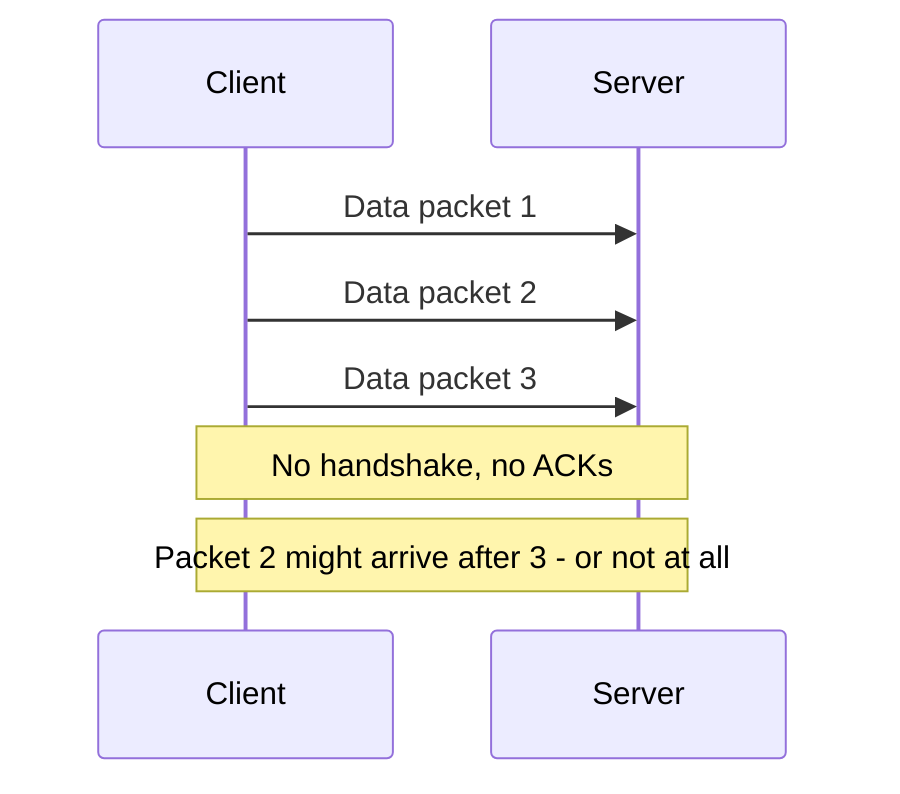
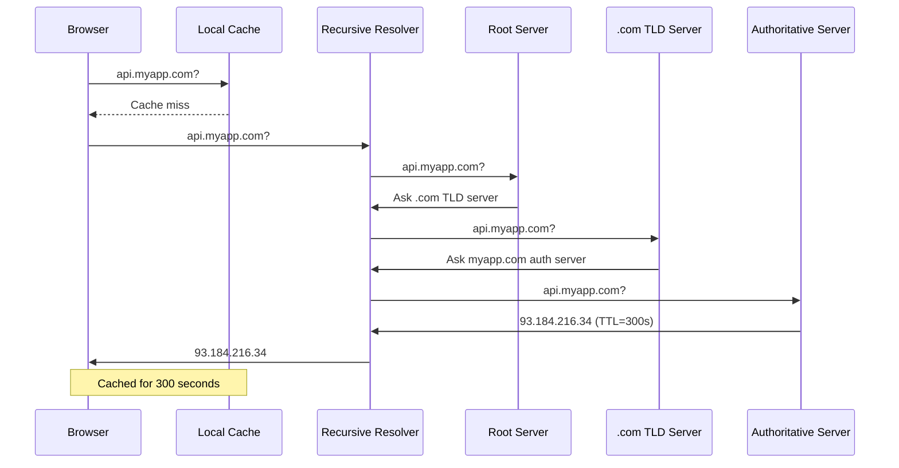
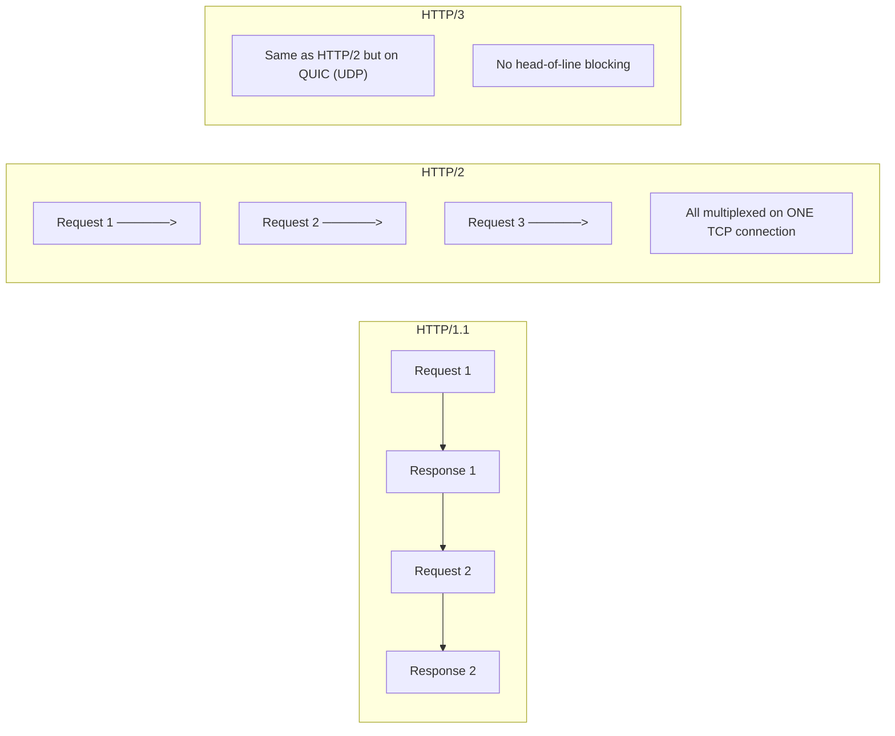
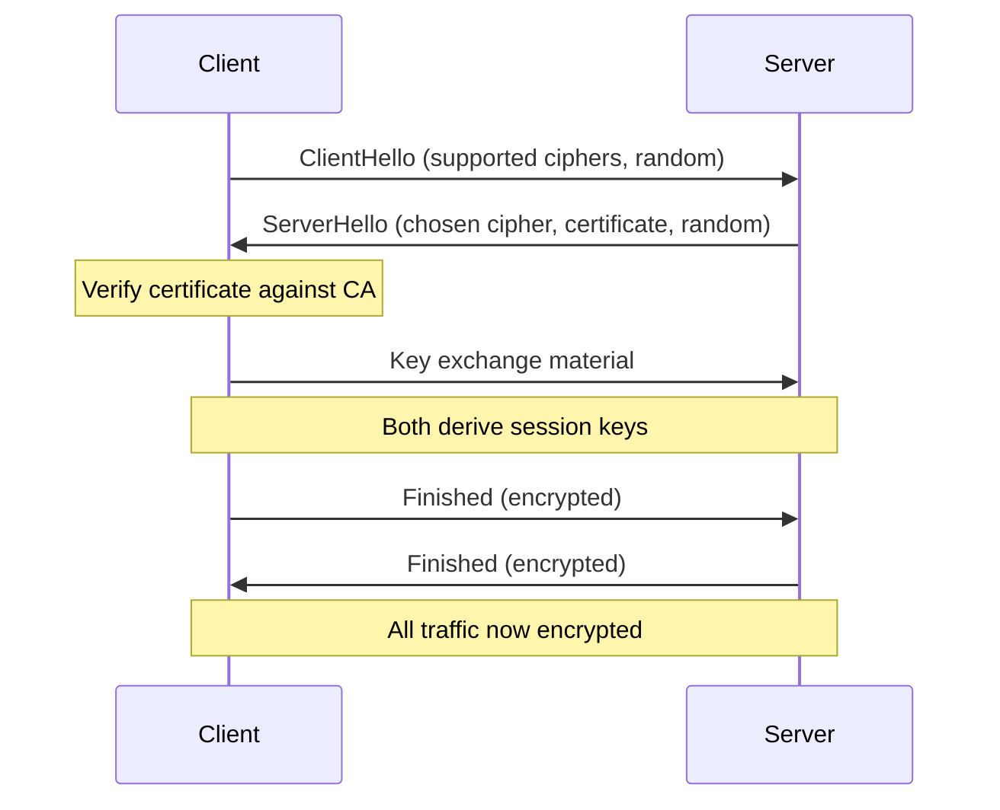
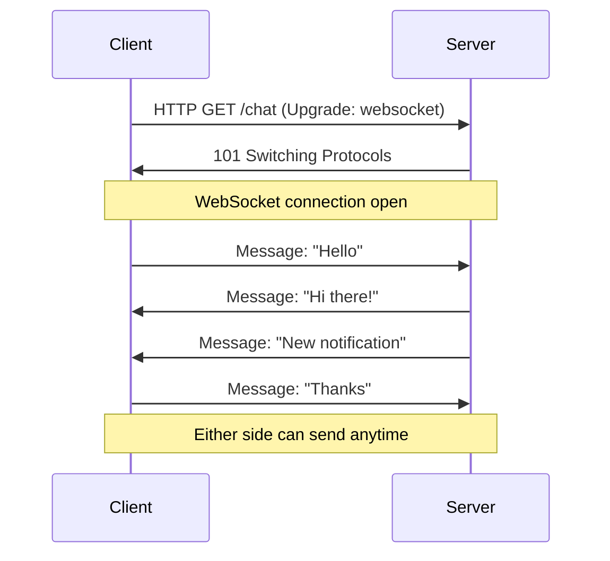
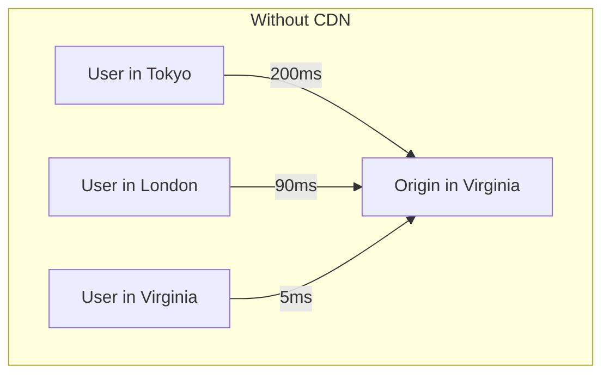
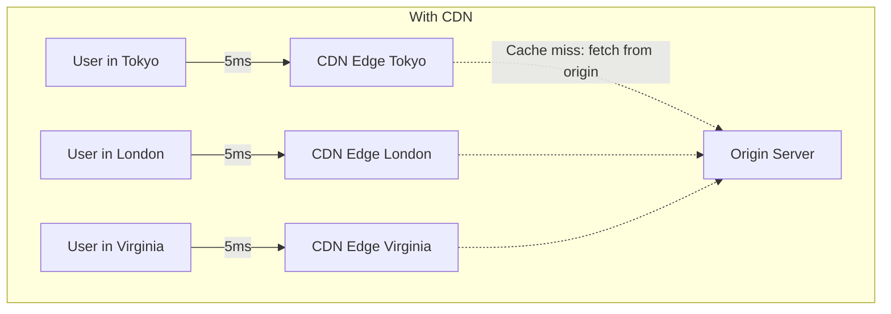
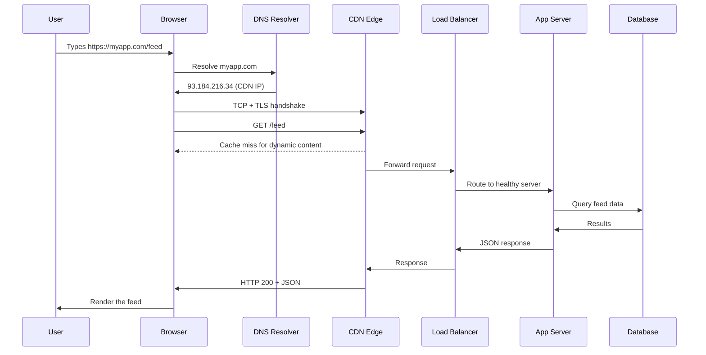

# Chapter 02 - Networking Essentials

> Every system design is built on top of the network. If you don't understand how data travels, you can't design systems that perform.

📖 [Read on Medium](#) · 🎬 [Watch on YouTube](#) · **Status: COMPLETE**

---

## Why Networking Matters for System Design

Every time a user clicks a button, a chain of network events fires: DNS lookup, TCP connection, TLS handshake, HTTP request, response. Each step adds latency. Each step can fail.

Understanding these layers lets you:
- Estimate latency for back-of-the-envelope calculations
- Choose the right communication protocol for your system
- Debug performance bottlenecks
- Design for failure and retries

---

## The Internet Protocol Stack

Data travels through layers. Each layer adds its own header and handles one concern.



```
┌─────────────────────────────────────────────────────┐
│           THE INTERNET PROTOCOL STACK                │
├──────────────────┬──────────────────────────────────┤
│  Application     │  HTTP, HTTPS, DNS, WebSocket,    │
│                  │  gRPC, SMTP, FTP                 │
├──────────────────┼──────────────────────────────────┤
│  Transport       │  TCP (reliable, ordered)         │
│                  │  UDP (fast, no guarantees)        │
├──────────────────┼──────────────────────────────────┤
│  Network         │  IP addressing, routing          │
│                  │  Packets find their path          │
├──────────────────┼──────────────────────────────────┤
│  Link            │  Ethernet, Wi-Fi                 │
│                  │  Physical transmission            │
└──────────────────┴──────────────────────────────────┘
```

**Key insight:** Higher layers build on lower ones. HTTP runs on TCP, TCP runs on IP, IP runs on Ethernet/Wi-Fi. When something is "slow," the bottleneck could be at any layer.

---

## TCP - The Reliable Workhorse

TCP (Transmission Control Protocol) guarantees that data arrives **in order**, **without duplicates**, and **without corruption**. This is what almost all web traffic uses.

### The Three-Way Handshake

Before any data flows, TCP establishes a connection in three steps:



```
Client                          Server
  │                               │
  │──── SYN (seq=100) ──────────>│  Step 1: Client initiates
  │                               │
  │<─── SYN-ACK (seq=200,        │  Step 2: Server agrees
  │      ack=101) ───────────────│
  │                               │
  │──── ACK (ack=201) ──────────>│  Step 3: Client confirms
  │                               │
  │     Connection Established    │
  │     Data flows both ways      │
  │                               │
```

**Why this matters for system design:**
- Every new TCP connection costs **1 round trip** (1 RTT) before data can flow
- Within the same datacenter: ~0.5ms overhead
- Cross-continent: ~150ms overhead
- This is why **connection pooling** and **keep-alive connections** exist - reusing connections avoids repeated handshakes

### TCP Guarantees and Costs

| Feature | How It Works | Cost |
|---------|-------------|------|
| **Ordered delivery** | Sequence numbers on every segment | Receiver must buffer and reorder |
| **Reliable delivery** | ACKs for every segment; retransmit on timeout | Extra round trips for lost packets |
| **Flow control** | Receiver advertises window size | Sender may need to slow down |
| **Congestion control** | Slow start, AIMD | Starts slow, ramps up gradually |

---

## UDP - The Speed Demon

UDP (User Datagram Protocol) skips reliability for raw speed. No handshake, no ordering, no retransmission. You send a packet and hope for the best.



### TCP vs UDP - When to Use Each

```
┌────────────────────────────────────────────────────────────┐
│                   TCP vs UDP                                │
├────────────────────────────┬───────────────────────────────┤
│           TCP              │            UDP                 │
├────────────────────────────┼───────────────────────────────┤
│ Reliable, ordered          │ Unreliable, unordered          │
│ Connection-oriented        │ Connectionless                 │
│ 3-way handshake            │ No handshake                   │
│ Flow + congestion control  │ No built-in control            │
│ Higher latency             │ Lower latency                  │
├────────────────────────────┼───────────────────────────────┤
│ USE FOR:                   │ USE FOR:                       │
│ - Web traffic (HTTP/HTTPS) │ - Video/voice streaming        │
│ - File transfers           │ - Online gaming                │
│ - Database connections     │ - DNS lookups                  │
│ - Email (SMTP)             │ - IoT sensor data              │
│ - APIs                     │ - Live broadcasts              │
└────────────────────────────┴───────────────────────────────┘
```

**System design rule of thumb:** Use TCP for correctness-critical data. Use UDP when speed matters more than perfection and the application can tolerate loss.

---

## DNS - The Internet's Phone Book

DNS (Domain Name System) translates human-readable names like `api.myapp.com` into IP addresses like `93.184.216.34`.

### How a DNS Lookup Works



```
User types: api.myapp.com
    │
    ▼
Browser Cache ──(miss)──> OS Cache ──(miss)──> Recursive Resolver
                                                   │
                                    ┌──────────────┼──────────────┐
                                    ▼              ▼              ▼
                               Root Server    .com TLD     myapp.com
                               "Ask .com"     "Ask myapp"  "93.184.216.34"
                                                              │
                                                              ▼
                                                    Answer: 93.184.216.34
                                                    TTL: 300 seconds
```

### DNS Record Types

| Record | Purpose | Example |
|--------|---------|---------|
| **A** | Domain to IPv4 address | `myapp.com -> 93.184.216.34` |
| **AAAA** | Domain to IPv6 address | `myapp.com -> 2001:db8::1` |
| **CNAME** | Alias to another domain | `www.myapp.com -> myapp.com` |
| **MX** | Mail server for domain | `myapp.com -> mail.myapp.com` |
| **NS** | Nameserver for domain | `myapp.com -> ns1.mydns.com` |
| **TXT** | Arbitrary text (SPF, verification) | `myapp.com -> "v=spf1 ..."` |

### DNS in System Design

| Pattern | How DNS Helps |
|---------|--------------|
| **Load balancing** | Return multiple A records; clients pick one (round-robin DNS) |
| **Geographic routing** | Return different IPs based on the user's location (GeoDNS) |
| **Failover** | Short TTLs let you reroute traffic quickly when a server dies |
| **Blue-green deploys** | Switch DNS from old cluster to new cluster |

**Watch out:** DNS caching means changes don't propagate instantly. A 300-second TTL means some users will hit the old IP for up to 5 minutes after you change it.

---

## HTTP / HTTPS - The Language of the Web

HTTP (HyperText Transfer Protocol) is the request-response protocol that powers the web. HTTPS is HTTP with TLS encryption on top.

### Anatomy of an HTTP Request

```
┌─────────────────────────────────────────────────────────┐
│                    HTTP REQUEST                          │
├─────────────────────────────────────────────────────────┤
│  POST /api/users HTTP/1.1          <- Method + Path     │
│  Host: api.myapp.com               <- Where to send     │
│  Content-Type: application/json    <- Body format        │
│  Authorization: Bearer eyJ...      <- Auth token         │
│                                                          │
│  {"name": "Alice", "email": "alice@example.com"}        │
│                                     ^-- Request body     │
├─────────────────────────────────────────────────────────┤
│                    HTTP RESPONSE                         │
├─────────────────────────────────────────────────────────┤
│  HTTP/1.1 201 Created              <- Status code        │
│  Content-Type: application/json                          │
│  Cache-Control: no-cache                                 │
│                                                          │
│  {"id": 42, "name": "Alice"}       <- Response body      │
└─────────────────────────────────────────────────────────┘
```

### HTTP Methods

| Method | Purpose | Idempotent? | Safe? |
|--------|---------|:-----------:|:-----:|
| **GET** | Retrieve data | Yes | Yes |
| **POST** | Create a resource | No | No |
| **PUT** | Replace a resource entirely | Yes | No |
| **PATCH** | Partially update a resource | No | No |
| **DELETE** | Remove a resource | Yes | No |
| **HEAD** | GET without body (check existence) | Yes | Yes |

### HTTP Status Codes You Must Know

```
2xx  - Success
  200 OK              Request succeeded
  201 Created         Resource created
  204 No Content      Success, nothing to return

3xx  - Redirection
  301 Moved Permanently   URL changed forever
  302 Found               Temporary redirect
  304 Not Modified        Use cached version

4xx  - Client Error
  400 Bad Request     Malformed request
  401 Unauthorized    Authentication required
  403 Forbidden       Authenticated but not allowed
  404 Not Found       Resource doesn't exist
  429 Too Many Reqs   Rate limited

5xx  - Server Error
  500 Internal Error  Something broke
  502 Bad Gateway     Upstream server failed
  503 Unavailable     Server overloaded / down
  504 Gateway Timeout Upstream took too long
```

### HTTP/1.1 vs HTTP/2 vs HTTP/3



```
┌────────────────────────────────────────────────────────────────┐
│              HTTP VERSION COMPARISON                            │
├──────────────┬──────────────────┬───────────────┬──────────────┤
│              │   HTTP/1.1       │   HTTP/2       │   HTTP/3     │
├──────────────┼──────────────────┼───────────────┼──────────────┤
│ Transport    │ TCP              │ TCP            │ QUIC (UDP)   │
│ Multiplexing │ No (1 req/conn)  │ Yes            │ Yes          │
│ Header       │ Text, repeated   │ Binary, HPACK  │ Binary, QPACK│
│ compression  │                  │ compressed     │ compressed   │
│ Server push  │ No               │ Yes            │ Yes          │
│ Head-of-line │ Yes (blocked)    │ Yes (TCP level)│ No           │
│ blocking     │                  │                │              │
│ Connection   │ 6 per domain     │ 1 per domain   │ 1 per domain │
│ setup        │ TCP + TLS        │ TCP + TLS      │ 0-RTT QUIC   │
└──────────────┴──────────────────┴───────────────┴──────────────┘
```

**System design takeaway:** HTTP/2 is the standard for modern APIs. HTTP/3 (QUIC) eliminates head-of-line blocking and enables 0-RTT connection setup - great for mobile users on flaky networks.

---

## TLS / HTTPS - Securing the Connection

TLS (Transport Layer Security) encrypts data between client and server. HTTPS is simply HTTP over TLS.

### The TLS Handshake



```
Client                              Server
  │                                    │
  │── ClientHello ────────────────────>│  "Here are ciphers I support"
  │                                    │
  │<── ServerHello + Certificate ─────│  "I pick this cipher, here's my cert"
  │                                    │
  │── (verify cert, key exchange) ───>│
  │                                    │
  │<═══════ ENCRYPTED TUNNEL ═════════>│
  │    All data encrypted from here    │
  │                                    │
```

**TLS cost in system design:**
- TLS 1.2: adds 2 RTTs to connection setup
- TLS 1.3: adds 1 RTT (or 0 RTT for resumed sessions)
- CPU cost for encryption/decryption (usually negligible with hardware AES)
- **TLS termination** is often done at the load balancer so backend servers handle plain HTTP

---

## WebSockets - Full-Duplex Communication

HTTP is request-response: the client asks, the server answers. WebSockets upgrade an HTTP connection into a persistent, full-duplex channel where both sides can send messages anytime.



```
┌───────────────────────────────────────────────────────────────┐
│         HTTP vs WebSocket Communication                       │
├───────────────────────────┬───────────────────────────────────┤
│      HTTP (Half-Duplex)   │      WebSocket (Full-Duplex)      │
├───────────────────────────┼───────────────────────────────────┤
│                           │                                   │
│  Client ──req──> Server   │  Client <══════> Server           │
│  Client <──res── Server   │   (both send anytime)             │
│  Client ──req──> Server   │                                   │
│  Client <──res── Server   │   - Chat messages                 │
│                           │   - Live scores                   │
│  Each message needs       │   - Stock tickers                 │
│  a new request            │   - Collaborative editing         │
│                           │   - Gaming                        │
└───────────────────────────┴───────────────────────────────────┘
```

### When to Use WebSockets vs Alternatives

| Method | Direction | Use Case | Complexity |
|--------|-----------|----------|:----------:|
| **HTTP polling** | Client pulls | Low-frequency updates | Low |
| **Long polling** | Client pulls, server holds | Medium-frequency updates | Medium |
| **SSE** | Server pushes | One-way notifications, feeds | Low |
| **WebSocket** | Both directions | Real-time bidirectional (chat, gaming) | High |

**System design rule:** Don't reach for WebSockets unless you truly need bidirectional real-time communication. SSE or long polling handles most "live update" use cases with far less complexity.

---

## CDNs - Content Delivery Networks

A CDN is a globally distributed network of edge servers that caches and serves content from locations close to the user.





```
Without CDN                           With CDN

User (Tokyo)──── 200ms ──> Origin    User (Tokyo)── 5ms ──> Edge (Tokyo)
User (London)─── 90ms ──> Origin    User (London)─ 5ms ──> Edge (London)
User (Virginia)─ 5ms ───> Origin    User (Virginia) 5ms ─> Edge (Virginia)
                                                             │
                                                    cache miss only
                                                             │
                                                             ▼
                                                      Origin Server
```

### What CDNs Cache

| Content Type | CDN Caches? | TTL |
|-------------|:-----------:|-----|
| Static files (JS, CSS, images) | Yes | Hours to days |
| Video/audio streams | Yes | Varies |
| API responses (GET) | Sometimes | Seconds to minutes |
| Dynamic/personalized content | No | N/A |

### CDN Strategies

| Strategy | How It Works | Best For |
|----------|-------------|----------|
| **Pull** | CDN fetches from origin on cache miss | Most websites |
| **Push** | You upload content directly to CDN | Large files, videos |
| **Invalidation** | Purge cached content before TTL expires | After deploys |

**Real-world:** Cloudflare, AWS CloudFront, Akamai, Fastly. Almost every production system uses a CDN for static assets at minimum.

---

## Putting It All Together - What Happens When You Type a URL



```
User types: https://myapp.com/feed

1. DNS Lookup          myapp.com -> 93.184.216.34     ~50ms (uncached)
2. TCP Handshake       SYN -> SYN-ACK -> ACK          ~1 RTT
3. TLS Handshake       ClientHello -> ... -> Finished  ~1-2 RTT
4. HTTP Request        GET /feed HTTP/2
5. CDN Check           Cache miss (dynamic content)    ~1ms
6. Load Balancer       Routes to healthy app server     ~1ms
7. App Server          Process request, query DB        ~10-50ms
8. Database            Execute query, return results    ~5-20ms
9. Response            JSON travels back through stack
10. Render             Browser paints the page

Total: ~100-300ms for a typical request within region
```

---

## Latency Budget - A System Designer's View

When designing systems, think in terms of a **latency budget**:

```
┌──────────────────────────────────────────────────────────┐
│            TYPICAL REQUEST LATENCY BUDGET                 │
├────────────────────────────┬─────────────────────────────┤
│ DNS lookup (cached)        │              ~1 ms           │
│ TCP handshake              │         ~0.5 ms (same DC)    │
│ TLS handshake              │         ~1-2 ms (TLS 1.3)    │
│ Network transit            │         ~0.5 ms (same DC)    │
│ Load balancer routing      │              ~1 ms           │
│ Application logic          │          ~10-50 ms           │
│ Database query             │           ~5-20 ms           │
│ Serialization / response   │           ~1-5 ms            │
├────────────────────────────┼─────────────────────────────┤
│ TOTAL (same region)        │          ~20-80 ms           │
│ TOTAL (cross-continent)    │         ~200-400 ms          │
└────────────────────────────┴─────────────────────────────┘
```

---

## Common Pitfalls

| Pitfall | Why It's Bad | Fix |
|---------|-------------|-----|
| Ignoring DNS TTL | Cached entries delay failover | Use short TTLs (30-60s) for critical services |
| New TCP connection per request | Handshake overhead on every call | Use connection pooling / keep-alive |
| No CDN for static assets | Every request hits your origin | Put images, JS, CSS behind a CDN |
| HTTP/1.1 with many resources | Head-of-line blocking, 6 conn limit | Upgrade to HTTP/2 |
| WebSocket for everything | Unnecessary complexity, hard to scale | Use SSE or polling unless bidirectional is needed |
| Skipping TLS internally | Vulnerable to MITM within your network | Use mTLS between services |

---

## Key Takeaways

1. **TCP = reliable but slow to start** - connection pooling and keep-alive eliminate repeated handshakes
2. **UDP = fast but unreliable** - use for streaming, gaming, and DNS where speed beats correctness
3. **DNS is the first step** - it can also be used for load balancing and geographic routing
4. **HTTP/2 is the modern default** - multiplexing, header compression, one connection per domain
5. **CDNs reduce latency dramatically** - serve content from edge servers close to users
6. **Every network hop adds latency** - design systems to minimize round trips

---

## What's Next?

- **Chapter 03:** [APIs & Communication Patterns](../03-apis-and-communication/) - REST, GraphQL, gRPC, and choosing the right API style
