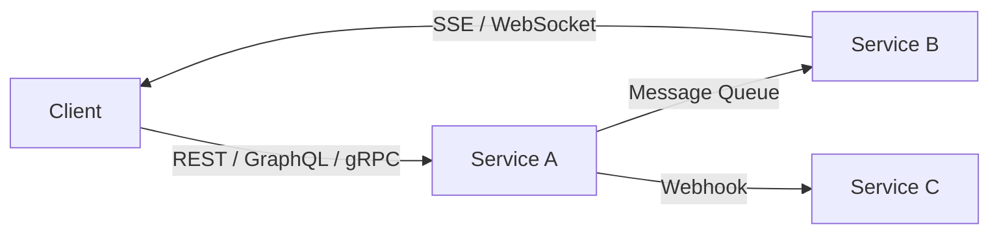
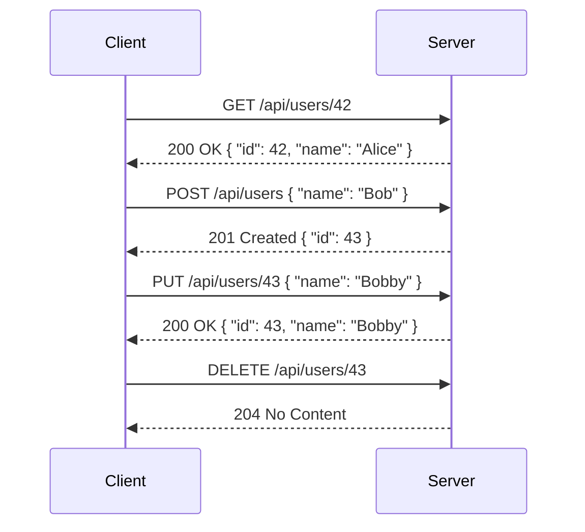
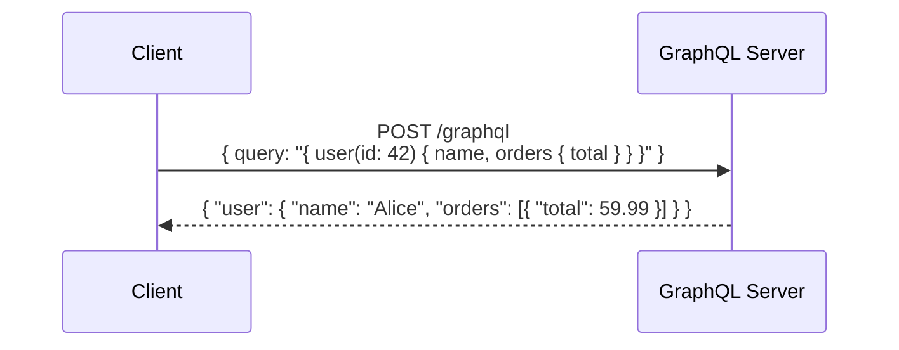
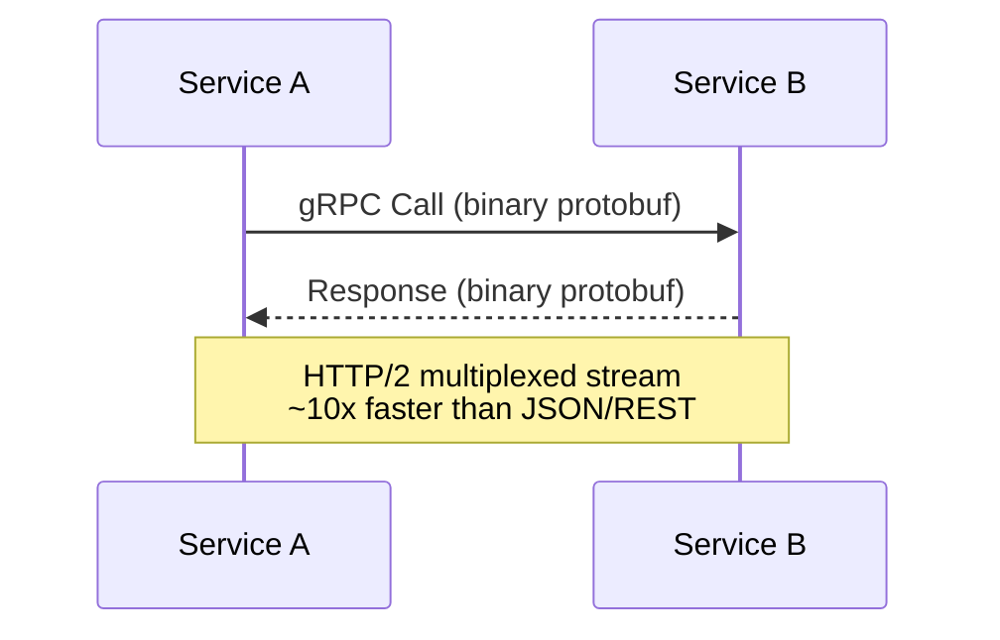
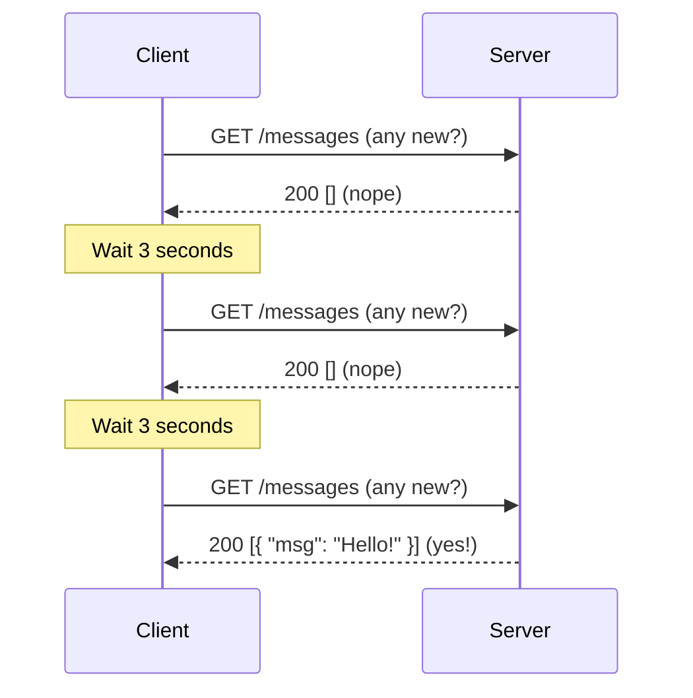
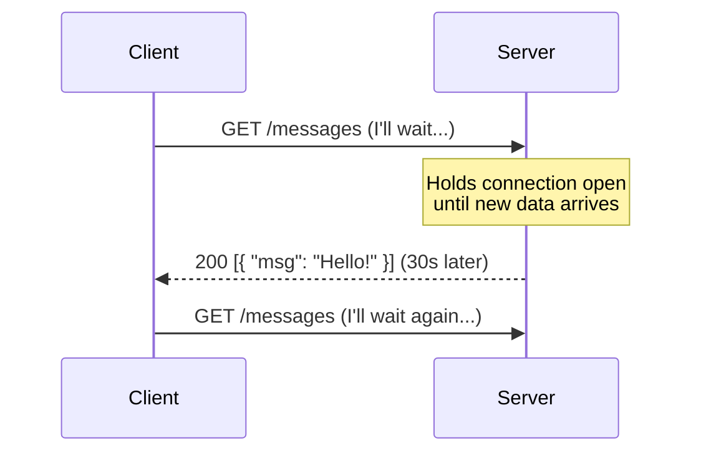
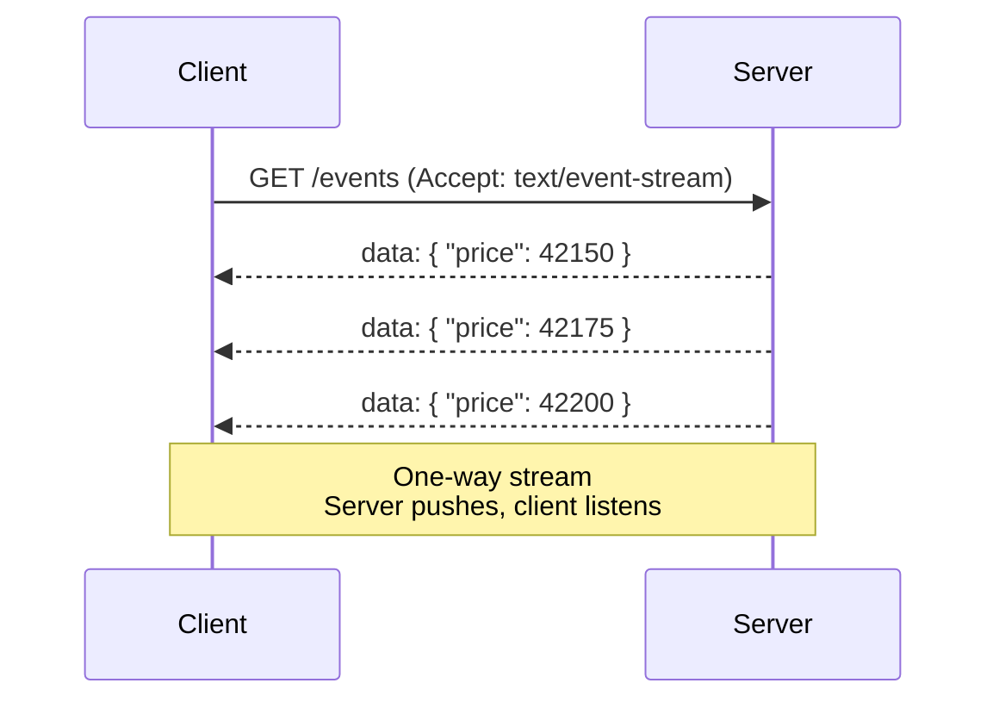
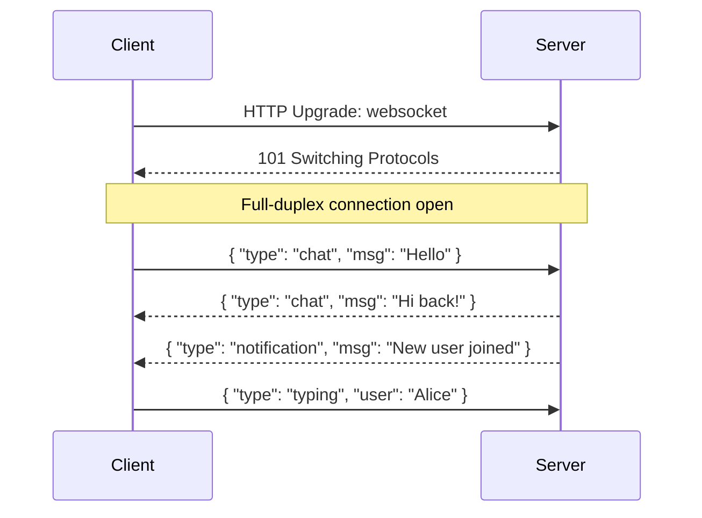
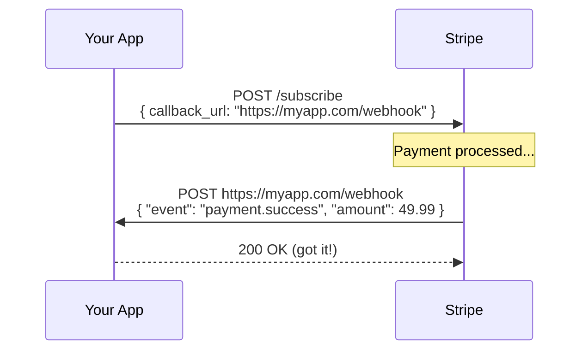

# Chapter 03 - APIs & Communication Patterns

> Your services need to talk to each other. The protocol you choose shapes your system's performance, flexibility, and developer experience.

📖 [Read on Medium](#) · 🎬 [Watch on YouTube](#) · **Status: COMPLETE**

---

## Why APIs Matter in System Design

Every distributed system is a collection of services that communicate. The **API** (Application Programming Interface) is the contract between them - it defines what you can ask for, how to ask, and what you get back.

Choosing the wrong communication pattern can mean:
- Wasted bandwidth on over-fetching data
- Tight coupling that makes changes painful
- Latency that kills user experience
- Complexity that slows your team down



---

## REST - The Industry Default

REST (Representational State Transfer) uses standard HTTP methods to operate on resources identified by URLs.



### Core Principles

| Principle | Meaning |
|-----------|---------|
| **Stateless** | Each request contains everything the server needs - no stored sessions |
| **Resource-based** | URLs represent nouns (`/users/42`), not actions (`/getUser`) |
| **HTTP methods** | GET (read), POST (create), PUT (replace), PATCH (partial update), DELETE (remove) |
| **Standard status codes** | 200 OK, 201 Created, 400 Bad Request, 404 Not Found, 500 Server Error |
| **Cacheable** | GET responses can be cached by browsers, CDNs, and proxies |

### REST Best Practices

```
Good:
  GET    /api/v1/users/42/orders          Get user's orders
  POST   /api/v1/orders                   Create a new order
  PATCH  /api/v1/orders/99                Update part of an order

Bad:
  GET    /api/getUser?id=42               Verb in URL
  POST   /api/createOrder                 Action-based naming
  GET    /api/deleteUser/42               GET with side effects
```

**Pros:**
- Simple, well-understood, massive tooling ecosystem
- Works great with caching (CDNs, browser cache, HTTP cache headers)
- Stateless - scales horizontally with ease
- Human-readable (JSON over HTTP)

**Cons:**
- Over-fetching: you get the whole resource even if you need one field
- Under-fetching: related data requires multiple round trips
- No real-time push - client must poll for updates
- No built-in schema/contract enforcement

---

## GraphQL - Ask for Exactly What You Need

GraphQL lets the client specify the exact shape of the data it wants in a single request. Developed by Facebook in 2012 to solve mobile app data fetching problems.



### How It Works

```
REST (3 requests):                    GraphQL (1 request):
  GET /users/42           ─┐            POST /graphql
  GET /users/42/orders     ├─ 3 RTTs      query {
  GET /users/42/profile   ─┘                user(id: 42) {
                                              name
                                              orders { total }
                                              profile { avatar }
                                            }
                                          }
                                        ─── 1 RTT
```

**Pros:**
- No over-fetching or under-fetching - client gets exactly what it asks for
- Single endpoint (`/graphql`) for all data
- Strongly typed schema acts as documentation and contract
- Great for complex, nested data (social graphs, e-commerce catalogs)

**Cons:**
- Caching is harder - every request is a POST to the same URL
- Complex queries can overwhelm the server (query depth attacks)
- Learning curve for backend teams
- Overkill for simple CRUD APIs

**Best for:** Mobile apps, dashboards, apps with deeply nested data, multiple consumer types needing different views of the same data.

---

## gRPC - High-Performance Service-to-Service

gRPC (Google Remote Procedure Call) uses Protocol Buffers for binary serialization and HTTP/2 for transport. Designed for internal microservice communication where speed matters.



### How It Compares to REST

```
REST + JSON:                          gRPC + Protobuf:
┌────────────────────┐                ┌────────────────────┐
│ Text-based (JSON)  │                │ Binary (compact)   │
│ HTTP/1.1           │                │ HTTP/2             │
│ Human-readable     │                │ Machine-optimized  │
│ ~100-500 bytes     │                │ ~20-80 bytes       │
│ Unidirectional     │                │ 4 streaming modes  │
└────────────────────┘                └────────────────────┘
```

### gRPC Streaming Modes

| Mode | Description | Use Case |
|------|-------------|----------|
| **Unary** | One request, one response (like REST) | Simple lookups |
| **Server streaming** | One request, stream of responses | Live price feeds |
| **Client streaming** | Stream of requests, one response | File upload in chunks |
| **Bidirectional** | Both sides stream simultaneously | Real-time chat, gaming |

**Pros:**
- 2-10x faster than REST+JSON (binary encoding + HTTP/2)
- Strongly typed contracts via `.proto` files
- Built-in streaming support
- Code generation for 10+ languages

**Cons:**
- Not human-readable (binary format)
- Not browser-friendly without a proxy (gRPC-Web)
- Harder to debug and test (no curl)
- Steeper learning curve

**Best for:** Internal microservice communication, low-latency service-to-service calls, polyglot environments.

---

## Real-Time Communication Patterns

Sometimes you need the server to push data to the client without waiting for a request. Here are three approaches, from simplest to most capable.

### Short Polling

The client repeatedly asks "anything new?" at a fixed interval.



- Simple to implement
- Wastes bandwidth and server resources when there's no new data
- Delay = polling interval (not truly real-time)

### Long Polling

The client sends a request, but the server holds it open until there's new data (or timeout).



- More efficient than short polling - no wasted requests
- Near real-time delivery
- Still one message per connection cycle
- Server holds many open connections

### Server-Sent Events (SSE)

The server opens a one-way persistent stream to push events to the client.



- Built on standard HTTP - works with proxies, load balancers, CDNs
- Auto-reconnect built into the browser API
- One-way only: server to client
- Lightweight - no special protocol

### WebSockets

Full-duplex, bidirectional communication over a single persistent TCP connection.



- True bidirectional real-time communication
- Low overhead after initial handshake (no HTTP headers per message)
- Ideal for chat, gaming, collaborative editing
- More complex - need to handle reconnection, state, scaling

---

## Real-Time Pattern Comparison

```
┌─────────────────────────────────────────────────────────────────────┐
│              REAL-TIME COMMUNICATION PATTERNS                       │
├──────────────┬──────────┬───────────┬────────────┬─────────────────┤
│              │ Short    │ Long      │ SSE        │ WebSocket       │
│              │ Polling  │ Polling   │            │                 │
├──────────────┼──────────┼───────────┼────────────┼─────────────────┤
│ Direction    │ Pull     │ Pull      │ Push       │ Bidirectional   │
│ Latency      │ High     │ Medium    │ Low        │ Lowest          │
│ Overhead     │ High     │ Medium    │ Low        │ Lowest          │
│ Complexity   │ Low      │ Medium    │ Low        │ High            │
│ Scalability  │ Easy     │ Moderate  │ Easy       │ Hard            │
│ Browser      │ Yes      │ Yes      │ Yes        │ Yes             │
│ Auto-reconnect│ Manual  │ Manual   │ Built-in   │ Manual          │
├──────────────┼──────────┼───────────┼────────────┼─────────────────┤
│ Best for     │ Simple   │ Chat     │ Feeds,     │ Chat, gaming,   │
│              │ dashboards│ (basic) │ dashboards │ collaboration   │
└──────────────┴──────────┴───────────┴────────────┴─────────────────┘
```

---

## Webhooks - Don't Call Us, We'll Call You

Instead of the client polling, the server calls the client's URL when something happens.



### How Webhooks Work

```
Traditional (Polling):                 Webhooks (Push):
┌─────────┐    Any updates?    ┌──────┐     ┌─────────┐              ┌──────┐
│  Your   │──────────────────>│Stripe│     │  Your   │              │Stripe│
│  App    │<──────────────────│      │     │  App    │<─────────────│      │
│         │    Nope            │      │     │         │  Payment done│      │
│         │──────────────────>│      │     │         │──────────────│      │
│         │<──────────────────│      │     │         │  200 OK      │      │
│         │    Nope            │      │     └─────────┘              └──────┘
│         │──────────────────>│      │
│         │<──────────────────│      │     One request when it matters
│         │    Yes! Payment!   │      │     vs. 100 wasted requests
└─────────┘                    └──────┘
```

**Pros:**
- Efficient - no wasted polling requests
- Near real-time notifications
- Decouples services (event-driven)

**Cons:**
- Your server must be publicly reachable (callback URL)
- Need to handle retries, idempotency, and verification
- Debugging is harder (you can't easily replay events)

**Used by:** Stripe, GitHub, Twilio, Slack, Shopify - almost every SaaS API.

---

## The Complete API Decision Matrix

```
┌────────────────────────────────────────────────────────────────────┐
│                   WHICH API PATTERN TO USE?                        │
├──────────────┬─────────────────────────────────────────────────────┤
│              │                                                     │
│   REST       │  Default choice. CRUD apps, public APIs, simple     │
│              │  request-response. When in doubt, start here.       │
│              │                                                     │
├──────────────┼─────────────────────────────────────────────────────┤
│              │                                                     │
│   GraphQL    │  Multiple clients needing different data shapes.    │
│              │  Complex nested data. Mobile apps. Dashboards.      │
│              │                                                     │
├──────────────┼─────────────────────────────────────────────────────┤
│              │                                                     │
│   gRPC       │  Internal microservice calls. Low-latency, high-   │
│              │  throughput. Polyglot services. Streaming needed.   │
│              │                                                     │
├──────────────┼─────────────────────────────────────────────────────┤
│              │                                                     │
│   WebSocket  │  True bidirectional real-time. Chat, gaming,       │
│              │  collaborative editing, live cursors.               │
│              │                                                     │
├──────────────┼─────────────────────────────────────────────────────┤
│              │                                                     │
│   SSE        │  Server-to-client push. Live feeds, stock tickers, │
│              │  notifications. Simpler than WebSockets.            │
│              │                                                     │
├──────────────┼─────────────────────────────────────────────────────┤
│              │                                                     │
│   Webhooks   │  Event notifications between services. Payment     │
│              │  callbacks, CI/CD triggers, third-party events.     │
│              │                                                     │
└──────────────┴─────────────────────────────────────────────────────┘
```

---

## Real-World Examples

| Company | Pattern | Why |
|---------|---------|-----|
| **Stripe** | REST + Webhooks | REST for actions, webhooks for async payment events |
| **GitHub** | REST + GraphQL + Webhooks | GraphQL for flexible data queries, webhooks for CI triggers |
| **Netflix** | gRPC (internal) + REST (external) | gRPC between microservices for speed, REST for public API |
| **Slack** | WebSocket + REST + Webhooks | WebSocket for real-time messaging, REST for bots, webhooks for integrations |
| **Uber** | gRPC + WebSocket | gRPC between services, WebSocket for live driver tracking |
| **Twitter/X** | REST + SSE (Streaming API) | SSE for real-time tweet streams, REST for standard operations |

---

## Common Pitfalls

| Pitfall | Why It's Bad | Fix |
|---------|-------------|-----|
| Using WebSockets for everything | Adds complexity, harder to scale and debug | Use REST/SSE unless you need bidirectional |
| REST with no versioning | Breaking changes break all clients | Use URL versioning (`/v1/`, `/v2/`) |
| GraphQL without query limits | Malicious deep queries can DDoS your server | Add query depth/complexity limits |
| Ignoring idempotency | Retried requests create duplicate records | Use idempotency keys for POST/PUT |
| Polling when webhooks are available | Wastes resources, adds latency | Use webhooks + fallback polling |
| No pagination on list endpoints | Returns 100K records, crashes the client | Always paginate: `?page=1&limit=20` |

---

## Key Takeaways

1. **REST is the default** - start here unless you have a specific reason not to
2. **GraphQL solves over/under-fetching** - ideal for complex, nested data with multiple consumers
3. **gRPC is for speed** - binary + HTTP/2 makes it 2-10x faster than REST for internal calls
4. **WebSockets are for bidirectional real-time** - chat, gaming, collaboration
5. **SSE is the simpler real-time option** - one-way push with auto-reconnect, no extra protocol
6. **Webhooks flip the model** - server pushes to client, no polling needed

---

## What's Next?

- **Chapter 04:** [Databases - SQL & NoSQL](../04-databases/) - How to store, query, and scale your data
