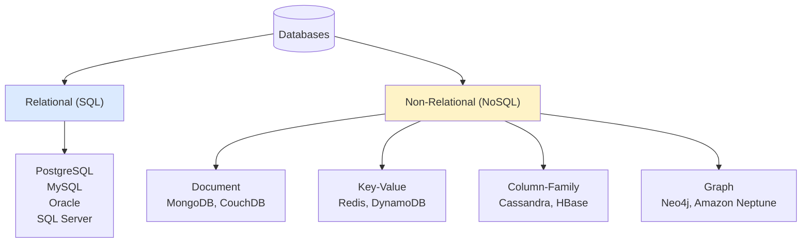
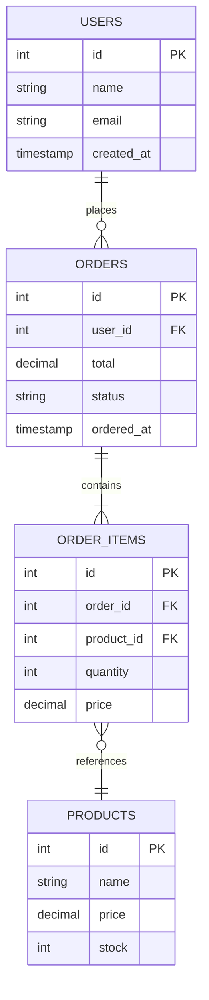
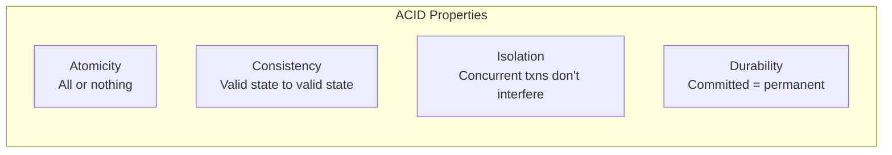
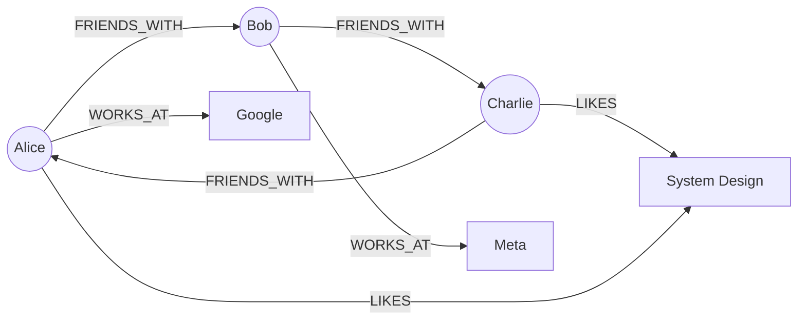
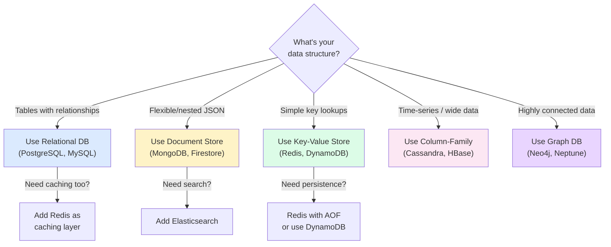
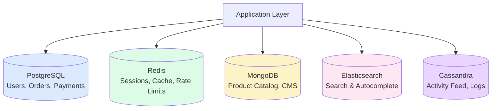
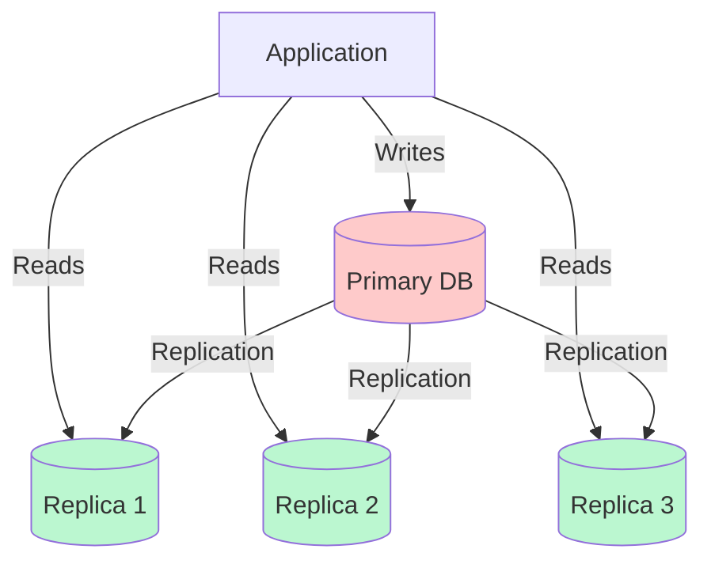
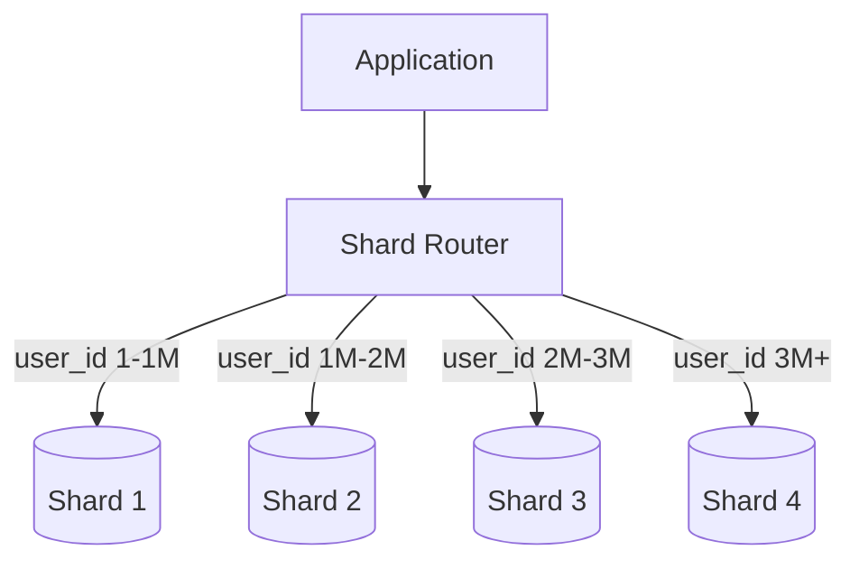
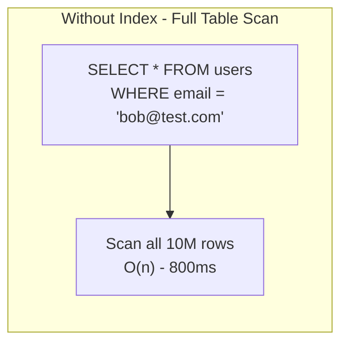
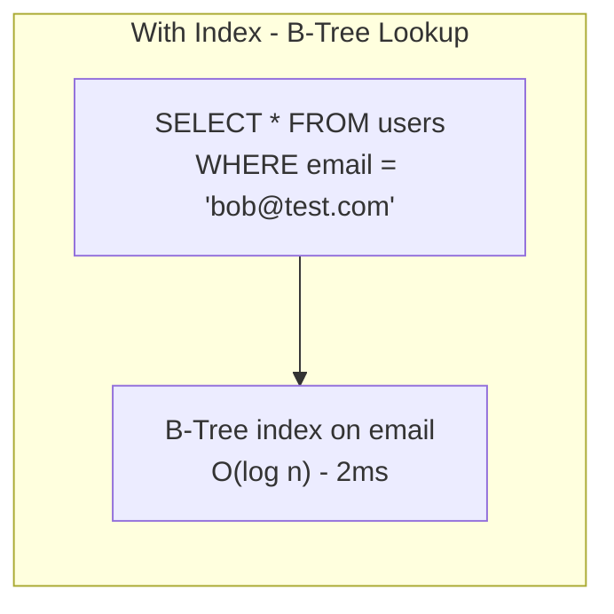

# Chapter 04 - Databases - SQL & NoSQL

> Every system design interview eventually comes down to one question: "Where does the data live?" Pick the wrong database and you're fighting your tooling forever. Pick the right one and the architecture almost designs itself.

📖 [Read on Medium](#) · 🎬 [Watch on YouTube](#)

---

## Why Database Choice Matters

Your database is the gravitational center of your system. Application servers come and go - you can spin up 50 more behind a load balancer in minutes. But your database? That's where state lives. Migrating it, reshaping it, or swapping it out later costs orders of magnitude more than getting it right upfront.

Twitter chose MySQL and later spent years building custom sharding infrastructure around it. MongoDB early adopters discovered that "schemaless" really meant "schema-on-read-and-good-luck-debugging." Google built Spanner because nothing else could give them global consistency at their scale.

The database you pick constrains everything downstream - your query patterns, your scaling strategy, your consistency guarantees, and your team's operational burden.

---

## The Two Big Families



---

## Relational Databases (SQL)

Relational databases store data in **tables with rows and columns**, connected by foreign keys. They've been the backbone of data storage since the 1970s, and for good reason - structured data with relationships is the most common pattern in business applications.

### How Relational Databases Work



The power here is in the **relationships**. Want all orders for a user? `JOIN`. Want the total revenue by product category? `GROUP BY`. Want to ensure an order can't reference a non-existent user? Foreign key constraints handle that automatically.

### Normalization - Eliminating Redundancy

Normalization is the process of organizing tables to reduce data duplication. The goal: every fact is stored in exactly one place.

```
Unnormalized (BAD):
┌────────────────────────────────────────────────────────────┐
│ order_id │ user_name │ user_email     │ product │ price   │
├──────────┼───────────┼────────────────┼─────────┼─────────┤
│ 1        │ Alice     │ alice@test.com │ Laptop  │ 999.99  │
│ 2        │ Alice     │ alice@test.com │ Monitor │ 399.99  │
│ 3        │ Bob       │ bob@test.com   │ Laptop  │ 999.99  │
└────────────────────────────────────────────────────────────┘

Alice's email appears twice. If she changes it, you need to
update every row. Miss one and you have inconsistent data.
```

```
Normalized (GOOD):
users                    orders              products
┌────┬───────┬──────┐   ┌────┬─────────┐   ┌────┬─────────┬────────┐
│ id │ name  │email │   │ id │ user_id │   │ id │ name    │ price  │
├────┼───────┼──────┤   ├────┼─────────┤   ├────┼─────────┼────────┤
│ 1  │ Alice │a@... │   │ 1  │ 1       │   │ 1  │ Laptop  │ 999.99 │
│ 2  │ Bob   │b@... │   │ 2  │ 1       │   │ 2  │ Monitor │ 399.99 │
└────┴───────┴──────┘   │ 3  │ 2       │   └────┴─────────┴────────┘
                        └────┴─────────┘

Each fact lives in one place. Change Alice's email in the
users table and every query that JOINs picks it up automatically.
```

Three normal forms matter in practice:

| Form | Rule | Plain English |
|------|------|---------------|
| **1NF** | No repeating groups; every cell holds one value | Don't store "red, blue, green" in one column |
| **2NF** | Every non-key column depends on the full primary key | If your key is (order_id, product_id), don't store user_name here - it depends only on order_id |
| **3NF** | No transitive dependencies | Don't store zip_code and city together - city depends on zip_code, not on the primary key |

Most production schemas aim for 3NF. Going further (BCNF, 4NF) adds complexity without much practical benefit for typical applications. Sometimes you intentionally denormalize for read performance - that's a valid trade-off, not a mistake, as long as you know what you're giving up.

### ACID - The Relational Promise

Every relational database guarantees four properties known as ACID:



| Property | What It Means | Example |
|----------|---------------|---------|
| **Atomicity** | A transaction either fully completes or fully rolls back | Transfer $100: debit AND credit both happen, or neither does |
| **Consistency** | Every transaction moves the DB from one valid state to another | Account balance can't go negative if you have a constraint |
| **Isolation** | Concurrent transactions behave as if they ran sequentially | Two people buying the last item - only one succeeds |
| **Durability** | Once committed, data survives crashes and power failures | Server dies mid-write - committed data is still there on restart |

ACID is why banks, airlines, and hospitals run on relational databases. When you absolutely cannot lose or corrupt data, ACID is non-negotiable.

### When to Use Relational

- **Structured data with clear relationships** - e-commerce orders, user accounts, financial records
- **Complex queries** - ad-hoc reporting, joins across multiple tables, aggregations
- **Strong consistency is required** - banking, inventory, booking systems
- **Data integrity matters** - foreign keys, unique constraints, check constraints

### Popular Relational Databases

| Database | Sweet Spot | Notable Users |
|----------|-----------|---------------|
| **PostgreSQL** | Feature-rich, extensible, great for complex queries | Apple, Instagram, Reddit |
| **MySQL** | Web applications, read-heavy workloads | Facebook, Twitter, Uber |
| **SQLite** | Embedded, single-file, no server needed | Every smartphone, browsers |
| **SQL Server** | Enterprise Windows ecosystems | Stack Overflow, legacy enterprise |

---

## NoSQL Databases

NoSQL doesn't mean "no SQL" - it means **"not only SQL."** These databases trade some relational guarantees for flexibility, scale, or performance in specific use cases.

There's no single NoSQL model. There are four distinct families, each built for different access patterns.

---

### 1. Document Stores

Store data as **JSON-like documents** - self-contained objects that can have nested structures.

```
┌─────────────────────────────────────────────────────────┐
│  Document Store (e.g., MongoDB)                         │
│                                                         │
│  ┌─────────────────────────┐  ┌───────────────────────┐ │
│  │ {                       │  │ {                     │ │
│  │   "_id": "u123",        │  │   "_id": "u456",      │ │
│  │   "name": "Alice",      │  │   "name": "Bob",      │ │
│  │   "orders": [           │  │   "orders": [],       │ │
│  │     {                   │  │   "address": {        │ │
│  │       "item": "Laptop", │  │     "city": "Austin"  │ │
│  │       "price": 999      │  │   }                   │ │
│  │     }                   │  │ }                     │ │
│  │   ]                     │  │                       │ │
│  │ }                       │  │                       │ │
│  └─────────────────────────┘  └───────────────────────┘ │
│                                                         │
│  Documents don't need the same fields or structure!     │
└─────────────────────────────────────────────────────────┘
```

**Strengths:** Flexible schema, natural fit for JSON APIs, good for content management, user profiles, product catalogs. Each document is self-contained, so reads don't require joins.

**Weaknesses:** No joins (you denormalize or do it in application code), weaker consistency guarantees by default, data duplication if relationships are complex.

**Examples:** MongoDB, CouchDB, Amazon DocumentDB, Firestore

---

### 2. Key-Value Stores

The simplest NoSQL model. Every piece of data is a **value** accessed by a unique **key**. Think of it as a giant hash map.

```
┌───────────────────────────────────────────┐
│  Key-Value Store (e.g., Redis)            │
│                                           │
│  ┌──────────────┬───────────────────────┐ │
│  │     Key      │        Value          │ │
│  ├──────────────┼───────────────────────┤ │
│  │ session:a1b2 │ {user_id: 42, ...}    │ │
│  │ cart:u123    │ [item1, item2, item3]  │ │
│  │ config:v2   │ {feature_flags: ...}   │ │
│  │ rate:ip_xyz │ 47                     │ │
│  └──────────────┴───────────────────────┘ │
│                                           │
│  O(1) lookup by key - blazing fast        │
└───────────────────────────────────────────┘
```

**Strengths:** Extremely fast reads and writes (sub-millisecond), simple data model, easy to scale horizontally, perfect for caching.

**Weaknesses:** No complex queries - you can only look up by key. No relationships, no aggregations, no filtering by value (unless you build secondary indexes yourself).

**Examples:** Redis, Memcached, Amazon DynamoDB, etcd

---

### 3. Column-Family Stores

Store data in **columns grouped into families** rather than rows. Optimized for reading and writing large volumes of data with known query patterns.

```
┌──────────────────────────────────────────────────────────────┐
│  Column-Family Store (e.g., Cassandra)                       │
│                                                              │
│  Row Key: "user:alice"                                       │
│  ┌───────────────────┬──────────────────┬──────────────────┐ │
│  │  Column Family:   │ Column Family:   │ Column Family:   │ │
│  │  profile          │ activity         │ preferences      │ │
│  ├───────────────────┼──────────────────┼──────────────────┤ │
│  │ name: "Alice"     │ login: "2025-01" │ theme: "dark"    │ │
│  │ email: "a@b.com"  │ post: "2025-01"  │ lang: "en"       │ │
│  │ age: 30           │ share: "2025-01" │                  │ │
│  └───────────────────┴──────────────────┴──────────────────┘ │
│                                                              │
│  Each row can have different columns!                        │
│  Reads are fast when you know the column family              │
└──────────────────────────────────────────────────────────────┘
```

**Strengths:** Handles massive write throughput, excellent for time-series data, scales linearly by adding nodes, no single point of failure.

**Weaknesses:** Poor for ad-hoc queries, you must model your data around your query patterns upfront, no joins, limited aggregation support.

**Examples:** Apache Cassandra, Apache HBase, Google Bigtable, ScyllaDB

---

### 4. Graph Databases

Store data as **nodes and edges** - purpose-built for traversing relationships.



**Strengths:** Relationship queries that would require 10 JOINs in SQL become a single traversal. "Friends of friends who also like X" is fast and natural.

**Weaknesses:** Not good for bulk analytics or simple CRUD. Smaller ecosystem. Scaling graphs is harder than scaling key-value or document stores.

**Examples:** Neo4j, Amazon Neptune, ArangoDB, JanusGraph

---

## ACID vs BASE

The two consistency philosophies:

```
┌────────────────────────────────────────────────────────────┐
│                  Consistency Spectrum                       │
│                                                            │
│  ACID                                          BASE        │
│  (Strong Consistency)              (Eventual Consistency)  │
│  ◄────────────────────────────────────────────────────────► │
│                                                            │
│  Banking       E-commerce      Social Media     Analytics  │
│  Healthcare    Booking         News Feed        Logging    │
│  Inventory     Order System    Recommendations  Metrics    │
│                                                            │
│  "I'd rather be slow              "I'd rather be fast      │
│   and correct"                     and eventually right"   │
└────────────────────────────────────────────────────────────┘
```

| Property | ACID | BASE |
|----------|------|------|
| **Full Name** | Atomicity, Consistency, Isolation, Durability | Basically Available, Soft-state, Eventually consistent |
| **Consistency** | Strong - reads always see the latest write | Eventual - reads may see stale data temporarily |
| **Availability** | May reject requests to maintain consistency | Prioritizes availability, always accepts writes |
| **Use When** | Correctness is critical (money, inventory) | Scale and speed matter more than instant consistency |
| **Trade-off** | Harder to scale horizontally | Harder to reason about in application code |

A practical example: when you "like" a post on Instagram, the like count might show 4,201 to you and 4,200 to someone else for a few seconds. That's eventual consistency - and nobody cares. But if your bank showed a different balance to your spouse than to you, that's a problem. That's where ACID shines.

---

## Choosing the Right Database

This is the most practical part. Don't pick a database because it's trendy - pick it because it matches your access patterns.



### Decision Matrix

| Requirement | Best Fit | Why |
|-------------|----------|-----|
| Complex joins and aggregations | PostgreSQL / MySQL | SQL is purpose-built for relational queries |
| Flexible schema, rapid iteration | MongoDB | Schema changes don't require migrations |
| Sub-millisecond reads at scale | Redis / DynamoDB | In-memory or SSD-optimized with simple access patterns |
| Massive write throughput | Cassandra / ScyllaDB | Distributed, no single leader bottleneck |
| Social networks, recommendations | Neo4j | Graph traversal is O(relationships), not O(data size) |
| Full-text search | Elasticsearch | Inverted index optimized for text queries |
| Everything (start of a project) | PostgreSQL | The safest default - covers 80% of use cases well |

---

## Polyglot Persistence - Using Multiple Databases

Real-world systems don't use just one database. They use the right database for each job.



**Example - an e-commerce platform:**

| Data | Database | Reason |
|------|----------|--------|
| Users, orders, payments | PostgreSQL | ACID transactions, complex queries, foreign keys |
| Session tokens, cart data | Redis | Fast expiring data, sub-ms reads |
| Product catalog | MongoDB | Varied product attributes (a shirt has different fields than a laptop) |
| Product search | Elasticsearch | Full-text search, faceted filtering, autocomplete |
| User activity log | Cassandra | Append-heavy writes, time-series data |

The downside of polyglot persistence is **operational complexity**. Each database is another system to deploy, monitor, back up, and debug. Don't use five databases when one PostgreSQL instance covers your needs.

---

## Scaling Databases

### Vertical Scaling (Scale Up)

Throw bigger hardware at the problem. Works until it doesn't.

```
┌─────────────────────────────────────────┐
│  Vertical Scaling                       │
│                                         │
│  Small DB          Large DB             │
│  ┌──────┐         ┌──────────────┐      │
│  │ 4 CPU│   -->   │  64 CPU      │      │
│  │ 16 GB│         │  512 GB RAM  │      │
│  │ 1 TB │         │  10 TB SSD   │      │
│  └──────┘         └──────────────┘      │
│                                         │
│  Limit: ~$100K/month for the biggest    │
│  cloud instance. Then what?             │
└─────────────────────────────────────────┘
```

### Horizontal Scaling - Read Replicas

Distribute reads across copies of the database.



Good for **read-heavy** workloads (most web apps are 90%+ reads). Doesn't help with write scaling.

### Horizontal Scaling - Sharding

Split data across multiple database instances by a **shard key**.



Sharding scales writes too, but introduces serious complexity:
- **Cross-shard queries** are expensive (joining data across shards)
- **Resharding** when data distribution gets uneven is painful
- **Transactions** across shards are hard (or impossible)

We'll cover sharding in depth in [Chapter 09 - Sharding](../09-sharding/).

---

## SQL vs NoSQL - The Honest Comparison

| Dimension | SQL | NoSQL |
|-----------|-----|-------|
| **Schema** | Fixed schema, migrations needed | Flexible or schema-free |
| **Query power** | Rich - joins, subqueries, window functions | Limited - depends on the type |
| **Scaling writes** | Hard (single leader) | Easier (distributed by design) |
| **Consistency** | Strong (ACID) | Configurable (usually eventual) |
| **Maturity** | 50+ years, battle-tested | 15-20 years, rapidly evolving |
| **Developer experience** | SQL is universal | Each NoSQL has its own API/query language |
| **Best for** | Known, structured, relational data | Variable, high-volume, denormalized data |

**The honest take:** PostgreSQL can handle more than most people think. Instagram runs on PostgreSQL with billions of rows. Don't reach for NoSQL because you assume SQL "doesn't scale" - it scales further than you'd expect with proper indexing, read replicas, and connection pooling. Reach for NoSQL when your **access patterns genuinely don't fit** the relational model.

---

## Indexing Basics

An index is a separate data structure that makes lookups faster at the cost of slower writes. Without an index, the database scans every row in the table (a "full table scan"). With an index, it jumps directly to the matching rows.





### How B-Tree Indexes Work

Most SQL databases use B-tree indexes by default. A B-tree is a balanced tree where each node holds sorted keys and pointers to child nodes. Finding a value in a table with 10 million rows takes roughly 24 comparisons (log base 2 of 10M) instead of scanning all 10 million.

```
B-Tree Index on "email":
                    ┌───────────────┐
                    │    [M]        │
                    └──┬─────────┬──┘
                       │         │
              ┌────────┘         └────────┐
              v                           v
        ┌───────────┐              ┌───────────┐
        │  [D, H]   │              │  [R, V]   │
        └─┬───┬───┬─┘              └─┬───┬───┬─┘
          │   │   │                  │   │   │
          v   v   v                  v   v   v
        ┌───┐┌───┐┌───┐           ┌───┐┌───┐┌───┐
        │a-c││d-g││h-l│           │m-q││r-u││v-z│
        │...││...││...│           │...││...││...│
        └───┘└───┘└───┘           └───┘└───┘└───┘

Looking up "bob@test.com":
  1. Root: 'b' < 'M' -> go left
  2. 'b' < 'D' -> go left
  3. Leaf node: find "bob@test.com" -> row pointer
  Total: 3 hops instead of 10 million row scans
```

### Index Types

| Type | Used For | Example |
|------|----------|---------|
| **B-Tree** | Equality and range queries (default) | `WHERE price > 100 AND price < 500` |
| **Hash** | Exact equality only (faster for =) | `WHERE session_id = 'abc123'` |
| **GIN** | Full-text search, array containment | `WHERE tags @> '{python}'` |
| **Composite** | Multi-column queries | `WHERE country = 'US' AND city = 'Austin'` |

### When to Add Indexes

Add indexes on columns you frequently `WHERE`, `JOIN`, or `ORDER BY`. But don't index everything - each index slows down `INSERT`, `UPDATE`, and `DELETE` because the database must update both the table and all its indexes.

**Rule of thumb:** A table with 5 indexes means every write does 6 operations (1 table + 5 indexes). For read-heavy workloads (90%+ reads), that's a great trade-off. For write-heavy workloads (lots of inserts), be selective.

---

## Real-World Examples

| Company | Database(s) | Why |
|---------|-------------|-----|
| **Instagram** | PostgreSQL + Cassandra + Redis | PG for core data, Cassandra for feed, Redis for caching |
| **Netflix** | Cassandra + MySQL + Elasticsearch | Cassandra for high-throughput distributed data, MySQL for billing |
| **Uber** | MySQL + Redis + Cassandra + Schemaless | MySQL sharded across 1000s of nodes, Schemaless built on top |
| **Airbnb** | MySQL + Redis + Elasticsearch | MySQL as primary, Redis for sessions/cache, ES for search |
| **Discord** | Cassandra (migrated to ScyllaDB) + PostgreSQL | Trillions of messages need massive write throughput |

Discord's migration story is particularly interesting - they moved from Cassandra to ScyllaDB (a C++ rewrite of Cassandra) because garbage collection pauses in Java-based Cassandra were causing latency spikes. Same data model, better runtime performance.

---

## Common Pitfalls

| Pitfall | Why It's Bad | Fix |
|---------|-------------|-----|
| Picking NoSQL because "SQL doesn't scale" | PostgreSQL scales further than you think | Benchmark your actual workload before deciding |
| No indexes | Queries scan entire tables, getting slower as data grows | Add indexes on columns you filter and sort by |
| Storing everything in one database | Single point of failure, mixed workloads compete for resources | Separate read-heavy from write-heavy data |
| Ignoring data modeling | Poor schema leads to slow queries or data anomalies | Spend time on schema design before writing application code |
| Premature sharding | Massive operational overhead for data that fits on one machine | Vertical scale and read replicas first, shard only when necessary |

---

## Key Takeaways

1. **Relational databases are the safe default** - PostgreSQL handles the majority of workloads well
2. **NoSQL isn't better, it's different** - each type solves a specific class of problems
3. **ACID vs BASE is a spectrum**, not a binary choice - pick based on your consistency needs
4. **Normalize your schema** until you have a good reason to denormalize - 3NF eliminates data anomalies
5. **Index the columns you query, not the columns you have** - every index speeds up reads but slows down writes
6. **Access patterns drive database choice** - model your queries first, then pick the database
7. **Polyglot persistence is real** - large systems use multiple databases for different jobs
8. **Scale reads with replicas, scale writes with sharding** - but exhaust simpler options first

---

## What's Next?

- **Chapter 05:** [Caching Strategies](../05-caching/) - Put a Redis in front of your database and watch response times drop from 50ms to 1ms
