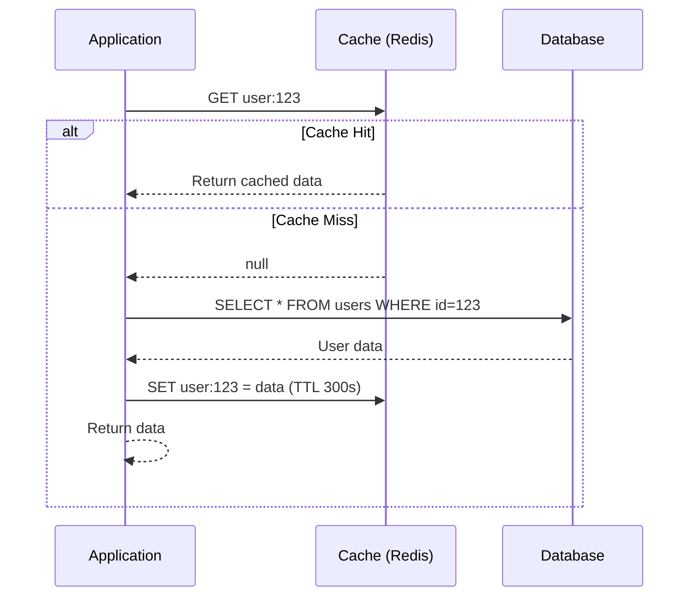
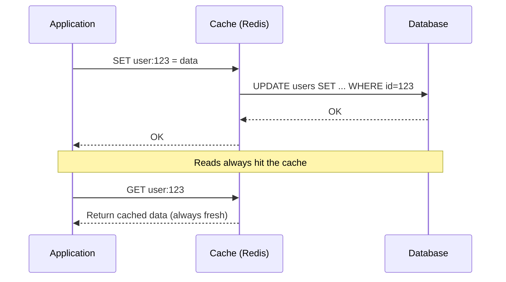
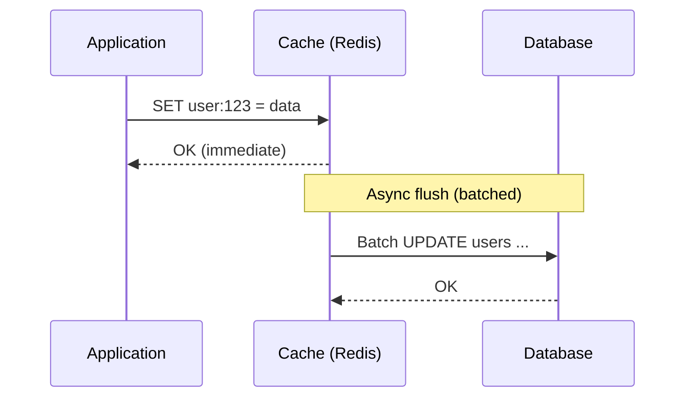
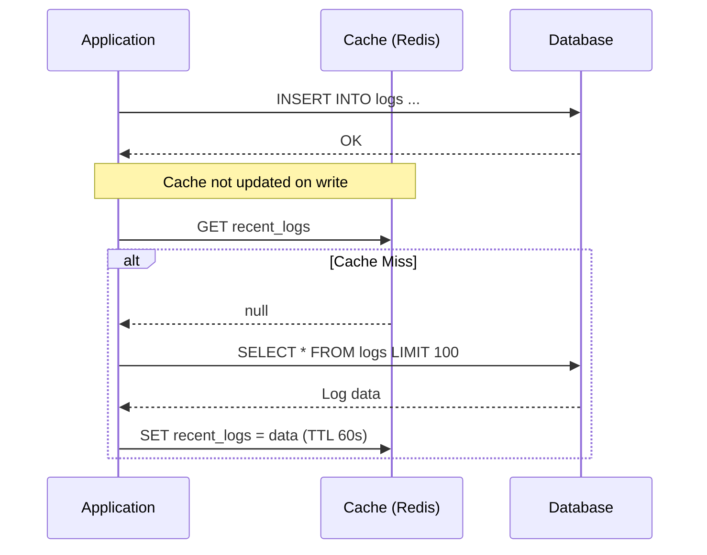
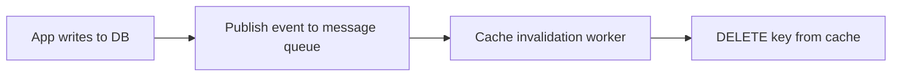
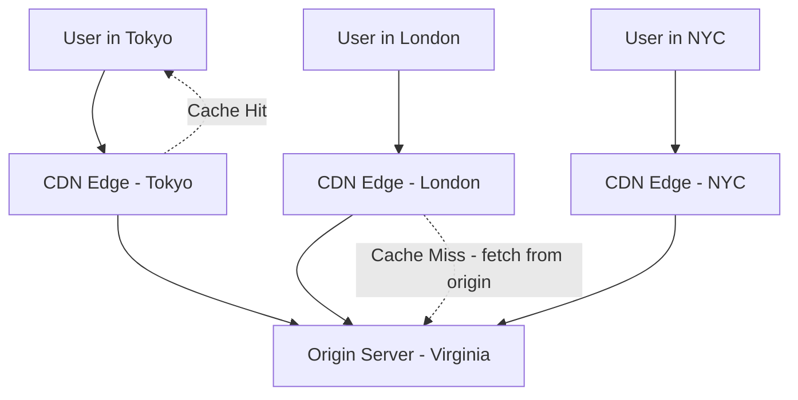
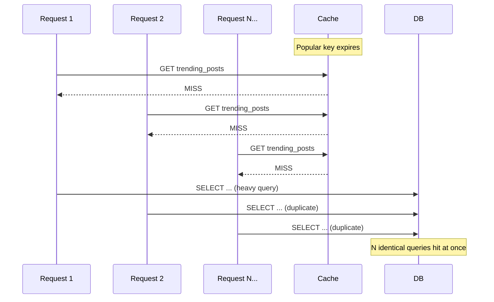

# Chapter 05 - Caching Strategies

> Your database answers a query in 5 milliseconds. Memory answers the same query in 100 microseconds. That's a 50x gap - and at 10,000 requests per second, those milliseconds become the wall your system slams into.

[Read on Medium](#) | [Watch on YouTube](#)

---

## Table of Contents

1. [Why Caching Matters](#why-caching-matters)
2. [The Latency Hierarchy](#the-latency-hierarchy)
3. [Cache-Aside (Lazy Loading)](#cache-aside-lazy-loading)
4. [Write-Through](#write-through)
5. [Write-Back (Write-Behind)](#write-back-write-behind)
6. [Write-Around](#write-around)
7. [Comparing Write Strategies](#comparing-write-strategies)
8. [Cache Eviction Policies](#cache-eviction-policies)
9. [Cache Invalidation](#cache-invalidation)
10. [Redis vs Memcached](#redis-vs-memcached)
11. [CDN Caching](#cdn-caching)
12. [Cache Stampede and Thundering Herd](#cache-stampede-and-thundering-herd)
13. [Cache Warming](#cache-warming)
14. [Real-World Examples](#real-world-examples)
15. [Common Pitfalls](#common-pitfalls)
16. [Key Takeaways](#key-takeaways)
17. [What's Next?](#whats-next)

---

## Why Caching Matters

Every system has a bottleneck. For most web applications, that bottleneck is the database. A single PostgreSQL query might take 5-50ms depending on complexity. Multiply that by thousands of concurrent users and you've got a problem.

Caching solves this by storing frequently accessed data in a faster storage layer - typically memory. Instead of asking the database every time, you check the cache first. If the data is there (a **cache hit**), you skip the database entirely. If it isn't (a **cache miss**), you fetch from the database and store a copy in the cache for next time.

The payoff is enormous. Twitter caches its entire social graph in memory. Facebook built an entire caching layer (TAO) that handles billions of reads per second. Netflix's EVCache processes 30 million requests per second across its fleet. These companies didn't adopt caching because it's trendy - they adopted it because nothing else scales to that level.

### Cache Hit Ratio

The single most important metric for any cache is the **hit ratio** - the percentage of requests served from the cache without touching the database.

```
Hit Ratio = cache hits / (cache hits + cache misses)
```

**Example math:** With a 95% hit ratio, 1ms cache latency, and 50ms DB latency:

```
Effective latency = (0.95 x 1ms) + (0.05 x 50ms)
                  = 0.95ms + 2.5ms
                  = 3.45ms    (instead of 50ms without cache - a 14x improvement)
```

Popular items routinely see hit rates above 99%. Stack Overflow serves millions of daily users with just 2 Redis instances because aggressive caching means most requests never touch the database.

---

## The Latency Hierarchy

Before choosing a caching strategy, you need to internalize how fast different storage tiers actually are.

| Operation | Latency | Relative Speed |
|---|---|---|
| L1 cache reference | 0.5 ns | 1x (baseline) |
| L2 cache reference | 7 ns | 14x slower |
| Main memory (RAM) | 100 ns | 200x slower |
| SSD random read | 16,000 ns (16 us) | 32,000x slower |
| HDD seek | 4,000,000 ns (4 ms) | 8,000,000x slower |
| Network round trip (same datacenter) | 500,000 ns (0.5 ms) | 1,000,000x slower |
| Network round trip (cross-continent) | 150,000,000 ns (150 ms) | 300,000,000x slower |

RAM is 250x faster than SSD for random reads. A Redis cache sitting in memory on the same network will answer in under a millisecond. Your PostgreSQL database sitting on an SSD will take 5-50ms. A CDN on a different continent adds 150ms of pure latency before the server even starts working.

These numbers dictate your caching architecture. Put the hottest data in the fastest tier you can afford.

---

## Cache-Aside (Lazy Loading)

Cache-aside is the most common caching pattern. The application manages both the cache and the database directly. Data enters the cache only when someone asks for it.



**How it works:**

1. Application checks the cache first.
2. On a hit, return the cached value immediately.
3. On a miss, query the database, store the result in the cache, then return it.

**When to use it:** Read-heavy workloads where you can tolerate stale data for short periods. This covers the majority of web applications - user profiles, product catalogs, configuration settings.

**The good:** Only requested data gets cached, so you don't waste memory on data nobody reads. The application keeps working even if the cache goes down (just slower).

**The bad:** The first request for any piece of data always hits the database (cold start penalty). Cached data can become stale if the database is updated without invalidating the cache.

Cache-aside is the default strategy for most applications. Start here unless you have a specific reason to do otherwise.

---

## Write-Through

Write-through caching writes data to both the cache and the database at the same time. Every write operation updates both stores before returning success to the caller.



**How it works:**

1. Application writes to the cache.
2. Cache synchronously writes to the database.
3. Both stores are always consistent.

**When to use it:** Workloads where data consistency is non-negotiable. Financial transactions, inventory counts, session tokens.

**The good:** Cache and database are always in sync. Reads never return stale data. You don't need a separate invalidation strategy.

**The bad:** Every write has the latency of two operations (cache + database). If you're writing data that nobody reads, you're wasting cache space. Write-heavy workloads will feel this penalty hard.

---

## Write-Back (Write-Behind)

Write-back is the performance-optimized cousin of write-through. Writes go to the cache immediately, and the cache flushes to the database asynchronously in the background.



**How it works:**

1. Application writes to the cache only.
2. Cache acknowledges immediately - the write is fast.
3. A background process flushes dirty entries to the database periodically or when a batch threshold is reached.

**When to use it:** Write-heavy workloads where brief inconsistency is acceptable. Analytics counters, view counts, activity logs, gaming leaderboards.

**The good:** Writes are extremely fast because they only touch memory. Multiple writes to the same key get coalesced - if a user updates their profile 5 times in a minute, only the final state hits the database.

**The bad:** Data loss risk. If the cache crashes before flushing, those writes are gone. This is a real tradeoff, not a theoretical one. You need to decide whether losing a few seconds of writes is acceptable for your use case.

---

## Write-Around

Write-around skips the cache entirely on writes. Data goes directly to the database. The cache only gets populated on subsequent reads (via cache-aside).



**When to use it:** Data that's written far more often than it's read. Log entries, audit trails, IoT sensor data. There's no point caching a log entry that might never be read again.

**The good:** Cache isn't polluted with write-once data. Memory stays reserved for genuinely hot data.

**The bad:** First reads after a write always miss. If your reads are time-sensitive and need the freshest data, write-around creates an awkward gap.

---

## Comparing Write Strategies

| Strategy | Write Latency | Read Latency | Consistency | Data Loss Risk |
|---|---|---|---|---|
| Cache-Aside | DB only | Hit: fast, Miss: slow | Eventual | None (DB is source of truth) |
| Write-Through | Slow (cache + DB) | Always fast | Strong | None |
| Write-Back | Fast (cache only) | Always fast | Eventual | Yes (cache crash) |
| Write-Around | Medium (DB only) | Hit: fast, Miss: slow | Eventual | None |

Most production systems use **cache-aside for reads** combined with one of the write strategies. Facebook's TAO uses write-through for social graph updates. Amazon's DynamoDB Accelerator (DAX) uses write-through. Redis itself can be configured for write-back with its AOF persistence.

Pick based on your read/write ratio. Read-heavy systems (90%+ reads) do fine with cache-aside alone. Write-heavy systems with consistency needs want write-through. Write-heavy systems that can tolerate data loss should consider write-back.

---

## Cache Eviction Policies

Caches have finite memory. When the cache is full and a new entry needs to come in, something has to go. The eviction policy determines what gets removed.

### LRU (Least Recently Used)

Evicts the entry that hasn't been accessed for the longest time. This is the default in Redis and the right choice for most applications.

**Why it works:** Temporal locality. Data accessed recently is likely to be accessed again. A user who just logged in will probably make more requests. A product page someone just viewed might get shared.

**Where it fails:** Scan pollution. If a batch job reads through every record in your database once, it fills the cache with data that won't be accessed again, evicting the actually popular data.

### LFU (Least Frequently Used)

Evicts the entry with the fewest access counts. Keeps popular data around even if it hasn't been accessed in the last few seconds.

**Why it works:** Some data is perpetually hot. Your homepage configuration, the top 10 trending products, your site's CSS bundle. LFU protects these from one-off requests.

**Where it fails:** Frequency counts create inertia. An item that was popular last week but isn't anymore will stick around because its count is high. Redis 4.0+ solves this with a decaying LFU that halves counts periodically.

### FIFO (First In, First Out)

Evicts the oldest entry regardless of access patterns. Simple to implement but rarely optimal.

**When to use it:** Time-series data where older entries are naturally less relevant. Session caches where you want a hard upper bound on session lifetime.

### TTL (Time To Live)

Not strictly an eviction policy but a complementary mechanism. Every entry gets an expiration timestamp. When the TTL expires, the entry is automatically removed.

**TTL is essential even with other eviction policies.** Without it, stale data can live in your cache indefinitely. Set TTLs based on how stale your data can tolerate being:

| Data Type | Suggested TTL |
|---|---|
| User session | 30 minutes |
| Product catalog | 5-15 minutes |
| Homepage content | 1-5 minutes |
| Config/feature flags | 30-60 seconds |
| Real-time stock prices | 1-5 seconds |

### Eviction Policy Comparison

| Policy | Best For | Weakness |
|---|---|---|
| LRU | General-purpose, most workloads | Scan pollution |
| LFU | Workloads with stable hot keys | Slow to adapt to trend changes |
| FIFO | Time-series, simple caches | Ignores access patterns entirely |
| TTL | Staleness control | Not a standalone eviction policy |

Use LRU unless you have a specific reason not to. Add TTL on top regardless of which policy you pick.

---

## Cache Invalidation

> "There are only two hard things in Computer Science: cache invalidation and naming things." - Phil Karlton

Cache invalidation is hard because you're maintaining two copies of data (cache and database) and trying to keep them synchronized. There are several approaches, each with distinct tradeoffs.

### TTL-Based Expiration

The simplest strategy. Set a TTL when writing to the cache and accept that data might be stale for up to that duration. No coordination needed.

Good enough for: product listings, blog posts, user profiles - anything where showing 5-minute-old data won't cause harm.

### Event-Driven Invalidation

When the database changes, publish an event that tells the cache layer to delete or update the relevant entries. This is what most mature systems use.



The challenge is making this reliable. If the event gets lost, the cache stays stale. If the event arrives before the database commit, you might cache old data. Systems like Debezium solve this by reading the database's write-ahead log (WAL) directly - the events can't get lost because they come from the database itself.

### Version-Based Invalidation

Attach a version number to cached data. When the underlying data changes, increment the version. Reads check the version and refetch on mismatch.

This works well for data with natural version identifiers - document revisions, deployment versions, schema migrations.

### Delete on Write

When you update the database, immediately delete the cache entry. The next read will populate a fresh copy via cache-aside. This is simpler and safer than trying to update the cache - you avoid race conditions where two concurrent writes leave the cache with a stale intermediate value.

**Why delete instead of update?** Consider two concurrent writers updating the same user. Writer A finishes the DB write first, then Writer B finishes its DB write. If both also update the cache, but Writer B's cache update arrives before Writer A's, the cache now holds Writer A's value while the database holds Writer B's. Deleting the key avoids this entirely.

### Invalidation Strategy Comparison

| Approach | Staleness Window | Complexity | Best For |
|---|---|---|---|
| TTL expiry | Up to TTL duration | Low | Data that changes infrequently |
| Delete on write | Near-zero (race window) | Medium | User-facing data with unpredictable writes |
| Event-driven (pub/sub) | Near-zero | High | Multi-server setups, microservices |
| Version stamps | Zero (verified on read) | Medium | Data where stale reads are dangerous |

---

## Redis vs Memcached

Both are in-memory key-value stores used for caching. Redis has largely won this battle, but Memcached still has its place.

| Feature | Redis | Memcached |
|---|---|---|
| Data structures | Strings, lists, sets, hashes, sorted sets, streams | Strings only |
| Persistence | RDB snapshots + AOF log | None |
| Replication | Built-in primary/replica | None (client-side) |
| Clustering | Redis Cluster (automatic sharding) | Client-side sharding |
| Pub/Sub | Yes | No |
| Lua scripting | Yes | No |
| Memory efficiency | Less efficient (overhead per key) | More efficient for simple strings |
| Multithreading | Single-threaded (I/O threads in 6.0+) | Multithreaded |
| Max value size | 512 MB | 1 MB (default) |

**Use Redis when:** You need data structures beyond simple strings, persistence, replication, or any advanced feature. This covers 90% of use cases.

**Use Memcached when:** You need a dead-simple string cache, your values are small, and you want to squeeze every byte of memory efficiency. Memcached's multi-threaded architecture also makes it faster for simple GET/SET on multi-core machines at very high throughput.

Facebook runs both. Memcached handles their massive social graph caching (TAO sits on top of it) because the workload is simple key-value lookups at enormous scale. But most companies should just use Redis - the operational simplicity of one system outweighs Memcached's marginal efficiency advantage.

---

## CDN Caching

A CDN (Content Delivery Network) is a geographically distributed cache for static and semi-static content. Instead of every user fetching your homepage from a server in Virginia, users in Tokyo hit a CDN edge node in Tokyo.



### What to Cache on a CDN

- Static assets: CSS, JavaScript, images, fonts (TTL: days to months)
- API responses that are the same for all users (TTL: seconds to minutes)
- HTML pages for logged-out users (TTL: minutes)
- Video and audio content (TTL: days)

### What NOT to Cache on a CDN

- Personalized content (user dashboards, account pages)
- Real-time data (stock tickers, live scores)
- Anything with sensitive data in the response

### Cache-Control Headers

CDN behavior is controlled by HTTP headers:

```
Cache-Control: public, max-age=3600        -- CDN and browsers can cache for 1 hour
Cache-Control: private, max-age=300         -- Only the browser caches, not the CDN
Cache-Control: no-store                     -- Don't cache anywhere
Cache-Control: s-maxage=600, max-age=60     -- CDN caches 10 min, browsers cache 1 min
```

The `s-maxage` directive is particularly useful - it lets you set different TTLs for the CDN and the end user's browser. You might want the CDN to hold content for 10 minutes but tell browsers to revalidate every minute.

### CDN Purging

When content changes, you need to remove it from every CDN edge node. Most CDNs (CloudFront, Cloudflare, Fastly) support:

- **Purge by URL:** Remove a specific resource from all edges.
- **Purge by tag/surrogate key:** Remove all resources matching a tag. Useful for "purge everything related to product X."
- **Purge all:** Nuclear option. Clears the entire cache. Use sparingly.

Fastly can purge in under 150ms globally. CloudFront takes 1-2 minutes. This matters if you need to quickly retract incorrect content.

---

## Cache Stampede and Thundering Herd

A cache stampede happens when a popular cache entry expires and hundreds of concurrent requests all see the miss simultaneously. Every one of them queries the database for the same data at the same time.



This can cascade. The database slows down under the sudden load, causing more timeouts, causing more retries, causing more load. A single expired key can take down your database.

### Solution 1: Locking (Mutex)

When a cache miss occurs, the first request acquires a lock and fetches from the database. All other requests either wait for the lock to release or get served a slightly stale value.

This is the most common solution. Redis supports this with `SET key value NX EX 30` (set if not exists, with a 30-second expiry on the lock itself to prevent deadlocks).

### Solution 2: Probabilistic Early Expiration

Each request that reads a cache entry has a small probability of refreshing it before the TTL actually expires. The probability increases as the TTL gets closer to expiration.

The formula: `currentTime - (ttl * beta * ln(random()))` > `expirationTime`

Where `beta` is a tuning parameter (typically 1.0). This spreads out refreshes over time so the cache entry never actually expires for everyone at once.

### Solution 3: Background Refresh

A dedicated background thread or cron job refreshes popular cache entries before they expire. The cached data always stays warm, and user requests never trigger a database fetch.

This is the simplest solution operationally but requires you to know which keys are "popular" upfront. Works great for homepage content, trending items, or any data you can predict will be requested.

### Which to Choose?

Use **locking** as your default - it handles arbitrary keys without foreknowledge. Add **background refresh** for your top 100 hottest keys. Use **probabilistic early expiration** if you want something self-tuning and can tolerate the occasional extra database query.

---

## Cache Warming

Cache warming is the practice of pre-loading the cache with data before traffic arrives. A cold cache - one that's empty after a restart or deployment - means every request hits the database until the cache fills up. For high-traffic systems, this initial surge can overwhelm the database.

**Warming strategies:**

- **Startup script:** On deployment, run a script that fetches the top N most-accessed keys from the database and loads them into the cache. Derive the "top N" from access logs or analytics.

- **Shadow traffic:** Before cutting over to a new cache cluster, replay production traffic against it so it fills up organically.

- **Buddy system:** When spinning up a new cache node, have it replicate from an existing warm node before accepting traffic.

- **Gradual rollout:** Route a small percentage of traffic to the new cache first. Increase the percentage as the hit rate climbs.

Netflix warms EVCache nodes before they enter the serving fleet. They learned this the hard way - cold cache nodes caused latency spikes that degraded the user experience.

---

## Real-World Examples

### Facebook TAO

TAO (The Associations and Objects) is Facebook's distributed data store for the social graph. It caches billions of objects (users, posts, comments) and associations (friendships, likes, tags) in memory.

- Sits on top of MySQL and Memcached
- Two-tier cache: L1 (per-region) and L2 (per-datacenter)
- Write-through caching with leader/follower topology
- Handles billions of reads per second with 99.9% cache hit rate
- Read-after-write consistency within a region

### Netflix EVCache

EVCache (Ephemeral Volatile Cache) is Netflix's distributed caching solution built on Memcached.

- Handles 30+ million requests per second
- Data replicated across availability zones for fault tolerance
- Automatic warm-up for new nodes joining the cluster
- Used for user sessions, personalization data, video metadata
- Cache-aside pattern with aggressive TTLs

### Twitter

Twitter's caching architecture uses Redis extensively:

- **Timeline cache:** Your home timeline is pre-computed and cached. When someone you follow tweets, it's fanned out and written to your cached timeline (write-behind pattern).
- **Tweet cache:** Individual tweets cached with LRU eviction.
- **User cache:** Profile data cached in Redis hashes.
- **Rate limiting:** Redis sorted sets track API usage per user.

---

## Common Pitfalls

### 1. Caching Everything

Not all data benefits from caching. Data that changes every second, data that's unique to each request, or data that's rarely accessed doesn't belong in a cache. You'll waste memory and add complexity for zero benefit.

**Rule of thumb:** Cache data that's read at least 10x more often than it's written.

### 2. No Eviction Policy

Running your cache without a max memory limit and eviction policy is a ticking time bomb. When memory fills up, Redis starts returning errors (or worse, the OS kills the process). Always set `maxmemory` and `maxmemory-policy` in Redis.

### 3. Cache as Source of Truth

If losing your cache means losing data, you don't have a cache - you have an unreliable database. Caches should always be rebuildable from the backing store. Design so your system works (slowly) with the cache completely empty.

### 4. Ignoring Serialization Costs

Serializing complex objects to store in the cache can be expensive. If you're caching a 10KB JSON blob and deserializing it on every request, the serialization overhead might negate the caching benefit. Profile this.

### 5. Inconsistent TTLs

If you cache user data with a 1-hour TTL in one place and a 5-minute TTL in another, you'll show contradictory information to users. Centralize your TTL configuration.

### 6. No Cache Metrics

If you don't measure your hit rate, you're flying blind. A cache with a 50% hit rate might not be worth the operational overhead. Aim for 90%+ hit rate. If you can't get there, reconsider what you're caching.

### 7. Storing Large Values

Redis isn't a blob store. Caching a 50MB video in Redis is a mistake - that's what CDNs and object stores are for. Keep cached values under 100KB. If a value is larger, consider breaking it into smaller pieces or rethinking your access patterns.

### 8. Caching Errors

A 500 error response gets cached and then served to every user for the duration of the TTL. Never cache error responses - only cache successful results.

---

## Key Takeaways

1. **Cache-aside is your default pattern.** Simple, resilient, and covers most read-heavy workloads. Start here.

2. **Write strategy depends on your consistency needs.** Write-through for strong consistency. Write-back for performance. Write-around for write-heavy data nobody reads.

3. **LRU is the right eviction policy for most systems.** Add TTLs on top for staleness control.

4. **Invalidation is harder than caching.** TTL-based expiration is simplest. Event-driven invalidation is most correct. Pick based on how stale your data can be.

5. **Redis beats Memcached for almost everything.** Use Memcached only if you need maximum memory efficiency for simple string caching at Facebook scale.

6. **Cache stampede will bite you.** Use locking as your default defense. Add background refresh for your hottest keys.

7. **Warm your cache before it takes traffic.** Cold caches cause cascading failures. Pre-load popular data on deployment.

8. **Measure your hit rate.** Below 90%, reconsider your caching strategy. Above 99%, you've done well.

---

## What's Next?

- **Chapter 06:** [Load Balancing](../06-load-balancing/) - Distributing traffic across servers, algorithms (round-robin, least connections, consistent hashing), and health checks.
