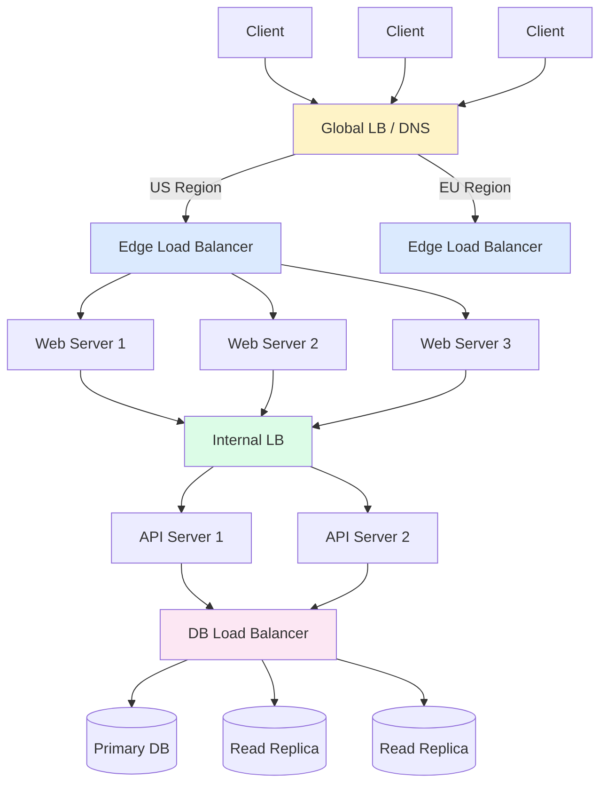
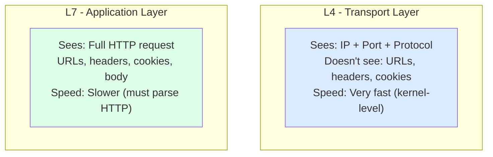
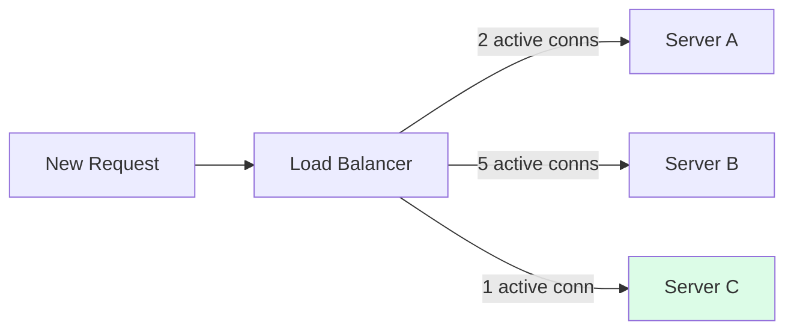
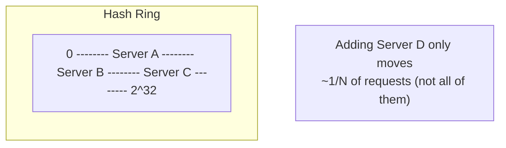
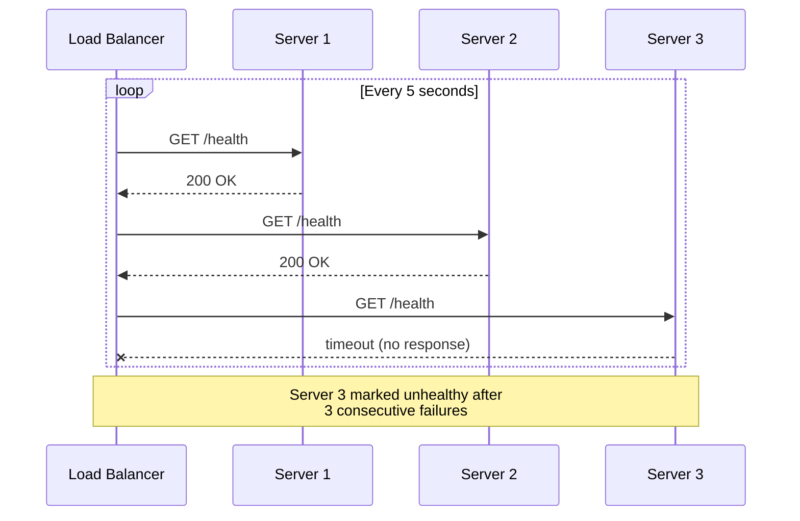
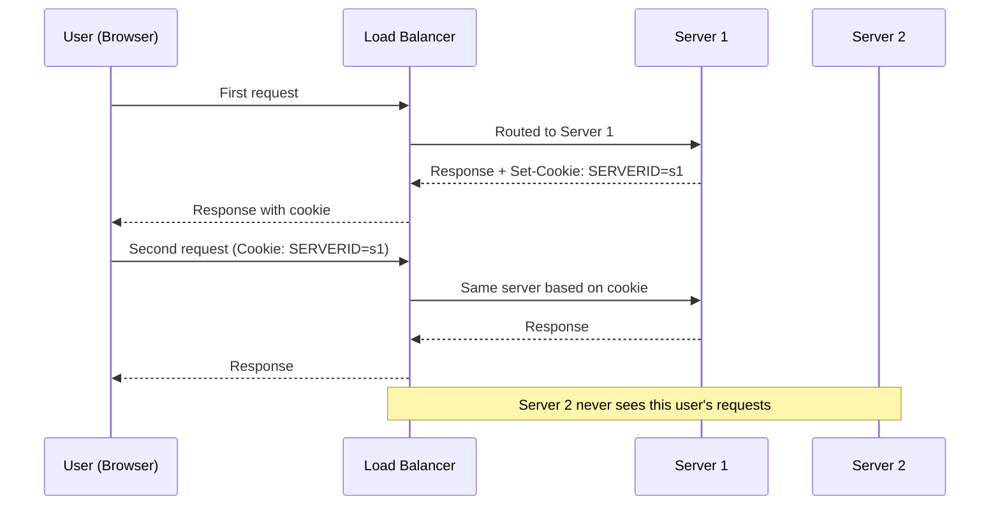
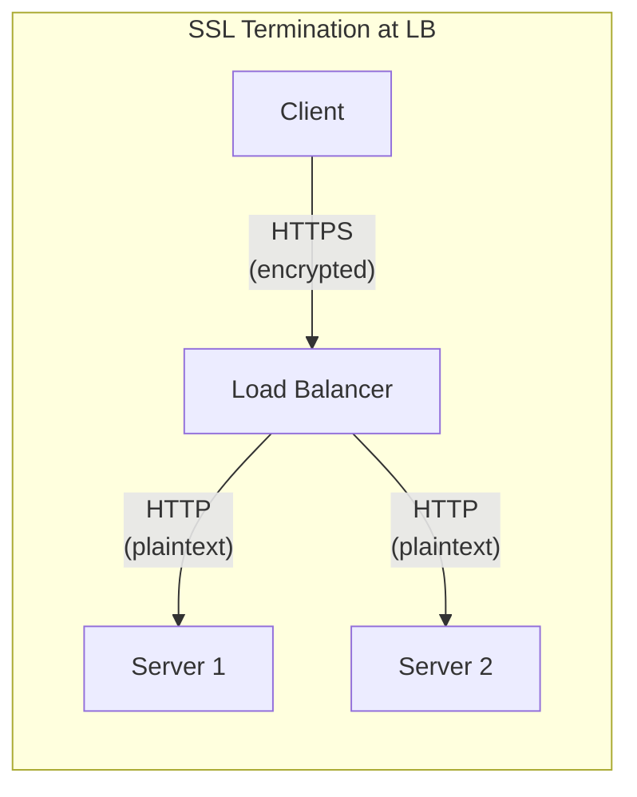
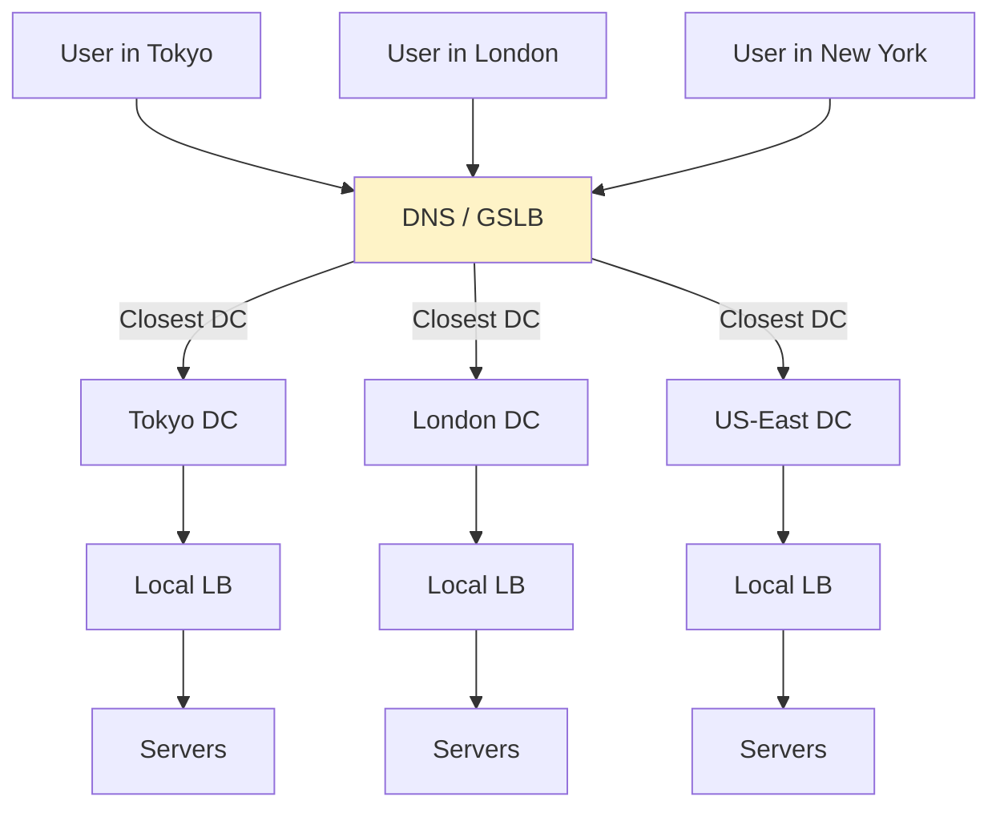

# Chapter 06 - Load Balancing

> A single server handling all your traffic is a single point of failure waiting to happen. Load balancers sit between clients and servers, distributing requests so no one machine gets crushed while others idle. They're invisible when they work and catastrophic when they don't - which makes understanding them non-negotiable for any system design conversation.

📖 [Read on Medium](#) · 🎬 [Watch on YouTube](#)

---

## Why Load Balancing Matters

Every production system that serves more than trivial traffic needs load balancing. Without it, you're stuck with two bad options: one overloaded server, or DNS-based distribution where clients cache stale IPs and hit dead machines for hours after a failure.

A load balancer solves three problems simultaneously:

1. **Distributes traffic** across multiple servers so no single machine bottlenecks the system
2. **Detects failures** and stops sending traffic to unhealthy servers within seconds
3. **Enables horizontal scaling** - add more servers behind the LB without changing client code

Netflix, Google, and Amazon don't run one massive server. They run thousands of smaller servers behind load balancers. When a server crashes at 3 AM, the load balancer routes around it before anyone notices.

---

## Where Load Balancers Sit

Load balancers can appear at multiple layers of your architecture:



You'll commonly see load balancers at three layers:

| Layer | Position | Purpose |
|-------|----------|---------|
| **Global** | DNS / Anycast | Route users to the nearest data center |
| **Edge** | Between clients and web servers | Distribute HTTP/HTTPS traffic |
| **Internal** | Between services | Distribute microservice-to-microservice calls |
| **Database** | Before read replicas | Spread read queries across replicas |

---

## L4 vs L7 Load Balancing

This is the most important distinction. Load balancers operate at different layers of the network stack, and the layer determines what they can see and do.



### L4 Load Balancing (Transport Layer)

Operates on TCP/UDP packets. It sees source IP, destination IP, and port numbers - nothing else. The load balancer forwards raw TCP connections without inspecting the content.

**How it works:** A client connects to the LB's IP:port. The LB picks a backend server and forwards the entire TCP connection. All packets for that connection go to the same server.

**Advantages:**
- Extremely fast - decisions happen at the kernel level, often with hardware acceleration
- Protocol-agnostic - works with HTTP, WebSocket, gRPC, database protocols, anything over TCP
- Lower resource consumption - doesn't need to parse application data

**Disadvantages:**
- Can't route based on URL path, headers, or cookies
- Can't do content-based health checks (only TCP connect checks)
- Can't modify requests or responses

### L7 Load Balancing (Application Layer)

Operates on HTTP requests. It fully parses the request - URL, headers, cookies, even the body - and makes routing decisions based on that content.

**How it works:** The client's TLS connection terminates at the LB. The LB reads the full HTTP request, decides which backend to use, and opens a separate connection to that backend.

**Advantages:**
- Route `/api/*` to API servers and `/static/*` to CDN origins
- Inspect cookies for session affinity
- Add, remove, or modify headers
- Terminate SSL in one place
- HTTP-level health checks (check that `/health` returns 200)

**Disadvantages:**
- Higher latency - must parse full HTTP request
- More CPU-intensive - TLS termination + HTTP parsing
- Only works with protocols it understands (HTTP/HTTPS, not raw TCP)

### Which One to Use

| Scenario | Choose | Why |
|----------|--------|-----|
| Raw TCP traffic (databases, game servers) | L4 | LB doesn't understand the protocol |
| Microservices with URL-based routing | L7 | Need path-based routing |
| WebSocket with initial HTTP upgrade | L7 | Need to inspect the upgrade request |
| Maximum throughput, simple distribution | L4 | Kernel-level forwarding is faster |
| SSL termination at the LB | L7 | L4 can't terminate TLS for you |
| Mixed content routing (API + static files) | L7 | Need content-aware decisions |

The honest answer: most web applications use L7 load balancing because you almost always need URL-based routing or SSL termination. L4 shows up in internal service meshes and database proxies where raw speed matters.

---

## Load Balancing Algorithms

The algorithm determines which server gets the next request. No single algorithm is best for all situations.

### Round Robin

Sends requests to servers in sequential order: server 1, server 2, server 3, server 1, server 2, server 3...

```
Request 1 --> Server A
Request 2 --> Server B
Request 3 --> Server C
Request 4 --> Server A  (cycle repeats)
Request 5 --> Server B
Request 6 --> Server C
```

**Good for:** Homogeneous server fleets where all machines have identical specs and request costs are uniform.

**Bad for:** Mixed hardware or requests with wildly different processing times. A server handling a 10-second report gets the same share as one handling 5ms health checks.

### Weighted Round Robin

Like round robin, but servers get traffic proportional to their weight. A server with weight 3 gets three requests for every one that a weight-1 server gets.

```
Weights: A=3, B=1, C=1

Request 1 --> Server A
Request 2 --> Server A
Request 3 --> Server A
Request 4 --> Server B
Request 5 --> Server C
Request 6 --> Server A  (cycle repeats)
```

**Good for:** Mixed hardware where some machines are more powerful. Set weights based on CPU/memory capacity.

### Least Connections

Sends each request to the server with the fewest active connections right now. This naturally adapts to servers that process requests at different speeds.



The new request goes to Server C because it has the fewest connections.

**Good for:** Requests with variable processing times - long-running queries, file uploads, WebSocket connections. This is the best general-purpose algorithm when request duration varies.

**Bad for:** Situations where connection count doesn't reflect actual load (e.g., keep-alive connections that are mostly idle).

### IP Hash

Hashes the client's IP address to deterministically pick a server. The same client always hits the same server (as long as the server pool doesn't change).

```
hash("192.168.1.10") % 3 = 0 --> Server A
hash("192.168.1.11") % 3 = 2 --> Server C
hash("192.168.1.12") % 3 = 1 --> Server B
hash("192.168.1.10") % 3 = 0 --> Server A  (same client, same server)
```

**Good for:** Simple session affinity without cookies. Stateful applications that store session data in local memory.

**Bad for:** Uneven distribution (some IPs generate far more traffic than others). Adding or removing a server reshuffles most client assignments.

### Consistent Hashing

Places both servers and request keys on a virtual ring. Each request goes to the nearest server clockwise on the ring. When a server joins or leaves, only requests near that point on the ring get reassigned - not the entire pool.



**Good for:** Caching layers, distributed systems, any situation where minimizing redistribution on server changes matters. This is what Cassandra, DynamoDB, and Memcached use.

We cover consistent hashing in depth in [Chapter 20](../20-consistent-hashing/).

### Algorithm Comparison

| Algorithm | Even Distribution | Handles Variable Load | Session Affinity | Resilient to Pool Changes |
|-----------|:-:|:-:|:-:|:-:|
| Round Robin | Good | Poor | No | N/A |
| Weighted Round Robin | Good (with tuning) | Poor | No | N/A |
| Least Connections | Excellent | Excellent | No | N/A |
| IP Hash | Fair | Poor | Yes | Poor |
| Consistent Hashing | Good | Poor | Yes | Excellent |

---

## Health Checks

A load balancer that sends traffic to dead servers is worse than no load balancer at all. Health checks let the LB detect failures and stop routing to unhealthy backends.

### Active Health Checks

The load balancer periodically pings each server to verify it's alive.



**Configuration knobs:**
- **Interval:** How often to check (typically 5-30 seconds)
- **Timeout:** How long to wait for a response (typically 2-5 seconds)
- **Unhealthy threshold:** Consecutive failures before marking a server down (typically 2-3)
- **Healthy threshold:** Consecutive successes before marking a recovered server as up (typically 2-3)

### Passive Health Checks

Instead of sending probes, the LB monitors real traffic. If a server starts returning 502/503 errors or timing out on actual requests, it gets marked unhealthy.

| Aspect | Active | Passive |
|--------|--------|---------|
| **How it works** | LB sends periodic probes | LB watches real traffic |
| **Detection speed** | Depends on check interval | Immediate (on next real request) |
| **Extra traffic** | Yes - probe requests | No |
| **Accuracy** | Can miss application-level bugs | Catches issues that health endpoints don't |
| **False positives** | Low (dedicated health endpoint) | Higher (one slow request isn't a failure) |

Most production setups use both: active checks catch servers that are completely down, passive checks catch degraded performance on live traffic.

### What a Good Health Check Endpoint Does

A `/health` endpoint that returns `200 OK` without checking anything is nearly useless. A good health check verifies the things that actually break:

```
GET /health

{
  "status": "healthy",
  "checks": {
    "database": "connected",
    "cache": "connected",
    "disk_space": "ok (72% used)",
    "memory": "ok (2.1 GB / 8 GB)"
  }
}
```

If the database connection is dead, the server should report itself as unhealthy - even though the process is running. A server that can't reach its database isn't useful to anyone.

---

## Session Persistence (Sticky Sessions)

Some applications store user state in local server memory - shopping carts, partially filled forms, WebSocket connections. If the load balancer sends a user's next request to a different server, that state is lost.

Sticky sessions solve this by routing all requests from a given user to the same backend server.



### Methods of Implementing Sticky Sessions

| Method | How | Pros | Cons |
|--------|-----|------|------|
| **Cookie-based** | LB injects a cookie identifying the backend | Reliable, survives IP changes | Requires cookie support in client |
| **IP-based** | Hash the client IP | No client cooperation needed | Breaks behind NAT (thousands of users share one IP) |
| **URL parameter** | Append server ID to URLs | Works without cookies | Ugly URLs, security risk |

### Why Sticky Sessions Are a Code Smell

Sticky sessions work, but they create real problems:

- **Uneven load** - popular users pile up on one server while others sit idle
- **Failover breaks state** - when the sticky server dies, the user's session is gone
- **Scaling constraints** - you can't freely add/remove servers without disrupting sessions

The better solution is **externalized state**. Store sessions in Redis or a database so any server can handle any request. This is why Chapter 05 (Caching) matters - move session data to a shared cache and sticky sessions become unnecessary.

---

## SSL/TLS Termination

TLS encryption between clients and servers is mandatory for any production system. The question is where to terminate it.



### Why Terminate at the Load Balancer

- **Centralizes certificate management** - one place to install and renew certs, not 50 servers
- **Offloads CPU** - TLS handshakes are expensive; the LB handles them instead of your app servers
- **Enables L7 inspection** - the LB can read headers and URLs only after decrypting
- **Simplifies backend config** - app servers just serve HTTP, no TLS configuration needed

### The Security Trade-off

Traffic between the LB and backend servers is unencrypted. In a trusted network (same VPC, same data center), this is usually acceptable. If you're routing across untrusted networks, use **TLS re-encryption** - the LB terminates the client's TLS, inspects the request, then opens a new TLS connection to the backend.

---

## Global Server Load Balancing (GSLB)

Standard load balancers distribute traffic across servers within one data center. GSLB distributes traffic across data centers worldwide.



### GSLB Routing Strategies

| Strategy | How It Works | Use Case |
|----------|-------------|----------|
| **Geographic** | Route to the nearest data center by location | Latency-sensitive applications |
| **Latency-based** | Route based on measured round-trip time | When geography doesn't perfectly predict latency |
| **Failover** | Route to primary DC, switch to secondary on failure | Disaster recovery |
| **Weighted** | Split traffic by percentage across DCs | Gradual rollouts, canary deployments |

### How DNS-Based GSLB Works

1. User queries DNS for `api.example.com`
2. The authoritative DNS server (acting as GSLB) checks the user's location
3. Returns the IP of the nearest healthy data center
4. User connects directly to that data center's load balancer

The downside: DNS TTLs. Clients and recursive resolvers cache DNS responses. If a data center goes down, some clients keep hitting the dead IP until the TTL expires. Setting low TTLs (30-60 seconds) helps but increases DNS query volume.

---

## Software vs Hardware Load Balancers

### Hardware Load Balancers

Dedicated physical appliances from vendors like F5 (BIG-IP) and Citrix (NetScaler). They use custom ASICs for wire-speed packet processing.

**Advantages:** Extreme throughput (millions of connections per second), specialized hardware acceleration for SSL, predictable performance.

**Disadvantages:** Expensive ($50K-$500K per unit), slow to provision, vendor lock-in, manual scaling. You can't spin up a new one in 30 seconds.

### Software Load Balancers

Programs running on commodity servers or cloud instances. Nginx, HAProxy, Envoy, and cloud-native options like AWS ALB/NLB.

**Advantages:** Cheap (free for open source), fast to deploy, scriptable configuration, autoscale with demand.

**Disadvantages:** Slightly lower raw throughput than purpose-built hardware (though modern software LBs handle millions of requests per second, which is enough for nearly everyone).

### The Market Has Decided

Hardware load balancers are a legacy choice. The industry has moved overwhelmingly to software and cloud-managed load balancers. Unless you're a telecom carrier or financial exchange processing tens of millions of packets per second with sub-microsecond latency requirements, software wins.

---

## Popular Load Balancers in Production

| Tool | Type | Layer | Sweet Spot |
|------|------|-------|-----------|
| **Nginx** | Software (open source) | L7 (L4 with stream module) | Web server + reverse proxy + LB, most popular choice for web apps |
| **HAProxy** | Software (open source) | L4 and L7 | High-performance proxying, used by GitHub, Stack Overflow, Reddit |
| **Envoy** | Software (open source) | L7 | Service mesh sidecar proxy, used in Istio, gRPC-native |
| **AWS ALB** | Cloud-managed | L7 | AWS applications needing path-based routing, WebSocket support |
| **AWS NLB** | Cloud-managed | L4 | Ultra-low latency TCP/UDP, millions of requests per second |
| **Google Cloud LB** | Cloud-managed | L4 and L7 | Global anycast, single IP for worldwide distribution |
| **F5 BIG-IP** | Hardware/software | L4 and L7 | Legacy enterprise, telecom, financial services |

### Nginx vs HAProxy

This is the most common head-to-head comparison:

| Feature | Nginx | HAProxy |
|---------|-------|---------|
| **Primary role** | Web server that also does LB | Purpose-built load balancer |
| **Config style** | Declarative config blocks | Detailed proxy configuration |
| **Health checks** | Basic (open source), advanced (Nginx Plus) | Advanced, highly configurable |
| **Stats/monitoring** | Limited (open source) | Excellent built-in stats page |
| **SSL termination** | Excellent | Excellent |
| **WebSocket** | Yes | Yes |
| **Community** | Massive | Large |
| **Use when** | You already use Nginx as your web server | You need a dedicated, feature-rich LB |

---

## Real-World Examples

### Netflix

Uses a multi-layer load balancing approach. AWS ELB handles external traffic, then Zuul (their custom L7 gateway) routes requests to microservices. Each service uses Eureka for service discovery and ribbon for client-side load balancing. They process billions of requests per day across three AWS regions.

### GitHub

Runs HAProxy as their primary load balancer. They've published extensively about their setup - HAProxy routes traffic based on URL patterns to different backend clusters (web, API, git operations). They handle millions of git pushes and pulls per day with L7 routing decisions.

### Cloudflare

Operates one of the world's largest Anycast networks. Every one of their 300+ data centers can handle any request. They use BGP Anycast for L3 load balancing (the network itself routes packets to the nearest DC) combined with custom L7 proxying at each edge location.

### Stripe

Uses Envoy as their service mesh proxy. Every service instance has an Envoy sidecar that handles load balancing, retries, circuit breaking, and observability. This keeps load balancing logic out of application code entirely.

---

## Common Pitfalls

| Pitfall | Why It Hurts | Fix |
|---------|-------------|-----|
| No health checks | LB sends traffic to dead servers, users see 502 errors | Configure active + passive health checks with proper thresholds |
| Sticky sessions as default | Uneven load, painful failover, can't scale freely | Externalize state to Redis; use sticky sessions only as a last resort |
| Single load balancer (no redundancy) | The LB itself becomes the single point of failure | Run LB pairs in active-passive or active-active with failover |
| Health check returns 200 unconditionally | Server reports healthy even when its database is down | Check actual dependencies in the health endpoint |
| Ignoring connection draining | Removing a server drops in-flight requests | Enable graceful drain - stop sending new requests, wait for existing ones to finish |
| Wrong algorithm for the workload | Round robin with highly variable request times means some servers get crushed | Use least-connections when request duration varies significantly |
| SSL everywhere (no termination) | Every backend server manages its own certs, wastes CPU on TLS | Terminate SSL at the LB, use plain HTTP internally (within a trusted network) |
| DNS TTL too high for GSLB | Failover takes minutes or hours because clients cache the old IP | Set TTLs to 30-60 seconds for services that need fast failover |

---

## Key Takeaways

1. **L7 is the default for web traffic** - you almost always need URL routing or SSL termination, which requires application-layer inspection
2. **Least connections is the safest general-purpose algorithm** - it naturally adapts to variable request times and heterogeneous hardware
3. **Health checks are non-negotiable** - a load balancer without health checks is just a traffic splitter
4. **Sticky sessions are a workaround, not a feature** - externalize state so any server can handle any request
5. **The load balancer itself needs redundancy** - a single LB is a single point of failure, which defeats the purpose
6. **Software load balancers have won** - Nginx, HAProxy, and cloud-managed LBs cover 99% of use cases; hardware LBs are a niche play
7. **Consistent hashing matters at scale** - when adding or removing servers, you want to disrupt as few clients as possible

---

## What's Next?

- **Chapter 07:** [Message Queues & Event Streaming](../07-message-queues/) - Decouple services and handle traffic spikes by buffering work in queues instead of processing everything synchronously
