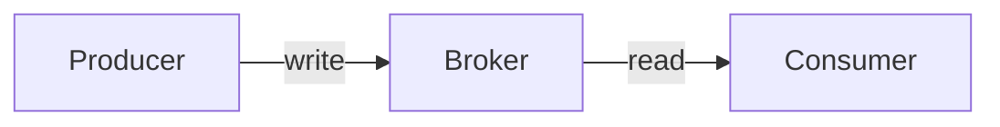
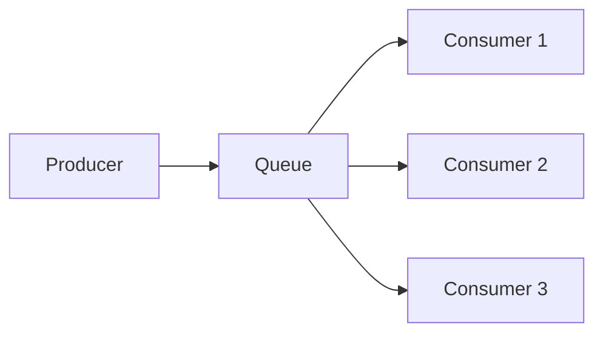
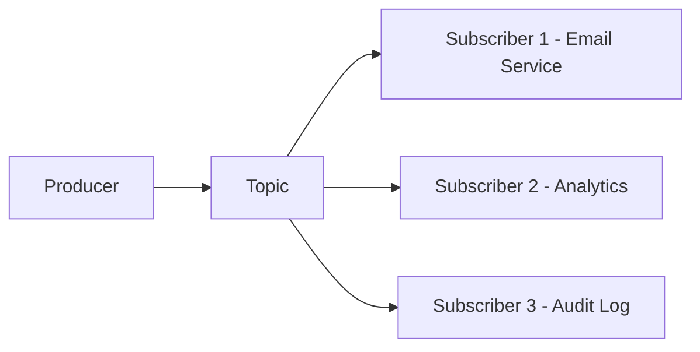
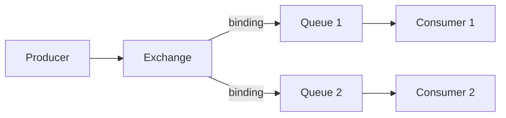
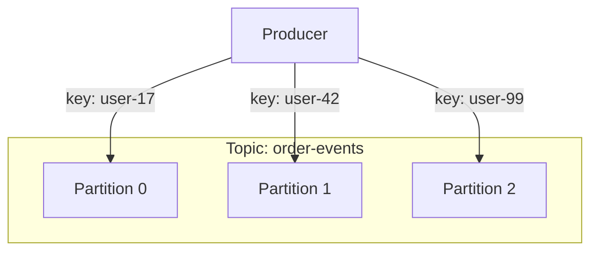
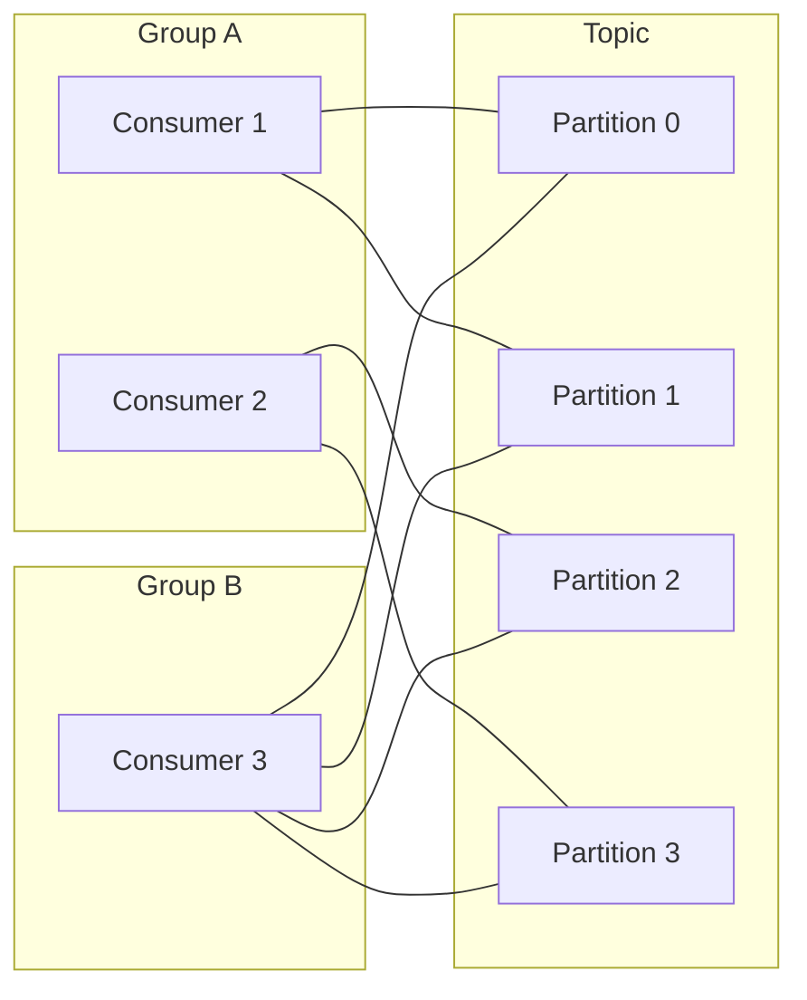
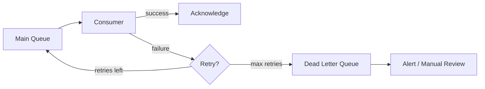
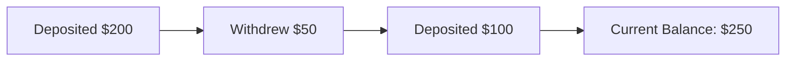

# Chapter 07 - Message Queues & Event Streaming

> Every distributed system eventually hits the same wall: Service A needs to
> tell Service B something happened, but Service B is slow, down, or just not
> ready yet. The answer isn't to make A wait around - it's to drop a message
> in a queue and move on. That single idea - decouple the sender from the
> receiver - unlocks the patterns behind every high-throughput system you
> actually use.

📖 [Read on Medium](#) · 🎬 [Watch on YouTube](#)

---

## Table of Contents

1. [Why Async Messaging](#why-async-messaging)
2. [Two Fundamental Patterns](#two-fundamental-patterns)
3. [Message Queue vs Event Stream](#message-queue-vs-event-stream)
4. [RabbitMQ Concepts](#rabbitmq-concepts)
5. [Kafka Architecture](#kafka-architecture)
6. [Delivery Guarantees](#delivery-guarantees)
7. [Dead Letter Queues](#dead-letter-queues)
8. [Backpressure](#backpressure)
9. [Event Sourcing Basics](#event-sourcing-basics)
10. [Ordering Guarantees](#ordering-guarantees)
11. [Kafka vs RabbitMQ](#kafka-vs-rabbitmq)
12. [Real-World Examples](#real-world-examples)
13. [Common Pitfalls](#common-pitfalls)
14. [Key Takeaways](#key-takeaways)
15. [What's Next?](#whats-next)

---

## Why Async Messaging

Synchronous communication (HTTP request/response, gRPC calls) works fine when
both sides are fast and available. The moment either condition breaks, you get
cascading failures. Service A calls Service B, which calls Service C - if C is
slow, B backs up, A times out, and the user sees a spinner.

Async messaging fixes this by inserting a broker between producer and consumer:

The producer fires a message and immediately returns. The consumer reads it
whenever it's ready. This buys you three things:

1. **Temporal decoupling** - Producer and consumer don't need to be alive at
   the same time. The broker holds messages until someone picks them up.

2. **Rate decoupling** - A producer can blast 10,000 messages/sec even if the
   consumer only handles 500/sec. The broker absorbs the burst.

3. **Failure isolation** - If the consumer crashes, messages pile up in the
   broker instead of crashing the producer. When the consumer restarts, it
   picks up where it left off.

Without async messaging, you're building a house of cards. One slow service
brings down the entire chain.

---

## Two Fundamental Patterns

Every messaging system boils down to two patterns: point-to-point and pub/sub.
Everything else is a variation.

### Point-to-Point (Competing Consumers)

One message goes to exactly one consumer. If you have three consumers on the
same queue, each message is delivered to only one of them. This is how you
distribute work across workers.

Use cases: task queues, job processing, order fulfillment. You don't want two
workers processing the same payment.

### Publish/Subscribe (Fan-Out)

One message goes to every subscriber. Each subscriber gets its own copy. This
is how you broadcast events to multiple independent services.

Use cases: event notification, data replication, cache invalidation. When a
user signs up, the email service, analytics pipeline, and audit log all need
to know - but they shouldn't know about each other.

### The Key Difference

| Aspect | Point-to-Point | Pub/Sub |
|--------|---------------|---------|
| Delivery | One consumer per message | All subscribers get every message |
| Scaling | Add consumers to share load | Each subscriber processes independently |
| Coupling | Consumers compete for work | Subscribers are independent |
| Use case | Work distribution | Event notification |

---

## Message Queue vs Event Stream

People use "message queue" and "event stream" interchangeably. They shouldn't.
The mental models are fundamentally different.

### Message Queue (Think: Task List)

A message queue is a buffer of work items. Once a consumer processes a message
and acknowledges it, the message is deleted. The queue doesn't care about
history - it cares about getting work done.

- Messages are transient - consumed and discarded
- The broker tracks which messages have been delivered
- Consumers don't control where they read from
- Built for: task distribution, request/reply, work queues

### Event Stream (Think: Append-Only Log)

An event stream is a persistent, ordered log of facts. Events aren't "consumed"
in the traditional sense - they're read. Multiple consumers can read the same
events independently. Old events stick around (based on retention policy).

- Events are persistent - stored for hours, days, or forever
- Consumers track their own position (offset) in the log
- Consumers can rewind and replay from any point
- Built for: event sourcing, stream processing, data pipelines

### Side-by-Side

| Feature | Message Queue | Event Stream |
|---------|--------------|-------------|
| Storage | Transient | Persistent log |
| After reading | Message deleted | Event stays |
| Position tracking | Broker tracks | Consumer tracks (offset) |
| Replay | Not possible | Replay from any offset |
| Ordering | Per-queue FIFO | Per-partition ordering |
| Example | RabbitMQ, SQS | Kafka, Kinesis, Pulsar |

This distinction matters for system design. If you need to replay last week's
events because you deployed a buggy consumer, you need a stream, not a queue.

---

## RabbitMQ Concepts

RabbitMQ is the most widely deployed message broker. It implements AMQP
(Advanced Message Queuing Protocol) and gives you fine-grained control over
message routing.

### Core Components

**Exchanges** receive messages from producers and route them to queues based on
rules called bindings. The producer never writes directly to a queue - it
publishes to an exchange with a routing key.

**Queues** store messages until consumers read them. Queues are the actual
buffers.

**Bindings** are the routing rules that connect exchanges to queues. A binding
says "messages with routing key X go to queue Y."

### Exchange Types

| Exchange Type | Routing Logic | Use Case |
|--------------|--------------|----------|
| Direct | Exact routing key match | Task routing by type |
| Fanout | Broadcast to all bound queues | Event notification |
| Topic | Pattern matching on routing key (e.g., `order.*`) | Flexible routing |
| Headers | Match on message headers | Complex routing rules |

Direct exchanges are the workhorse. Fanout exchanges give you pub/sub. Topic
exchanges split the difference - you can subscribe to `order.created` or
`order.*` to get all order events.

### Acknowledgments

RabbitMQ won't delete a message until the consumer explicitly acknowledges it.
If the consumer crashes before acking, the message goes back on the queue and
gets redelivered to another consumer. This is how RabbitMQ guarantees at-least-once
delivery.

You can also reject a message (nack) and optionally requeue it or send it to a
dead letter exchange.

---

## Kafka Architecture

Apache Kafka isn't a message queue - it's a distributed commit log. LinkedIn
built it to handle trillions of messages per day for activity tracking, and it
turns out an append-only log is a remarkably powerful abstraction.

### Topics and Partitions

A **topic** is a named feed of events - think "order-events" or "user-clicks."
Each topic is split into **partitions**, which are the unit of parallelism and
ordering.

Each partition is an ordered, immutable sequence of records. Messages within a
partition are assigned a sequential **offset** (0, 1, 2, ...). Kafka guarantees
ordering within a partition but not across partitions.

When a producer sends a message, it includes a **partition key** (often the
entity ID). Kafka hashes the key to determine which partition gets the message.
All events for `user-42` always land in the same partition, which means they're
always in order.

### Consumer Groups

A **consumer group** is a set of consumers that cooperate to read a topic.
Kafka assigns each partition to exactly one consumer in the group. If you have
6 partitions and 3 consumers, each consumer reads 2 partitions.

Different consumer groups read the same data independently. Group A might be
the payment service reading order events, while Group B is the analytics
pipeline - both reading the same topic, each tracking their own offsets.

### Offset Management

Each consumer tracks its position in each partition via an offset. After
processing a batch of records, the consumer commits its offset. If it crashes
and restarts, it resumes from the last committed offset.

This is why Kafka supports replay. Want to reprocess yesterday's events? Reset
your consumer group's offset to yesterday's position and consume again.

### Brokers and Replication

A Kafka cluster has multiple **brokers** (servers). Each partition is replicated
across brokers for fault tolerance. One replica is the **leader** (handles all
reads and writes), and the others are **followers** that replicate the data.

| Concept | What It Is |
|---------|-----------|
| Broker | A single Kafka server |
| Topic | A named category of events |
| Partition | Ordered sub-log within a topic |
| Offset | Position of a record in a partition |
| Consumer Group | Coordinated set of consumers |
| Replication Factor | Number of copies per partition |

---

## Delivery Guarantees

This is where messaging gets tricky. There are three delivery semantics, and
the one you pick shapes your entire architecture.

### At-Most-Once

Fire and forget. The producer sends the message and doesn't wait for
confirmation. If the broker is down or the network drops the packet, the
message is lost.

- **How:** Producer doesn't retry. Consumer auto-acks before processing.
- **Trade-off:** Fast, but you can lose data.
- **Use case:** Metrics, logging - where losing a data point isn't catastrophic.

### At-Least-Once

The producer retries until it gets an acknowledgment. The consumer processes
the message and then acks. If the consumer crashes after processing but before
acking, the message gets redelivered - so you might process it twice.

- **How:** Producer retries on failure. Consumer acks after processing.
- **Trade-off:** No data loss, but possible duplicates.
- **Use case:** Most business logic - payments, orders, notifications.

### Exactly-Once

Each message is processed exactly one time. This is the holy grail and the
hardest to achieve. It requires coordination between the producer, broker, and
consumer - usually through idempotency keys or transactional writes.

- **How:** Idempotent producers + transactional consumers, or deduplication.
- **Trade-off:** Highest latency and complexity.
- **Use case:** Financial transactions, inventory management.

### The Practical Reality

Most systems use at-least-once delivery and make their consumers idempotent.
An idempotent consumer produces the same result whether it processes a message
once or five times. This is far simpler than true exactly-once semantics.

For example, instead of "increment the counter," use "set the counter to 42."
The second approach is naturally idempotent - applying it multiple times doesn't
change the result.

| Guarantee | Data Loss | Duplicates | Complexity |
|-----------|----------|------------|------------|
| At-most-once | Possible | No | Low |
| At-least-once | No | Possible | Medium |
| Exactly-once | No | No | High |

---

## Dead Letter Queues

Some messages are poison. They cause the consumer to crash, throw an exception,
or hit an unrecoverable error. Without a plan, these messages cycle endlessly:
delivered, failed, requeued, delivered, failed, requeued.

A **dead letter queue** (DLQ) is a holding area for messages that can't be
processed after repeated attempts.

### How It Works

1. Consumer pulls a message and tries to process it.
2. Processing fails - the message is requeued with a retry counter.
3. After N retries (typically 3-5), the message moves to the DLQ.
4. An alert fires so an engineer can investigate.
5. After fixing the bug, messages can be replayed from the DLQ.

### Why DLQs Matter

Without a DLQ, you have two bad options: lose the message (ack it despite the
failure) or block the queue forever (keep retrying). A DLQ gives you a third
option: set the problem aside and keep processing healthy messages.

RabbitMQ has native DLQ support through dead letter exchanges. Kafka doesn't
have built-in DLQs, but the pattern is straightforward - publish failed
messages to a separate topic.

---

## Backpressure

What happens when producers send messages faster than consumers can process
them? The naive answer is "the queue grows." But memory and disk are finite.
Eventually something breaks.

**Backpressure** is the mechanism that slows down producers when consumers
can't keep up.

### Strategies

| Strategy | How It Works | Downside |
|----------|-------------|----------|
| Blocking | Producer blocks until the broker has space | Producer stalls |
| Dropping | Broker drops oldest or newest messages | Data loss |
| Buffering | Broker spills to disk when memory fills | Higher latency |
| Rate limiting | Broker rejects messages above a threshold | Producer must retry |
| Signaling | Broker tells producer to slow down | Requires protocol support |

Kafka handles backpressure through retention and consumer lag monitoring. If
consumers fall behind, the data stays on disk (Kafka stores everything to disk
anyway). You monitor consumer lag - the gap between the latest offset and the
consumer's committed offset - and scale consumers or investigate bottlenecks.

RabbitMQ can apply credit-based flow control, throttling producers when queues
grow beyond configured limits.

The worst approach is no backpressure at all. Unbounded queues eventually
exhaust memory and crash the broker - taking down every producer and consumer
connected to it.

---

## Event Sourcing Basics

Traditional systems store current state: "User 42 has $150 in their account."
Event sourcing stores the sequence of events that led to that state: "User 42
deposited $200, then withdrew $50."

### Why Event Sourcing Pairs with Streaming

Event streams like Kafka are a natural fit for event sourcing because they're
already append-only logs. Each event is a fact that happened at a point in
time, stored in order, and never modified.

### Benefits

- **Complete audit trail** - you can reconstruct state at any point in time.
- **Temporal queries** - "What was this user's balance on March 1st?"
- **Replay and rebuild** - deploy a new projection, replay all events, done.
- **Debugging** - every state change has a traceable cause.

### The Cost

Event sourcing adds complexity. You need projections (materialized views) to
answer queries efficiently, because scanning millions of events for "current
balance" is too slow. You also need snapshots to avoid replaying the entire
event history on startup.

Don't adopt event sourcing because it sounds elegant. Adopt it when you need
an audit trail, temporal queries, or the ability to rebuild read models from
scratch. For a CRUD app with simple state, it's overkill.

---

## Ordering Guarantees

Ordering is one of the most misunderstood aspects of messaging. The question
isn't "are my messages in order?" but "in order with respect to what?"

### Global Ordering

Every message across the entire system is processed in the exact order it was
sent. This requires a single partition/queue - which means no parallelism.
Global ordering kills throughput.

### Partition/Key-Based Ordering

Messages with the same key are ordered. Messages with different keys have no
ordering guarantee relative to each other. Kafka provides this by design -
same key, same partition, same order.

This is almost always what you actually need. You need all events for order
#12345 in order. You don't need order #12345 and order #67890 to be globally
ordered relative to each other.

### No Ordering

Messages can arrive in any order. The consumer must be designed to handle
out-of-order delivery. This gives you maximum throughput and flexibility.

| Level | Throughput | Use Case |
|-------|-----------|----------|
| Global | Low (single partition) | Financial ledgers, sequential workflows |
| Per-key | High (parallel partitions) | Per-user, per-order, per-entity processing |
| None | Highest | Independent events, idempotent operations |

**Rule of thumb:** Use per-key ordering. It handles 95% of real-world scenarios
without sacrificing parallelism.

---

## Kafka vs RabbitMQ

This isn't a "which is better" question. They solve different problems and
the right choice depends on what you're building.

| Dimension | Kafka | RabbitMQ |
|-----------|-------|----------|
| Model | Distributed log | Message broker |
| Storage | Persistent (days/weeks) | Transient (until consumed) |
| Throughput | Millions of msgs/sec | Tens of thousands of msgs/sec |
| Ordering | Per-partition | Per-queue |
| Routing | Topic-based, simple | Exchange-based, flexible |
| Consumer model | Pull (consumer polls) | Push (broker delivers) |
| Replay | Yes (offset reset) | No |
| Latency | Higher (batching) | Lower (per-message) |
| Complexity | High (ZooKeeper/KRaft, partitions) | Moderate |
| Protocol | Custom binary protocol | AMQP, MQTT, STOMP |

### Choose Kafka When

- You need event replay and audit trails
- You're building data pipelines or stream processing
- Throughput is measured in millions of messages per second
- Multiple consumers need to read the same data independently
- You want to retain events for days or weeks

### Choose RabbitMQ When

- You need flexible routing (topic, header-based, priority queues)
- You want low-latency, per-message delivery
- Your workload is task distribution (competing consumers)
- You need request/reply patterns
- You want a simpler operational model

### The Hybrid Approach

Many organizations use both. RabbitMQ handles task queues and request/reply
patterns within services, while Kafka serves as the central event backbone
connecting services and feeding data pipelines. They're complementary, not
competing.

---

## Real-World Examples

### LinkedIn - Activity Tracking

LinkedIn built Kafka specifically for this problem. Every click, page view,
and profile update generates an event. These events feed into real-time
analytics, notification systems, and the recommendation engine - all as
independent consumer groups reading the same topics.

At peak, LinkedIn's Kafka clusters handle over 7 trillion messages per day
across hundreds of topics and thousands of partitions.

### Uber - Trip Processing

When a rider requests a trip, Uber publishes an event to a message queue.
Multiple services consume it independently: the matching service finds a
driver, the pricing service calculates the fare, the ETA service estimates
arrival time. Each service processes the event at its own pace without
blocking the others.

If the pricing service is slow, it doesn't delay the driver matching. The
message broker absorbs the difference in processing speeds.

### Netflix - Data Pipeline

Netflix uses Kafka as the backbone of its data pipeline. Every play, pause,
search, and error generates an event. These events flow through Kafka into
real-time analytics (for monitoring), batch processing (for recommendations),
and operational dashboards. The same event stream serves multiple purposes
because consumers read independently.

Netflix processes billions of events per day through Kafka, feeding into
systems that decide what to recommend, when to pre-cache content, and how
to allocate encoding resources.

---

## Common Pitfalls

### 1. Treating Queues as Databases

Message brokers aren't databases. Don't query them, don't store data in them
long-term (Kafka's retention is an exception, not a rule), and don't build
business logic around queue depth. Use the broker as a transport layer, not a
storage layer.

### 2. Ignoring Idempotency

At-least-once delivery means duplicates will happen. Network blips, consumer
restarts, rebalancing - all cause redelivery. If your consumer isn't
idempotent, you'll process the same order twice, send the same email twice,
charge the customer twice.

### 3. Unbounded Queues

"We'll just let the queue grow" sounds reasonable until the broker runs out of
memory at 3 AM on a Saturday. Set limits. Configure backpressure. Monitor
queue depth. Alert on consumer lag.

### 4. Too Many Small Topics/Queues

Creating a separate topic for every event type sounds clean until you have 500
topics with 10 partitions each (5,000 partitions). Kafka's performance degrades
with too many partitions. Group related events into broader topics and use
message headers or payload fields to distinguish types.

### 5. Skipping Dead Letter Queues

"Our consumers never fail" is not a production strategy. Every consumer will
eventually encounter a message it can't process - malformed data, missing
dependencies, bugs. Without a DLQ, that message blocks the queue or gets
silently dropped.

### 6. Choosing Global Ordering When You Don't Need It

Global ordering forces you into a single partition, which caps your throughput
at one consumer. Per-key ordering handles almost every real scenario. Only use
global ordering when the business requirement genuinely demands it - and push
back, because it usually doesn't.

### 7. Not Monitoring Consumer Lag

Consumer lag is the most important metric in any streaming system. It tells
you how far behind your consumers are. If lag is growing, you're either
under-provisioned or have a processing bottleneck. If you're not monitoring
it, you're flying blind.

---

## Key Takeaways

1. Async messaging decouples producers from consumers in time, rate, and
   failure domain. This is the foundation of resilient distributed systems.

2. Point-to-point distributes work across competing consumers. Pub/sub
   broadcasts events to independent subscribers. Know when to use each.

3. Message queues (RabbitMQ) delete messages after consumption. Event streams
   (Kafka) retain them. This distinction drives your architecture choice.

4. Kafka's power comes from the partition model: append-only logs, consumer
   group coordination, and offset-based replay.

5. At-least-once delivery with idempotent consumers is the pragmatic default
   for most systems. True exactly-once is expensive and rarely necessary.

6. Dead letter queues keep your system moving when individual messages fail.
   Don't skip them.

7. Per-key ordering gives you both correctness and parallelism. Global
   ordering is almost never worth the throughput cost.

8. Kafka and RabbitMQ solve different problems. Use Kafka for event streaming
   and data pipelines. Use RabbitMQ for task distribution and flexible routing.
   Many production systems use both.

---

## What's Next?

- **Chapter 08:** [Proxies & Reverse Proxies](../08-proxies/) - Forward proxies, reverse proxies, L4 vs L7 load balancing, API gateways, and how services like Nginx and HAProxy fit into your architecture.
