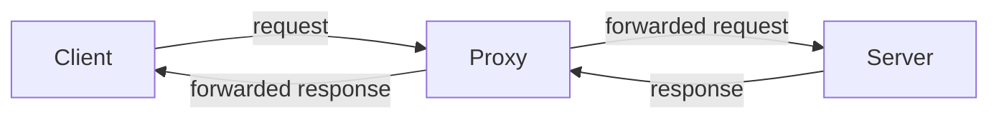
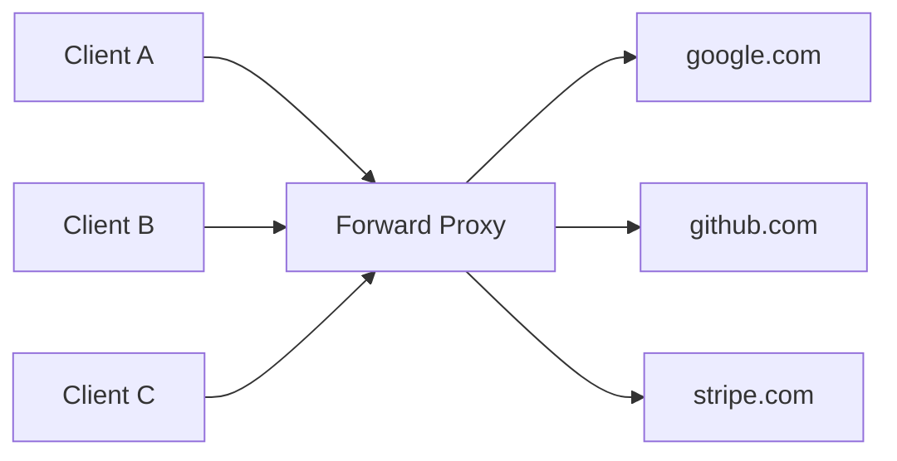
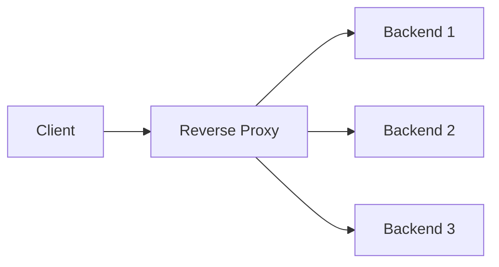
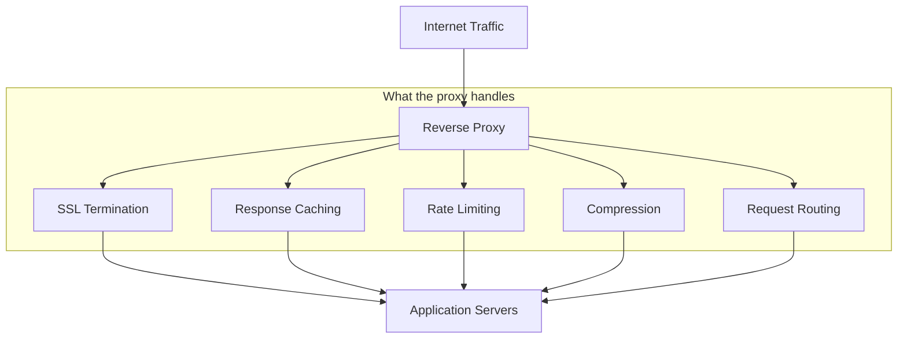
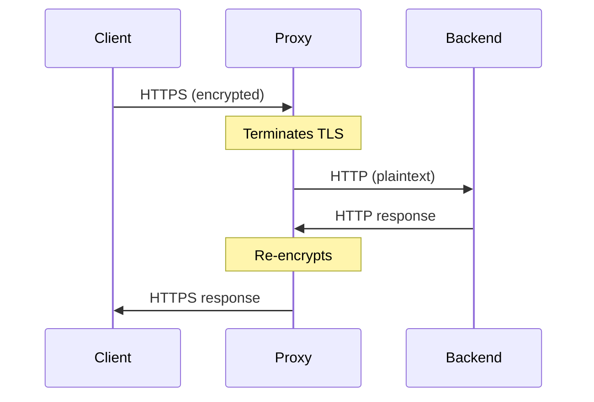
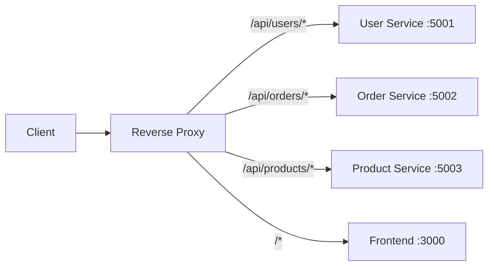
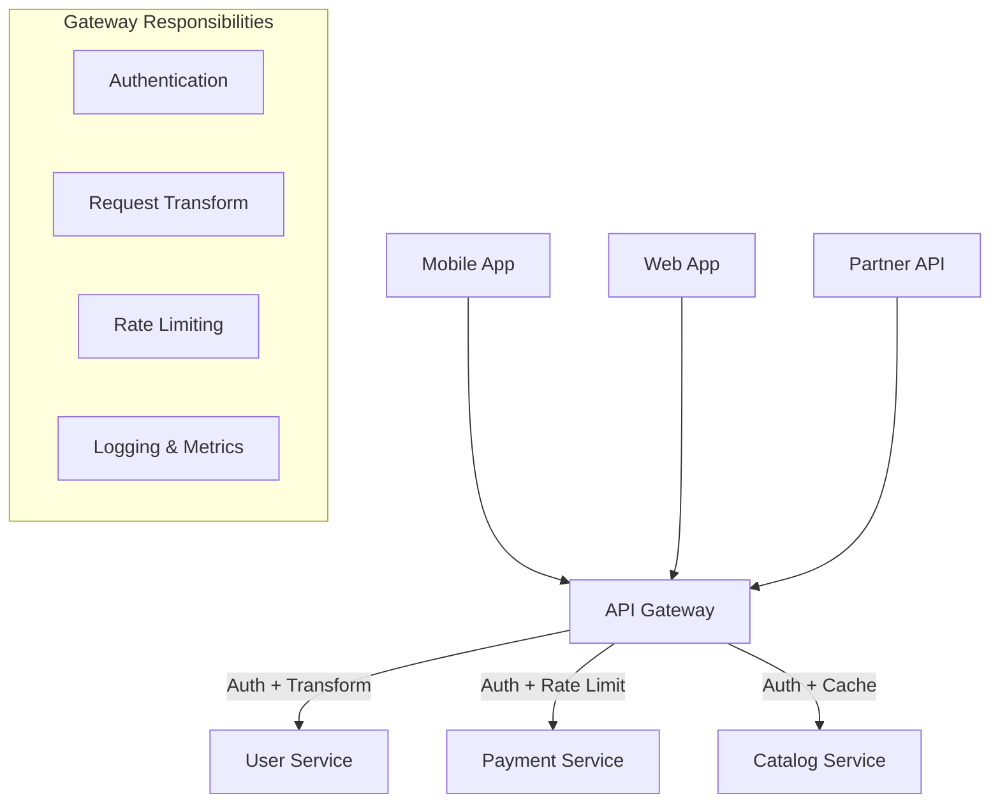
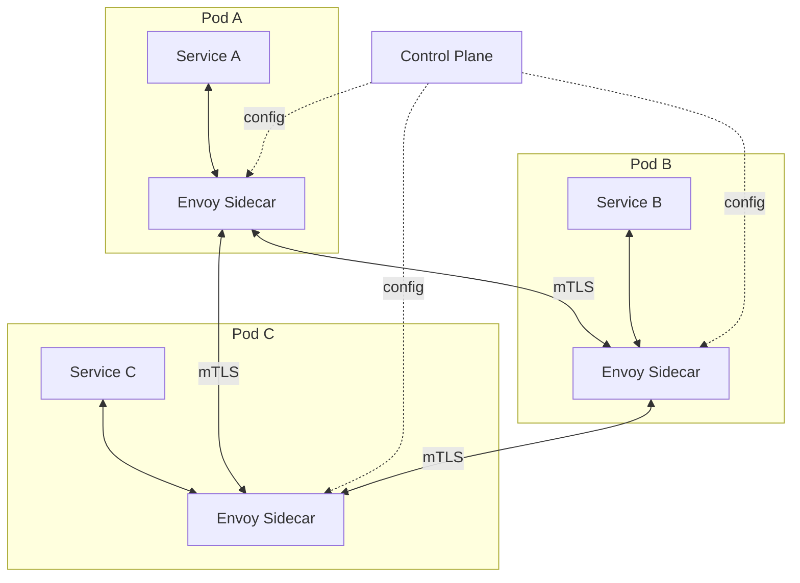
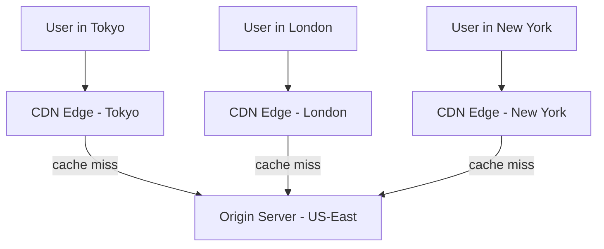

# Chapter 08 - Proxies & Reverse Proxies

> Every request your browser makes to Netflix, Stripe, or GitHub never touches an application server directly. It hits a proxy first - a gatekeeper that decides what gets through, how fast, and in what shape. Understanding proxies isn't optional for system design; they're the invisible layer that makes modern architectures possible.

[Read on Medium](#) | [Watch on YouTube](#)

---

## Table of Contents

1. [What Is a Proxy?](#what-is-a-proxy)
2. [Forward Proxy vs Reverse Proxy](#forward-proxy-vs-reverse-proxy)
3. [Why Reverse Proxies Run the Internet](#why-reverse-proxies-run-the-internet)
4. [SSL Termination](#ssl-termination)
5. [Caching at the Proxy Layer](#caching-at-the-proxy-layer)
6. [Compression and Response Optimization](#compression-and-response-optimization)
7. [Rate Limiting at the Proxy Layer](#rate-limiting-at-the-proxy-layer)
8. [Request Routing and URL Rewriting](#request-routing-and-url-rewriting)
9. [The API Gateway Pattern](#the-api-gateway-pattern)
10. [Nginx as a Reverse Proxy](#nginx-as-a-reverse-proxy)
11. [Envoy Proxy](#envoy-proxy)
12. [Service Mesh and the Sidecar Pattern](#service-mesh-and-the-sidecar-pattern)
13. [CDN as a Reverse Proxy](#cdn-as-a-reverse-proxy)
14. [Real-World Examples](#real-world-examples)
15. [Common Pitfalls](#common-pitfalls)
16. [Key Takeaways](#key-takeaways)
17. [What's Next?](#whats-next)

---

## What Is a Proxy?

A proxy is a server that sits between a client and a destination server, intercepting requests and responses. The word comes from "procuracy" - the authority to act on someone else's behalf. That's exactly what a proxy does: it makes requests on behalf of one party so the other party never sees who's really asking.

There are two flavors, and they solve completely different problems.



A proxy can modify requests, cache responses, block traffic, add headers, compress payloads, terminate TLS, or just pass things through. The key property is that at least one side of the conversation doesn't know the proxy exists.

---

## Forward Proxy vs Reverse Proxy

This distinction trips people up in interviews. The difference isn't about direction - both forward and reverse proxies sit in the request path. The difference is about **who the proxy represents**.

### Forward Proxy

A forward proxy acts on behalf of the **client**. The server doesn't know which client made the original request - it only sees the proxy's IP address.



Use cases for forward proxies:

| Use Case | Example |
|----------|---------|
| Anonymity | VPNs hide your IP from destination servers |
| Access control | Corporate proxies block social media during work hours |
| Content filtering | Schools filter inappropriate content |
| Bypassing geo-restrictions | Routing through a proxy in another country |
| Caching | ISP proxies cache popular content to reduce bandwidth |

The client knows the forward proxy exists and is configured to use it. The server has no idea.

### Reverse Proxy

A reverse proxy acts on behalf of the **server**. The client doesn't know which backend server actually handled the request - it only sees the proxy's address.



Use cases for reverse proxies:

| Use Case | Example |
|----------|---------|
| Load balancing | Distribute requests across backend servers |
| SSL termination | Handle TLS at one place instead of every backend |
| Caching | Serve cached responses without hitting backends |
| Security | Hide backend topology from the internet |
| Compression | Gzip responses before sending to clients |
| Rate limiting | Throttle abusive clients before they reach your app |

The client has no idea the reverse proxy exists. It thinks it's talking directly to the application. The backend servers know the proxy is there - they're configured to receive traffic from it.

### Side-by-Side Comparison

| Property | Forward Proxy | Reverse Proxy |
|----------|--------------|---------------|
| Acts on behalf of | Client | Server |
| Hidden from | Server | Client |
| Configured by | Client / network admin | Server admin |
| Typical location | Client's network | Server's network |
| Examples | Squid, corporate VPN | Nginx, HAProxy, Cloudflare |

---

## Why Reverse Proxies Run the Internet

Almost no production system exposes application servers directly to the internet. A reverse proxy gives you a single control point to enforce security policies, optimize performance, and manage traffic - without changing a single line of application code.

Think of it this way: your application code should handle business logic. Everything else - TLS, compression, rate limiting, caching - belongs in infrastructure. The reverse proxy is that infrastructure.



The rest of this chapter breaks down each of these capabilities.

---

## SSL Termination

SSL/TLS termination means the proxy handles the encryption handshake and decrypts incoming HTTPS traffic. Backend servers receive plain HTTP. This matters for three reasons:

1. **Performance** - TLS handshakes are CPU-intensive. Offloading them to the proxy means your app servers spend cycles on business logic, not cryptography.

2. **Certificate management** - You manage certificates in one place (the proxy) instead of deploying them to every backend server. When a cert expires, you renew it once.

3. **Inspection** - The proxy can inspect request content for caching, routing, and rate limiting. It can't do any of that with encrypted traffic.



The traffic between the proxy and backend servers is plaintext, which is fine when they're on the same private network. If they're across data centers, you'll want TLS there too - that's called **TLS re-encryption** or **end-to-end TLS**.

---

## Caching at the Proxy Layer

A proxy cache stores responses and serves them to subsequent clients without forwarding the request to the backend. This is the single biggest performance win a reverse proxy provides.

Consider a product page on an e-commerce site. The page content changes once a day, but it gets 10,000 requests per hour. Without caching, your backend handles all 10,000. With proxy caching, the backend handles 1 request and the proxy serves the other 9,999 from memory.

### Cache Control Headers

The backend controls caching behavior through HTTP headers:

| Header | Purpose | Example |
|--------|---------|---------|
| `Cache-Control` | Directives for caching | `max-age=3600, public` |
| `ETag` | Version identifier for a resource | `"abc123"` |
| `Last-Modified` | When the resource last changed | `Mon, 16 Mar 2026 10:00:00 GMT` |
| `Vary` | Cache separately by header value | `Vary: Accept-Encoding` |

### Cache Invalidation

Cache invalidation is famously one of the two hard problems in computer science (the other being naming things). Common strategies:

- **TTL-based** - Cache entries expire after a fixed time. Simple but imprecise. A 60-second TTL means users might see stale data for up to 60 seconds.
- **Event-based** - The backend explicitly tells the proxy to purge a cache entry when data changes. Precise but requires coordination.
- **Versioned URLs** - Append a version or hash to the URL (`/styles.v3.css`). New version means new URL, so the old cache entry is irrelevant.

---

## Compression and Response Optimization

Proxies can compress responses before sending them to clients, reducing bandwidth and improving page load times. Gzip reduces typical HTML/CSS/JSON payloads by 60-80%.

The flow works like this:

1. Client sends `Accept-Encoding: gzip, br` header
2. Proxy checks if it has a compressed version cached
3. If not, it fetches the uncompressed response from the backend
4. Proxy compresses the response and caches the compressed version
5. Proxy sends the compressed response to the client

Brotli (`br`) compresses 15-20% better than gzip for text content but uses more CPU. Most proxies support both and choose based on the client's `Accept-Encoding` header.

Don't compress everything. Images (JPEG, PNG, WebP) and videos are already compressed. Compressing them again wastes CPU and can actually increase file size.

---

## Rate Limiting at the Proxy Layer

Rate limiting at the proxy layer is more effective than rate limiting in application code because abusive traffic never reaches your servers. The proxy rejects requests before they consume backend resources.

Common algorithms:

| Algorithm | How It Works | Best For |
|-----------|-------------|----------|
| Fixed window | Count requests per time window (e.g., 100/minute) | Simple APIs |
| Sliding window | Weighted count across current and previous windows | Smoother enforcement |
| Token bucket | Tokens refill at a fixed rate; each request costs one token | Allowing bursts |
| Leaky bucket | Requests queue and drain at a constant rate | Strict rate enforcement |

Rate limits are typically applied per client IP, per API key, or per user ID. The proxy extracts the identifier from the request (IP address, header, JWT claim) and maintains counters.

When a client exceeds the limit, the proxy returns `429 Too Many Requests` with a `Retry-After` header telling the client when to try again.

---

## Request Routing and URL Rewriting

A reverse proxy can route requests to different backend services based on the URL path, hostname, headers, or query parameters. This is how a single domain can serve multiple microservices.



URL rewriting transforms the URL before forwarding. The client requests `/api/users/42`, but the proxy forwards it to the User Service as `/users/42` - stripping the `/api` prefix. The backend service doesn't need to know about the proxy's URL structure.

This decoupling is powerful. You can:

- Move a service to a different host without changing client URLs
- Split a monolith into microservices behind the same domain
- Run A/B tests by routing a percentage of traffic to a new service version
- Blue-green deploy by switching the proxy's routing target

---

## The API Gateway Pattern

An API gateway is a reverse proxy that's been specialized for APIs. It does everything a reverse proxy does, plus API-specific concerns:

- **Authentication** - Validate JWTs, API keys, or OAuth tokens before the request reaches your service
- **Request transformation** - Convert between protocols (REST to gRPC), merge responses from multiple services, reshape payloads
- **API versioning** - Route `/v1/users` and `/v2/users` to different service versions
- **Documentation** - Auto-generate OpenAPI specs from observed traffic
- **Analytics** - Track request volume, latency, and error rates per endpoint



The distinction between "reverse proxy" and "API gateway" is blurry. Nginx can act as an API gateway with the right configuration. Kong and AWS API Gateway are purpose-built API gateways. The right choice depends on how many API-specific features you need.

### API Gateway vs Reverse Proxy - When to Use Which

| Scenario | Use |
|----------|-----|
| Static sites, simple web apps | Reverse proxy (Nginx) |
| Microservices with auth/rate limiting | API gateway |
| Internal services communicating | Service mesh (see below) |
| Public APIs with usage tiers | API gateway |

---

## Nginx as a Reverse Proxy

Nginx is the most widely deployed reverse proxy. It serves over 30% of all websites. Its event-driven architecture handles tens of thousands of concurrent connections with minimal memory.

A basic Nginx reverse proxy config looks like this:

```nginx
upstream backend_servers {
    server 127.0.0.1:5001;
    server 127.0.0.1:5002;
    server 127.0.0.1:5003;
}

server {
    listen 80;
    server_name example.com;

    location / {
        proxy_pass http://backend_servers;
        proxy_set_header Host $host;
        proxy_set_header X-Real-IP $remote_addr;
        proxy_set_header X-Forwarded-For $proxy_add_x_forwarded_for;
    }

    location /static/ {
        root /var/www;
        expires 30d;
    }
}
```

Key things happening here:

- `upstream` defines a pool of backend servers. Nginx round-robins across them by default.
- `proxy_set_header` passes the real client IP to backends. Without this, every request appears to come from the proxy's IP.
- The `/static/` block serves files directly from disk - the request never reaches a backend server.
- `expires 30d` tells browsers to cache static files for 30 days.

Nginx also supports weighted load balancing (`server 127.0.0.1:5001 weight=3`), health checks, and sticky sessions. It's the Swiss Army knife of reverse proxies.

---

## Envoy Proxy

Envoy was built by Lyft and is now a CNCF graduated project. Where Nginx was designed for serving web content and later gained proxy features, Envoy was designed from the ground up as a proxy for microservices.

Key differences from Nginx:

| Feature | Nginx | Envoy |
|---------|-------|-------|
| Configuration | Static config files, reload to apply | Dynamic config via API (xDS) |
| Observability | Access logs, basic stats | Rich metrics, distributed tracing, access logs |
| Protocol support | HTTP/1.1, HTTP/2, TCP | HTTP/1.1, HTTP/2, gRPC, TCP, MongoDB, Redis |
| Hot restart | Binary reload, brief connection drops | Zero-downtime restarts |
| Primary use case | Web server + reverse proxy | Service mesh sidecar |

Envoy's killer feature is **dynamic configuration**. You don't edit config files and reload - a control plane pushes configuration changes to Envoy instances through APIs. This makes it the foundation of most service meshes.

---

## Service Mesh and the Sidecar Pattern

In a microservices architecture, every service needs proxy capabilities: retries, timeouts, circuit breaking, mutual TLS, observability. You could build all of this into each service, but that means reimplementing the same logic in every language your org uses.

A service mesh solves this by deploying a proxy sidecar alongside every service instance. The sidecar handles all network communication while the service handles business logic.



Popular service meshes:

| Mesh | Sidecar Proxy | Control Plane |
|------|--------------|---------------|
| Istio | Envoy | istiod |
| Linkerd | linkerd2-proxy (Rust) | Linkerd control plane |
| Consul Connect | Envoy or built-in | Consul server |

Service meshes are powerful but add operational complexity. Don't adopt one until you have at least 10-15 services and a dedicated platform team. For smaller deployments, a reverse proxy at the edge handles most needs.

---

## CDN as a Reverse Proxy

A CDN (Content Delivery Network) is a globally distributed reverse proxy. It caches content at edge locations close to users, reducing latency and offloading traffic from your origin servers.



A user in Tokyo requesting an image doesn't wait for a round trip to a US-East origin server (150ms+). The Tokyo edge server has a cached copy and responds in under 10ms.

CDNs aren't just for static assets anymore. Modern CDNs like Cloudflare Workers and AWS CloudFront Functions run custom code at the edge - authentication, A/B testing, request routing - all before the request reaches your data center.

### What to Cache on a CDN

| Content Type | CDN Cacheable? | TTL Strategy |
|-------------|----------------|-------------|
| Images, CSS, JS | Yes | Long TTL (days/weeks) with versioned URLs |
| HTML pages | Depends | Short TTL (seconds/minutes) or event-based purge |
| API responses | Sometimes | Short TTL, `Vary` by auth header |
| Personalized content | No | Pass through to origin |
| WebSocket connections | No | Pass through to origin |

---

## Real-World Examples

### Cloudflare

Cloudflare sits as a reverse proxy in front of over 20% of all websites. When you put a domain behind Cloudflare, DNS resolves to Cloudflare's edge servers instead of your origin. Cloudflare handles DDoS protection, WAF (Web Application Firewall), SSL termination, caching, and performance optimization. Your origin server only sees traffic that Cloudflare allows through.

### AWS API Gateway

AWS API Gateway is a fully managed API gateway that handles authentication (Cognito, Lambda authorizers), rate limiting (usage plans and API keys), request/response transformation, and caching. It integrates tightly with Lambda for serverless architectures - the gateway receives HTTP requests and triggers Lambda functions, so you don't run any servers at all.

### Kong

Kong is an open-source API gateway built on Nginx and OpenResty. It extends Nginx with a plugin system for authentication, rate limiting, logging, and request transformation. Kong runs on your infrastructure (or as a managed service) and stores configuration in PostgreSQL or Cassandra. Its plugin ecosystem is its strength - there are plugins for OAuth2, OIDC, bot detection, IP restriction, and dozens more.

### Traefik

Traefik is a reverse proxy built for container orchestration. It auto-discovers services in Docker and Kubernetes, generates routing rules from labels/annotations, and handles SSL with automatic Let's Encrypt certificates. You deploy a new service, add a label, and Traefik picks it up - no config file changes.

---

## Common Pitfalls

### 1. Single Point of Failure

A proxy that handles all traffic is a single point of failure. If it goes down, everything behind it is unreachable. Always deploy proxies in pairs (active-passive or active-active) with health checks and automatic failover.

### 2. Losing the Client IP

When a proxy forwards a request, the backend sees the proxy's IP as the client IP. You must configure the proxy to set `X-Forwarded-For` and `X-Real-IP` headers, and configure backends to trust those headers. Get this wrong and your rate limiting, geo-routing, and audit logs are useless.

### 3. Timeout Cascades

If your proxy timeout is shorter than your backend timeout, slow requests get killed at the proxy while the backend keeps processing them - wasting resources. If your proxy timeout is too long, slow backends tie up proxy connections. Set proxy timeouts slightly longer than backend timeouts, and make sure backends have their own deadlines.

### 4. Caching Authenticated Content

Caching a response that contains user-specific data and serving it to another user is a security disaster. Use `Cache-Control: private` for authenticated responses and `Vary: Authorization` to cache per-user if needed. Better yet, don't cache authenticated responses at the proxy layer at all.

### 5. Over-engineering with a Service Mesh

A service mesh adds a sidecar proxy to every pod, increasing memory usage, latency (extra network hop), and operational complexity. If you have 5 services and a small team, a service mesh is overkill. Start with a reverse proxy at the edge and add a mesh only when you genuinely need per-service traffic policies.

### 6. Not Monitoring the Proxy

The proxy sees all traffic, which makes it the best place to collect metrics. Track request rate, error rate, latency percentiles (p50, p95, p99), cache hit ratio, and active connections. If you're not monitoring these, you're flying blind.

---

## Key Takeaways

1. **Forward proxies** act on behalf of clients (VPNs, corporate firewalls). **Reverse proxies** act on behalf of servers (Nginx, Cloudflare). The interview question is about who the proxy represents, not which direction traffic flows.

2. **Reverse proxies are infrastructure, not optional.** SSL termination, caching, compression, rate limiting, and routing all belong at the proxy layer, not in application code.

3. **API gateways are specialized reverse proxies** for API-specific concerns: authentication, request transformation, versioning, and analytics.

4. **Nginx dominates** for traditional reverse proxy deployments. **Envoy dominates** for service mesh sidecars. Pick based on whether you need static config simplicity or dynamic config flexibility.

5. **CDNs are geographically distributed reverse proxies.** Use them for static assets (long TTL), and increasingly for edge compute.

6. **Service meshes (Istio, Linkerd)** deploy sidecar proxies alongside every service. Powerful for large microservice deployments, overkill for small ones.

7. **Always deploy proxies redundantly.** A single proxy in front of 50 backend servers is worse than no proxy at all - you've traded horizontal scalability for a single point of failure.

8. **Cache carefully.** TTL-based caching is simple but risks stale data. Event-based invalidation is precise but complex. Versioned URLs are the cleanest approach for static assets.

---

## What's Next?

- **Chapter 09:** [Data Partitioning & Sharding](../09-sharding/) - How to split databases across multiple machines when a single server can't hold all your data.
