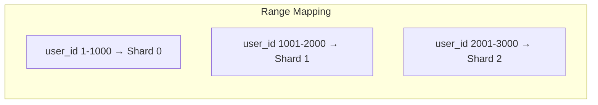
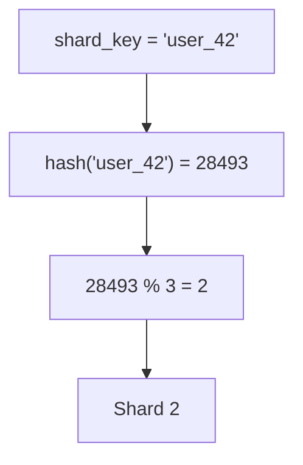
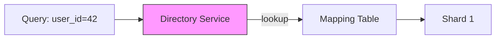
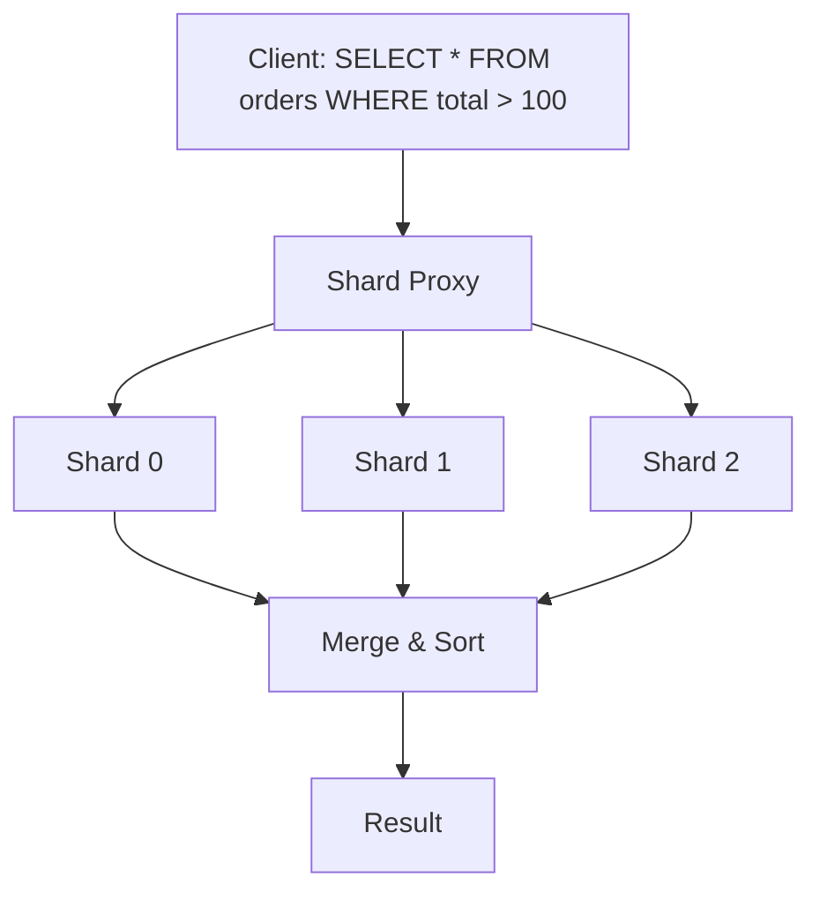
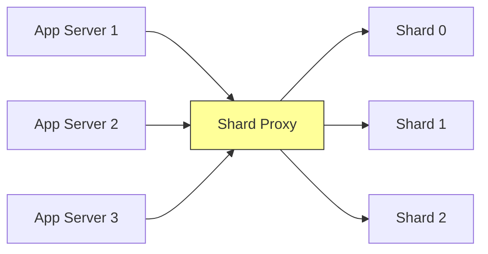

# Chapter 09 - Data Partitioning & Sharding

> A single database handles your first million rows just fine - but the next billion will bring it to its knees unless you split the data across multiple machines.

📖 [Read on Medium](#) · 🎬 [Watch on YouTube](#)

---

## Why Shard at All?

Vertical scaling has a ceiling. You can throw faster CPUs and bigger disks at a database server, but eventually you hit hardware limits, and the cost curve goes exponential long before you reach them. Sharding - splitting a dataset across multiple independent database instances - is how systems like Instagram, Pinterest, and Slack serve billions of rows without breaking a sweat.

Sharding isn't free. It adds operational complexity, makes certain queries harder, and introduces new failure modes. The decision to shard should come from real pressure - slow queries on indexed columns, write throughput hitting disk I/O limits, or a single replica set that can't keep up with read demand even after you've optimized everything else.

---

## Partitioning vs Sharding

These terms get used interchangeably, but there's a meaningful distinction.

| Term | Meaning |
|------|---------|
| **Partitioning** | Splitting data within a single database instance (logical split) |
| **Sharding** | Splitting data across multiple database instances (physical split) |

PostgreSQL table partitioning, for example, divides a table into partitions that all live on the same server. Sharding distributes those partitions across separate servers, each with its own CPU, memory, and storage.

This chapter focuses on sharding - the distributed case - because that's where the interesting design decisions live.

---

## Horizontal vs Vertical Partitioning

Before diving into sharding strategies, understand the two fundamental ways to split data.

### Vertical Partitioning

Split a table by **columns**. Put frequently-accessed columns on one server and rarely-accessed columns on another.

```
┌─────────────────────────────────┐
│         users (original)        │
├────┬───────┬────────┬───────────┤
│ id │ name  │ email  │ profile   │
│    │       │        │ (10 KB)   │
└────┴───────┴────────┴───────────┘
            ↓ split ↓
┌──────────────────┐  ┌──────────────────┐
│  users_core      │  │  users_profile   │
├────┬───────┬─────┤  ├────┬─────────────┤
│ id │ name  │email│  │ id │ profile     │
└────┴───────┴─────┘  └────┴─────────────┘
   Server A              Server B
```

Vertical partitioning is useful when some columns are much larger than others (like a blob or JSON field) or when different parts of a row have different access patterns. But it doesn't help when the row count itself is the problem.

### Horizontal Partitioning (Sharding)

Split a table by **rows**. Each shard holds a subset of the rows with all columns intact.

```
┌───────────────────────────────┐
│       orders (100M rows)      │
└───────────────────────────────┘
            ↓ split ↓
┌─────────────────┐  ┌─────────────────┐  ┌─────────────────┐
│    Shard 0      │  │    Shard 1      │  │    Shard 2      │
│  orders 0-33M   │  │ orders 33M-66M  │  │ orders 66M-100M │
└─────────────────┘  └─────────────────┘  └─────────────────┘
    Server A             Server B             Server C
```

Horizontal partitioning scales linearly - add more shards to handle more data. The rest of this chapter is about horizontal partitioning.

---

## Shard Key Selection

The shard key is the column (or columns) that determines which shard a row belongs to. This is the single most important decision in your sharding design. A bad shard key will haunt you for years.

### What Makes a Good Shard Key

A good shard key has these properties:

1. **High cardinality** - many distinct values so data distributes evenly
2. **Even distribution** - values appear with roughly equal frequency
3. **Query alignment** - most queries include the shard key, so the router can target a single shard
4. **Immutability** - the value doesn't change after insertion (changing a shard key means moving the row)

### Good vs Bad Shard Keys - Examples

| Use Case | Good Shard Key | Bad Shard Key | Why |
|----------|---------------|---------------|-----|
| Multi-tenant SaaS | `tenant_id` | `created_at` | Queries almost always filter by tenant |
| Social media posts | `user_id` | `country` | Users query their own posts; countries are uneven |
| E-commerce orders | `customer_id` | `order_status` | Only ~5 statuses - terrible cardinality |
| IoT sensor data | `device_id` | `sensor_type` | Few sensor types, many devices |
| Chat messages | `channel_id` | `message_id` (auto-inc) | Messages in a channel are read together |

Notice the pattern: the best shard key is usually the entity that owns the data, not a property of the data itself.

---

## Sharding Strategies

There are three fundamental approaches to mapping a shard key to a shard.

### 1. Range-Based Sharding

Assign contiguous ranges of the shard key to each shard.



**Advantages:**
- Range queries are efficient - scanning user_ids 500-700 hits only Shard 0
- Simple to understand and implement
- Easy to find which shard holds a given key

**Disadvantages:**
- Prone to hotspots if recent keys get more traffic (new users are more active)
- Uneven distribution if key values aren't uniformly distributed
- Manual range management as data grows

Range-based sharding works well for time-series data where queries naturally target time ranges, and old data gets less traffic than new data.

### 2. Hash-Based Sharding

Apply a hash function to the shard key, then modulo by the number of shards.

```
shard_id = hash(shard_key) % num_shards
```



**Advantages:**
- Distributes data evenly regardless of key patterns
- No range metadata to manage
- Simple computation

**Disadvantages:**
- Range queries require scatter-gather across all shards
- Adding or removing shards requires rehashing everything (unless you use consistent hashing)
- Hash collisions can still create minor imbalances

Hash-based sharding is the default choice for most applications. It's simple, predictable, and handles skewed key distributions gracefully.

### 3. Directory-Based Sharding

Maintain a lookup table that maps each shard key (or key range) to a shard.



```
┌────────────┬─────────┐
│ shard_key  │ shard   │
├────────────┼─────────┤
│ tenant_A   │ shard_0 │
│ tenant_B   │ shard_1 │
│ tenant_C   │ shard_0 │
│ tenant_D   │ shard_2 │
└────────────┴─────────┘
```

**Advantages:**
- Complete flexibility - move any key to any shard at any time
- Supports uneven shard sizes (put a big tenant on its own shard)
- Easy to rebalance without rehashing

**Disadvantages:**
- The directory is a single point of failure and a potential bottleneck
- Every query requires a directory lookup (extra network hop)
- Directory must be highly available and low-latency

Directory-based sharding is the right choice when you need fine-grained control. Slack uses this approach - large enterprise workspaces get dedicated shards while smaller ones share.

### Strategy Comparison

| Criteria | Range | Hash | Directory |
|----------|-------|------|-----------|
| Even distribution | Poor | Excellent | Manual |
| Range queries | Excellent | Poor | Depends |
| Resharding ease | Medium | Hard (without consistent hashing) | Easy |
| Hotspot risk | High | Low | Low |
| Operational complexity | Low | Low | High |
| Flexibility | Low | Low | High |

---

## Consistent Hashing

Standard hash-based sharding has a critical flaw: when you add or remove a shard, `hash(key) % N` changes for most keys, requiring massive data migration. Consistent hashing fixes this.

### How It Works

1. Arrange shards on a virtual ring (0 to 2^32 - 1)
2. Hash each shard's identifier to place it on the ring
3. To find which shard owns a key, hash the key and walk clockwise until you hit a shard

```
           Shard A (pos 100)
              ·
          ·       ·
        ·           ·
    Shard D         Shard B
    (pos 300)       (pos 150)
        ·           ·
          ·       ·
              ·
           Shard C (pos 250)

    key hash = 120 → walks clockwise → Shard B
    key hash = 270 → walks clockwise → Shard D
```

### Why It's Better

When you add Shard E at position 200, only keys between positions 150 and 200 move - from Shard C to Shard E. All other keys stay put. With naive modulo hashing, adding a shard would relocate roughly `(N-1)/N` of all keys.

### Virtual Nodes

A problem with basic consistent hashing: if shards are unevenly spaced on the ring, some shards get more data than others. Virtual nodes fix this by placing each physical shard at multiple positions on the ring.

```
Physical Shard A → Virtual nodes: A-1 (pos 50), A-2 (pos 180), A-3 (pos 290)
Physical Shard B → Virtual nodes: B-1 (pos 100), B-2 (pos 220), B-3 (pos 350)
```

With 100-200 virtual nodes per physical shard, the distribution becomes nearly uniform. Amazon DynamoDB and Apache Cassandra both use this technique.

---

## Resharding and Rebalancing

Shards don't stay balanced forever. Some grow faster than others, traffic patterns shift, and you need to add capacity. Resharding is the process of redistributing data across shards.

### When to Reshard

- A shard exceeds its storage capacity
- A shard's query latency degrades due to data volume
- You need to add or decommission servers
- One shard handles disproportionate traffic

### Rebalancing Strategies

**Fixed partition count:** Create many more partitions than servers (e.g., 1000 partitions across 10 servers). When adding a server, move whole partitions to it. This is how Elasticsearch and Riak work.

**Dynamic splitting:** When a partition exceeds a size threshold, split it in two. When it shrinks, merge it with a neighbor. HBase and MongoDB use this approach.

**Proportional to nodes:** Each node gets a fixed number of partitions. When a new node joins, it randomly splits existing partitions and takes half. Cassandra (with virtual nodes) works this way.

### The Rebalancing Constraint

Never rebalance automatically without safeguards. An overly aggressive rebalancing algorithm can saturate your network during a traffic spike - exactly when you can least afford it. Most production systems require an operator to confirm rebalancing operations, or at minimum set a rate limit on data migration.

---

## The Hotspot Problem

Even with a good hash function, hotspots happen. A celebrity posts something viral, and their shard gets hammered. A big customer runs a massive batch job. An event triggers a flood of writes to a single partition.

### Causes of Hotspots

1. **Skewed shard keys** - a few keys have vastly more data than others
2. **Temporal patterns** - recent data gets more reads/writes
3. **Celebrity problem** - a single popular entity dominates one shard
4. **Batch operations** - bulk imports or exports targeting one shard

### Mitigation Strategies

**Shard splitting:** When a shard gets hot, split it. This is reactive but effective. MongoDB's balancer does this automatically.

**Key salting:** Append a random suffix to the shard key to spread writes across shards. For example, instead of sharding by `celebrity_user_id`, shard by `celebrity_user_id:random(0-9)`. Reads now need to query 10 shards and merge, but writes are distributed.

**Read replicas per shard:** Add read replicas to the hot shard. This handles read hotspots without resharding.

**Caching layer:** Put a cache in front of hot shards. This is often the fastest fix for read hotspots.

**Application-level routing:** Detect hot keys at the application level and route them specially. Instagram does this for high-profile accounts.

---

## Cross-Shard Queries

The biggest operational pain of sharding: queries that span multiple shards.

### The Scatter-Gather Pattern

When a query can't be routed to a single shard, the system sends it to all (or many) shards in parallel, then merges the results.



Scatter-gather works, but it's expensive. Latency is bounded by the slowest shard, and every shard does work even if most results come from one shard.

### Cross-Shard Joins

Joins across shards are the hardest problem. There's no good general solution - only trade-offs.

**Denormalization:** Duplicate the joined data into each shard so joins are local. This is the most common approach. Store the customer name directly in the orders table instead of joining to a customers table on a different shard.

**Broadcast tables:** Small, rarely-changing tables (countries, currencies, categories) are replicated to every shard. Joins against broadcast tables are always local.

**Application-level joins:** Fetch data from each shard separately and join in the application. This works but is slow and memory-intensive for large result sets.

**Shard co-location:** Place related data on the same shard. If you shard both `orders` and `order_items` by `customer_id`, joins between them are always local.

### Aggregation Queries

`COUNT`, `SUM`, `AVG`, `MIN`, `MAX` across shards require special handling.

| Aggregate | Cross-Shard Strategy |
|-----------|---------------------|
| `COUNT` | Sum the counts from each shard |
| `SUM` | Sum the sums from each shard |
| `AVG` | Compute sum and count from each shard, then divide total sum by total count |
| `MIN` | Take the minimum of the minimums |
| `MAX` | Take the maximum of the maximums |
| `DISTINCT` | Union all distinct values, then deduplicate |
| `ORDER BY ... LIMIT N` | Get top N from each shard, merge-sort, take top N |

Getting `AVG` wrong is a classic mistake. You can't average the averages - you need the underlying sums and counts.

---

## Shard Proxy

A shard proxy sits between the application and the shards, handling routing, query rewriting, and connection pooling.



### What a Shard Proxy Does

1. **Query routing** - parses the query, extracts the shard key, routes to the correct shard
2. **Scatter-gather** - sends cross-shard queries to all shards and merges results
3. **Connection pooling** - maintains persistent connections to all shards
4. **Schema management** - applies DDL changes across all shards
5. **Monitoring** - tracks per-shard latency, error rates, and data volume

### Production Shard Proxies

**Vitess** (YouTube/PlanetScale) - the most mature MySQL sharding proxy. Handles query routing, connection pooling, schema migrations, and resharding. Used by Slack, Square, GitHub, and HubSpot.

**ProxySQL** - MySQL-focused proxy with query routing and connection multiplexing.

**Citus** (PostgreSQL) - extends PostgreSQL with distributed tables. Queries look like regular SQL but execute across shards.

**ShardingSphere** - database-agnostic sharding middleware from Apache.

---

## Real-World Examples

### Instagram's Sharding

Instagram shards by user ID using PostgreSQL. Each logical shard is a PostgreSQL schema within a larger database cluster. They use thousands of logical shards mapped to a smaller number of physical servers, making it easy to rebalance by moving schemas between servers.

Their shard key is embedded in the ID itself - Instagram's ID format includes the shard ID in the upper bits, so routing doesn't require a lookup table.

### Pinterest's Sharding

Pinterest uses MySQL sharded by object ID. They chose explicit, application-level sharding over a middleware solution. Each pin, board, and user lives on a deterministic shard based on its ID. They keep a simple Python function that maps IDs to shards and deliberately avoid cross-shard queries - all related data is co-located.

### Vitess at YouTube

YouTube built Vitess because MySQL couldn't handle their scale, but they didn't want to abandon MySQL's ecosystem. Vitess sits between the application and MySQL, making a cluster of MySQL instances look like a single database. It handles query routing, resharding, and schema changes with zero downtime.

---

## Common Pitfalls

### 1. Sharding Too Early

Don't shard until you've exhausted vertical scaling, read replicas, caching, and query optimization. Every one of those is simpler than sharding. A well-tuned PostgreSQL instance handles tens of millions of rows without breaking a sweat.

### 2. Choosing the Wrong Shard Key

You can't easily change a shard key after deployment. It's baked into your data distribution, your query patterns, and often your ID generation scheme. Spend serious time analyzing your query patterns before choosing.

### 3. Ignoring Cross-Shard Query Costs

That `JOIN` across two tables works fine on a single database. After sharding, it becomes a distributed operation. Audit every query your application runs and know which ones will become cross-shard.

### 4. No Shard-Aware ID Generation

If your IDs don't encode the shard, every read requires a directory lookup to find which shard holds the data. Embed the shard ID in your primary keys from day one.

### 5. Uneven Shard Sizes

Start with more logical shards than physical servers. If you start with exactly 4 shards on 4 servers, you have no room to rebalance without resharding. Start with 256 logical shards on 4 servers - you can rebalance by moving whole logical shards.

### 6. Forgetting About Transactions

ACID transactions don't span shards without a distributed transaction protocol (2PC, Saga, etc.). If your application relies on multi-row transactions, make sure all involved rows live on the same shard.

### 7. Manual Shard Management

Write automation for shard health checks, failover, backup, and rebalancing from the start. Managing shards by hand works with 4 shards but not with 40.

---

## Key Takeaways

1. Sharding splits data across multiple database instances to scale beyond a single server's capacity. Don't do it until you've exhausted simpler options.
2. The shard key is the most critical decision - it should have high cardinality, even distribution, align with query patterns, and be immutable.
3. Hash-based sharding with consistent hashing is the safest default. Range-based works for time-series. Directory-based gives maximum flexibility at the cost of complexity.
4. Consistent hashing minimizes data movement when adding or removing shards. Use virtual nodes for even distribution.
5. Cross-shard queries are expensive. Design your data model to minimize them through denormalization, co-location, and broadcast tables.
6. Hotspots are inevitable. Plan for them with shard splitting, key salting, caching, and read replicas.
7. Start with many logical shards mapped to fewer physical servers. This gives you room to rebalance without resharding.
8. Use a shard proxy (Vitess, Citus, ShardingSphere) in production rather than building routing logic from scratch.

---

## What's Next?

- **Chapter 10:** [Database Replication](../10-replication/) - Keep copies of your data in sync across servers for fault tolerance and read scaling.
