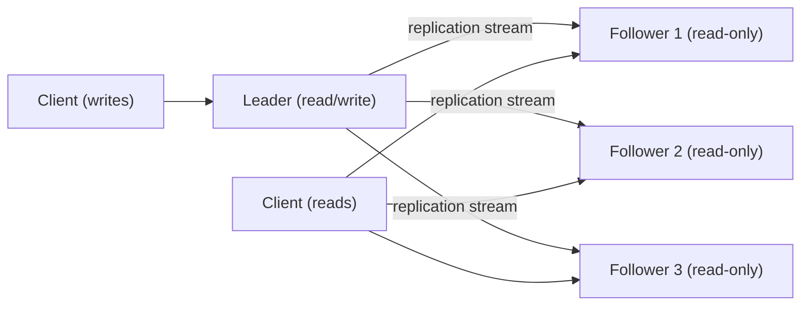
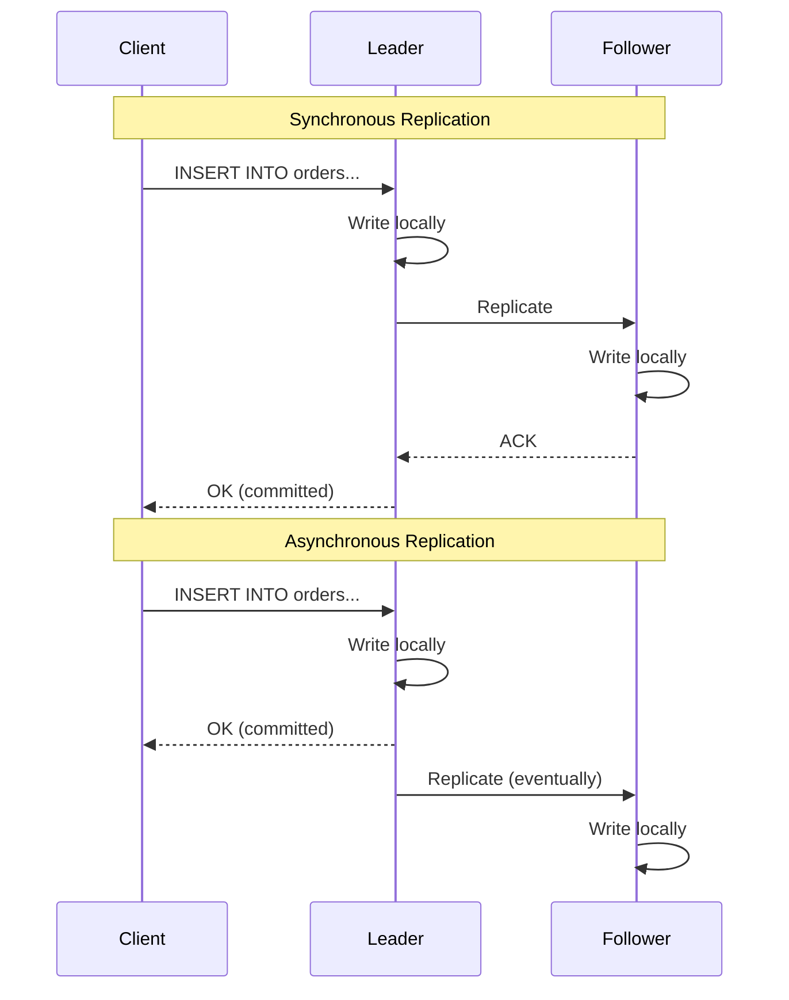
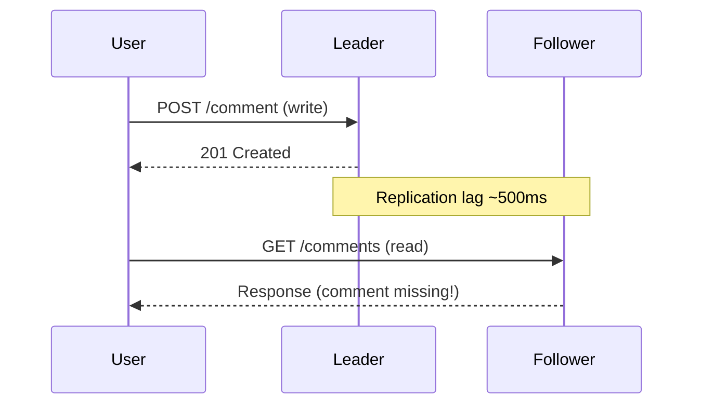
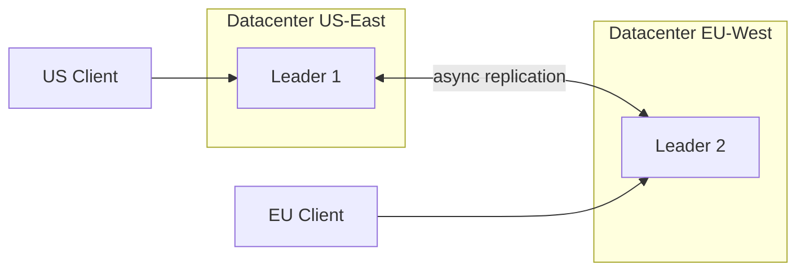
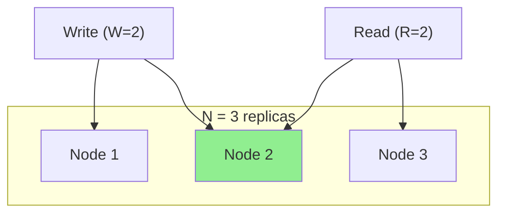
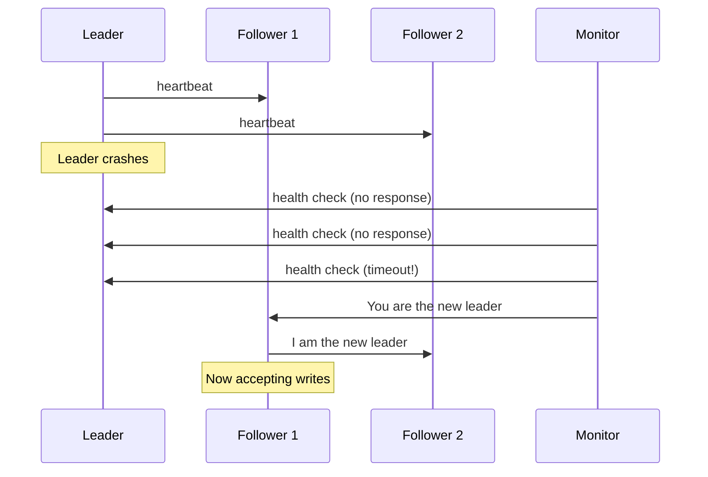

# Chapter 10 - Database Replication

One database server is a single point of failure. When it dies, your entire
application goes dark. Replication fixes this by keeping copies of the same
data on multiple machines - so that a hardware failure at 3 AM doesn't become
a company-wide incident at 3:01 AM.

But replication isn't just insurance. It's how you scale reads, survive
datacenter outages, and bring data closer to users on the other side of the
planet. Every production database you've ever used - MySQL, PostgreSQL,
MongoDB, DynamoDB - relies on replication under the hood.

The trade-offs are real, though. More copies means more coordination, more
lag, and more chances for data to diverge. Understanding those trade-offs is
what separates "it works on my laptop" from "it works at scale."

---

## Why Replicate?

Replication serves three distinct purposes, and most production systems care
about all three simultaneously.

| Goal                | What It Means                                      | Example                                         |
|---------------------|----------------------------------------------------|-------------------------------------------------|
| **Availability**    | Survive node failures without downtime             | Follower promotes to leader when leader crashes  |
| **Read Scaling**    | Spread read traffic across multiple nodes          | 10 read replicas serving analytics queries       |
| **Disaster Recovery** | Keep data safe even if a datacenter burns down   | Async replica in a second AWS region             |

A single replica can serve all three purposes at once, but each goal pulls
the design in a different direction. Availability wants fast failover.
Read scaling wants many replicas. Disaster recovery wants geographic
distance - which makes latency worse.

---

## Leader-Follower Replication

Leader-follower (also called master-slave or primary-secondary) is the most
common replication topology. One node accepts writes. The others copy those
writes and serve reads.

### How It Works

1. A client sends a write to the leader.
2. The leader writes the change to its local storage.
3. The leader sends the change to each follower via a replication log.
4. Each follower applies the change to its own copy of the data.

This is how MySQL's binlog replication, PostgreSQL's streaming replication,
and MongoDB's replica sets all work at a high level. The details differ
(logical vs. physical replication, WAL shipping vs. oplog tailing), but the
architecture is the same.

### Strengths and Weaknesses

| Strength                        | Weakness                                    |
|---------------------------------|---------------------------------------------|
| Simple mental model             | Leader is a write bottleneck                |
| No write conflicts              | Followers can serve stale data              |
| Read scaling is easy            | Failover requires leader election           |
| Widely supported in every RDBMS | Cross-region replication adds latency       |

Leader-follower is the right default for most applications. You need a
strong reason to pick something more complex.

---

## Synchronous vs. Asynchronous Replication

The critical question: does the leader wait for followers to confirm the
write before acknowledging the client?

### Synchronous

- **Guarantee:** The follower has the data before the client gets an OK.
- **Cost:** Every write is as slow as the slowest follower. One lagging
  follower stalls all writes.
- **Use when:** You can't tolerate any data loss on failover (financial
  transactions, for example).

### Asynchronous

- **Guarantee:** None. The follower might be seconds, minutes, or hours
  behind.
- **Cost:** Writes are fast, but failover can lose committed data.
- **Use when:** You need write throughput more than you need zero-data-loss
  failover (most web applications).

### Semi-synchronous

A practical middle ground: the leader waits for *one* follower to confirm,
then sends the OK. The remaining followers replicate asynchronously. This
gives you one guaranteed up-to-date replica without paying the latency cost
of waiting for all of them.

PostgreSQL calls this `synchronous_commit = on` with a single synchronous
standby. MySQL calls it semi-synchronous replication.

| Mode             | Write Latency | Data Loss on Failover | Availability Impact |
|------------------|---------------|-----------------------|---------------------|
| Synchronous      | High          | None                  | High (one slow follower blocks writes) |
| Semi-synchronous | Medium        | Low (one replica is current) | Medium              |
| Asynchronous     | Low           | Possible              | Low                 |

---

## Replication Lag

Asynchronous replication means followers are always at least a little behind
the leader. The gap between the leader's latest write and a follower's
latest applied write is the replication lag.

When lag is a few milliseconds, nobody notices. When it's a few seconds,
users start seeing bizarre behavior.

### The Stale Read Problem

A user writes a comment, refreshes the page, and the comment is gone. The
write went to the leader, but the read hit a follower that hasn't received
the write yet. The user thinks the system lost their data.

This isn't a bug - it's an inherent property of async replication. But users
don't care about your architecture. They care that their comment vanished.

### Read-After-Write Consistency

The fix for the stale-read problem is **read-after-write consistency** (also
called read-your-writes consistency). After a user writes data, any
subsequent read from that same user sees the write.

Implementation strategies:

1. **Read from leader after write.** For a short window after a user writes,
   route that user's reads to the leader. Simple, but increases leader load.

2. **Track replication position.** The client remembers the log position of
   its last write. On a read, pick a follower that has caught up to at least
   that position. This is what Amazon Aurora does.

3. **Causal consistency tokens.** The write response includes a token. The
   client sends the token on subsequent reads. The system ensures the read
   sees at least that version.

---

## Leader-Leader (Multi-Master) Replication

What if you need writes in multiple datacenters? Leader-follower forces all
writes through one node in one datacenter, which means cross-continent write
latency. Leader-leader replication allows writes on multiple nodes.

### The Conflict Problem

Two leaders can accept conflicting writes simultaneously. User A updates a
row on Leader 1 while User B updates the same row on Leader 2. Both writes
succeed locally, but when replication delivers them to the other leader,
you have a conflict.

This is the fundamental problem with multi-master: **conflicts are
unavoidable and must be resolved.**

### Conflict Resolution Strategies

| Strategy             | How It Works                                  | Downside                             |
|----------------------|-----------------------------------------------|--------------------------------------|
| **Last-Write-Wins**  | Timestamp or counter determines the winner    | Silently drops data                  |
| **Version Vectors**  | Track causal history per node                 | Complex to implement correctly       |
| **Custom Merge**     | Application-specific logic merges both writes | Requires domain-specific code        |
| **CRDT**             | Data structure that merges automatically      | Limited to certain data types        |
| **Conflict Avoidance** | Partition writes so conflicts can't happen  | Limits flexibility                   |

Last-write-wins (LWW) is the most common default because it's simple, but
it's also the most dangerous. It silently discards data. If User A and
User B both edit the same document, LWW picks one edit and throws away the
other without telling anyone.

CRDTs (Conflict-free Replicated Data Types) are mathematically guaranteed to
converge, but they only work for specific data structures - counters, sets,
registers. You can't CRDT your way out of arbitrary application logic
conflicts.

The honest answer: **avoid multi-master unless you genuinely need it.** The
conflict resolution complexity is substantial, and most applications are
better served by leader-follower with fast failover.

---

## Quorum Reads and Writes

Leaderless replication (used by Dynamo, Cassandra, Riak) takes a different
approach entirely. There's no leader. Any node can accept reads and writes.
Consistency is achieved through quorums.

Given N replicas, a write must be confirmed by W nodes, and a read must
query R nodes. If **W + R > N**, at least one node in the read set has the
latest write.

In this example, Node 2 has the latest write and is included in the read
set, so the read returns fresh data.

### Common Quorum Configurations

| N | W | R | W+R>N? | Trade-off                                     |
|---|---|---|--------|-----------------------------------------------|
| 3 | 2 | 2 | Yes    | Balanced reads and writes                     |
| 3 | 3 | 1 | Yes    | Fast reads, slow writes, low write availability |
| 3 | 1 | 3 | Yes    | Fast writes, slow reads, low read availability |
| 3 | 1 | 1 | No     | Fast everything, no consistency guarantee      |
| 5 | 3 | 3 | Yes    | High fault tolerance, higher latency           |

The classic configuration is N=3, W=2, R=2. It tolerates one node failure
for both reads and writes.

### Sloppy Quorums

Strict quorums require the write to reach W of the N designated nodes. But
what if two of three nodes are down? Strict quorum says: reject the write.

A sloppy quorum says: write to W of *any* available nodes, even ones that
don't normally hold this data. When the original nodes come back, hand the
data off (this is called "hinted handoff"). You get availability at the cost
of consistency - a read quorum might miss the data sitting on a temporary
node.

Dynamo and Cassandra both support sloppy quorums. They're great for
availability, but they break the W + R > N consistency guarantee.

---

## Failover

When a leader dies, something needs to take over. This is failover, and
getting it right is one of the hardest operational problems in distributed
systems.

### Manual Failover

A human decides when to promote a follower. Slow (minutes to hours) but
safe. You avoid false positives from flaky network monitoring. Many
organizations prefer this for critical databases.

### Automatic Failover

The system detects the leader is down and promotes a follower automatically.
Fast (seconds to a minute) but risky. The standard process:

1. **Detect failure.** Followers notice the leader isn't responding.
   Typically after missing several heartbeats (e.g., 30 seconds of silence).

2. **Elect a new leader.** The followers agree on which one becomes the new
   leader. Usually the one with the most up-to-date replication position.

3. **Reconfigure the system.** Clients and remaining followers start sending
   writes to the new leader.

### The Split-Brain Problem

The most dangerous failover scenario: the old leader isn't actually dead.
It was just slow, or there was a network partition. Now you have two nodes
that both think they're the leader, both accepting writes.

This is split-brain, and it leads to data corruption. Two clients write
conflicting data to two different "leaders," and there's no clean way to
merge them after the fact.

**Defenses against split-brain:**

- **Fencing tokens.** The new leader gets a monotonically increasing token.
  Any write with an old token is rejected.
- **STONITH (Shoot The Other Node In The Head).** The new leader forcibly
  powers off the old leader via IPMI or cloud API before accepting writes.
- **Lease-based leadership.** The leader must periodically renew a lease.
  If it can't (because it's partitioned), it stops accepting writes before
  the lease expires.

---

## Replication in the Real World

### MySQL Replication

MySQL uses binlog-based replication. The leader writes changes to a binary
log. Followers read the binlog and replay statements (statement-based) or
row changes (row-based). Row-based is safer and now the default.

MySQL supports semi-synchronous replication since 5.5. Group Replication
(since 5.7) adds multi-master with automatic conflict detection, but it
requires all tables to have a primary key and uses a certification-based
conflict resolution that rejects conflicting transactions.

### PostgreSQL Streaming Replication

PostgreSQL ships WAL (Write-Ahead Log) segments to followers. Streaming
replication sends WAL records as they're written, reducing lag to
sub-second levels. Logical replication (since PG 10) replicates at the
row level, allowing selective table replication and cross-version
replication.

PostgreSQL doesn't natively support multi-master. Tools like BDR
(Bi-Directional Replication) add it, but they're commercial add-ons with
significant operational complexity.

### MongoDB Replica Sets

MongoDB's replica set is leader-follower with automatic failover built in.
A replica set has one primary and multiple secondaries. If the primary goes
down, the secondaries hold an election (using Raft-like consensus) to pick
a new primary. Elections typically complete in under 12 seconds.

MongoDB supports read preferences - you can choose to read from primaries,
secondaries, or the nearest node. Reading from secondaries can return stale
data.

---

## Common Pitfalls

### 1. Ignoring Replication Lag in Application Code

If you write to the leader and immediately read from a follower, you'll get
stale data. This isn't rare - it's the default behavior in most setups. Your
application code needs to handle it, usually with read-after-write
consistency for user-facing reads.

### 2. Promoting a Lagging Follower

When the leader dies, the follower with the most recent data should become
the new leader. If you promote a follower that's 30 seconds behind, you lose
30 seconds of committed writes. This is called data loss, and it's
permanent.

### 3. Not Testing Failover

Failover is the thing you need most and practice least. If you've never
tested your failover process, it won't work when you need it. Netflix
pioneered Chaos Engineering for exactly this reason - randomly killing
nodes in production to verify the system recovers.

### 4. Multi-Master Without a Conflict Strategy

If you deploy multi-master replication and rely on last-write-wins as your
conflict strategy, you will lose data. It's not a question of if, but when.
Either invest in proper conflict resolution or don't use multi-master.

### 5. Split-Brain After Network Partition

A network partition can make the leader unreachable to followers while it's
still accepting writes from local clients. If followers elect a new leader,
you now have two leaders. Without fencing, both accept writes, and your data
diverges permanently.

---

## Key Takeaways

| Concept                 | Remember This                                     |
|-------------------------|---------------------------------------------------|
| Leader-follower         | The default. One writer, many readers.             |
| Leader-leader           | Avoid unless you need multi-datacenter writes.     |
| Sync replication        | Safe but slow. One slow node blocks everything.    |
| Async replication       | Fast but risky. Failover can lose data.            |
| Replication lag         | Always non-zero in async. Design your app for it.  |
| Read-after-write        | Route reads to leader after user writes.           |
| Quorum (W+R>N)          | Overlap guarantees you read fresh data.            |
| Split-brain             | The worst failure mode. Use fencing tokens.        |
| Failover                | Test it. If you haven't tested it, it won't work.  |

---

## What's Next?

**Chapter 11:** [CAP Theorem & Consistency Models](../11-cap-theorem/)

Replication forces you to choose between consistency and availability when
the network partitions. Chapter 11 formalizes that trade-off with the CAP
theorem and explores the spectrum of consistency models - from linearizable
to eventual - so you can pick the right guarantee for each part of your
system.
