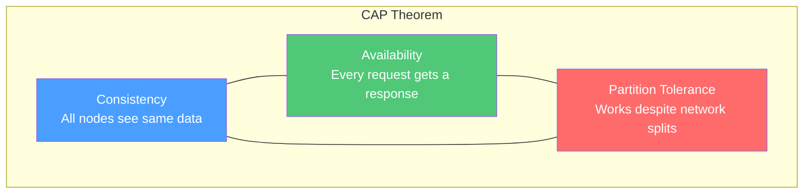
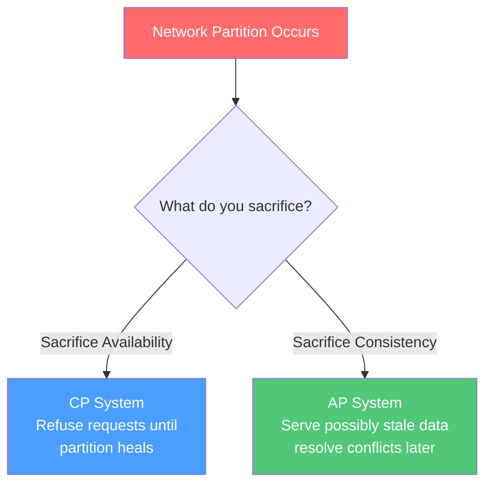
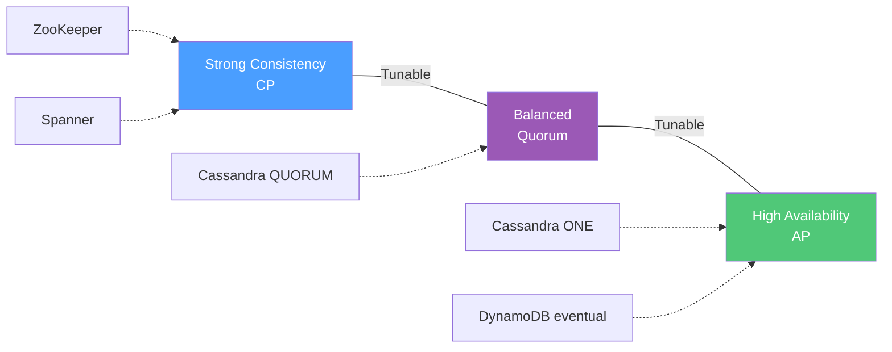
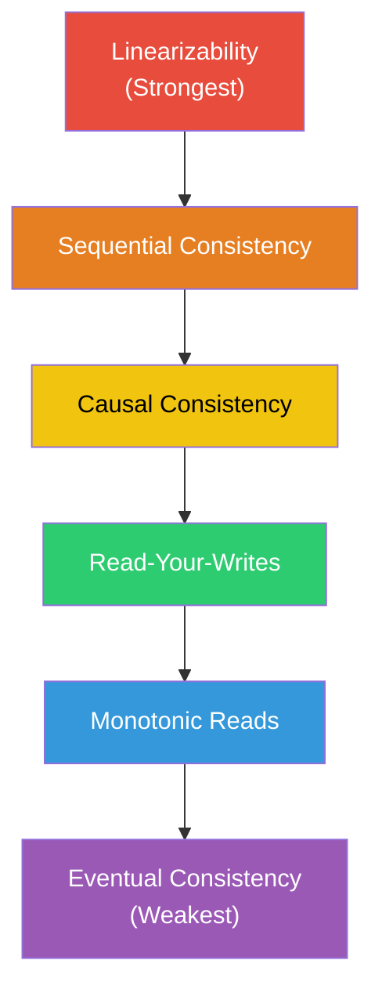
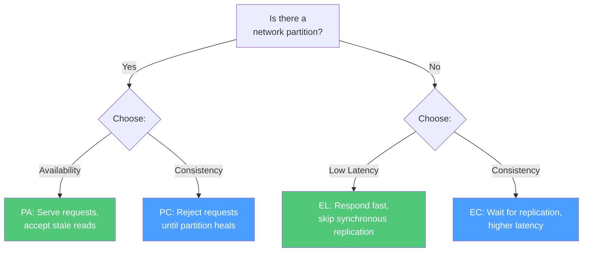
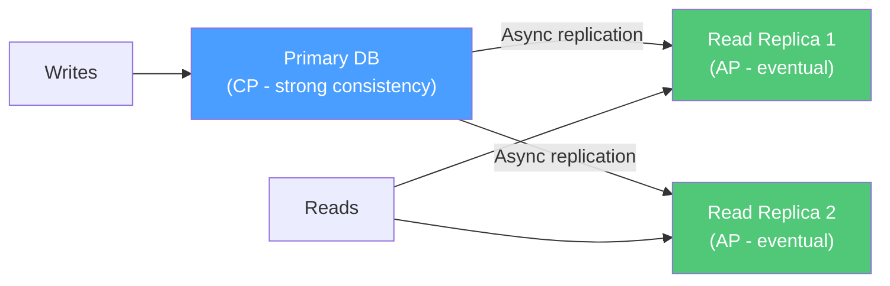

# Chapter 11 - CAP Theorem & Consistency Models

> You can't have it all. Every distributed database makes a tradeoff between consistency, availability, and partition tolerance. Understanding these tradeoffs is the difference between picking the right database and getting paged at 3 AM.

[Read on Medium](#) | [Watch on YouTube](#) | **Status: DRAFT**

---

## Why CAP Matters

The moment you put data on more than one machine, you face a fundamental question: what happens when those machines can't talk to each other?

Every distributed system interview, every database selection, every architecture decision comes back to this. You'll hear "we chose Cassandra for availability" or "we need strong consistency so we went with Spanner" - and if you don't understand CAP, those statements are just noise.

The CAP theorem isn't academic. It's the single most important constraint in distributed system design.

---

## The CAP Theorem - Stated Simply

Eric Brewer proposed this in 2000, and Gilbert & Lynch proved it in 2002. Here's what it says:

**A distributed data store can provide at most two of the following three guarantees simultaneously:**

| Property | What It Means |
|----------|---------------|
| **Consistency (C)** | Every read receives the most recent write or an error. All nodes see the same data at the same time. |
| **Availability (A)** | Every request receives a non-error response, without guarantee that it contains the most recent write. |
| **Partition Tolerance (P)** | The system continues to operate despite network partitions between nodes. |

The critical insight: **you don't get to choose two out of three freely. You must choose between C and A, because P is not optional.**

---

## Why Partition Tolerance Is Non-Negotiable

Network partitions aren't theoretical. They happen constantly in production:

- A switch fails and splits your cluster in half
- A cloud availability zone loses connectivity to the others
- A fiber optic cable gets cut (this happens more often than you'd think)
- A misconfigured firewall rule blocks traffic between nodes

If your system runs on more than one machine, partitions will happen. A system that doesn't tolerate partitions is just a single-node database - and single-node databases don't scale.

**So the real choice is: during a partition, do you sacrifice consistency or availability?**

---

## CP Systems - Consistency Over Availability

A CP system guarantees that every read returns the latest write. During a partition, nodes that can't confirm they have the latest data will refuse to serve requests.

**What this looks like in practice:** A client sends a read request. The node it hits can't reach the primary or can't get a quorum. Instead of returning stale data, it returns an error. The client retries or fails.

### Real CP Systems

| System | How It Achieves CP |
|--------|-------------------|
| **ZooKeeper** | Leader-based consensus (ZAB protocol). Reads and writes go through the leader. During partition, minority side becomes unavailable. |
| **etcd** | Raft consensus. Requires majority quorum for reads and writes. Minority partition rejects all operations. |
| **HBase** | Single RegionServer owns each region. If the RegionServer is partitioned, that region is unavailable until failover. |
| **MongoDB** (majority write concern) | Writes require acknowledgment from majority of replica set. During partition, minority side can't accept writes. |
| **Google Spanner** | TrueTime + Paxos. Globally consistent reads at the cost of higher latency. |

**When to choose CP:** Financial transactions, inventory systems, leader election, configuration management - anywhere serving wrong data is worse than serving no data.

---

## AP Systems - Availability Over Consistency

An AP system guarantees that every node can accept reads and writes, even during a partition. The tradeoff is that different nodes might have different versions of the data.

**What this looks like in practice:** A client sends a write to Node A. A network partition prevents Node A from replicating to Node B. Another client reads from Node B and gets stale data. When the partition heals, the system resolves the conflict.

### Real AP Systems

| System | How It Achieves AP |
|--------|-------------------|
| **Cassandra** | Peer-to-peer ring. Any node can accept reads/writes. Uses hinted handoff and read repair for eventual convergence. |
| **DynamoDB** | Multi-AZ replication. Eventually consistent reads by default. Always writable. |
| **CouchDB** | Multi-master replication. Accepts writes anywhere, uses revision trees for conflict resolution. |
| **Riak** | Dynamo-style. Vector clocks for conflict detection, application-level resolution. |

**When to choose AP:** Social media feeds, product catalogs, user sessions, analytics, DNS - anywhere showing slightly stale data is acceptable and downtime isn't.

---

## The CAP Spectrum - It's Not Binary

A common misconception is that a system is strictly CP or AP. In reality, most systems are tunable. They sit on a spectrum and let you dial the tradeoff per operation.

Cassandra is the textbook example. You can set consistency level per query:

| Consistency Level | Behavior | Tradeoff |
|------------------|----------|----------|
| `ONE` | One replica must respond | Fast, low consistency |
| `QUORUM` | Majority of replicas must agree | Balanced |
| `ALL` | All replicas must respond | Slow, strong consistency |
| `LOCAL_QUORUM` | Majority in local datacenter | Good for multi-DC |

With a replication factor of 3 and `QUORUM` reads + `QUORUM` writes, you get strong consistency because `R + W > N` (2 + 2 > 3). Any reader is guaranteed to see at least one replica that has the latest write.

---

## Consistency Models - A Deeper Look

CAP's "consistency" is a specific thing: linearizability. But there's a whole spectrum of consistency models, each with different guarantees and performance characteristics.

### The Consistency Hierarchy

### Model Details

| Model | Guarantee | Example |
|-------|-----------|---------|
| **Linearizability** | Operations appear to execute atomically at some point between invocation and response. Real-time ordering is preserved. | Google Spanner, single-node databases |
| **Sequential Consistency** | All processes see the same order of operations, but that order doesn't have to match real-time. | Rarely implemented in isolation |
| **Causal Consistency** | Operations that are causally related are seen in the same order by all nodes. Concurrent operations may appear in any order. | MongoDB (causal sessions), COPS |
| **Read-Your-Writes** | A process always sees its own writes in subsequent reads. Other processes' writes may be stale. | Most web session stores |
| **Monotonic Reads** | Once a process reads a value, it never sees an older value on subsequent reads. | DynamoDB consistent reads |
| **Eventual Consistency** | If no new writes occur, all replicas will eventually converge to the same value. No guarantee on when. | Cassandra (ONE), DNS, CDN caches |

### Linearizability vs Serializability

These two terms sound similar but mean very different things. Confusing them is one of the most common mistakes in system design interviews.

| Property | What It Is | Scope | Where It Matters |
|----------|-----------|-------|-----------------|
| **Linearizability** | Single-operation real-time ordering. Every read sees the most recent write. | Single object | Distributed consensus, leader election |
| **Serializability** | Multi-operation transaction isolation. The result is equivalent to some serial execution of transactions. | Multiple objects | Database transactions (ACID) |
| **Strict Serializability** | Both at once. Transactions execute serially AND respect real-time ordering. | Multiple objects | Google Spanner, CockroachDB, FoundationDB |

Linearizability is about recency - did I get the latest value? Serializability is about isolation - did my transaction see a consistent snapshot? You can have one without the other.

---

## The PACELC Theorem

CAP only talks about what happens during a partition. But most of the time, there's no partition. What tradeoffs does the system make during normal operation?

Daniel Abadi proposed PACELC in 2012 to address this gap:

**If there's a Partition (P), choose between Availability (A) and Consistency (C). Else (E), choose between Latency (L) and Consistency (C).**

### Real Systems in PACELC Terms

| System | During Partition | Else (Normal) | Classification |
|--------|-----------------|---------------|----------------|
| **Cassandra** | Available (PA) | Low latency (EL) | PA/EL |
| **DynamoDB** | Available (PA) | Low latency (EL) | PA/EL |
| **MongoDB** | Consistent (PC) | Consistent (EC) | PC/EC |
| **ZooKeeper** | Consistent (PC) | Consistent (EC) | PC/EC |
| **Google Spanner** | Consistent (PC) | Consistent (EC) | PC/EC |
| **Cosmos DB** | Tunable | Tunable | Depends on config |
| **CockroachDB** | Consistent (PC) | Consistent (EC) | PC/EC |

PACELC is more useful than CAP for real architectural decisions because it captures the latency/consistency tradeoff you live with every day, not just during rare partition events.

---

## Tunable Consistency in Practice

The most pragmatic systems let you choose your consistency level per operation. Here's how quorum math works.

### The Quorum Formula

Given:
- **N** = number of replicas
- **W** = number of replicas that must acknowledge a write
- **R** = number of replicas that must respond to a read

**If R + W > N, you get strong consistency.** At least one responding node must have the latest write.

| N | W | R | R + W > N? | Consistency |
|---|---|---|:----------:|-------------|
| 3 | 1 | 1 | No (2 <= 3) | Eventual - might read stale |
| 3 | 1 | 3 | Yes (4 > 3) | Strong - all replicas respond |
| 3 | 2 | 2 | Yes (4 > 3) | Strong - quorum overlap |
| 3 | 3 | 1 | Yes (4 > 3) | Strong - all must write |
| 5 | 3 | 3 | Yes (6 > 5) | Strong - quorum overlap |

### Tradeoffs in Practice

| Config | Write Speed | Read Speed | Fault Tolerance | Use Case |
|--------|:-----------:|:----------:|:---------------:|----------|
| W=1, R=1 | Fast | Fast | High | Analytics, logs |
| W=QUORUM, R=QUORUM | Medium | Medium | Medium | General purpose |
| W=ALL, R=1 | Slow | Fast | Low | Read-heavy, needs consistency |
| W=1, R=ALL | Fast | Slow | Low | Write-heavy, needs consistency |

---

## Common Misconceptions About CAP

These come up constantly in interviews. Get them right.

| Misconception | Reality |
|---------------|---------|
| "You pick 2 of 3" | You must tolerate partitions, so you're choosing between C and A during partitions. Outside partitions, you can have both. |
| "CA systems exist" | A distributed system that doesn't tolerate partitions is just a single node. Single-node Postgres is "CA" but that misses the point. |
| "AP means no consistency" | AP systems still converge eventually. The guarantee is that data becomes consistent after the partition heals. |
| "CP means no availability" | CP systems are available when there's no partition. They only become unavailable on the minority side during a partition. |
| "CAP applies to every request" | CAP is about what happens during partitions. Most of the time, your system works fine with both C and A. |
| "Eventual consistency means data loss" | Eventual consistency means temporary staleness, not data loss. All writes are eventually propagated. |

---

## Conflict Resolution Strategies

When an AP system allows concurrent writes during a partition, conflicts must be resolved. Here are the common approaches:

| Strategy | How It Works | Used By |
|----------|-------------|---------|
| **Last-Writer-Wins (LWW)** | Timestamp determines winner. Simple but can silently drop writes. | Cassandra, DynamoDB |
| **Vector Clocks** | Track causal ordering. Detect true conflicts. Application resolves. | Riak, Voldemort |
| **CRDTs** | Conflict-free data types that merge automatically. Limited to specific operations (counters, sets). | Riak (data types), Redis (CRDT module) |
| **Application-level** | Return all conflicting versions. Let the app decide. | CouchDB (revision trees) |
| **Merge functions** | Custom logic combines conflicting writes. | DynamoDB (conditional writes) |

**My recommendation:** LWW is the default choice for most systems because it's simple and predictable. Use vector clocks or CRDTs only when you genuinely can't afford to lose concurrent writes - shopping carts, collaborative editing, distributed counters.

---

## Real-World Architecture Patterns

### Pattern 1: CP for Writes, AP for Reads

Many production systems use different consistency for reads vs writes. Write to a CP primary store, then asynchronously replicate to AP read replicas.

### Pattern 2: Different Consistency Per Feature

You don't have to pick one consistency model for your entire system:

| Feature | Consistency Needed | Why |
|---------|-------------------|-----|
| Account balance | Strong (CP) | Showing wrong balance causes support tickets and lost trust |
| News feed | Eventual (AP) | A 5-second delay on a post appearing is fine |
| Shopping cart | Causal | Items added in sequence should appear in sequence |
| Like counts | Eventual (AP) | Nobody cares if it says 4,831 vs 4,833 |
| Inventory (last item) | Strong (CP) | Overselling is expensive |
| User profile | Read-your-writes | You should see your own edits immediately |

---

## Common Pitfalls

| Pitfall | Why It Hurts | What to Do Instead |
|---------|-------------|-------------------|
| Treating CAP as a one-time choice | Different parts of your system have different needs | Choose consistency per feature, not per system |
| Using eventual consistency for financial data | Stale reads cause double-spending, overselling, incorrect balances | Use strong consistency with quorum writes for anything involving money |
| Ignoring the "E" in PACELC | You optimized for partitions but have 300ms latency in normal operation | Design for normal operation first - partitions are rare |
| Assuming network partitions are rare | Cloud providers have zone-level failures multiple times per year | Design for partitions from day one |
| Not testing partition behavior | Your system "supports" partitions but you've never verified it | Use chaos engineering tools (Jepsen, Chaos Monkey) to simulate partitions |
| Choosing CP when AP would suffice | System goes down during partitions when users would've been fine with stale data | Ask: "Is stale data worse than no data?" Usually it isn't. |

---

## System Design Interview Cheat Sheet

When asked about CAP in an interview, walk through this framework:

1. **Identify the data type.** Financial? Social? Configuration? Inventory?
2. **Ask: is stale data dangerous?** If yes, lean CP. If no, lean AP.
3. **Consider the read/write ratio.** Read-heavy systems benefit from AP with read replicas.
4. **Think about conflict resolution.** If you choose AP, how do you resolve conflicting writes?
5. **Mention PACELC.** Show you understand the latency tradeoff during normal operation.
6. **Be specific about systems.** Don't just say "I'd use a CP database." Say "I'd use etcd for the coordination layer and Cassandra with QUORUM for the data layer."

### Quick Reference

| Need | System Choice | Why |
|------|--------------|-----|
| Distributed lock / leader election | ZooKeeper, etcd | Must be strongly consistent |
| Configuration store | etcd, Consul | CP - wrong config = outage |
| User sessions | Redis, DynamoDB | AP - stale session is better than no session |
| Product catalog | Cassandra, DynamoDB | AP - eventual consistency is fine |
| Financial ledger | Spanner, CockroachDB | CP - strict serializability required |
| Analytics / metrics | Cassandra, InfluxDB | AP - slight delay is acceptable |

---

## Key Takeaways

1. **CAP is really about C vs A** - partition tolerance is mandatory in any distributed system
2. **Most systems are tunable** - you don't pick a rigid category, you dial consistency per query
3. **PACELC > CAP** - the latency vs consistency tradeoff during normal operation matters more than partition behavior
4. **Different features need different consistency** - don't use one model for your entire system
5. **Eventual consistency doesn't mean broken** - it means temporarily stale, and most features tolerate that just fine
6. **Quorum math is simple and powerful** - R + W > N gives you strong consistency with tunable read/write speeds

---

## What's Next?

**Chapter 12:** [Data Storage & Object Stores](../12-data-storage/)
