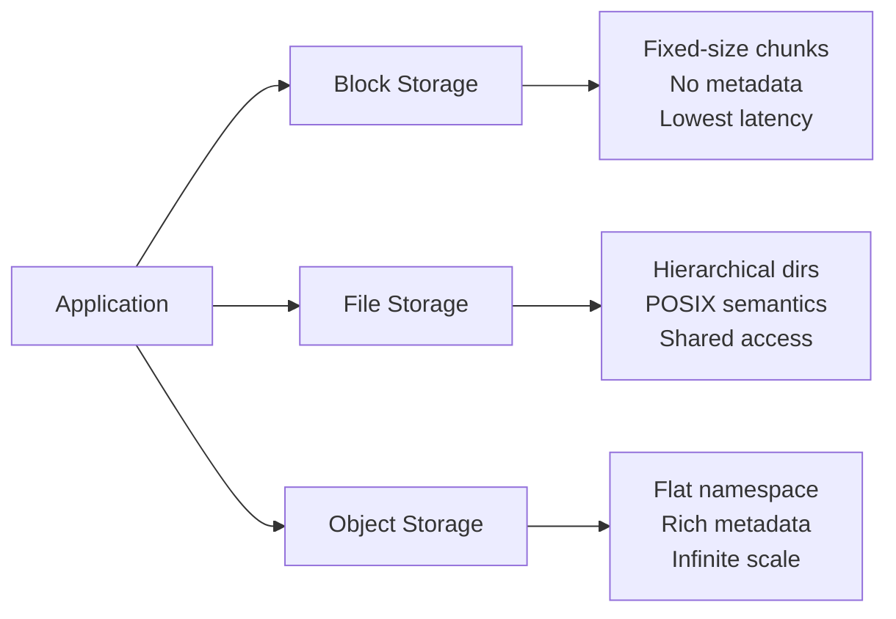
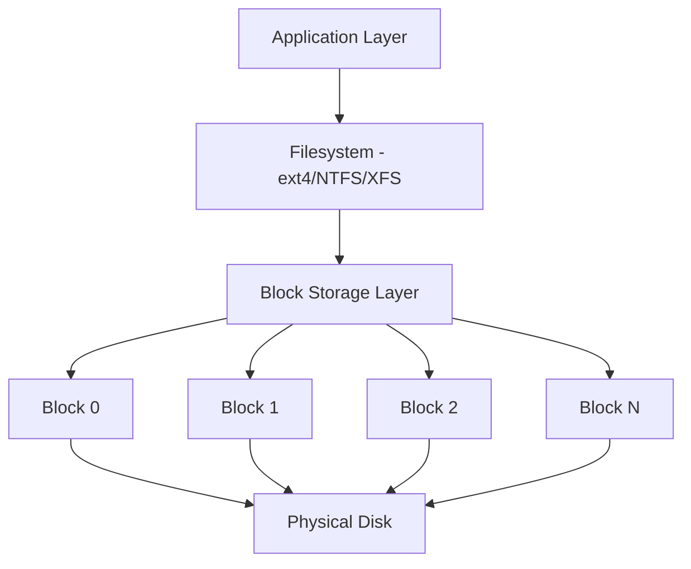
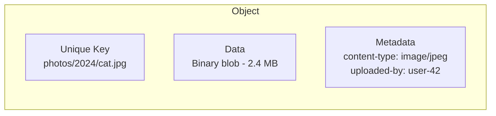
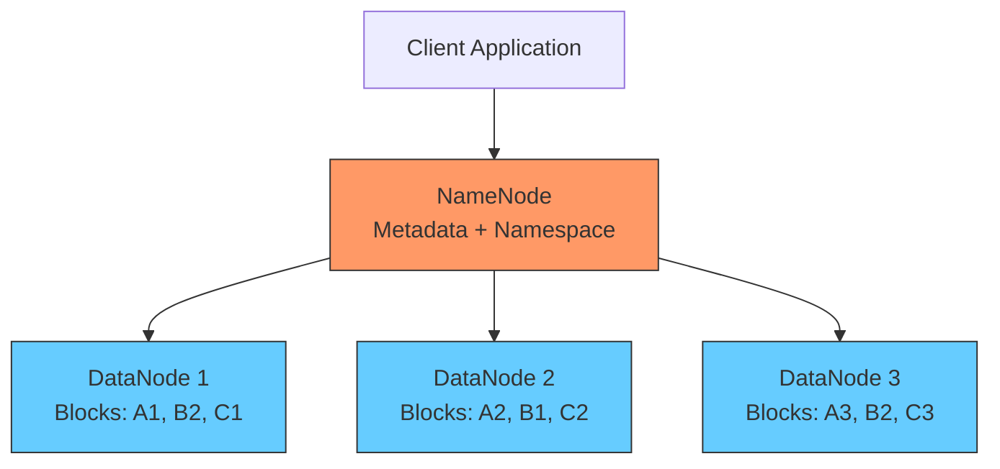
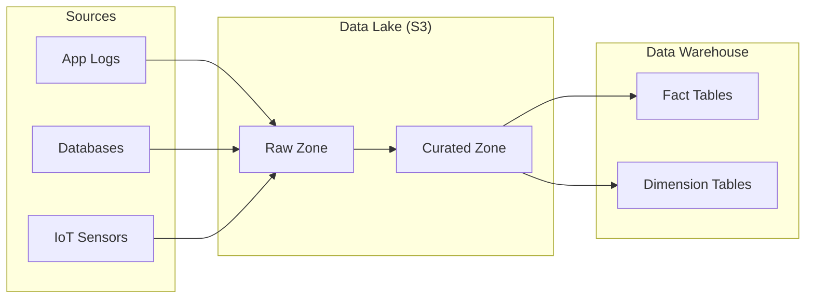
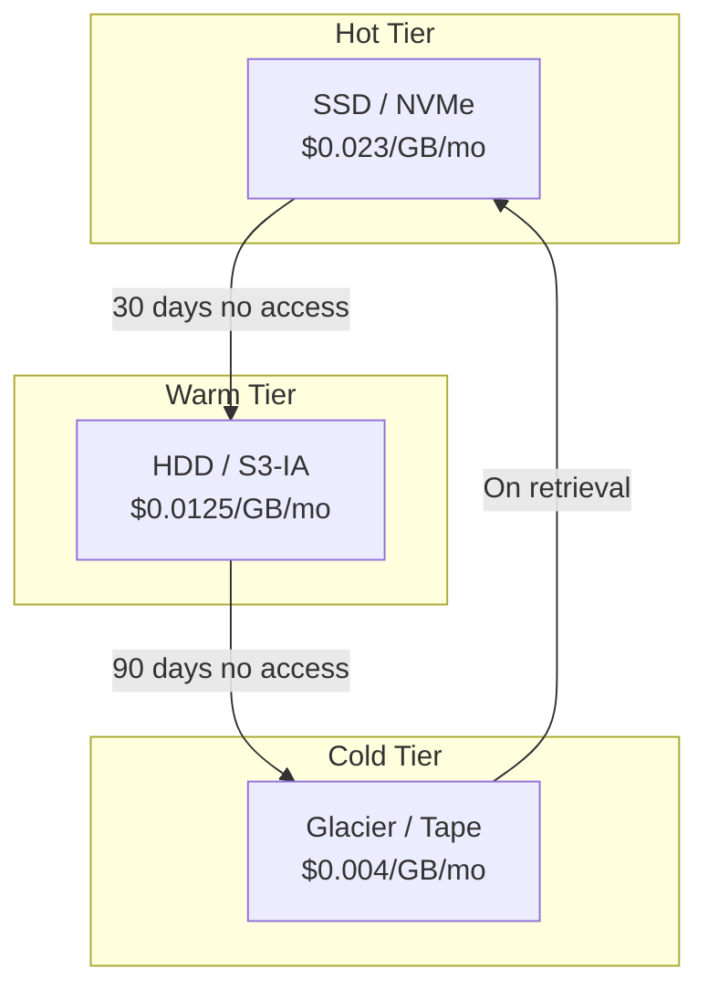
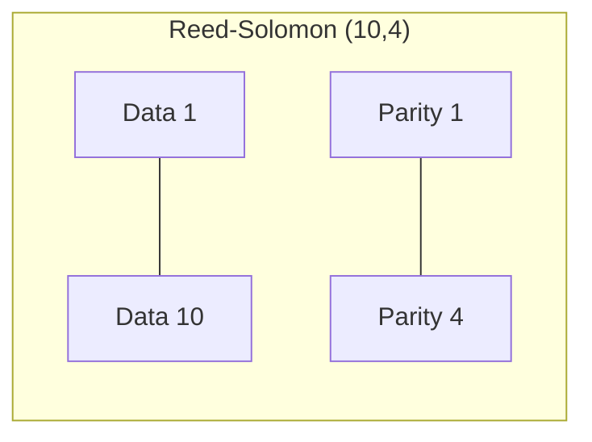

# Chapter 12 - Data Storage & Object Stores

Every system you'll ever build has one non-negotiable requirement: it needs to
store data somewhere. The choice you make here - block, file, or object - shapes
your architecture's cost, performance, and durability for years. Most teams
default to whatever they used last time without thinking about it. That's how you
end up paying 10x more than you should.

---

## Table of Contents

1. [The Three Storage Models](#the-three-storage-models)
2. [Block Storage](#block-storage)
3. [File Storage](#file-storage)
4. [Object Storage](#object-storage)
5. [Block vs File vs Object](#block-vs-file-vs-object)
6. [HDFS Architecture](#hdfs-architecture)
7. [Data Lakes vs Data Warehouses](#data-lakes-vs-data-warehouses)
8. [Storage Tiers - Hot, Warm, Cold](#storage-tiers---hot-warm-cold)
9. [Content-Addressable Storage](#content-addressable-storage)
10. [Erasure Coding vs Replication](#erasure-coding-vs-replication)
11. [Storage Cost Optimization](#storage-cost-optimization)
12. [Real-World Examples](#real-world-examples)
13. [Common Pitfalls](#common-pitfalls)
14. [Summary](#summary)

---

## The Three Storage Models

There are exactly three ways to persist data in a distributed system. Everything
else - databases, caches, message queues - is built on top of one of these:



Each model makes a different tradeoff. Block storage gives you raw speed but no
structure. File storage gives you familiar directories but struggles at scale.
Object storage gives you virtually unlimited capacity but no random writes.

---

## Block Storage

Block storage is the lowest-level abstraction. It splits data into fixed-size
chunks (typically 512 bytes to 4 KB) and addresses them by index. There's no
concept of files, directories, or metadata - just numbered blocks on a disk.

**Examples:** AWS EBS, Azure Managed Disks, SAN, your laptop's SSD.

**When to use it:** Databases that need sub-millisecond I/O, VM boot volumes,
any workload requiring random read/write access.

Block storage is the foundation beneath every filesystem. When you format an EBS
volume as ext4, you're layering file semantics on top of blocks. It's fast
because there's almost no abstraction overhead. The downside: blocks have no
awareness of what they contain.



---

## File Storage

File storage adds structure on top of blocks. Data is organized into files and
directories in a hierarchy, with POSIX semantics (open, read, write, close,
seek), file-level locking, and metadata per file (permissions, timestamps).

**Examples:** NFS, AWS EFS, Azure Files, SMB/CIFS, GlusterFS.

**When to use it:** Shared access across multiple servers, legacy applications
that expect a filesystem interface, workloads with moderate scale (millions of
files, not billions).

File storage breaks down at extreme scale. A single NFS server managing 100
million files spends most of its time traversing directory trees. This is why
Google, Facebook, and Amazon all moved to object storage for their largest
datasets.

---

## Object Storage

Object storage throws away the directory hierarchy entirely. Every piece of data
is an "object" in a flat namespace with three components: the data itself,
arbitrary key-value metadata, and a globally unique identifier.



**Examples:** AWS S3, Google Cloud Storage, Azure Blob Storage, MinIO.

**Key properties:** Flat namespace, HTTP/REST API, immutable writes (replace
only, never modify in place), virtually unlimited scale, built-in durability
(99.999999999% - eleven 9s on S3).

The immutability constraint is what makes object storage scale. Because objects
can't be partially modified, there's no need for complex locking or consistency
protocols. The system can replicate objects across data centers without worrying
about conflicting writes.

---

## Block vs File vs Object

| Feature | Block | File | Object |
|---|---|---|---|
| **Abstraction** | Raw chunks | Files + directories | Blobs + metadata |
| **Access** | Device driver / iSCSI | POSIX / NFS / SMB | HTTP REST API |
| **Mutability** | Read/write anywhere | Read/write anywhere | Replace only |
| **Metadata** | None | Basic (permissions, timestamps) | Rich (custom key-value) |
| **Max scale** | Single volume (16 TB typical) | Millions of files | Trillions of objects |
| **Latency** | Sub-millisecond | Low milliseconds | Tens of milliseconds |
| **Cost (per GB/mo)** | $0.08-0.10 | $0.30 | $0.023 |
| **Best for** | Databases, VMs | Shared filesystems | Static assets, archives |
| **Durability** | Single disk or RAID | Depends on backend | 11 nines (S3) |

Object storage is roughly 4x cheaper than block and 13x cheaper than managed
file storage. If you're storing terabytes that don't need sub-millisecond access,
object storage should be your default.

---

## HDFS Architecture

The Hadoop Distributed File System (HDFS) is a hybrid. It stores data as large
blocks (128 MB default) and provides a file-like namespace through a centralized
metadata server.



**NameNode** - the single metadata server tracking which blocks belong to which
files. It holds the entire namespace in memory, limiting clusters to roughly
200-400 million files. Production deployments always run a standby NameNode.

**DataNode** - commodity servers storing actual data blocks. Each block is
replicated to 3 DataNodes by default. DataNodes send heartbeats to the NameNode
every 3 seconds.

**Why 128 MB blocks?** Small blocks mean more metadata on the NameNode and more
network round trips. HDFS was designed for batch processing of large files, not
random access to small records.

---

## Data Lakes vs Data Warehouses

| Aspect | Data Lake | Data Warehouse |
|---|---|---|
| **Storage format** | Raw (any format) | Structured (tables/columns) |
| **Schema** | Schema-on-read | Schema-on-write |
| **Users** | Data scientists, ML engineers | Business analysts, BI teams |
| **Query engine** | Spark, Presto, Athena | SQL (Redshift, BigQuery, Snowflake) |
| **Storage backend** | Object storage (S3, GCS) | Proprietary or columnar |
| **Cost** | Low (object storage pricing) | High (compute + storage bundled) |



The modern pattern is a data lake as the source of truth (cheap storage, any
format) with curated subsets loaded into a warehouse for fast SQL. Tools like
Delta Lake and Apache Iceberg add ACID transactions on top of object storage,
blurring the line between the two.

Don't build a data lake without a plan for data governance. Without cataloging
and quality checks, a data lake becomes a data swamp.

---

## Storage Tiers - Hot, Warm, Cold

Not all data is accessed equally. Storing everything on the same high-performance
tier wastes money.



| Tier | Access Pattern | Retrieval Time | Cost (per GB/mo) | Example |
|---|---|---|---|---|
| **Hot** | Multiple times/day | Milliseconds | $0.023 | Active user profiles |
| **Warm** | Few times/month | Milliseconds | $0.0125 | Old order records |
| **Cold** | Less than once/year | Minutes to hours | $0.004 | Compliance archives |
| **Archive** | Almost never | 5-12 hours | $0.00099 | Legal holds |

**Lifecycle policies** automate tier transitions. Define rules like "move to IA
after 30 days, Glacier after 90 days, delete after 7 years." This is the single
easiest way to cut your storage bill - most teams save 40-60%.

---

## Content-Addressable Storage

In content-addressable storage (CAS), the address of data is derived from its
content - typically a cryptographic hash. You hash the data and that hash becomes
the key.

```
data = b"Hello, world!"
key  = SHA-256(data) = "315f5bdb76d078c43b8ac..."
```

**Automatic deduplication** - identical content always produces the same hash, so
it's stored once. If 1,000 users upload the same file, you store it once.

**Immutability** - you can't change data at an address without changing the
address. CAS is naturally append-only.

**Integrity verification** - re-hashing and comparing catches corruption.

**Real-world uses:** Git (every file/commit is content-addressed), Docker image
layers, IPFS, Dropbox deduplication.

---

## Erasure Coding vs Replication

You need redundancy to survive disk failures. **3x replication** stores 3 copies
(200% overhead, survives 2 failures, fast reads). **Erasure coding** splits data
into k data chunks plus m parity chunks - any k of the (k+m) chunks can
reconstruct the original.



| Property | 3x Replication | Erasure Coding (10,4) |
|---|---|---|
| **Storage overhead** | 200% | 40% |
| **Fault tolerance** | 2 failures | 4 failures |
| **Read latency** | Low (any copy) | Higher (decode required) |
| **Recovery speed** | Fast (copy) | Slow (reconstruct) |
| **CPU cost** | None | Encoding/decoding |
| **Best for** | Hot data, small files | Cold data, large files |

The industry consensus: replication for hot data, erasure coding for cold data.
Meta uses Reed-Solomon coding for cold storage and saves petabytes compared to
replication.

---

## Storage Cost Optimization

1. **Lifecycle policies** - Highest impact, lowest effort. Do this first.
2. **Compression** - Parquet/ORC compress columnar data 5-10x vs CSV/JSON.
3. **Deduplication** - CAS eliminates duplicates. Backup systems achieve 10-50x dedup ratios.
4. **Right-sizing volumes** - A 1 TB EBS volume costs the same at 10 GB or 1 TB usage. Audit quarterly.
5. **Delete what you don't need** - Set retention policies. Five years of debug logs in S3 Standard costs real money.
6. **S3 Intelligent-Tiering** - Monitors access patterns and moves objects automatically.
7. **Erasure coding for cold data** - Cuts overhead from 200% to 40%.

---

## Real-World Examples

**Netflix on S3** - Over 100 PB of video on S3. Each title encoded in dozens of
formats. Frequently streamed content in S3 Standard; old titles in S3-IA. Edge
caches (Open Connect) prevent every viewer request from hitting S3 directly.

**Uber's HDFS** - 200+ PB across tens of thousands of DataNodes. Backs their
analytics platform and ML pipelines. Extended with namespace federation and
tiered storage to object storage for cold data.

**Dropbox Magic Pocket** - Migrated from S3 to their own object storage in 2016.
Uses CAS for deduplication and erasure coding for durability. Saved roughly $75
million over two years.

**Meta Warm Storage** - Over 1 EB of warm data using Reed-Solomon erasure coding
(10,4), cutting overhead from 200% to 40%. Saved hundreds of petabytes of disk
space.

---

## Common Pitfalls

**Treating S3 like a filesystem.** S3 has no directories - "/" is just a
character. Listing large prefixes is slow. Use a metadata service if you need
directory semantics at scale.

**Ignoring S3 request costs.** S3 charges $0.005 per 1,000 GETs. A service
making 100M GETs/day pays $500/day in request fees alone.

**Using EBS when you need S3.** EBS is 4x more expensive, limited to one AZ, and
capped at 16 TB. S3 is cheaper, more durable, and accessible from anywhere.

**HDFS for small files.** Each file consumes ~150 bytes on the NameNode. Millions
of 1-10 KB files overwhelm it. Combine into sequence files or use object storage.

**Assuming durability means availability.** S3's 11-nines durability means data
won't be lost. But availability is 99.99% - still 52 minutes of downtime/year.

**Skipping encryption at rest.** Every major provider offers it at zero cost.
There's no reason not to enable it.

---

## Summary

Storage decisions are hard to change later. Moving petabytes takes weeks. Get it
right the first time:

- **Block storage** for databases and VMs needing raw performance
- **File storage** for shared filesystems with POSIX semantics
- **Object storage** for everything else - cheap, durable, unlimited scale
- **Tiering** saves 40-60% on storage costs with minimal effort
- **Erasure coding** cuts overhead from 200% to 40% at the cost of CPU/latency
- **Content-addressable storage** eliminates duplicates and guarantees integrity

The trend is clear: object storage is eating the world. S3-compatible APIs are
the de facto standard. Design around object storage by default, and only reach
for block or file storage when you have a specific reason.

---

**What's Next:** **Chapter 13:** [Search & Indexing](../13-search-indexing/)
