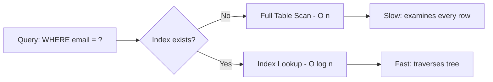
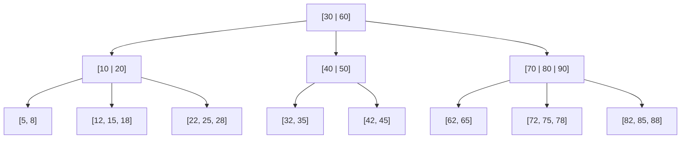
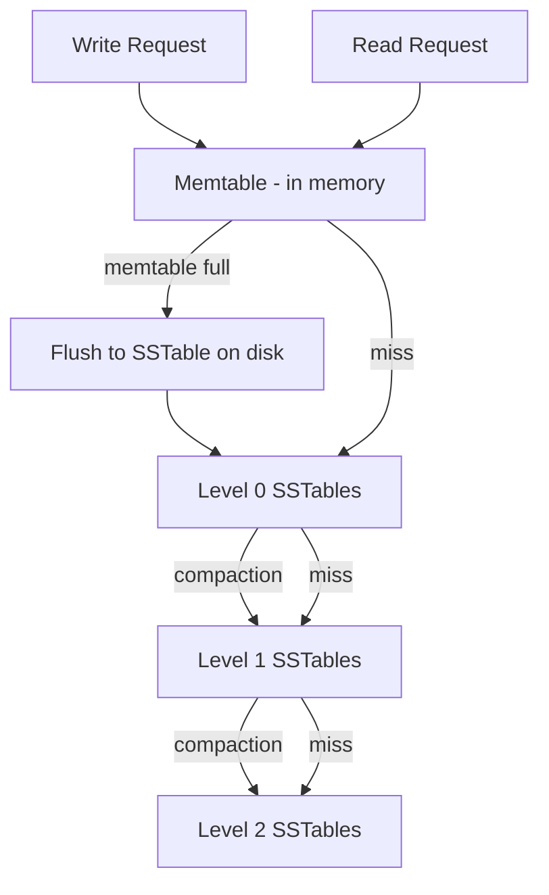
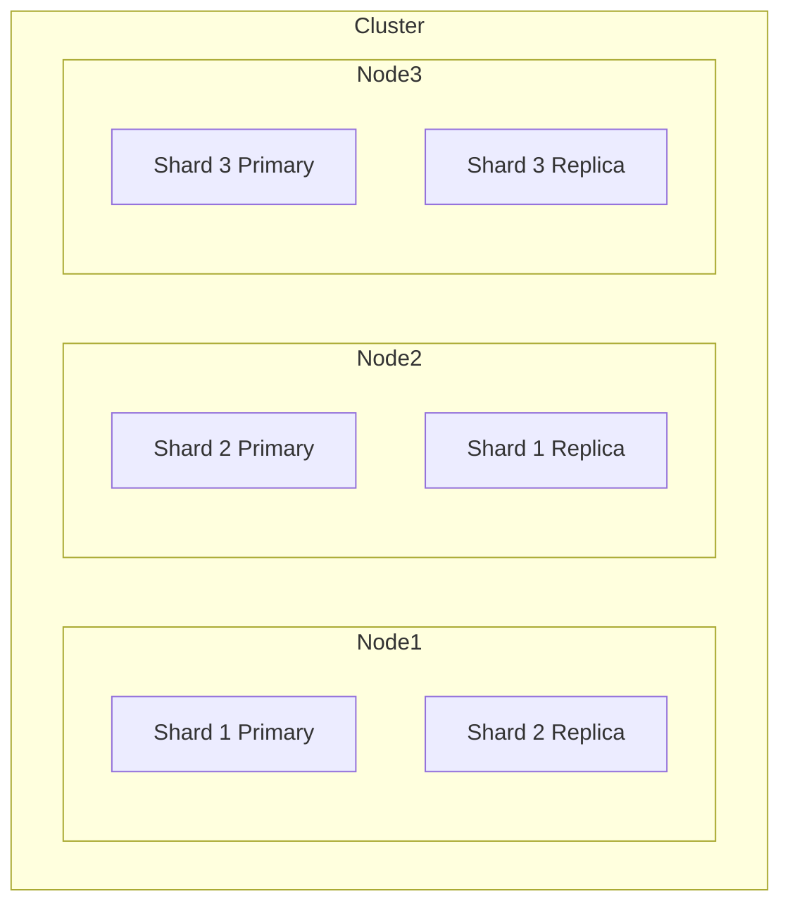

# Chapter 13 - Search & Indexing

Every database query that doesn't use an index is a full table scan.
That's the equivalent of reading every page of a 10,000-page book to find
one sentence. Indexes exist to turn that O(n) disaster into an O(log n)
lookup - and understanding how they work is the difference between a system
that handles 50 queries per second and one that handles 50,000.

This chapter covers three families of indexing: B-trees (the default in
almost every relational database), LSM trees (the engine behind
Cassandra, RocksDB, and LevelDB), and inverted indexes (the backbone of
full-text search in Elasticsearch and Lucene). You'll learn when each one
shines, where each one hurts, and how to pick the right one for your
workload.

---

## Table of Contents

1. [Why Indexes Matter](#why-indexes-matter)
2. [B-Tree Indexes](#b-tree-indexes)
3. [LSM Trees](#lsm-trees)
4. [B-Tree vs LSM Tree](#b-tree-vs-lsm-tree)
5. [Inverted Indexes](#inverted-indexes)
6. [Tokenization, Stemming, and Stop Words](#tokenization-stemming-and-stop-words)
7. [TF-IDF and BM25 Scoring](#tf-idf-and-bm25-scoring)
8. [Elasticsearch Architecture](#elasticsearch-architecture)
9. [Composite Indexes and Index Ordering](#composite-indexes-and-index-ordering)
10. [Covering Indexes](#covering-indexes)
11. [Index Maintenance Costs](#index-maintenance-costs)
12. [Real-World Examples](#real-world-examples)
13. [Common Pitfalls](#common-pitfalls)
14. [Key Takeaways](#key-takeaways)
15. [What's Next](#whats-next)

---

## Why Indexes Matter

A table with 10 million rows and no index on the `email` column forces
the database to examine all 10 million rows for `SELECT * FROM users
WHERE email = 'alice@example.com'`. That's a sequential scan. On spinning
disk, it might take 30 seconds. On SSD, maybe 3 seconds. With a B-tree
index, the same query takes under 1 millisecond.

```
Without index:  Scan 10,000,000 rows  ->  ~3 seconds
With index:     Traverse 4 tree levels ->  ~0.3 ms
```

The cost is real: every index you add speeds up reads but slows down
writes, because the database must update the index on every INSERT,
UPDATE, and DELETE. Indexing is always a tradeoff - you're trading write
performance and storage for read performance.



---

## B-Tree Indexes

B-trees are the default index type in PostgreSQL, MySQL/InnoDB, Oracle,
and SQL Server. They've been the workhorse of database indexing since
1970.

### How B-Trees Work

A B-tree is a self-balancing tree where each node can hold multiple keys
and pointers. A typical B-tree node in a database fits one disk page
(usually 4 KB or 8 KB). A node might hold 200-500 keys depending on key
size.



Key properties of a B-tree with branching factor `b`:

| Property | Value |
|---|---|
| Max children per node | b |
| Min children per internal node | ceil(b/2) |
| Height for n keys | O(log_b(n)) |
| Search time | O(log n) |
| Insert time | O(log n) |
| Delete time | O(log n) |

For a table with 100 million rows and a branching factor of 500, the tree
height is only 4. That means at most 4 disk reads to find any row.

### When B-Trees Shine

B-trees are best for read-heavy workloads with a mix of point lookups and
range queries. They support equality checks (`WHERE id = 42`), range
scans (`WHERE age BETWEEN 20 AND 30`), and ordering (`ORDER BY
created_at`) efficiently.

### When B-Trees Struggle

Every write updates the tree in place. That means random I/O on disk.
For write-heavy workloads - like time-series data or event logging -
B-trees can become a bottleneck because each insert may trigger a page
split and multiple random disk writes.

---

## LSM Trees

Log-Structured Merge trees take the opposite approach from B-trees:
instead of updating data in place, they buffer writes in memory and
flush them to disk as sorted, immutable files.

### How LSM Trees Work

1. **Writes go to a memtable** - an in-memory sorted structure (usually a
   red-black tree or skip list). This is fast because it's purely in RAM.

2. **When the memtable fills up**, it's flushed to disk as an immutable
   sorted file called an SSTable (Sorted String Table).

3. **Background compaction** merges multiple SSTables into larger ones,
   removing duplicates and deleted entries.



### Write Advantage, Read Tradeoff

LSM trees convert random writes into sequential writes. A memtable
absorbs writes in memory, then flushes them as one large sequential
write - 10-100x faster than random I/O.

The downside: reads must check the memtable and potentially multiple
SSTable levels. Bloom filters mitigate this by skipping SSTables that
definitely don't contain the target key (a 10-bit-per-entry Bloom filter
gives roughly 1% false positive rate).

### Who Uses LSM Trees

| System | Storage Engine |
|---|---|
| Apache Cassandra | Built-in LSM |
| Google LevelDB | LSM |
| Facebook RocksDB | LSM (forked from LevelDB) |
| Apache HBase | LSM on top of HDFS |
| ScyllaDB | LSM (C++ rewrite of Cassandra) |
| CockroachDB | RocksDB/Pebble (LSM) |

---

## B-Tree vs LSM Tree

This is one of the most important tradeoffs in storage engine design.
Neither is universally better - it depends on your workload.

| Dimension | B-Tree | LSM Tree |
|---|---|---|
| Read latency | Lower (data in place) | Higher (check multiple levels) |
| Write throughput | Lower (random I/O) | Higher (sequential I/O) |
| Write amplification | Moderate (page rewrites) | Higher (compaction rewrites) |
| Space amplification | Lower (data in place) | Can be higher (stale data until compaction) |
| Range queries | Excellent (leaves linked) | Good (within SSTable), costlier across levels |
| Predictable latency | More predictable | Compaction can cause spikes |
| Best for | OLTP, mixed read/write | Write-heavy, time-series, logs |

**Write amplification** deserves special attention. In a B-tree, a single
logical write may rewrite an entire 4 KB page. In an LSM tree, the same
data may be written once to the WAL, once to the memtable flush, and then
rewritten multiple times during compaction. RocksDB typically has a write
amplification factor of 10-30x.

---

## Inverted Indexes

Inverted indexes are the foundation of full-text search. Instead of
mapping documents to words (a "forward index"), an inverted index maps
words to the documents that contain them.

### Forward Index vs Inverted Index

```
Forward Index:
  Doc1 -> ["the", "quick", "brown", "fox"]
  Doc2 -> ["the", "lazy", "brown", "dog"]

Inverted Index:
  "the"   -> [Doc1, Doc2]
  "quick" -> [Doc1]
  "brown" -> [Doc1, Doc2]
  "fox"   -> [Doc1]
  "lazy"  -> [Doc2]
  "dog"   -> [Doc2]
```

When a user searches for "brown fox", the engine looks up "brown" and
"fox" in the inverted index, finds that both appear in Doc1, and returns
Doc1 as a match.

### Posting Lists

Each entry in the inverted index points to a posting list - a sorted
list of document IDs where that term appears. Posting lists also store
term frequency and position info (for phrase queries). They're stored
compressed using delta encoding and variable-byte encoding, typically
achieving 5-10x compression.

---

## Tokenization, Stemming, and Stop Words

Raw text can't go directly into an inverted index. It needs to be
processed through an analysis pipeline.

**Tokenization** splits text into individual terms. Simple tokenizers
split on whitespace and punctuation; real ones handle contractions, URLs,
email addresses, and CJK characters.

**Stop words** are extremely common words ("the", "is", "and") that
appear in almost every document. Removing them saves space and rarely
hurts search quality.

**Stemming** reduces words to their root form so "running", "runs", and
"ran" all match "run". The Porter Stemmer uses rule-based suffix
stripping (fast but sometimes produces non-words like "fli" from
"flies"). Lemmatization uses a dictionary for accurate results but is
slower. Elasticsearch uses stemming by default, which is the right
tradeoff for most workloads.


---

## TF-IDF and BM25 Scoring

Finding documents that match a query is only half the problem. The other
half is ranking them - putting the most relevant results first.

### TF-IDF

TF-IDF (Term Frequency - Inverse Document Frequency) is the classic
relevance scoring algorithm.

- **TF (Term Frequency)**: How often the term appears in this document.
  More occurrences = more relevant.
- **IDF (Inverse Document Frequency)**: How rare the term is across all
  documents. Rare terms are more discriminating than common ones.

```
TF(t, d)  = count of term t in document d
IDF(t)    = log(N / df(t))
              where N = total documents, df(t) = documents containing t
TF-IDF    = TF * IDF
```

If "database" appears in 5,000 out of 100,000 documents, its IDF is
log(100000/5000) = 3.0. If "quorum" appears in only 50 documents, its
IDF is log(100000/50) = 7.6. A search for "database quorum" will weight
"quorum" much more heavily, which is correct - it's the more specific
term.

### BM25

BM25 (Best Matching 25) is the successor to TF-IDF and the default
scoring algorithm in Elasticsearch and Lucene. It improves on TF-IDF in
two ways:

1. **Saturation**: TF-IDF grows linearly with term frequency. BM25 uses
   a logarithmic curve - after a point, extra occurrences barely matter.

2. **Length normalization**: Longer documents naturally contain more
   occurrences. BM25 penalizes documents longer than average so they
   don't get unfair advantages.

```
BM25(t, d) = IDF(t) * (TF(t,d) * (k1 + 1)) / (TF(t,d) + k1 * (1 - b + b * |d|/avgdl))

where:
  k1   = term frequency saturation parameter (default 1.2)
  b    = document length normalization (default 0.75)
  |d|  = document length
  avgdl = average document length
```

You don't need to memorize the formula, but you should understand the
intuition: BM25 rewards term frequency with diminishing returns and
penalizes documents for being longer than average.

---

## Elasticsearch Architecture

Elasticsearch is the most widely deployed search engine. Understanding
its architecture matters because it shows how inverted indexes scale
horizontally.

### Core Concepts

| Component | Description |
|---|---|
| Cluster | One or more nodes working together |
| Node | A single Elasticsearch server |
| Index | A collection of documents (like a database table) |
| Shard | A partition of an index (a self-contained Lucene index) |
| Replica | A copy of a shard for fault tolerance and read scaling |
| Segment | An immutable file within a shard (the actual inverted index) |

### Sharding and Segments

Each Elasticsearch index is split into shards (default was 5, now 1 in
newer versions). Each shard is a complete Lucene index. Within each
shard, data is stored in immutable segments.



### How a Search Query Executes

Elasticsearch uses a scatter-gather pattern. The query hits a
coordinating node, which fans it out to one copy of each shard. Each
shard searches its local Lucene index and returns the top-k scored
results. The coordinating node merges and re-ranks. This works well up
to dozens of shards but gets expensive with hundreds.

### Near-Real-Time Search

New documents go into an in-memory buffer and become searchable only
after the next "refresh" (every 1 second by default). That's why
Elasticsearch is called near-real-time, not real-time.

---

## Composite Indexes and Index Ordering

A composite index (also called a compound index or multi-column index)
indexes multiple columns together. The order of columns in the index
matters enormously.

### The Leftmost Prefix Rule

A composite index on (country, city, zip_code) can efficiently serve:

| Query | Uses Index? |
|---|---|
| `WHERE country = 'US'` | Yes (leftmost prefix) |
| `WHERE country = 'US' AND city = 'Denver'` | Yes |
| `WHERE country = 'US' AND city = 'Denver' AND zip_code = '80202'` | Yes (full index) |
| `WHERE city = 'Denver'` | No (skips leftmost column) |
| `WHERE zip_code = '80202'` | No (skips leftmost columns) |
| `WHERE country = 'US' AND zip_code = '80202'` | Partial (uses country only) |

Think of a composite index like a phone book sorted by last name, then
first name. You can look up all "Smiths" efficiently. You can look up
"Smith, John" efficiently. But you can't look up all "Johns" without
scanning the entire book.

### Column Ordering Strategy

Rule of thumb: equality columns first, range columns last,
high-selectivity before low-selectivity. For `WHERE status = 'active'
AND created_at > '2024-01-01'`, the index should be `(status,
created_at)` - not the reverse.

---

## Covering Indexes

A covering index contains all the columns a query needs, so the database
can answer the query entirely from the index without touching the table
data (called a "heap" in PostgreSQL or the "clustered index" in MySQL).

```sql
-- Query
SELECT name, email FROM users WHERE status = 'active';

-- Covering index
CREATE INDEX idx_covering ON users (status) INCLUDE (name, email);
```

When the database uses a covering index, the query plan shows "Index Only
Scan" (PostgreSQL) or "Using index" (MySQL). This is significantly faster
because it avoids the random I/O needed to fetch the full row from the
table.

The tradeoff: covering indexes are larger because they store extra
columns. Don't create covering indexes for every query - reserve them for
your hottest, most performance-critical queries.

---

## Index Maintenance Costs

Indexes aren't free. Every index you add imposes costs on writes.

### Write Amplification

Each INSERT must update every index on the table. A table with 5 indexes
means each insert does roughly 6 writes (one to the table, one per
index). For write-heavy tables, this is a serious concern.

| Indexes on Table | Relative Write Cost | Typical Use Case |
|---|---|---|
| 0 | 1x (table only) | Append-only logs |
| 1-2 | 2-3x | Most OLTP tables |
| 3-5 | 4-6x | Feature-rich query patterns |
| 6-10 | 7-11x | Analytics/reporting tables |
| 10+ | 11x+ | Probably over-indexed |

### Index Bloat and Unused Indexes

B-tree indexes fragment over time as rows are inserted and deleted. In
PostgreSQL, `REINDEX` or `VACUUM` cleans up dead tuples. In MySQL,
`OPTIMIZE TABLE` rebuilds indexes.

Unused indexes are pure waste. Check `pg_stat_user_indexes` in PostgreSQL
to find indexes with zero scans - they're candidates for removal:

```sql
SELECT schemaname, relname, indexrelname, idx_scan
FROM pg_stat_user_indexes
WHERE idx_scan = 0
ORDER BY pg_relation_size(indexrelid) DESC;
```

---

## Real-World Examples

**Google Search.** Google's original index (circa 1998) was a
straightforward inverted index on disk. Today it's distributed across
thousands of machines, sharded by document ID, rebuilt continuously by
web crawlers, with queries executing in parallel across all shards.

**Elasticsearch at Netflix.** Netflix indexes over 150 billion documents
for device search, support tooling, and log analysis. They size shards at
10-50 GB each, use time-based indices (one per day for logs) with ILM for
automatic cleanup, and run a hot-warm-cold architecture to tier storage
costs.

**Lucene Internals.** Apache Lucene powers both Elasticsearch and Solr.
Each segment contains an inverted index, stored fields, doc values
(columnar storage for sorting), term vectors, and norms. Segments are
immutable - deletes are tracked in a bitset and physically removed during
segment merges.

---

## Common Pitfalls

| Pitfall | Why It Hurts | Fix |
|---|---|---|
| Indexing every column | Slower writes, wasted storage | Index only columns in WHERE/JOIN clauses |
| Wrong composite order | `(created_at, user_id)` can't serve `WHERE user_id = 42` efficiently | Equality columns first, range columns last |
| Low-cardinality indexes | Index on `gender` (3 values) barely narrows the search | Combine with other columns or skip it |
| Functions on indexed columns | `WHERE YEAR(created_at) = 2024` bypasses the index | Rewrite as range: `created_at >= '2024-01-01' AND created_at < '2025-01-01'` |
| Over-sharding Elasticsearch | 100 shards at 100 MB each wastes memory on overhead | Target 10-50 GB per shard |
| Ignoring EXPLAIN | You're guessing whether your index is used | Always check `EXPLAIN ANALYZE` (PG) or `EXPLAIN` (MySQL) |

---

## Key Takeaways

| Concept | One-Liner |
|---|---|
| B-tree | Read-optimized, in-place updates, the default choice for OLTP |
| LSM tree | Write-optimized, sequential I/O, best for write-heavy workloads |
| Inverted index | Maps terms to documents, the backbone of full-text search |
| TF-IDF | Scores relevance by term frequency and rarity |
| BM25 | TF-IDF with diminishing returns and length normalization |
| Composite index | Column order matters - equality first, range last |
| Covering index | Avoids table lookups by including all needed columns |
| Write amplification | Each index adds write cost - don't over-index |
| Elasticsearch | Sharded Lucene indexes with scatter-gather queries |

---

## What's Next

**Chapter 14:** [Fault Tolerance & High Availability](../14-fault-tolerance/)
