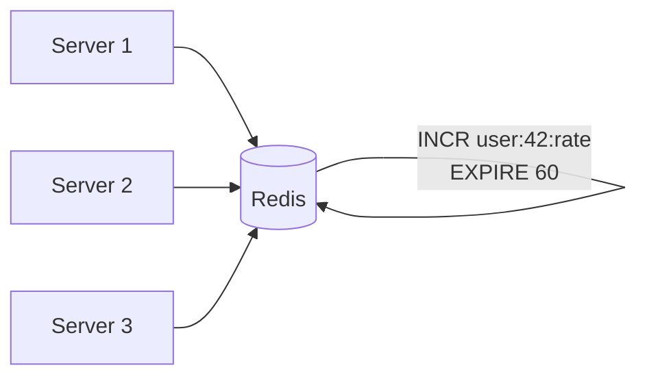

# Chapter 15 - Rate Limiting & Throttling

> Your API goes viral on Hacker News. Traffic spikes 50x in an hour. Without rate limiting, one misbehaving client can take down your entire service - and every other customer with it. Rate limiting isn't optional. It's the seatbelt your API needs before the crash.

📖 [Read on Medium](#) · 🎬 [Watch on YouTube](#) · **Status: COMPLETE**

---

## Why Rate Limiting Matters

Rate limiting controls how many requests a client can make in a given time window. It's one of the few system design patterns that protects you from both attackers and your own customers.

Without rate limiting, three things will ruin your day:

1. **Abuse** - A single bot hammers your login endpoint 10,000 times per second trying password combos
2. **Accidental overload** - A client's retry loop goes haywire and floods your API with duplicate requests
3. **Resource starvation** - One heavy user consumes all your capacity, and everyone else gets timeouts

```
┌──────────────────────────────────────────────────────────┐
│  Without Rate Limiting                                    │
│                                                           │
│  Client A ──[1,000 req/s]──┐                              │
│  Client B ──[5 req/s]──────┤──> API Server ──> Database   │
│  Client C ──[3 req/s]──────┘       │                      │
│                                    │                      │
│  Client A hogs all capacity.       ▼                      │
│  Clients B and C get timeouts.   💀 DOWN                  │
│                                                           │
│  With Rate Limiting (100 req/s per client)                 │
│                                                           │
│  Client A ──[100 req/s]────┐                              │
│  Client B ──[5 req/s]──────┤──> API Server ──> Database   │
│  Client C ──[3 req/s]──────┘       │                      │
│       │                            │                      │
│       └── 900 req/s rejected       ▼                      │
│           with HTTP 429          ✓ HEALTHY                │
└──────────────────────────────────────────────────────────┘
```

Rate limiting is also a business decision. GitHub gives you 5,000 requests per hour for free. Want more? Pay for a higher tier. Stripe limits API calls to protect payment infrastructure. Twitter rate-limits timeline reads to control server costs. The limit isn't just protection - it's product design.

---

## Rate Limiting vs Throttling

People use these interchangeably, but they're different:

| Concept | What It Does | Response |
|---------|-------------|----------|
| **Rate Limiting** | Hard cutoff - rejects requests beyond the limit | HTTP 429 Too Many Requests |
| **Throttling** | Slows down requests instead of rejecting them | Queues or delays responses |

Rate limiting says "no" after the limit. Throttling says "wait." Most production systems use rate limiting because throttling ties up server resources holding connections open.

---

## The Five Algorithms

There are five main approaches to counting requests against a limit. Each makes different trade-offs between memory, accuracy, and burst tolerance.

### 1. Token Bucket

The token bucket is the most widely used algorithm. Tokens accumulate in a bucket at a fixed rate. Each request removes one token. When the bucket is empty, requests are rejected.

```
┌─────────────────────────────────────────────────────┐
│  Token Bucket (capacity: 10, refill: 2 tokens/sec)  │
│                                                      │
│  Time 0s:   [●●●●●●●●●●]  10 tokens (full)         │
│  Burst:     [●●●●●●●○○○]   7 tokens (3 used)       │
│  Time 1s:   [●●●●●●●●●○]   9 tokens (2 refilled)   │
│  Time 2s:   [●●●●●●●●●●]  10 tokens (capped)       │
│                                                      │
│  Key: ● = token available  ○ = empty slot            │
│  Requests without tokens get HTTP 429                │
└─────────────────────────────────────────────────────┘
```

**How it works:**
1. Bucket starts full with `capacity` tokens
2. Every `1/refill_rate` seconds, one token is added (up to capacity)
3. Each request consumes one token
4. If no tokens remain, the request is rejected

**Pros:** Allows bursts up to bucket capacity. Simple. Memory-efficient - just two numbers per user (token count + last refill timestamp).

**Cons:** Choosing the right capacity and refill rate takes tuning.

**Used by:** Amazon API Gateway, Stripe, most cloud providers.

---

### 2. Leaky Bucket

The leaky bucket processes requests at a fixed rate, like water dripping out of a bucket. Incoming requests fill the bucket. If the bucket overflows, requests are dropped.

```
┌───────────────────────────────────────────────────┐
│  Leaky Bucket (capacity: 5, drain: 1 req/sec)     │
│                                                    │
│  Incoming requests fill from the top:              │
│                                                    │
│     req req req                                    │
│      ▼   ▼   ▼                                     │
│    ┌─────────┐                                     │
│    │ ░░░░░░░ │ <- queue (FIFO)                     │
│    │ ░░░░░░░ │                                     │
│    │ ░░░░░░░ │                                     │
│    └────┬────┘                                     │
│         │  drip (1 per second, constant rate)      │
│         ▼                                          │
│      processed                                     │
│                                                    │
│  If bucket is full, new requests are dropped.      │
└───────────────────────────────────────────────────┘
```

**How it works:**
1. Requests enter a FIFO queue (the bucket)
2. The queue drains at a constant rate
3. If the queue is full, new requests are dropped

**Pros:** Smooths out bursty traffic into a steady output rate. Predictable server load.

**Cons:** Burst traffic gets queued or dropped even if the server has capacity. Not great when you want to allow short bursts.

**Used by:** Nginx (`limit_req` with `burst` parameter), network traffic shapers.

---

### 3. Fixed Window Counter

Divide time into fixed windows (e.g., 1-minute blocks). Count requests in the current window. Reject when the count exceeds the limit.

```
┌───────────────────────────────────────────────────────┐
│  Fixed Window (limit: 5 per minute)                    │
│                                                        │
│  Minute 1           Minute 2           Minute 3        │
│  [12:00-12:01]      [12:01-12:02]      [12:02-12:03]  │
│  ┌──────────┐       ┌──────────┐       ┌──────────┐   │
│  │ ████░    │       │ ███░░    │       │ █░░░░    │   │
│  │ 4 req    │       │ 3 req    │       │ 1 req    │   │
│  │ (OK)     │       │ (OK)     │       │ (OK)     │   │
│  └──────────┘       └──────────┘       └──────────┘   │
│                                                        │
│  Problem: boundary burst                               │
│  12:00:59 ──> 5 requests (end of window 1)            │
│  12:01:00 ──> 5 requests (start of window 2)          │
│  = 10 requests in 2 seconds, but both windows pass!   │
└───────────────────────────────────────────────────────┘
```

**How it works:**
1. Divide time into fixed intervals (e.g., each minute)
2. Maintain a counter for the current window
3. Increment on each request; reject if counter exceeds limit
4. Reset counter when the window rolls over

**Pros:** Dead simple. Minimal memory - one counter and one timestamp per key.

**Cons:** The boundary problem is real. A client can send 2x the limit in a burst right at the window boundary. This is the biggest reason people avoid fixed windows in production.

**Used by:** Simple rate-limiting middleware, basic API gateways.

---

### 4. Sliding Window Log

Keep a sorted log of timestamps for each request. When a new request comes in, remove all timestamps older than the window, then check if the log size exceeds the limit.

```
┌───────────────────────────────────────────────────────┐
│  Sliding Window Log (limit: 5 per 60 seconds)          │
│                                                        │
│  Request log for user "alice":                         │
│  [12:00:15, 12:00:23, 12:00:45, 12:01:02, 12:01:10]  │
│                                                        │
│  New request at 12:01:20:                              │
│  1. Remove entries older than 12:00:20                 │
│     -> removes 12:00:15                                │
│  2. Log is now: [12:00:23, 12:00:45, 12:01:02,        │
│                  12:01:10]                              │
│  3. Count = 4, limit = 5 -> ALLOWED                    │
│  4. Add 12:01:20 to log                                │
│                                                        │
│  No boundary problem - window slides continuously.     │
└───────────────────────────────────────────────────────┘
```

**How it works:**
1. Store the timestamp of every request in a sorted set
2. On each new request, remove timestamps outside the window
3. If remaining count < limit, allow the request and add its timestamp
4. Otherwise, reject

**Pros:** Perfectly accurate. No boundary problem. You know exactly how many requests happened in any rolling window.

**Cons:** Memory-hungry. If the limit is 10,000 requests per hour, you're storing 10,000 timestamps per user. Doesn't scale well for high-volume APIs.

**Used by:** Systems where accuracy matters more than memory - fraud detection, financial APIs.

---

### 5. Sliding Window Counter

A hybrid of fixed window and sliding window log. Uses counters from the current and previous windows, weighted by how far into the current window you are.

```
┌────────────────────────────────────────────────────────┐
│  Sliding Window Counter (limit: 100 per minute)         │
│                                                         │
│  Previous window (12:00-12:01): 84 requests            │
│  Current window  (12:01-12:02): 36 requests            │
│  Current time: 12:01:15 (25% into current window)      │
│                                                         │
│  Weighted count = (prev * overlap%) + current           │
│                 = (84 * 75%) + 36                       │
│                 = 63 + 36                               │
│                 = 99                                    │
│                                                         │
│  99 < 100 -> ALLOWED                                   │
│                                                         │
│  This smooths the boundary problem without storing      │
│  individual timestamps. Just two counters per key.      │
└────────────────────────────────────────────────────────┘
```

**How it works:**
1. Keep counters for the current and previous fixed windows
2. On each request, calculate a weighted sum: `previous_count * overlap_percentage + current_count`
3. If the weighted sum exceeds the limit, reject

**Pros:** Almost as accurate as sliding window log, with the memory footprint of fixed window. Best of both worlds.

**Cons:** Slightly approximate - the weighted average assumes requests are evenly distributed in the previous window. In practice, this is close enough.

**Used by:** Cloudflare, Redis-based rate limiters. This is the sweet spot for most production systems.

---

## Algorithm Comparison

| Algorithm | Memory per Key | Boundary Accuracy | Burst Handling | Complexity |
|-----------|---------------|-------------------|----------------|------------|
| **Token Bucket** | 2 values (tokens + timestamp) | N/A (not window-based) | Allows bursts up to capacity | Low |
| **Leaky Bucket** | Queue (up to capacity) | N/A (not window-based) | Smooths bursts to constant rate | Low |
| **Fixed Window** | 2 values (counter + timestamp) | Poor - 2x burst at boundaries | Allows full limit per window | Lowest |
| **Sliding Window Log** | O(n) timestamps per key | Perfect | Exact enforcement | Medium |
| **Sliding Window Counter** | 3 values (2 counters + timestamp) | Near-perfect (~0.003% error) | Weighted smoothing | Low |

**My recommendation:** Use token bucket if you want to allow bursts (most APIs). Use sliding window counter if you want strict per-window limits with low memory. Avoid fixed window in production - the boundary problem is a real exploit vector.

---

## Rate Limiting at Different Layers

You can enforce rate limits at multiple points in your stack. Each layer serves a different purpose.

```
┌──────────────────────────────────────────────────────────┐
│                    Rate Limiting Layers                    │
│                                                           │
│  Client SDK / Mobile App                                  │
│    └── Self-throttle before sending (client-side)         │
│          └── CDN / Edge (Cloudflare, AWS Shield)          │
│                └── Rate limit by IP, block DDoS           │
│                      └── API Gateway (Kong, Envoy)        │
│                            └── Per-API-key limits         │
│                                  └── Application Layer    │
│                                        └── Business rules │
│                                           (per user,      │
│                                            per endpoint)  │
│                                                           │
│  Each layer catches different abuse patterns.             │
│  Layer them - don't rely on just one.                     │
└──────────────────────────────────────────────────────────┘
```

| Layer | What It Catches | Example |
|-------|----------------|---------|
| **Client-side** | Prevents accidental bursts from retries | SDK limits to 10 req/s with backoff |
| **Edge/CDN** | Volumetric DDoS, geographic blocking | Cloudflare blocks 1M+ req/s from single IP |
| **API Gateway** | Per-key limits, plan enforcement | Kong enforces free tier: 100 req/hr |
| **Application** | Business logic limits | Max 5 password attempts per 15 minutes |

Don't rely on client-side limiting alone - it's trivially bypassed. But it's still worth doing because it reduces accidental abuse from well-behaved clients.

---

## HTTP 429 and Rate Limit Headers

When you reject a request, tell the client what happened and when they can retry. The standard response is HTTP 429 Too Many Requests with these headers:

```
HTTP/1.1 429 Too Many Requests
Content-Type: application/json
X-RateLimit-Limit: 100
X-RateLimit-Remaining: 0
X-RateLimit-Reset: 1672531261
Retry-After: 30

{
  "error": "rate_limit_exceeded",
  "message": "Rate limit of 100 requests per minute exceeded.",
  "retry_after": 30
}
```

| Header | Meaning | Example |
|--------|---------|---------|
| `X-RateLimit-Limit` | Max requests allowed in the window | 100 |
| `X-RateLimit-Remaining` | Requests left in the current window | 0 |
| `X-RateLimit-Reset` | Unix timestamp when the window resets | 1672531261 |
| `Retry-After` | Seconds until the client should retry | 30 |

Send these headers on every response, not just 429s. Clients need visibility into their remaining quota before they hit the limit - not after.

---

## What to Limit By

Different identifiers catch different abuse patterns. Most systems use a combination.

| Identifier | Good For | Pitfall |
|------------|----------|---------|
| **IP Address** | Unauthenticated endpoints, brute-force prevention | NAT - thousands of users share one IP behind corporate networks |
| **API Key** | Per-customer limits, plan enforcement | Key sharing, stolen keys |
| **User ID** | Authenticated per-user limits | Doesn't stop unauthenticated abuse |
| **Endpoint** | Protecting expensive operations | Doesn't distinguish between users |
| **Composite** (user + endpoint) | Granular control | More keys to track, higher memory |

The NAT problem is worth calling out. If you rate-limit by IP alone, you'll accidentally block entire office buildings, university campuses, and mobile carrier networks. Always combine IP limiting with authenticated limits where possible.

---

## Distributed Rate Limiting

Rate limiting on a single server is easy - just keep counters in memory. The hard part is making it work across multiple servers.

```
┌────────────────────────────────────────────────────────┐
│  The Distributed Problem                                │
│                                                         │
│  Limit: 100 requests per minute per user                │
│                                                         │
│  Without coordination:                                  │
│  Server 1 sees 80 requests  -> allows all (< 100)      │
│  Server 2 sees 70 requests  -> allows all (< 100)      │
│  Total: 150 requests allowed - limit violated!          │
│                                                         │
│  With centralized counter (Redis):                      │
│  Server 1 checks Redis -> 80 total -> allows           │
│  Server 2 checks Redis -> 81 total -> allows           │
│  Request 101 -> Redis says 100 -> REJECTED             │
└────────────────────────────────────────────────────────┘
```

### Approach 1: Centralized Store (Redis)

Every server checks and increments a shared counter in Redis. This is the most common approach.



**Pros:** Accurate, consistent, simple to implement with Redis INCR + EXPIRE.

**Cons:** Redis becomes a single point of failure. Every request adds a network round-trip to Redis (~1ms). At 100K req/s, that's 100K Redis operations per second.

### Approach 2: Local Counters with Sync

Each server maintains local counters and periodically syncs with a central store. This trades accuracy for performance.

**Pros:** No per-request network hop. Faster.

**Cons:** Inaccurate during sync gaps. A user could exceed the limit by the sync delay multiplied by the number of servers.

### Approach 3: Sticky Sessions

Route all requests from a given client to the same server. Each server rate-limits independently.

**Pros:** No coordination needed. Simple.

**Cons:** Uneven load distribution. If one server goes down, its clients get new limits on another server.

**My recommendation:** Use Redis for most cases. The 1ms overhead is negligible compared to API response times, and the accuracy is worth it. Use local counters only if you're operating at massive scale (hundreds of thousands of requests per second) where Redis becomes the bottleneck.

---

## Real-World Rate Limits

| Service | Limit | Window | Notes |
|---------|-------|--------|-------|
| **GitHub API** | 5,000 | Per hour | Authenticated. 60/hr for unauthenticated |
| **Twitter/X API** | 300 | Per 15 min | Per-endpoint limits, varies by tier |
| **Stripe API** | 100 | Per second | Per-key, higher for live mode |
| **Google Maps API** | 50 | Per second | Per-project, 30K per day |
| **OpenAI API** | Varies | Per minute | Token-based + request-based limits |
| **AWS API Gateway** | 10,000 | Per second | Configurable per stage |
| **Discord API** | 50 | Per second | Global + per-route buckets |

Notice the variety - per second, per minute, per hour. The window size depends on the resource cost of each API call. Stripe limits per second because each call potentially moves money. GitHub limits per hour because most calls are cheap reads.

---

## Rate Limiting in System Design Interviews

When rate limiting comes up in interviews, interviewers care about these things:

1. **Algorithm choice and trade-offs** - Don't just pick one. Explain why token bucket fits better than fixed window for an API that needs burst tolerance.

2. **Distributed coordination** - "Where do you store the counters?" is the real question. Redis is the default answer, but know the trade-offs.

3. **What to limit by** - IP, user ID, API key, or all three? Discuss the NAT problem.

4. **Failure modes** - What happens when Redis is down? Fail open (allow all) or fail closed (reject all)? Most systems fail open because a brief period without rate limiting is better than a total outage.

5. **Race conditions** - Two servers read the counter as 99, both increment to 100, but the real count is 101. Solve with Redis INCR (atomic) or Lua scripts.

```
Fail Open vs Fail Closed:

  Redis is down. What do you do?

  Fail Open:  Allow all requests through.
              Risk: temporary abuse.
              Benefit: service stays up.

  Fail Closed: Reject all requests.
               Risk: total outage for everyone.
               Benefit: guaranteed protection.

  Most production systems fail open. A few seconds without
  rate limiting rarely causes permanent damage. A total
  outage always does.
```

---

## Common Pitfalls

| Pitfall | Why It Hurts | Fix |
|---------|-------------|-----|
| Rate limiting by IP only | Blocks entire offices behind NAT | Combine IP + API key + user ID |
| No rate limit headers | Clients can't self-regulate | Always send X-RateLimit-* headers |
| Fixed window in production | 2x burst at boundaries is exploitable | Use sliding window counter or token bucket |
| Same limit for all endpoints | Login attempt and GET /status have different costs | Per-endpoint limits weighted by cost |
| Not rate limiting internal services | Service-to-service calls can cascade | Rate limit between microservices too |
| Hard-coded limits | Can't adjust without redeployment | Store limits in config or database |
| No monitoring on 429 responses | You don't know who's being throttled | Alert on 429 spikes, track by client |
| Fail closed on store failure | Redis outage becomes total outage | Fail open with local fallback counters |

---

## Key Takeaways

1. **Token bucket is the default choice** - it handles bursts gracefully and uses minimal memory. Start here unless you have a specific reason not to.

2. **Sliding window counter is the accurate choice** - near-perfect accuracy with only three values per key. Use it when you need strict window-based limits.

3. **Never use fixed window in production** - the boundary problem lets attackers send 2x your limit in a short burst. It's a known exploit.

4. **Use Redis for distributed rate limiting** - atomic INCR + EXPIRE is simple, fast, and accurate. The 1ms latency is worth the consistency.

5. **Layer your defenses** - edge, gateway, and application-level rate limiting catch different attack patterns. Don't rely on just one.

6. **Send rate limit headers on every response** - clients need to know their remaining quota before they hit the wall.

7. **Fail open when your rate limit store is down** - a few seconds without rate limiting beats a total outage.

---

## What's Next?

- **Chapter 16:** [Circuit Breaker & Retry Patterns](../16-circuit-breaker/) - What happens when the service you're calling is down? Circuit breakers prevent cascading failures, and retry patterns determine how aggressively you try again.
- **Chapter 17:** [Disaster Recovery & Backup Strategies](../17-disaster-recovery/) - Rate limiting protects against traffic spikes, but what about hardware failures, data corruption, and entire region outages?
