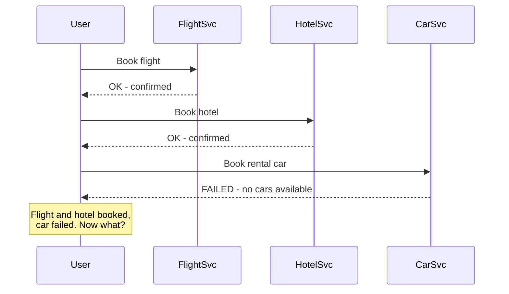
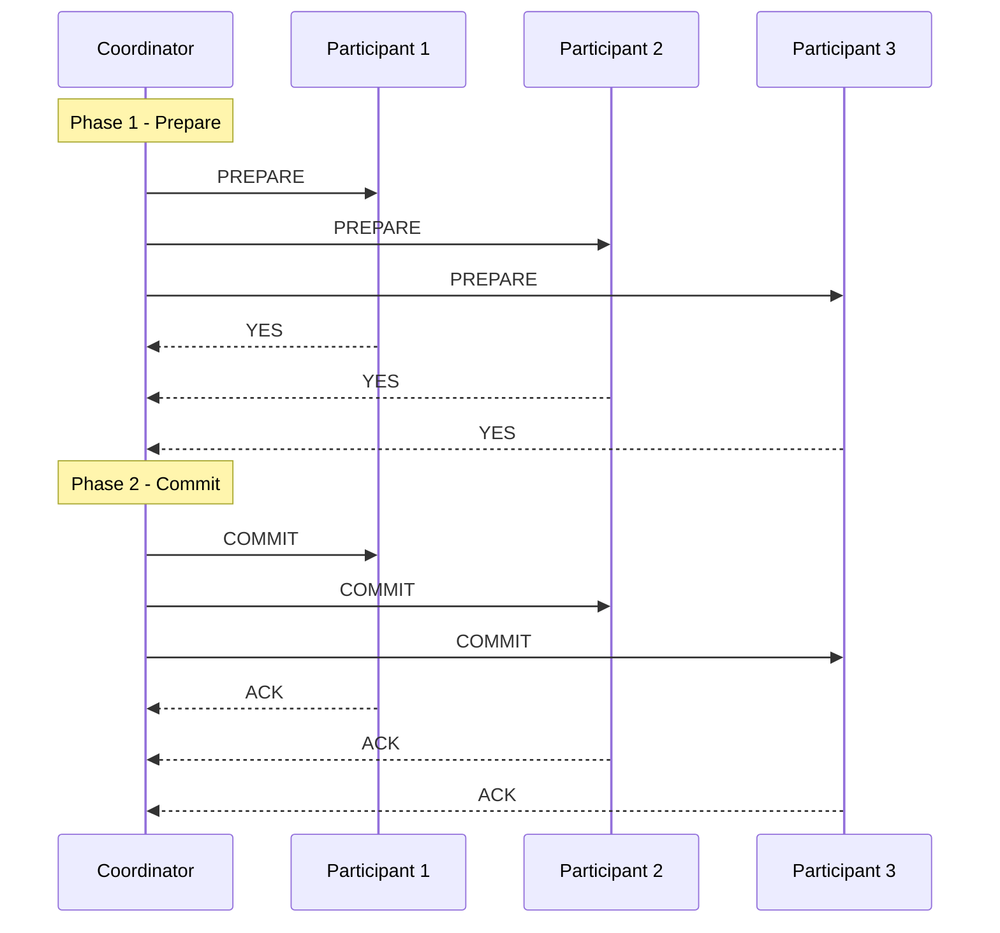
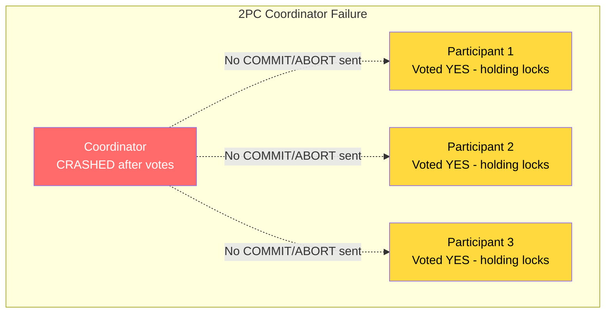
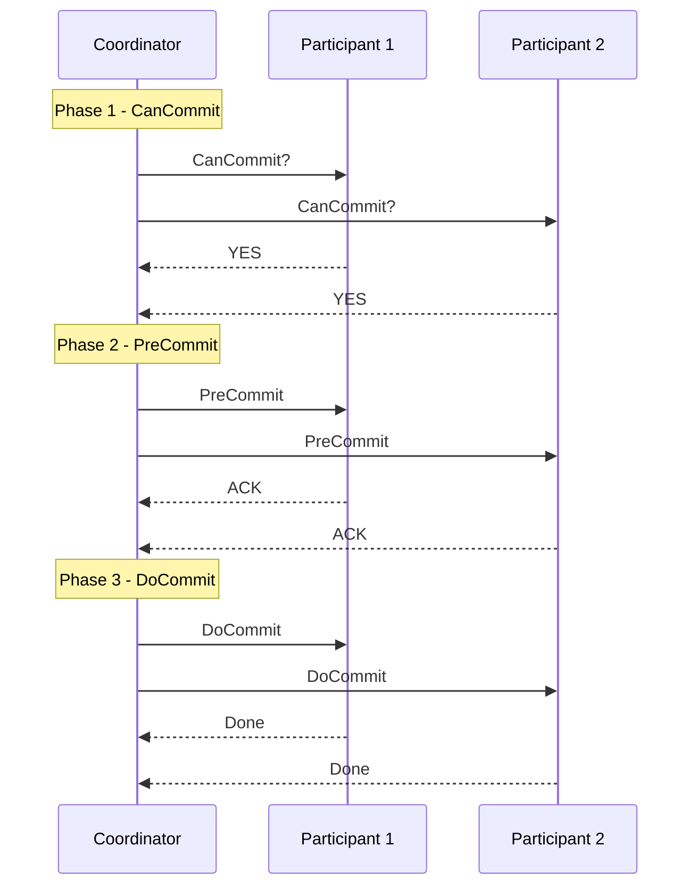
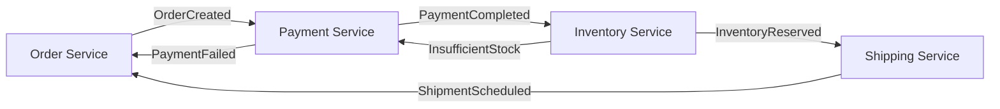
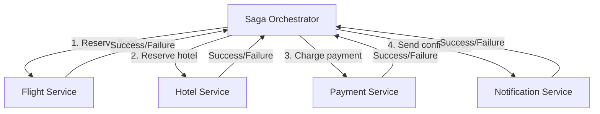
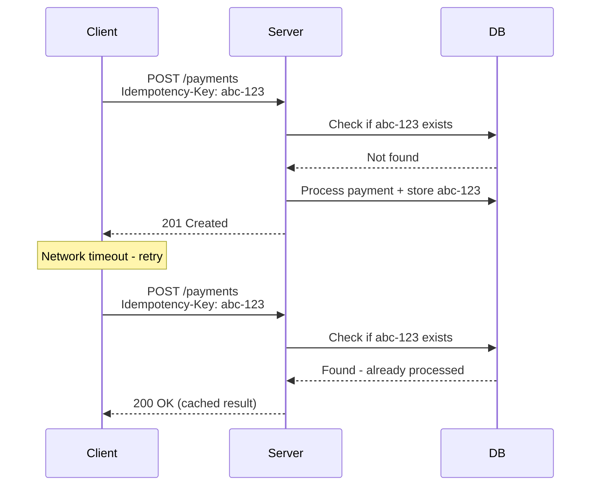
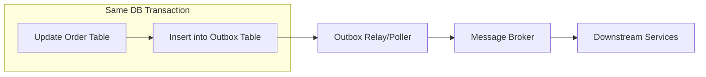

# Chapter 19 - Distributed Transactions

> A single database transaction is easy. Coordinating writes across multiple services without losing data or corrupting state - that's where distributed systems earn their reputation.

📖 [Read on Medium](#) · 🎬 [Watch on YouTube](#)

---

## Why Distributed Transactions Are Hard

In a monolith with one database, you wrap everything in a transaction and call it a day. ACID guarantees handle the rest. But the moment you split into microservices - each with its own database - you lose that safety net.

Consider booking a trip: you need to reserve a flight, a hotel, and a rental car. Three services, three databases. If the hotel confirms but the flight fails, you've got a partial booking that nobody wants.



The core problem: **there's no global transaction manager that can atomically commit across independent databases.** Networks fail. Services crash. Timeouts happen. You need a strategy that accounts for partial failures.

---

## Two-Phase Commit (2PC)

Two-Phase Commit is the classic answer to distributed transactions. A central **coordinator** asks all **participants** to prepare, waits for votes, then tells everyone to commit or abort.

### Phase 1 - Prepare (Voting)

The coordinator sends a `PREPARE` message to every participant. Each participant:

1. Validates the operation locally
2. Acquires locks and writes to a WAL (write-ahead log)
3. Responds `YES` (ready to commit) or `NO` (can't do it)

### Phase 2 - Commit or Abort

- If **all** participants voted `YES` - coordinator sends `COMMIT`
- If **any** participant voted `NO` - coordinator sends `ABORT`



### The 2PC Coordinator Failure Problem

Here's the critical flaw: **if the coordinator crashes after collecting votes but before sending COMMIT/ABORT, every participant is stuck.** They've acquired locks, written to their WAL, and they're waiting for a decision that may never come.

This is called the **blocking problem**. Participants can't safely commit (maybe another participant voted NO) and can't safely abort (maybe the coordinator already told others to commit). They hold their locks and wait, potentially forever.



| Scenario | What Happens | Impact |
|----------|-------------|--------|
| Coordinator crashes before PREPARE | Participants never hear about it | Safe - nothing to undo |
| Coordinator crashes after PREPARE, before decision | Participants stuck holding locks | **Blocking - resources locked** |
| Coordinator crashes after sending some COMMITs | Some committed, some uncertain | **Inconsistent state possible** |
| Participant crashes after voting YES | Coordinator still decides | Participant recovers from WAL |

**Bottom line:** 2PC guarantees safety (no inconsistency if everyone follows protocol) but not liveness (the system can get stuck). That's why it's rarely used across wide-area networks or microservices.

### Where 2PC Actually Works

2PC is fine when the coordinator and participants are close together and reliable:

- **Within a single data center** between tightly coupled databases
- **XA transactions** in Java/JEE connecting to multiple databases
- **Database internals** - most databases use 2PC internally for cross-shard writes
- **Google Spanner** uses a variation of 2PC with TrueTime for global transactions

---

## Three-Phase Commit (3PC)

3PC was designed to fix the blocking problem by adding a **pre-commit phase** between voting and committing.

### The Three Phases

1. **CanCommit** - Coordinator asks "can you commit?" (same as 2PC prepare)
2. **PreCommit** - If all said yes, coordinator sends "get ready to commit" - participants acknowledge
3. **DoCommit** - Coordinator sends the final "commit now"

The key difference: if the coordinator dies during Phase 2, participants know that everyone voted YES (otherwise they wouldn't have received PreCommit). They can elect a new coordinator and proceed.



### Why 3PC Isn't Popular

In theory, 3PC solves the blocking problem. In practice, it has its own issues:

- **Network partitions** can still cause inconsistency - one group commits while another aborts
- **More round trips** means higher latency (3 phases vs 2)
- **More complex** to implement correctly
- The Saga pattern solves the same problem more practically for microservices

Most distributed systems skip 3PC entirely and jump to Sagas or eventual consistency.

---

## The Saga Pattern

Sagas take a fundamentally different approach. Instead of trying to make a distributed transaction look atomic, you break it into a **sequence of local transactions**. Each step commits immediately to its own database. If a later step fails, you run **compensating transactions** to undo previous steps.

This is how the real world works. If you book a flight and then can't get a hotel, you cancel the flight. You don't try to hold both in a pending state.

### Compensating Transactions

Every forward action needs a matching undo action:

| Step | Forward Action | Compensating Action |
|------|---------------|-------------------|
| 1 | Reserve flight | Cancel flight reservation |
| 2 | Reserve hotel | Cancel hotel reservation |
| 3 | Charge payment | Refund payment |
| 4 | Send confirmation | Send cancellation email |

Compensating transactions aren't true rollbacks. They're new transactions that semantically undo the effect. A refund isn't the same as "the charge never happened" - it's a new credit that cancels it out. This distinction matters for audit trails and accounting.

### Choreography vs Orchestration

There are two ways to coordinate a Saga:

#### Choreography - Event-Driven

Each service publishes events and reacts to events from others. No central coordinator. Services are loosely coupled but the transaction flow is implicit in the event chain.



**Choreography pros:**
- Services are decoupled - they don't know about each other directly
- Easy to add new steps (just subscribe to events)
- No single point of failure

**Choreography cons:**
- Hard to understand the full transaction flow (it's scattered across services)
- Debugging failures means tracing events across services
- Cyclic dependencies can sneak in
- Difficult to implement complex compensation logic

#### Orchestration - Central Controller

An **orchestrator** explicitly controls the transaction flow. It tells each service what to do and handles failures by triggering compensations.



**Orchestration pros:**
- Transaction flow is explicit and readable in one place
- Easier to test - you can unit test the orchestrator
- Simpler to add complex conditional logic
- Clear ownership of the transaction

**Orchestration cons:**
- Orchestrator is a single point of failure (mitigated with replication)
- Risk of putting too much logic in the orchestrator (becomes a "god service")
- Services are coupled to the orchestrator's API

### Choreography vs Orchestration - When to Pick Which

| Factor | Choreography | Orchestration |
|--------|-------------|--------------|
| Number of steps | 2-4 steps | 4+ steps |
| Compensation complexity | Simple rollbacks | Complex conditional logic |
| Team structure | Independent teams per service | Shared ownership or dedicated team |
| Visibility | Harder to trace | Easy to monitor and debug |
| Coupling | Loose (event-based) | Tighter (orchestrator knows all services) |
| Real-world analogy | Jazz improvisation | Orchestra with a conductor |

**My recommendation:** Start with orchestration for anything beyond trivial flows. The debuggability alone is worth the trade-off. Choreography sounds elegant but becomes a nightmare when you're tracing a failed transaction across eight services at 3 AM.

---

## Idempotency

Distributed transactions will have retries. Networks are unreliable. Messages get delivered more than once. Your services **must** handle duplicate messages gracefully.

An operation is idempotent if calling it multiple times produces the same result as calling it once.

```
# Idempotent - safe to retry
PUT /users/123 {"name": "Alice"}    -- always sets name to Alice
DELETE /orders/456                   -- deleting twice is fine

# NOT idempotent - dangerous to retry
POST /payments {"amount": 50}        -- creates a new payment each time
POST /orders/456/increment-quantity  -- adds 1 every call
```

### Idempotency Keys

The standard pattern: clients generate a unique **idempotency key** per logical operation and send it with every request (including retries). The server checks if it's already processed that key.



Stripe, PayPal, and every serious payment API uses idempotency keys. If you're building anything that handles money, this isn't optional.

---

## The Transactional Outbox Pattern

Here's a subtle problem: your service needs to update its database AND publish an event. These are two separate operations. If the database write succeeds but the event publish fails, downstream services never hear about the change. If you publish first and the database write fails, you've broadcast a lie.

The **outbox pattern** solves this by writing the event to an outbox table in the **same database transaction** as the business data. A separate process (relay/poller) reads the outbox and publishes events.



### How It Works

1. Service receives a request
2. In a **single database transaction**: update business table + insert event row into outbox table
3. Transaction commits atomically - both succeed or both fail
4. A background poller reads unpublished events from the outbox
5. Poller publishes to the message broker (Kafka, RabbitMQ, etc.)
6. On successful publish, mark the outbox row as sent

| Component | Role |
|-----------|------|
| Outbox table | Stores events alongside business data in the same DB |
| Relay/poller | Reads outbox, publishes to message broker |
| Message broker | Delivers events to downstream consumers |
| Idempotency check | Consumers deduplicate since relay may publish twice |

### CDC as an Alternative

Instead of polling the outbox table, you can use **Change Data Capture** (CDC). Tools like Debezium read the database's transaction log directly and publish changes as events. Same concept, different mechanism - no polling delay, no extra table queries.

---

## Eventual Consistency in Practice

When you abandon distributed transactions in favor of Sagas and events, you're accepting **eventual consistency**. The system won't be consistent at every instant, but it will converge to a consistent state.

This sounds scary, but it's how most real-world systems already work:

- Your bank balance takes days to reflect a check deposit
- Amazon shows "in stock" even if the last unit just sold
- Social media feeds are seconds behind reality

### Making Eventual Consistency Tolerable

| Technique | How It Helps |
|-----------|-------------|
| Optimistic UI | Show the expected result immediately, reconcile later |
| Read-your-writes | Route reads to the same replica that handled the write |
| Causal consistency | Ensure cause-before-effect ordering (comments appear after posts) |
| Compensation UI | Show pending states ("Payment processing...") |
| Reconciliation jobs | Periodic batch jobs that fix inconsistencies |

---

## Comparison - 2PC vs Saga vs Eventual Consistency

| Property | 2PC | Saga (Orchestrated) | Saga (Choreographed) | Eventual Consistency |
|----------|-----|--------------------|--------------------|---------------------|
| Consistency | Strong | Eventual with compensations | Eventual with compensations | Eventual |
| Isolation | Full (locks held) | None (intermediate states visible) | None | None |
| Latency | High (2 round trips + locks) | Medium (sequential steps) | Low (parallel events) | Lowest |
| Availability | Low (coordinator is SPOF) | Medium | High | Highest |
| Complexity | Medium | Medium-High | High (hidden complexity) | Low |
| Failure recovery | Coordinator WAL | Orchestrator retries + compensations | Event replay + compensations | Idempotent retries |
| Best for | Single data center, tight coupling | Multi-service workflows | Simple event chains | Independent services |

---

## Real-World Examples

### Uber - Trip Lifecycle

Uber uses an orchestrated Saga for trip management:

1. **Match rider to driver** - Matching service
2. **Start trip** - Trip service records it
3. **Calculate fare** - Pricing service
4. **Charge rider** - Payment service
5. **Pay driver** - Payment service

If payment fails, compensating transactions cancel the trip and adjust driver earnings. Uber built **Cadence** (now Temporal) specifically to manage these long-running workflows.

### Airbnb - Booking Flow

When you book on Airbnb:

1. **Hold dates** - Calendar service marks dates tentatively
2. **Charge guest** - Payment service processes payment
3. **Confirm booking** - Booking service finalizes
4. **Notify host** - Notification service

If payment fails after dates are held, a compensating transaction releases the dates. Airbnb uses idempotency keys on every payment operation so retries don't double-charge guests.

### Shopify - Order Processing

Shopify's order flow spans inventory, payments, shipping, and notifications. They use the outbox pattern to ensure that when an order is created in the database, the corresponding event always makes it to their event bus. No silent failures.

---

## Common Pitfalls

### 1. Using 2PC Across Microservices

2PC was designed for databases in the same data center, not for services communicating over HTTP. The blocking problem combined with network unreliability makes this a recipe for cascading failures.

### 2. Forgetting Compensation Semantics

Not every action has a clean undo. You can't "unsend" an email or "unship" a package. Design your Saga steps so that compensations are possible at each stage, or accept that some steps are non-compensatable and plan accordingly.

### 3. Ignoring Idempotency

"We'll deal with duplicates later" - famous last words. Build idempotency in from day one. Every message handler, every API endpoint that mutates state needs to handle being called twice with the same input.

### 4. No Observability

Distributed transactions are hard to debug. You need:
- **Correlation IDs** that follow the transaction across all services
- **Distributed tracing** (Jaeger, Zipkin) to visualize the flow
- **Dead letter queues** for failed events
- **Saga state dashboards** showing in-progress, completed, and compensating transactions

### 5. Mixing Patterns

Don't use 2PC for some services and Sagas for others within the same logical transaction. Pick one approach and stick with it. Mixing creates consistency models that are nearly impossible to reason about.

---

## Key Takeaways

1. **2PC gives you strong consistency but kills availability** - use it within data centers, not across services
2. **Sagas trade consistency for availability** - you accept intermediate states in exchange for resilience
3. **Orchestration beats choreography for complex flows** - the debuggability is worth the coupling
4. **Idempotency isn't optional** - every service in a distributed transaction must handle retries
5. **The outbox pattern solves the dual-write problem** - never update a DB and publish an event as separate operations
6. **Eventual consistency is a feature, not a bug** - most business processes are already eventually consistent

---

## What's Next?

- **Chapter 20:** [Consistent Hashing](../20-consistent-hashing/) - How to distribute data across nodes evenly and handle nodes joining or leaving
- **Chapter 21:** [Bloom Filters & Probabilistic Data Structures](../21-bloom-filters/) - Space-efficient data structures that trade exactness for speed
- **Chapter 22:** [Clocks & Ordering](../22-clocks-ordering/) - Lamport clocks, vector clocks, and why wall clocks lie in distributed systems
