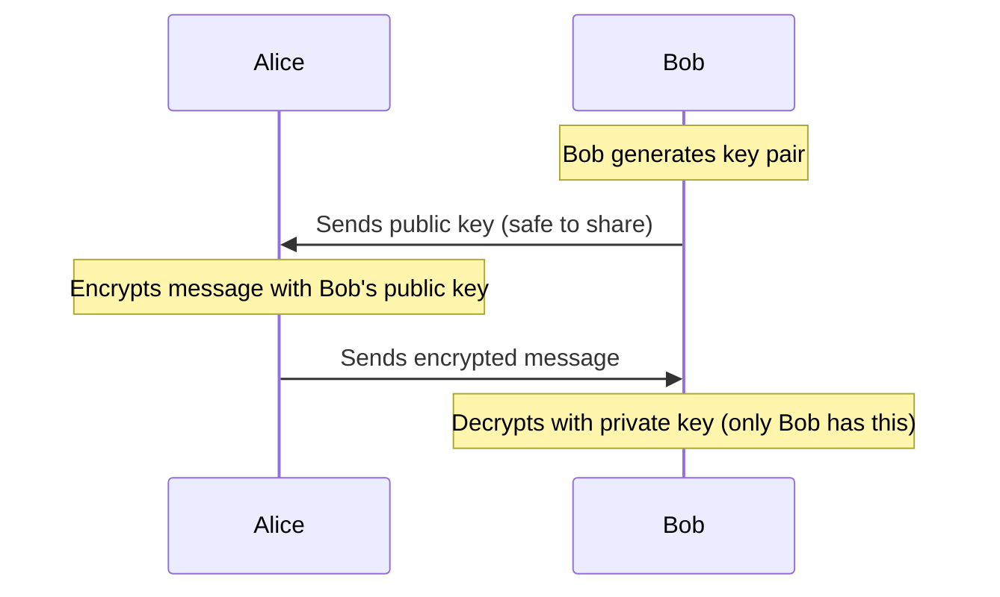
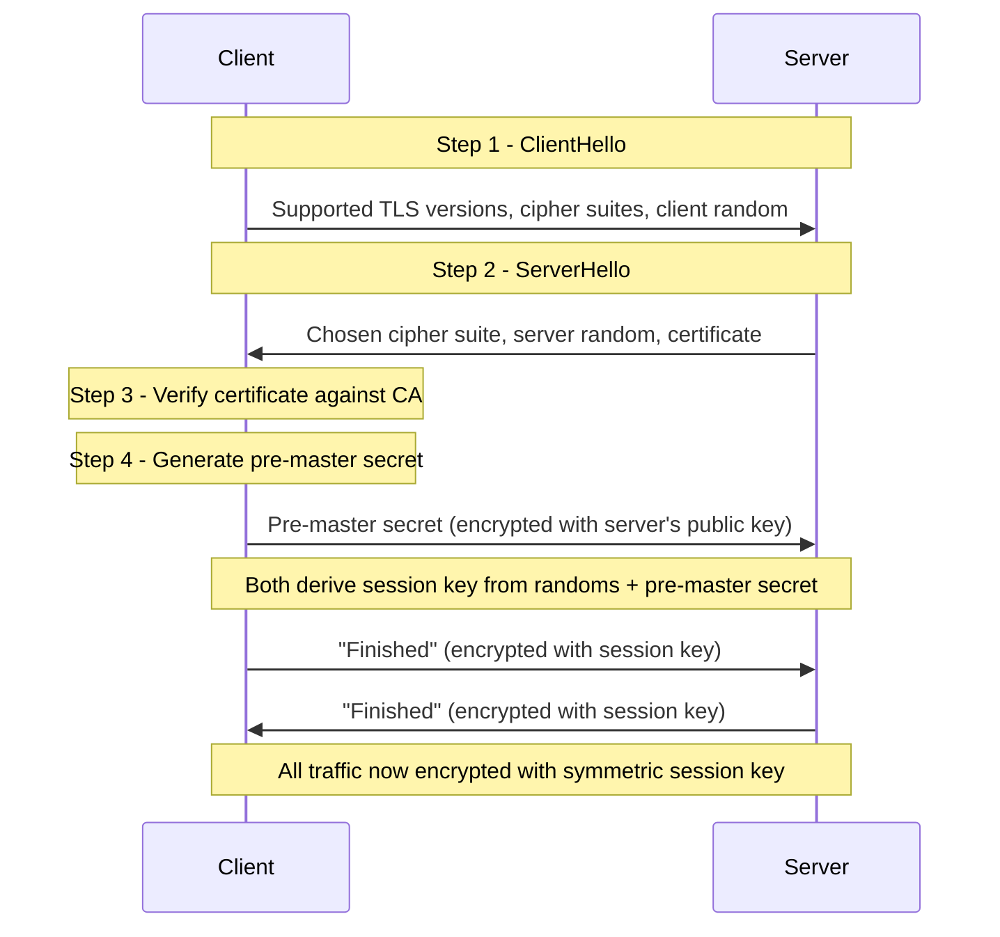
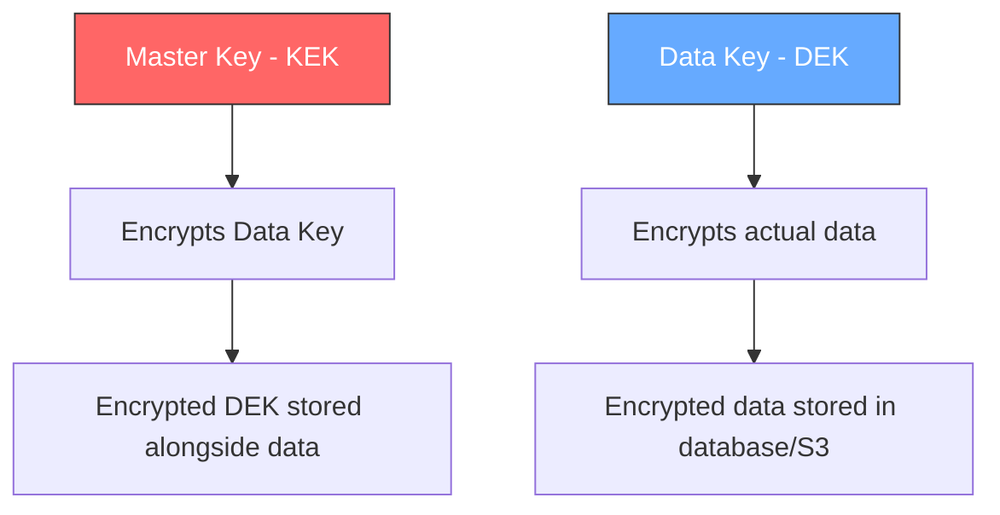
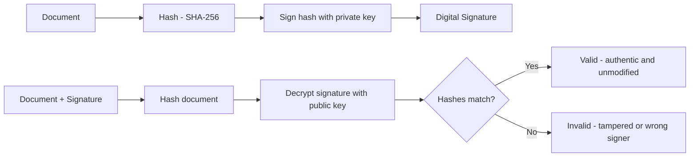
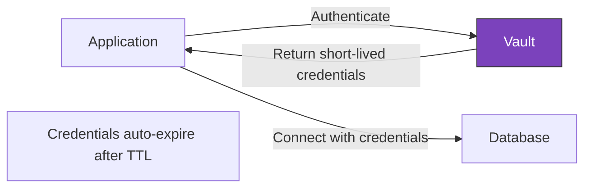
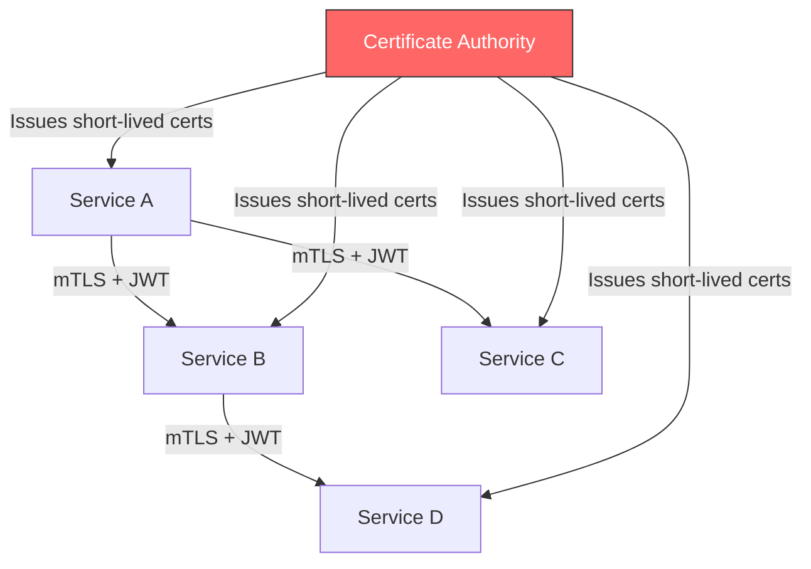

# Chapter 29 - Encryption & Data Security

> Every byte your system touches is either protected or exposed. There's no middle ground.

📖 [Read on Medium](#) · 🎬 [Watch on YouTube](#)

---

## Why Encryption Matters for System Design

You can nail sharding, caching, and load balancing - but if someone intercepts your database traffic in plaintext, none of that matters. Encryption isn't a feature you bolt on at the end. It's a foundational design decision that affects your architecture, performance, key management strategy, and compliance posture.

This chapter covers the encryption primitives you'll actually use in production systems, how TLS protects data in transit, how envelope encryption protects data at rest, and the key management patterns that make or break real deployments.

---

## Encryption vs Hashing - Know the Difference

People confuse these constantly. They're fundamentally different operations.

| Property | Encryption | Hashing |
|----------|-----------|---------|
| Reversible? | Yes (with the key) | No (one-way) |
| Output size | Proportional to input | Fixed size |
| Purpose | Confidentiality | Integrity / verification |
| Key required? | Yes | No (but HMAC uses a key) |
| Example use | Encrypting a credit card number | Storing a password |

**Encryption** turns plaintext into ciphertext that can be reversed with the correct key. **Hashing** produces a fixed-size digest that can't be reversed - you can only verify by hashing the same input again and comparing.

If you're storing passwords, you hash. If you're storing credit card numbers you need to retrieve later, you encrypt. Get this wrong and you'll either have an irreversible mess or a security vulnerability.

---

## Symmetric Encryption

Symmetric encryption uses the same key for both encryption and decryption. It's fast - roughly 100-1000x faster than asymmetric encryption - which makes it the workhorse for bulk data encryption.

### AES (Advanced Encryption Standard)

AES is the standard. When someone says "we encrypt the data," they almost certainly mean AES. It operates on fixed-size blocks (128 bits) and supports key sizes of 128, 192, or 256 bits.

```
Plaintext: "user credit card 4111-1111-1111-1111"
     |
     v
  AES-256 + Key (32 bytes)
     |
     v
Ciphertext: "a7f3b2c1e8d9..." (unreadable)
     |
     v
  AES-256 + Same Key
     |
     v
Plaintext: "user credit card 4111-1111-1111-1111"
```

### AES Modes That Matter

Not all AES modes are equal. Pick the wrong one and your "encrypted" data leaks patterns.

| Mode | Use Case | Pitfall |
|------|----------|---------|
| ECB | Never use this | Identical blocks produce identical ciphertext - leaks patterns |
| CBC | Legacy systems | Needs IV, vulnerable to padding oracle attacks |
| GCM | Modern standard | Authenticated encryption - integrity + confidentiality |
| CTR | Streaming data | No authentication by itself - pair with HMAC |

**Use AES-256-GCM.** It gives you authenticated encryption - meaning it detects if someone tampers with the ciphertext. If you're starting a new system, there's no reason to pick anything else.

### The Key Problem

Symmetric encryption has one brutal constraint: both parties need the same key. How do you securely share a secret key with someone you've never met? You can't encrypt it - that's circular. This is the key distribution problem, and it's why asymmetric encryption exists.

---

## Asymmetric Encryption

Asymmetric encryption uses a key pair: a public key (shareable with anyone) and a private key (kept secret). Data encrypted with the public key can only be decrypted with the private key, and vice versa.



### RSA

RSA is the most widely deployed asymmetric algorithm. Key sizes are typically 2048 or 4096 bits. It's secure but slow - you'd never encrypt a gigabyte file with RSA directly.

**Performance reality check:**

| Operation | AES-256 | RSA-2048 |
|-----------|---------|----------|
| Encrypt 1 KB | ~1 microsecond | ~1 millisecond |
| Throughput | ~1 GB/s | ~1 MB/s |
| Key size | 32 bytes | 256+ bytes |

That's a 1000x speed difference. This is why real systems use asymmetric encryption to exchange symmetric keys, then switch to symmetric encryption for the actual data. This hybrid approach gives you the best of both worlds.

---

## TLS/SSL - Encryption in Transit

TLS (Transport Layer Security) is how the internet encrypts data in transit. Every HTTPS connection uses TLS. It's the most important encryption protocol you'll interact with as a system designer.

### The TLS Handshake

The TLS handshake is a masterpiece of applied cryptography. It solves key exchange, server authentication, and cipher negotiation in a few round trips.



**Key insight:** TLS uses asymmetric encryption exactly once - to exchange the symmetric session key. After that, everything runs on fast symmetric encryption. This is the hybrid approach in action.

### TLS 1.3 vs 1.2

TLS 1.3 (released 2018) is a significant improvement:

| Feature | TLS 1.2 | TLS 1.3 |
|---------|---------|---------|
| Handshake round trips | 2 | 1 |
| 0-RTT resumption | No | Yes |
| Weak ciphers allowed | Yes | No |
| Forward secrecy | Optional | Mandatory |

TLS 1.3 removed all the legacy cruft - no more RSA key exchange (Diffie-Hellman only), no more CBC mode, no more MD5/SHA-1. If you're configuring a new service, mandate TLS 1.3 minimum.

### mTLS (Mutual TLS)

Standard TLS only authenticates the server. The client verifies the server's certificate, but the server doesn't verify the client. mTLS fixes this - both sides present certificates.

This matters for service-to-service communication. When your payment service talks to your order service, you want both sides authenticated. Service meshes like Istio and Linkerd automate mTLS between all services in your cluster.

---

## Encryption at Rest

Data at rest means data stored on disk - databases, object stores, file systems. Encrypting it protects against physical theft, unauthorized disk access, and certain classes of backup exposure.

### Full Disk Encryption (FDE)

The simplest form. The entire disk is encrypted with a single key. AWS EBS volumes, Azure Managed Disks, and GCP Persistent Disks all support this transparently.

**Limitation:** FDE protects against someone stealing the physical disk. It does not protect against a compromised application reading data through the normal OS path - the OS decrypts transparently for any process with read access.

### Application-Level Encryption

Encrypt specific fields before they hit the database. A compromised database server can't read encrypted fields because the decryption key lives in the application layer.

```
User table:
| id | name      | email              | ssn_encrypted          |
|----|-----------|--------------------|-----------------------|
| 1  | Alice     | alice@example.com  | AES(123-45-6789, key) |
| 2  | Bob       | bob@example.com    | AES(987-65-4321, key) |
```

The tradeoff: you lose the ability to query encrypted fields directly. You can't do `WHERE ssn = '123-45-6789'` because the database only sees ciphertext. Solutions include deterministic encryption (same input always produces same ciphertext - queryable but leaks equality) or blind indexing.

---

## Envelope Encryption

Envelope encryption is how every major cloud provider handles encryption at rest. It's the pattern you'll use in any serious production system.

The idea: don't encrypt data directly with your master key. Instead, generate a unique data encryption key (DEK) for each piece of data, encrypt the data with the DEK, then encrypt the DEK with your master key (KEK).



### Why Not Just Use the Master Key Directly?

Three reasons:

1. **Blast radius.** If a DEK is compromised, only that one piece of data is exposed. Rotate just that DEK.
2. **Performance.** The master key can live in an HSM (Hardware Security Module) that's slow but ultra-secure. DEKs are fast AES keys that live in memory during processing.
3. **Key rotation.** Rotating the master key means re-encrypting DEKs (small, fast). Rotating without envelope encryption means re-encrypting all your data (massive, slow).

### AWS KMS Envelope Encryption Flow

```
1. App calls KMS: "Generate a data key"
2. KMS returns: plaintext DEK + encrypted DEK (encrypted under your CMK)
3. App encrypts data with plaintext DEK
4. App stores encrypted data + encrypted DEK together
5. App discards plaintext DEK from memory

To decrypt:
1. App sends encrypted DEK to KMS
2. KMS decrypts DEK using CMK, returns plaintext DEK
3. App decrypts data with plaintext DEK
4. App discards plaintext DEK from memory
```

The master key (CMK) never leaves KMS. It never touches your application servers. That's the security win.

---

## Hashing Deep Dive

### Cryptographic Hash Functions

A good hash function is:
- **Deterministic** - same input always produces same output
- **Fast to compute** - but not too fast (see bcrypt below)
- **Avalanche effect** - changing one bit of input changes ~50% of output bits
- **Pre-image resistant** - can't derive input from output
- **Collision resistant** - infeasible to find two inputs with the same hash

### SHA-256

The workhorse hash function. Used in TLS certificates, Bitcoin, Git commits, file integrity checks, and about a million other things. Produces a 256-bit (32-byte) digest.

```
SHA-256("hello") = 2cf24dba5fb0a30e26e83b2ac5b9e29e1b161e5c1fa7425e73043362938b9824
SHA-256("hello.") = 3338c3c01e8e8bffc3bce827e4e1c1e73ce6b63c42ee6e897e5e0f87372e5e0f
```

One extra character completely changes the output. That's the avalanche effect.

### HMAC (Hash-Based Message Authentication Code)

HMAC combines a hash function with a secret key. It proves both integrity (data wasn't modified) and authenticity (data came from someone with the key).

```
HMAC-SHA256(key, message) = hash
```

Use cases: API authentication (AWS Signature V4), webhook verification (Stripe, GitHub), JWT signatures.

**HMAC vs plain hash:** Anyone can compute SHA-256 of a message. Only someone with the secret key can compute the correct HMAC. That's the difference between "this data hasn't been modified" and "this data hasn't been modified AND came from a trusted source."

### Password Hashing - bcrypt, scrypt, Argon2

Regular hash functions are designed to be fast. That's terrible for passwords - an attacker with a GPU can try billions of SHA-256 hashes per second.

Password hashing functions are intentionally slow:

| Algorithm | Speed (per hash) | Memory Usage | Recommended? |
|-----------|-----------------|--------------|-------------|
| MD5 | ~1 ns | Minimal | No - broken |
| SHA-256 | ~5 ns | Minimal | No - too fast |
| bcrypt | ~100 ms | 4 KB | Yes - proven |
| scrypt | ~100 ms | Configurable (MB) | Yes - memory-hard |
| Argon2id | ~100 ms | Configurable (MB) | Yes - current best |

**bcrypt** is the safe default. It's been around since 1999, is battle-tested, and has a configurable work factor. When hardware gets faster, you increase the work factor.

**Argon2id** is the modern choice. It's memory-hard (requires significant RAM per hash), which makes GPU/ASIC attacks much harder. It won the Password Hashing Competition in 2015.

Never, ever store passwords as plain SHA-256. Not even with a salt. Use bcrypt or Argon2id.

---

## Digital Signatures and PKI

### Digital Signatures

A digital signature proves that a message was created by a known sender and wasn't altered in transit. It uses asymmetric cryptography in reverse - you sign with your private key, and anyone can verify with your public key.



### PKI and Certificate Authorities

PKI (Public Key Infrastructure) is the trust hierarchy that makes HTTPS work. The chain:

1. **Root CAs** - A handful of organizations (DigiCert, Let's Encrypt, etc.) whose public keys are pre-installed in your browser/OS
2. **Intermediate CAs** - Signed by root CAs, used for day-to-day certificate issuance
3. **End-entity certificates** - Your server's certificate, signed by an intermediate CA

When your browser connects to `https://example.com`, it verifies the entire chain from the server's certificate up to a trusted root CA. If any link breaks, you get a certificate error.

### Let's Encrypt Changed Everything

Before Let's Encrypt (founded 2014, launched 2016), SSL certificates cost $50-300/year and required manual renewal. Let's Encrypt provides free, automated certificates with 90-day expiration. It pushed HTTPS adoption from ~40% to over 90% of web traffic.

The 90-day expiration isn't a bug - it's a feature. Short-lived certificates reduce the window of exposure if a private key is compromised. Automation (certbot, ACME protocol) makes renewal painless.

---

## Data Masking and Tokenization

Sometimes you don't need to encrypt data - you need to remove or replace it entirely.

### Data Masking

Replace sensitive data with realistic but fake data. Used in non-production environments so developers can work with realistic data without exposure risk.

```
Production:  John Smith, 4111-1111-1111-1111, john@company.com
Masked:      Jane Doe,   4111-XXXX-XXXX-7890, user1234@masked.com
```

### Tokenization

Replace sensitive data with a random token. A separate token vault maps tokens back to original values. The token itself is meaningless - if stolen, it reveals nothing.

```
Credit card: 4111-1111-1111-1111  -->  Token: tok_a8f3b2c1
Token vault: tok_a8f3b2c1 --> 4111-1111-1111-1111
```

Payment processors like Stripe use tokenization heavily. Your server never sees the raw card number - only a token. This dramatically reduces your PCI DSS compliance scope.

---

## Secrets Management

Hardcoding secrets in source code is the number-one cause of credential leaks. Full stop. Every month, researchers find thousands of AWS keys, database passwords, and API tokens committed to public GitHub repos.

### The Vault Pattern

HashiCorp Vault (and similar tools like AWS Secrets Manager, Azure Key Vault) provide:

- **Dynamic secrets** - generate short-lived database credentials on demand
- **Automatic rotation** - rotate secrets without application downtime
- **Audit logging** - every secret access is logged
- **Lease-based access** - secrets expire automatically



### Secrets Management Hierarchy

From worst to best:

1. **Hardcoded in source** - You will get breached. Not if, when.
2. **Environment variables** - Better, but visible in process listings and crash dumps
3. **Encrypted config files** - Good, but key management becomes the problem
4. **Secrets manager (Vault/AWS SM)** - Best for most teams. Centralized, audited, rotatable.
5. **Hardware Security Modules** - Best security, highest cost. For master keys and signing keys.

---

## Common Pitfalls

### 1. Rolling Your Own Crypto
Don't. Use established libraries (OpenSSL, libsodium, AWS Encryption SDK). Cryptography is full of subtle bugs that look correct but leak information through timing attacks, padding oracles, or weak randomness.

### 2. ECB Mode
AES in ECB mode encrypts identical blocks to identical ciphertext. The famous "ECB penguin" image shows this perfectly - you can see the penguin shape in the encrypted image because identical color blocks encrypt to identical ciphertext blocks.

### 3. Reusing Nonces/IVs
AES-GCM with a reused nonce is catastrophically broken - an attacker can recover the authentication key and forge messages. Use a random 96-bit nonce for each encryption operation.

### 4. Symmetric Keys in Source Code
If your AES key is a string literal in your code, it's not a secret. It's in your Git history, your CI/CD logs, and probably on a developer's laptop that got stolen from a coffee shop.

### 5. Not Encrypting Internal Traffic
"But it's inside our VPC" is not a security strategy. Lateral movement after a breach is trivially easy. Encrypt service-to-service traffic with mTLS.

### 6. Confusing Encoding with Encryption
Base64 is not encryption. It's encoding. Anyone can decode it. Same with URL encoding, hex encoding, or any other reversible transformation that doesn't require a key.

---

## Real-World Architecture Patterns

### HTTPS Everywhere (Modern Web)

```
Client <--TLS 1.3--> CDN <--mTLS--> Load Balancer <--mTLS--> App Server
                                                                  |
                                                          Envelope encryption
                                                                  |
                                                        Encrypted database
```

Every hop is encrypted. The CDN terminates TLS and re-encrypts with mTLS to the origin. The application uses envelope encryption for sensitive fields before writing to the database. The database itself uses FDE on the underlying storage.

### AWS KMS Integration Pattern

```
App --> KMS.generateDataKey() --> {plaintext DEK, encrypted DEK}
App --> AES.encrypt(data, plaintext DEK) --> encrypted data
App --> store(encrypted data + encrypted DEK) --> S3/DynamoDB
App --> wipe(plaintext DEK from memory)
```

The CMK never leaves KMS hardware. DEKs are generated per-object or per-batch. KMS handles rotation, access control, and audit logging. You pay $1/month per CMK plus $0.03 per 10,000 API calls - cheap insurance.

### Zero-Trust Service Mesh



Every service has its own certificate, rotated automatically (often hourly). No service trusts another service just because it's "inside the network." This is the zero-trust model - verify every request, encrypt every connection.

---

## Decision Checklist

| Scenario | Solution |
|----------|----------|
| Storing passwords | bcrypt or Argon2id (never plain hash) |
| Encrypting a database field | AES-256-GCM with envelope encryption |
| Service-to-service auth | mTLS |
| API request signing | HMAC-SHA256 |
| Data in transit | TLS 1.3 |
| Secrets storage | Vault or cloud secrets manager |
| File integrity | SHA-256 checksum |
| Key exchange | Diffie-Hellman (via TLS) |
| PCI compliance | Tokenization |
| Non-prod data | Data masking |

---

## Hands-On Code Labs

Check out the [code labs](./code/) for practical demonstrations:

1. **Symmetric vs Asymmetric** - AES and RSA encryption with performance comparison
2. **TLS Handshake Simulation** - Step-by-step TLS handshake walkthrough
3. **Hashing Demo** - SHA-256, HMAC, and bcrypt comparison
4. **Envelope Encryption** - Data key encrypted by master key pattern

---

## What's Next?

- **Chapter 30:** [Monitoring, Logging & Observability](../30-observability/)
- **Chapter 31:** [CI/CD & Deployment Strategies](../31-cicd/)
