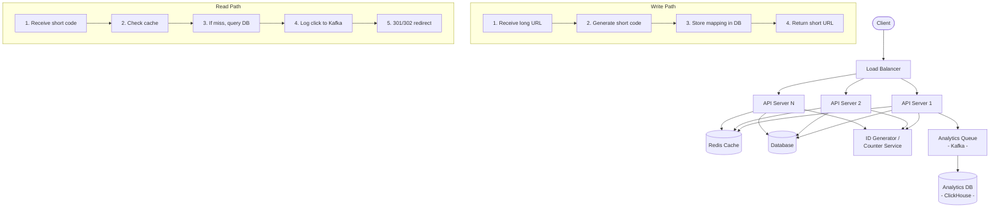
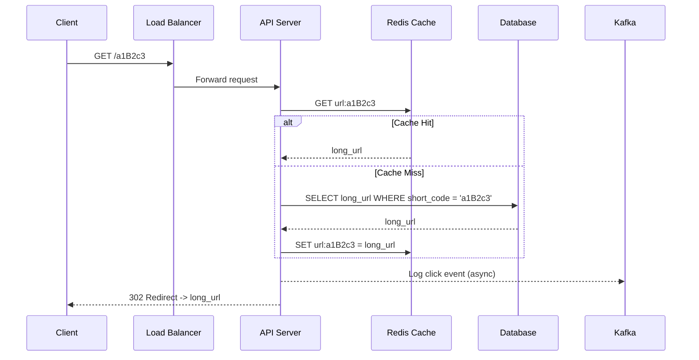
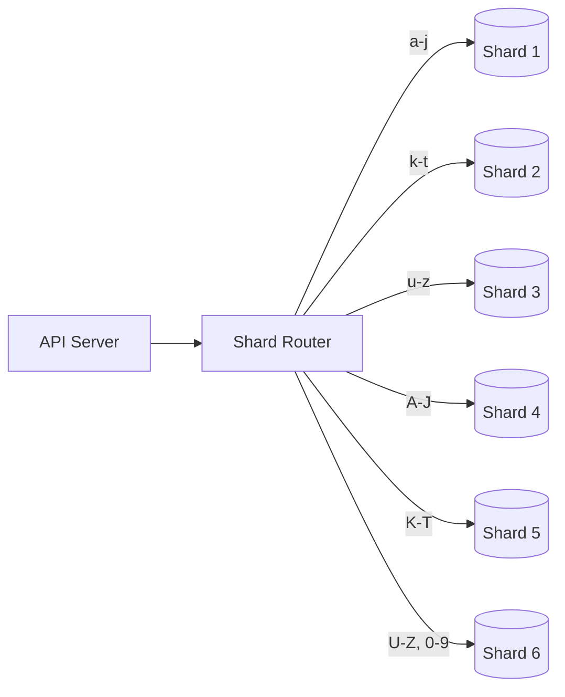
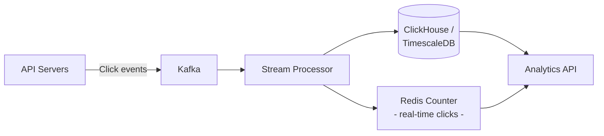

# Chapter 31 - Design a URL Shortener

> Bit.ly handles 28 billion clicks per month. Behind that simplicity - paste a long URL, get a short one - sits a system that must generate unique keys at scale, redirect in single-digit milliseconds, and never lose a mapping. It's the most popular system design interview question for a reason: it's small enough to finish in 45 minutes but deep enough to expose how you think about databases, caching, and distributed coordination.

📖 [Read on Medium](#) · 🎬 [Watch on YouTube](#)

---

## 1. Requirements

### Functional Requirements

| Requirement | Detail |
|-------------|--------|
| **Shorten** | Given a long URL, return a short URL (e.g., `https://short.ly/a1B2c3`) |
| **Redirect** | Given a short URL, redirect to the original long URL |
| **Custom aliases** | Users can optionally pick their own short code |
| **Expiration** | URLs can have a TTL (default: 5 years) |
| **Analytics** | Track click count, referrer, device, timestamp per short URL |

### Non-Functional Requirements

| Requirement | Target |
|-------------|--------|
| **Availability** | 99.99% uptime - reads must never fail |
| **Latency** | Redirect in < 10ms (p99) |
| **Scale** | 100M new URLs/day, 10:1 read/write ratio |
| **Durability** | Once created, a mapping must never be lost |
| **Uniqueness** | No two long URLs produce the same short code (no collisions) |

### Out of Scope

- User accounts and authentication
- Link editing after creation
- QR code generation
- Spam/phishing detection (important in production, but not the core design)

---

## 2. Capacity Estimation

Start with 100M new short URLs per day.

### Traffic

```
Writes: 100M / 86,400 sec = ~1,200 URLs/sec
Reads:  100M * 10 (read/write ratio) = 1B redirects/day
        1B / 86,400 = ~12,000 redirects/sec
Peak:   12,000 * 3 (peak factor) = ~36,000 redirects/sec
```

### Storage

Each URL mapping needs: short code (7 bytes) + long URL (avg 200 bytes) + metadata (100 bytes) = ~300 bytes.

```
Per day:    100M * 300 bytes = 30 GB/day
Per year:   30 GB * 365 = ~11 TB/year
Over 5 years: ~55 TB total
```

### Short Code Key Space

A 7-character code using base62 (a-z, A-Z, 0-9) gives 62^7 = 3.5 trillion possible codes. At 100M URLs/day, that's enough for ~96 years. Seven characters is plenty.

### Bandwidth

```
Incoming (writes): 1,200/sec * 300 bytes = 360 KB/sec (trivial)
Outgoing (reads):  12,000/sec * 300 bytes = 3.6 MB/sec (trivial)
```

The bottleneck won't be bandwidth. It'll be database lookups during redirects.

### Memory for Cache

If we cache the top 20% of URLs (Pareto principle - 20% of URLs get 80% of traffic):

```
1B daily redirects * 20% = 200M URLs to cache
200M * 300 bytes = 60 GB
```

That fits in a single beefy Redis instance, or a small cluster.

---

## 3. API Design

### REST API

```
POST /api/v1/urls
  Body: { "long_url": "https://example.com/very/long/path", "custom_alias": "mylink", "ttl_days": 365 }
  Response: { "short_url": "https://short.ly/a1B2c3", "expires_at": "2027-03-16T00:00:00Z" }
  Status: 201 Created

GET /{short_code}
  Response: 301/302 Redirect to long URL
  Header: Location: https://example.com/very/long/path

GET /api/v1/urls/{short_code}/stats
  Response: { "clicks": 14523, "created_at": "...", "top_referrers": [...] }

DELETE /api/v1/urls/{short_code}
  Response: 204 No Content
```

### Rate Limiting

- Writes: 10 URLs/min per IP (prevent abuse)
- Reads: 1,000 redirects/min per IP (prevent scraping)

---

## 4. Database Schema

### URL Mappings Table

| Column | Type | Notes |
|--------|------|-------|
| `short_code` | VARCHAR(7) | Primary key |
| `long_url` | VARCHAR(2048) | The original URL |
| `created_at` | TIMESTAMP | Creation time |
| `expires_at` | TIMESTAMP | Expiration time |
| `click_count` | BIGINT | Total clicks (denormalized for fast reads) |

### Analytics Table

| Column | Type | Notes |
|--------|------|-------|
| `id` | BIGINT | Auto-increment |
| `short_code` | VARCHAR(7) | Foreign key |
| `clicked_at` | TIMESTAMP | When the click happened |
| `ip_address` | VARCHAR(45) | Client IP |
| `user_agent` | VARCHAR(512) | Browser/device info |
| `referrer` | VARCHAR(2048) | Where the click came from |
| `country` | VARCHAR(2) | Geo-resolved from IP |

### Why SQL over NoSQL?

The URL mapping is a classic key-value lookup - you'd think NoSQL is the obvious choice. And it works fine. But a relational database like PostgreSQL gives you ACID transactions for the write path (critical when checking for collisions) and flexible querying for analytics. At Bit.ly's scale, you'd shard PostgreSQL. DynamoDB or Cassandra work too if you're willing to handle analytics separately.

Pick what your team knows. The data model is simple enough that the database choice won't make or break the design.

---

## 5. High-Level Architecture



The API servers are stateless - they don't store any URL data locally. All state lives in the database and cache. This means you can add or remove API servers freely behind the load balancer.

---

## 6. Deep Dive: URL Shortening Algorithms

This is where the interview gets interesting. There are three solid approaches, and each has real trade-offs.

### Approach 1: Base62 Encoding with Auto-Increment Counter

The simplest approach. Use an auto-incrementing counter and convert the number to base62.

```
Counter value: 1000000
Base62:        "4c92"

Counter value: 238,328
Base62:        "ZZZ"

Counter value: 3,521,614,606,208
Base62:        "ZZZZZZZ" (max 7-char code)
```

**How it works:**

1. Counter gives next ID (e.g., 1000001)
2. Convert to base62: `1000001` -> `"4c93"`
3. Store mapping: `"4c93"` -> `"https://example.com/long/url"`

**Pros:**
- Zero collisions - every counter value maps to a unique code
- Codes are short and get longer gradually as the counter grows
- Dead simple to implement

**Cons:**
- Sequential codes are predictable - users can enumerate URLs by incrementing
- Single counter becomes a bottleneck at high write throughput
- Requires a centralized counter service (ZooKeeper, Redis INCR, database sequence)

**Fixing the single-counter bottleneck:** Allocate ranges. Server 1 gets IDs 1-10000, Server 2 gets 10001-20000, etc. Each server burns through its range locally, then requests a new range. This is how Twitter's Snowflake and similar ID generators work.

### Approach 2: MD5/SHA256 Hash + Truncation

Hash the long URL and take the first 7 characters of the base62-encoded hash.

```
MD5("https://example.com/path") = "d41d8cd98f00b204..."
Take first 43 bits -> convert to base62 -> "a1B2c3D"
```

**Pros:**
- Same long URL always produces the same short code (deduplication for free)
- No centralized counter - each server can hash independently
- Codes look random, not predictable

**Cons:**
- Collisions. MD5 has 128 bits but we're only using ~42 bits (7 base62 chars). Birthday paradox means collisions start appearing around 2^21 = 2M URLs. That's way too soon.
- Must handle collisions: check DB, if taken, append a seed and rehash. This adds latency and complexity.

**Fixing collisions:** On collision, append a counter to the input and rehash: `MD5("https://example.com/path" + "1")`. Keep incrementing until you find an unused code. Ugly, but it works.

### Approach 3: Pre-Generated Key Service (KGS)

Generate all possible 7-character codes ahead of time and store them in a database. When a URL needs shortening, grab a pre-generated key.

```
Keys DB:
  unused_keys: [a1B2c3D, x7Y8z9A, m3N4o5P, ...]
  used_keys:   [q1W2e3R, ...]
```

**How it works:**

1. KGS pre-generates millions of random 7-char base62 keys
2. When an API server needs a key, it grabs a batch (say 1000 keys) from the unused pool
3. Move those keys from `unused` to `used` atomically
4. API server hands out keys from its local batch

**Pros:**
- Zero collisions - keys are unique by construction
- No hash computation, no counter coordination
- API servers work independently after getting their batch
- Codes are random, not sequential

**Cons:**
- Wasted keys if a server crashes with unused keys in its batch (acceptable - 3.5T key space is huge)
- Need to pre-generate and store keys (one-time cost)
- Adds a component to maintain (the KGS itself)

### Which Approach Should You Pick?

| Criteria | Counter + Base62 | Hash + Truncate | Pre-Generated Keys |
|----------|:---:|:---:|:---:|
| Collision-free | Yes | No | Yes |
| Distributed (no coordination) | No | Yes | Mostly |
| Unpredictable codes | No | Yes | Yes |
| Implementation complexity | Low | Medium | Medium |
| Same URL = same code | No | Yes | No |

**My recommendation:** Go with the counter + base62 approach for most cases. It's the simplest, has zero collisions, and the single-counter bottleneck is solvable with range allocation. If unpredictable codes matter (they usually do for security), pre-generated keys win. Hash-based is the weakest option because you're fighting collisions forever.

---

## 7. Deep Dive: Read Path (Redirect Flow)

The read path is the hot path. 10x more reads than writes, and every extra millisecond matters because the user is waiting for a page to load.

### 301 vs 302 Redirects

This decision has real consequences.

| Aspect | 301 (Permanent) | 302 (Temporary) |
|--------|:---:|:---:|
| Browser caching | Yes - browser remembers, won't hit your server again | No - browser hits your server every time |
| SEO | Link equity passes to destination URL | Link equity stays with short URL |
| Analytics accuracy | Undercounts - cached redirects aren't tracked | Accurate - every click goes through your server |
| Server load | Lower - browsers cache the redirect | Higher - every click is a server hit |

**The right answer depends on what you're building.** If analytics are important (they almost always are for a URL shortener), use 302. Bit.ly uses 301 for performance but supplements with JavaScript-based tracking. In an interview, pick 302 and explain why.

### Redirect Flow



The key optimization: the click logging goes to a Kafka queue, not directly to the analytics database. The redirect response goes back to the client immediately without waiting for analytics to be written. This keeps redirect latency under 10ms even when the analytics database is under heavy load.

---

## 8. Scaling

### Caching Strategy

Cache the mapping `short_code -> long_url` in Redis. The access pattern is perfect for caching: a small number of popular links account for most traffic (classic Zipf distribution).

**Cache policy:**
- LRU eviction (least recently used links get evicted first)
- TTL of 24 hours (prevents stale mappings for deleted/expired URLs)
- Write-through on creation (populate cache when URL is created)
- Cache-aside on reads (populate cache on first read if not already there)

With 60 GB of cache holding the top 20% of URLs, you'll get an 80%+ cache hit rate. That means 80% of your 36,000 peak redirects/sec never touch the database.

### Database Sharding

At 55 TB over 5 years, a single database won't cut it. Shard by short code.

**Shard key: first character of short_code**

With base62, that gives 62 shards. Each shard holds roughly 55 TB / 62 = ~900 GB. That's comfortable for a single PostgreSQL instance.

**Why shard by short code and not by long URL?** Because the hot path (redirects) looks up by short code. You want that lookup to hit exactly one shard with no scatter-gather.



Consistent hashing on the short code is even better - it handles adding/removing shards without reshuffling everything. But starting with range-based sharding on the first character is good enough for the interview.

### Rate Limiting

Without rate limiting, someone can exhaust your key space or DDoS your redirect service.

**Write rate limiting:** Token bucket per API key or IP. 10 URLs/min for anonymous users, 100/min for authenticated users.

**Read rate limiting:** Sliding window per IP. 1,000 redirects/min. Generous enough for normal use, tight enough to stop scrapers.

Implement this at the API gateway layer (Nginx, Kong, or a custom middleware). Don't put rate limiting logic in every API server.

---

## 9. Analytics

Analytics is a separate pipeline, not part of the redirect hot path.

### Data Flow



### What to Track

| Metric | Storage | Query Pattern |
|--------|---------|---------------|
| Total clicks per URL | Redis counter (real-time) | `INCR clicks:a1B2c3` |
| Clicks over time | ClickHouse time-series | Hourly/daily aggregates |
| Top referrers | ClickHouse | GROUP BY referrer |
| Geographic distribution | ClickHouse | GROUP BY country |
| Device breakdown | ClickHouse | GROUP BY user_agent parsed |

### Why Not Just Increment a Counter in the Main DB?

You could. And for a small-scale system, you should - it's simpler. But at 12,000 reads/sec, each incrementing a counter in PostgreSQL, you'd create a write hotspot. Every click to the same popular URL contends for the same row lock. Redis handles this effortlessly because it's single-threaded and in-memory. The Kafka pipeline gives you the full click stream for deeper analysis without impacting redirect latency.

---

## 10. Trade-offs and Alternatives

### SQL vs NoSQL for URL Storage

| | SQL (PostgreSQL) | NoSQL (DynamoDB/Cassandra) |
|---|---|---|
| **Schema** | Rigid but structured | Flexible |
| **Transactions** | ACID for collision checks | Eventually consistent |
| **Analytics** | SQL queries built-in | Need separate analytics layer |
| **Scaling** | Manual sharding | Auto-scaling built-in |
| **Team familiarity** | Most teams know SQL | Requires NoSQL expertise |

For a URL shortener specifically, DynamoDB is arguably the better fit: the access pattern is purely key-value, it auto-scales, and it handles the read throughput without manual sharding. But PostgreSQL with proper sharding works fine, and you can run analytics queries directly against it during the early days.

### Handling Duplicate Long URLs

Two options:
1. **Allow duplicates:** Different short codes for the same long URL. Simpler, uses more storage, but storage is cheap.
2. **Deduplicate:** Hash the long URL, check if it already exists, return the same short code. Saves storage but adds a lookup on every write.

Most production systems allow duplicates. The storage cost is negligible and the write path stays simple. Different users might want different analytics for the same destination URL anyway.

### Expired URL Cleanup

Don't delete expired URLs synchronously. Run a background job that scans for expired URLs and either marks them as inactive or moves them to cold storage. Lazy deletion works too - check expiration during redirect and return 410 Gone if expired.

### Custom Aliases

Custom aliases bypass the shortening algorithm entirely. The user provides the short code; you just check if it's available. Store them in the same table with a flag indicating it's custom. Validate length (3-20 chars), allowed characters (alphanumeric + hyphens), and reject reserved words.

---

## System Design Interview Checklist

Use this as a mental checklist when presenting this design:

| Step | Key Points to Hit |
|------|------------------|
| **Requirements** | Write vs read ratio, scale numbers, SLA |
| **Estimation** | QPS, storage, cache size, key space |
| **API** | RESTful, versioned, rate-limited |
| **Schema** | Simple key-value mapping + analytics table |
| **Architecture** | Stateless API servers, cache layer, sharded DB |
| **Algorithm** | Counter vs hash vs KGS - pick one and defend it |
| **Redirect** | 301 vs 302, async analytics |
| **Scaling** | Cache hit rate, sharding strategy, range allocation |
| **Analytics** | Kafka pipeline, ClickHouse, Redis counters |
| **Trade-offs** | SQL vs NoSQL, dedup, expiration, custom aliases |

---

## Key Takeaways

1. **The shortening algorithm is the core decision.** Counter + base62 is simplest and collision-free. Pre-generated keys are best for unpredictable codes. Hash-based is the weakest option.
2. **Reads dominate writes 10:1.** Design the read path first. Cache aggressively - the Zipf distribution is your friend.
3. **Use 302 redirects if you care about analytics.** 301 is faster but you lose visibility into click patterns.
4. **Decouple analytics from redirects.** Async logging via Kafka keeps the redirect path fast.
5. **Shard by short code.** It's the lookup key on the hot path.
6. **7 characters of base62 give you 3.5 trillion codes.** Don't overthink the key space.

---

## What's Next?

- **Chapter 32:** [Design a Rate Limiter](../32-design-rate-limiter/) - Token bucket, sliding window, and distributed rate limiting at the API gateway layer
- **Chapter 33:** [Design a Chat System](../33-chat-system/) - Real-time messaging with WebSockets, message ordering, and delivery guarantees
