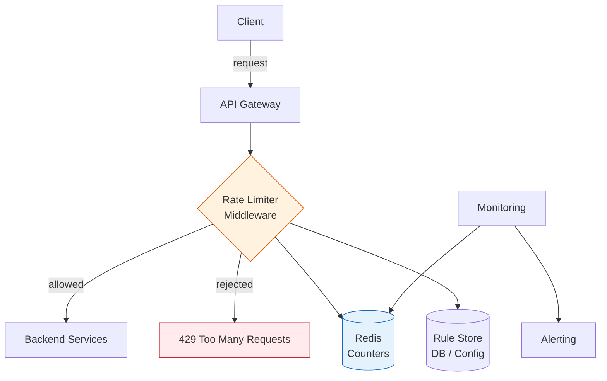

# Chapter 32 - Design a Rate Limiter

> "Design a rate limiter" is the first system design question many candidates see because it sounds simple but hides real distributed systems problems - clock skew, race conditions, and the tension between accuracy and latency. Get this one right and you've demonstrated you can think beyond CRUD.

📖 [Read on Medium](#) · 🎬 [Watch on YouTube](#)

---

## Step 1 - Understand the Problem and Scope

Before you draw a single box, pin down what the interviewer actually wants. Rate limiters vary wildly depending on scope.

### Functional Requirements

| # | Requirement | Detail |
|---|-------------|--------|
| F1 | Limit request rate | Throttle requests that exceed a configured threshold |
| F2 | Multiple limiting dimensions | By user ID, IP address, endpoint, or any combination |
| F3 | Configurable rules | Ops can change limits without redeploying code |
| F4 | Informative responses | Rejected clients receive clear headers telling them when to retry |
| F5 | Soft and hard limits | Some rules warn (log + allow), others reject outright |

### Non-Functional Requirements

| # | Requirement | Target |
|---|-------------|--------|
| N1 | Low latency | Rate check adds < 2ms to request path |
| N2 | High availability | Rate limiter failure doesn't take down the API |
| N3 | Distributed accuracy | Works correctly across multiple API servers |
| N4 | Fault tolerance | Fails open if the backing store is unreachable |
| N5 | Scalability | Handles 500K+ rate checks per second |

### Back-of-the-Envelope Estimates

Assume a mid-size API serving 10,000 requests per second across 20 servers:

```
Requests/sec:          10,000
Servers:               20
Rate checks/sec:       10,000 (one per request)
Unique users:          ~100,000 active per hour
Memory per user key:   ~100 bytes (counter + timestamps)
Total memory:          100,000 * 100B = 10 MB
Redis ops/sec:         10,000 (one INCR per request)
```

10 MB of state and 10K Redis ops/sec - this is comfortably within a single Redis instance. You don't need to shard the rate limiter until you're well past 100K requests per second.

---

## Step 2 - Where to Put the Rate Limiter

There are four options. Each has a clear use case.


| Location | Pros | Cons | Best For |
|----------|------|------|----------|
| **Client-side** | Reduces unnecessary requests | Trivially bypassed; you don't control the client | Mobile SDKs, well-behaved first-party clients |
| **Server-side middleware** | Full access to request context (user ID, endpoint) | Coupled to your app; runs on every server | Monoliths, simple setups |
| **API Gateway** | Centralized; no app code changes; works across services | Another hop; limited custom logic | Microservices behind Kong, Envoy, or AWS API Gateway |
| **Dedicated service** | Fully decoupled; can serve multiple products | Network hop + operational overhead | Large orgs with multiple API products |

**My take:** For most companies, the API gateway is the right answer. You already have one (or should), and rate limiting is exactly the kind of cross-cutting concern gateways exist for. Drop it into middleware only if you need deep access to business context that the gateway can't see - like "this user is on the enterprise plan."

---

## Step 3 - Rate Limiting Algorithms

Chapter 15 covers five algorithms in depth. Here's the interview-ready summary with a clear recommendation.

| Algorithm | Memory | Accuracy | Burst Tolerance | When to Use |
|-----------|--------|----------|-----------------|-------------|
| **Token Bucket** | 2 values/key | N/A (not window-based) | Allows bursts up to capacity | Default choice for most APIs |
| **Leaky Bucket** | Queue up to capacity | N/A (not window-based) | Smooths to constant rate | Traffic shaping, network QoS |
| **Fixed Window** | 2 values/key | Poor at boundaries | Full limit per window | Never in production |
| **Sliding Window Log** | O(n) timestamps | Perfect | Exact | Low-volume, high-value APIs |
| **Sliding Window Counter** | 3 values/key | ~99.97% | Weighted smoothing | Strict per-window limits |

### Token Bucket - The Default

The token bucket is what Amazon, Stripe, and most cloud providers use. Tokens refill at a steady rate. Each request consumes one. When tokens run out, requests are rejected. The bucket capacity controls burst size.

```
Bucket: capacity=10, refill_rate=2/sec

Time 0s:   [##########]  10 tokens - full bucket
Burst 8:   [##........]   2 tokens - burst consumed 8
Time 1s:   [####......]   4 tokens - 2 refilled
Time 2s:   [######....]   6 tokens - 2 more refilled
Time 5s:   [##########]  10 tokens - full again
```

Why it wins: two numbers per user (token count + last refill time), O(1) per check, and it handles bursty real-world traffic gracefully. A user who's been idle accumulates tokens and can burst - which matches how humans actually use APIs.

### Sliding Window Counter - The Accurate Alternative

When you need strict "no more than N requests in any 60-second window" guarantees, the sliding window counter is the right pick. It uses counters from the current and previous windows, weighted by position in the current window.

```
Previous window (12:00-12:01): 84 requests
Current window  (12:01-12:02): 36 requests
Current time:   12:01:15 (25% into current window)

Estimated count = 84 * 0.75 + 36 = 99
Limit: 100 - ALLOWED
```

Three values per key. Near-perfect accuracy. No boundary exploit. For a deeper walkthrough of all five algorithms, see [Chapter 15 - Rate Limiting & Throttling](../15-rate-limiting/).

---

## Step 4 - High-Level Architecture

Here's the complete picture. The rate limiter sits in the request path between the client and your backend services, backed by Redis for distributed state and a rule engine for configuration.



The request flow:

1. Client sends a request to the API gateway
2. Rate limiter middleware extracts the client identifier (API key, user ID, IP)
3. Middleware looks up the applicable rule (which limit applies to this client + endpoint?)
4. Middleware checks the counter in Redis
5. If under limit: increment counter, forward request, attach rate limit headers
6. If over limit: return 429 with Retry-After header

The critical insight: the rate check (steps 3-6) must happen in **under 2ms**. Redis INCR with EXPIRE handles this easily - it's a single atomic operation that takes ~0.5ms over the network.

---

## Step 5 - Rate Limit Rules and Configuration

Hard-coding limits is a deployment hazard. Every limit change requires a code deploy, which means you can't respond quickly when a new client is hammering you. Store rules externally.

### Rule Schema

```json
{
  "rules": [
    {
      "id": "global-default",
      "match": {"scope": "global"},
      "limit": 1000,
      "window_seconds": 60,
      "algorithm": "token_bucket",
      "action": "reject"
    },
    {
      "id": "login-brute-force",
      "match": {"endpoint": "/api/login", "key_type": "ip"},
      "limit": 5,
      "window_seconds": 900,
      "algorithm": "sliding_window",
      "action": "reject"
    },
    {
      "id": "free-tier",
      "match": {"plan": "free", "key_type": "api_key"},
      "limit": 100,
      "window_seconds": 3600,
      "algorithm": "token_bucket",
      "action": "reject"
    },
    {
      "id": "enterprise-soft-limit",
      "match": {"plan": "enterprise", "key_type": "api_key"},
      "limit": 50000,
      "window_seconds": 3600,
      "algorithm": "token_bucket",
      "action": "log_and_allow"
    }
  ]
}
```

### Rule Matching Priority

Rules are evaluated in priority order. The most specific match wins.

| Priority | Scope | Example |
|----------|-------|---------|
| 1 (highest) | User + Endpoint | user:42 on POST /upload - 10 req/min |
| 2 | User | user:42 globally - 1000 req/hr |
| 3 | Endpoint | POST /login from any IP - 5 req/15min |
| 4 | Plan tier | Free plan - 100 req/hr |
| 5 (lowest) | Global default | Everything else - 1000 req/min |

The `log_and_allow` action matters for enterprise customers. You don't want to hard-block a customer paying you $50K/month. Instead, log the overage, alert the account team, and discuss an upgrade. Rate limiting is a business decision, not just a technical one.

---

## Step 6 - Distributed Rate Limiting with Redis

Single-server rate limiting is trivial - an in-memory dictionary is fine. The real problem is making it work across a fleet of servers.

### The Core Problem

```
Limit: 100 requests per minute

Without shared state:
  Server A sees 80 requests  -> all pass (80 < 100)
  Server B sees 70 requests  -> all pass (70 < 100)
  Total: 150 requests passed - limit violated by 50%

With Redis:
  Server A: INCR rate:user42 -> 80   -> pass
  Server B: INCR rate:user42 -> 81   -> pass
  ...
  Any server: INCR rate:user42 -> 101 -> REJECT
```

### Redis Implementation

The token bucket in Redis needs just two keys per rate-limit entry and two commands:

```
Key:   rate:{user_id}:{endpoint}
Value: current token count
TTL:   window duration

Operation (Lua script for atomicity):
  1. GET tokens and last_refill_time
  2. Calculate tokens to add based on elapsed time
  3. If tokens > 0: decrement and ALLOW
  4. If tokens = 0: REJECT
  5. SET new token count with TTL
```

The Lua script is critical. Without it, there's a race condition between GET and SET. Redis executes Lua scripts atomically - no other command can interleave.

```lua
-- Token bucket rate limiter (runs atomically in Redis)
local key = KEYS[1]
local capacity = tonumber(ARGV[1])
local refill_rate = tonumber(ARGV[2])
local now = tonumber(ARGV[3])

local data = redis.call('HMGET', key, 'tokens', 'last_refill')
local tokens = tonumber(data[1]) or capacity
local last_refill = tonumber(data[2]) or now

-- Refill tokens based on elapsed time
local elapsed = now - last_refill
local new_tokens = math.min(capacity, tokens + elapsed * refill_rate)

if new_tokens >= 1 then
    redis.call('HMSET', key, 'tokens', new_tokens - 1, 'last_refill', now)
    redis.call('EXPIRE', key, capacity / refill_rate * 2)
    return 1  -- allowed
else
    redis.call('HMSET', key, 'tokens', new_tokens, 'last_refill', now)
    redis.call('EXPIRE', key, capacity / refill_rate * 2)
    return 0  -- rejected
end
```

### What Happens When Redis Goes Down?

This is the most important design decision in the entire system. You have two options:

| Strategy | Behavior | Risk | When to Use |
|----------|----------|------|-------------|
| **Fail open** | Allow all requests through | Brief period without rate limiting | Most APIs - availability over protection |
| **Fail closed** | Reject all requests | Total outage for everyone | Financial APIs, security-critical endpoints |

**Fail open is almost always correct.** A few seconds without rate limiting rarely causes lasting damage. A total outage always does. The exception is something like a login endpoint where brute-force attacks are a real threat - there you might fail closed on that specific endpoint while failing open everywhere else.

Practical fallback: keep a local in-memory counter as a backup. It won't be accurate across servers, but a rough per-server limit (total_limit / num_servers) is better than nothing.

---

## Step 7 - Rate Limit Headers

Clients need visibility into their quota. Without headers, they're flying blind - hitting the limit and getting 429s without knowing why or when they can retry.

### Standard Headers

Every response (not just 429s) should include these:

```
HTTP/1.1 200 OK
X-RateLimit-Limit: 100
X-RateLimit-Remaining: 67
X-RateLimit-Reset: 1710590400

HTTP/1.1 429 Too Many Requests
X-RateLimit-Limit: 100
X-RateLimit-Remaining: 0
X-RateLimit-Reset: 1710590400
Retry-After: 23

{"error": "rate_limit_exceeded", "retry_after": 23}
```

| Header | Purpose | Format |
|--------|---------|--------|
| `X-RateLimit-Limit` | Maximum requests allowed in window | Integer |
| `X-RateLimit-Remaining` | Requests left before hitting the limit | Integer |
| `X-RateLimit-Reset` | When the window resets | Unix timestamp (seconds) |
| `Retry-After` | How long to wait before retrying (429 only) | Seconds |

### Why Retry-After Matters

Without Retry-After, clients implement their own retry logic - usually a tight loop that hammers your server even harder. With it, well-behaved clients back off automatically. This turns a 429 from "your server is under attack by retries" into "temporary, self-resolving."

The IETF draft `RateLimit` headers (RateLimit-Policy, RateLimit-Limit, RateLimit-Remaining, RateLimit-Reset) are still gaining adoption. For now, the X-RateLimit-* convention is what most APIs use. GitHub, Stripe, Twitter - they all use this format.

---

## Step 8 - Race Conditions and Solutions

Race conditions are the #1 reason rate limiters fail in production. The classic scenario:

```
Time    Server A                  Redis               Server B
----    --------                  -----               --------
T1      GET counter -> 99
T2                                                    GET counter -> 99
T3      99 < 100, ALLOW
T4      SET counter = 100
T5                                                    99 < 100, ALLOW
T6                                                    SET counter = 100

Result: counter = 100, but 2 requests passed at 99.
        If they both came in at 99, the real count is 101.
```

### Solution 1: Atomic INCR (Simple and Correct)

Redis INCR is atomic. No read-modify-write race.

```
Server A: INCR counter -> 100 -> ALLOW
Server B: INCR counter -> 101 -> REJECT
```

One command. No race. This is why Redis is the standard choice for distributed rate limiting - INCR was practically designed for this use case.

### Solution 2: Lua Scripts (Complex Algorithms)

For token bucket and sliding window, you need more than a single INCR. Wrap the logic in a Lua script. Redis executes Lua atomically - the entire script runs as one operation with no interleaving.

### Solution 3: Redis Sorted Sets with MULTI/EXEC

For the sliding window log algorithm, use a sorted set of timestamps inside a MULTI/EXEC transaction:

```
MULTI
  ZREMRANGEBYSCORE key 0 (now - window)
  ZADD key now now
  ZCARD key
EXEC
```

The transaction ensures no other client modifies the set between the remove and count operations.

### What About Locks?

Don't use distributed locks for rate limiting. Locks add latency (acquiring/releasing), create deadlock risk, and defeat the purpose of a sub-2ms rate check. Atomic operations and Lua scripts solve the problem without locks.

---

## Step 9 - Monitoring and Alerting

A rate limiter you can't observe is a rate limiter you can't trust.

### Key Metrics

| Metric | What It Tells You | Alert Threshold |
|--------|-------------------|-----------------|
| `rate_limit.allowed` | Normal traffic volume | Sudden drop = possible outage |
| `rate_limit.rejected` | How much traffic you're blocking | Spike = possible attack or misconfigured rule |
| `rate_limit.rejected_ratio` | % of requests rejected | > 10% sustained = investigate |
| `rate_limit.latency_p99` | Rate check overhead | > 5ms = Redis performance issue |
| `rate_limit.redis_errors` | Backend store failures | Any = failover triggered |
| `rate_limit.rules_loaded` | Config health check | Mismatch with expected count = config error |

### What to Alert On

1. **Rejection spike** - A sudden jump in 429s across many clients means you might have a misconfigured rule, not an attack
2. **Single-client rejection flood** - One client generating thousands of 429s means either abuse or a broken retry loop on their side
3. **Redis latency spike** - Rate check latency over 5ms means Redis is struggling; check memory, network, or slow Lua scripts
4. **Failover to local counters** - If Redis is down and you've failed open, you need to know immediately

### Dashboard Essentials

A good rate limiter dashboard shows: total allowed vs rejected, rejection ratio over time, p99 latency of rate checks, Redis health, and the top rejected clients. That last one is the most valuable - it lets you distinguish between attacks (block the IP), bugs (contact the developer), and limits that are too low (raise the limit).

---

## Step 10 - Trade-Offs and Design Decisions

Every rate limiter design involves trade-offs. Here are the ones interviewers want to hear you reason about.

### Accuracy vs Latency

| Approach | Accuracy | Latency per Check | Trade-off |
|----------|----------|-------------------|-----------|
| Redis atomic INCR | Exact | ~1ms (network hop) | Best default |
| Redis Lua script | Exact | ~1-2ms | Needed for token bucket |
| Local counter + periodic sync | Approximate | ~0 (in-memory) | Use above 100K req/s |
| Sticky sessions | Per-server exact | ~0 | Uneven load; failover resets counts |

### Centralized vs Decentralized

| Dimension | Centralized (Redis) | Decentralized (local counters) |
|-----------|--------------------|---------------------------------|
| Accuracy | Global exact count | Approximate (off by sync_interval * num_servers) |
| Latency | 1ms network hop | Microseconds |
| Failure mode | Redis down = fail open | Server down = counts lost for that server |
| Complexity | Simple | Need sync protocol |
| Scale ceiling | ~200K ops/s per Redis instance | Unlimited |

### Fixed Rules vs Dynamic Rules

| Aspect | Fixed (config file) | Dynamic (database) |
|--------|--------------------|--------------------|
| Change speed | Requires deploy or config reload | Instant via API call |
| Complexity | Low | Medium (need admin API, caching) |
| Audit trail | Git history | Database changelog |
| Risk | Low (reviewed in PR) | Higher (accidental change via API) |

### The Interview Checklist

When you present your rate limiter design, make sure you've covered:

- [ ] Algorithm choice with justification (not just "I'll use token bucket")
- [ ] Where in the stack the limiter lives and why
- [ ] Distributed coordination (Redis, not just in-memory)
- [ ] Race condition handling (atomic ops, Lua scripts)
- [ ] Failure mode (fail open vs closed, local fallback)
- [ ] Rate limit headers for client visibility
- [ ] Configurable rules without redeployment
- [ ] Monitoring and alerting strategy

---

## Common Interview Follow-Ups

| Question | Key Points |
|----------|------------|
| **Multi-datacenter rate limiting?** | Each DC gets its own Redis. Sync counters async between regions. Accept approximate limits across regions. For financial APIs, pin users to one DC. |
| **Client using millions of IPs?** | IP limiting alone won't stop distributed attacks. Layer with API key limits, account-level limits, and a WAF in front. |
| **Rate-limiting WebSockets?** | Two points: connection establishment (new connections/sec/user) and message rate (messages/sec/connection). Token bucket per connection. |
| **Tiered pricing with rate limits?** | Store plan-to-limit mapping in the rule engine. User upgrades update the plan, not the rate limiter config. Cache plan lookups with short TTL. |

---

## Key Takeaways

1. **Put the rate limiter at the API gateway** - it's a cross-cutting concern that doesn't belong in application code
2. **Token bucket for most APIs, sliding window counter for strict limits** - know both and explain why you picked one
3. **Redis atomic operations solve the race condition** - INCR for simple counters, Lua scripts for complex algorithms
4. **Fail open, not closed** - unless you're protecting a login endpoint or financial API
5. **Send rate limit headers on every response** - not just 429s; clients need visibility before they hit the wall
6. **Store rules externally** - hard-coded limits are a deployment hazard
7. **Monitor rejections, not just allowances** - a spike in 429s is either an attack or a misconfigured rule, and you need to know which

---

## What's Next?

- **Chapter 33:** [Design a Chat System](../33-chat-system/) - Real-time messaging at scale with WebSockets, presence detection, and message delivery guarantees
- **Chapter 34:** [Design a News Feed](../34-news-feed/) - Fan-out strategies, ranking algorithms, and the push vs pull debate
