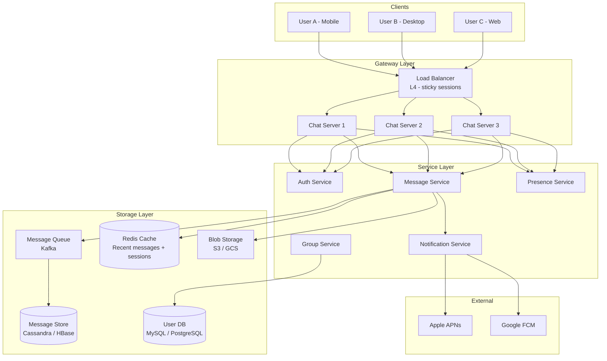

# Chapter 33 - Design a Chat System

> WhatsApp delivers roughly 100 billion messages per day. Slack handles millions of concurrent connections across thousands of organizations. Behind both sits the same core problem: get a message from one person to another in under 300 milliseconds, and never lose it. This chapter walks through exactly how to design that system.

📖 [Read on Medium](#) · 🎬 [Watch on YouTube](#)

---

## 1. Requirements

Every chat system design interview starts with scoping. Don't jump into architecture before you know what you're building.

### Functional Requirements

| Feature | Details |
|---|---|
| 1-on-1 chat | Real-time messaging between two users |
| Group chat | Up to 500 members per group (WhatsApp caps at 1024, Slack at thousands) |
| Online presence | Show who's online, offline, or away |
| Push notifications | Deliver notifications when the recipient is offline |
| Message history | Persistent storage, scrollback pagination |
| Read receipts | "Delivered" and "Read" indicators |
| Media messages | Images, files, voice clips (not the focus, but acknowledged) |

### Non-Functional Requirements

| Requirement | Target |
|---|---|
| Latency | < 300ms message delivery for online users |
| Availability | 99.99% uptime - chat is a primary communication channel |
| Durability | Zero message loss once accepted by server |
| Ordering | Messages appear in consistent order for all participants |
| Scale | 500M daily active users, 100B messages/day |

### Out of Scope

- Video/voice calls (different infrastructure entirely)
- Stories/status updates
- Channels with 100K+ members (broadcast model, not chat)

---

## 2. Capacity Estimation

Back-of-envelope math matters here. Interviewers want to see you think about scale before drawing boxes.

### Message Volume

```
500M DAU
Each user sends ~40 messages/day on average
= 20 billion messages/day
= ~230,000 messages/second average
= ~700,000 messages/second at peak (3x average)
```

### Storage

```
Average message size: 200 bytes (text + metadata)
20B messages/day x 200 bytes = 4 TB/day
5 years retention = 4 TB x 365 x 5 = ~7.3 PB
```

That's just text. Media pushes this into tens of petabytes - which is why WhatsApp stores media on blob storage with expiring URLs, not in the message database.

### Connections

```
500M DAU, assume 30% concurrent at peak = 150M simultaneous connections
Each WebSocket connection: ~10 KB memory overhead
150M x 10 KB = 1.5 TB RAM just for connections
At 100K connections per server = 1,500 chat servers minimum
```

Those numbers should shape every decision that follows.

---

## 3. Communication Protocol

This is the most important technical decision in the entire design. Get it wrong and nothing else matters.

### The Options

| Protocol | How It Works | Latency | Server Load |
|---|---|---|---|
| HTTP Polling | Client asks "any new messages?" every N seconds | High (N seconds) | Very high - most polls return nothing |
| HTTP Long Polling | Client opens request, server holds it until data arrives | Medium (connection overhead) | Medium - still HTTP overhead per message |
| Server-Sent Events | Server pushes to client over HTTP | Low | Medium - unidirectional only |
| WebSocket | Full-duplex persistent connection | Very low | Low per message (high per connection) |

### WebSocket Wins

For chat, WebSocket is the clear winner. Here's why:

1. **Bidirectional** - Both client and server can send messages at any time. SSE only goes server-to-client, so you'd still need HTTP for sending.
2. **Low overhead** - After the initial handshake, each message frame is just 2-10 bytes of overhead vs. hundreds of bytes for HTTP headers.
3. **Connection reuse** - One TCP connection handles all messages. Long polling creates a new HTTP connection for every message.
4. **Real-time** - Messages arrive the instant the server pushes them. No polling interval delay.

The downside: WebSocket connections are stateful. The server must remember which user is on which connection. This makes scaling and failover harder than stateless HTTP - but it's a tradeoff every major chat system accepts.

---

## 4. High-Level Architecture



### Component Responsibilities

| Component | Role |
|---|---|
| **Load Balancer** | L4 (TCP-level) with sticky sessions - WebSocket connections must stay on the same server |
| **Chat Servers** | Hold WebSocket connections, route messages, manage per-connection state |
| **Message Service** | Validate messages, assign sequence numbers, fan out to recipients |
| **Presence Service** | Track online/offline/away status via heartbeats |
| **Notification Service** | Push notifications to offline users via APNs/FCM |
| **Message Queue** | Decouple message acceptance from storage and delivery - Kafka gives ordering guarantees |
| **Message Store** | Append-only message log - Cassandra or HBase for write-heavy workload |
| **Redis Cache** | Recent messages, user sessions, connection mapping (which user is on which server) |

---

## 5. Message Flow

### 1-on-1 Message Flow

Here's what happens when User A sends "Hello" to User B:

```
1. User A sends message over WebSocket to Chat Server 1
2. Chat Server 1 validates auth token, checks rate limits
3. Message Service assigns a monotonic sequence number
4. Message is written to Kafka (topic: chat.messages)
5. Message is written to Redis (recent message cache)
6. Message Service looks up User B's connection:
   - Redis stores: user_B -> chat_server_2
7. IF User B is online:
   - Message is forwarded to Chat Server 2
   - Chat Server 2 pushes message to User B via WebSocket
   - User B's client sends delivery ACK
8. IF User B is offline:
   - Notification Service sends push notification via APNs/FCM
   - Message waits in storage until User B reconnects
9. Kafka consumer writes message to Cassandra (durable storage)
10. Chat Server 1 sends delivery confirmation to User A
```

### Why the Message Queue?

You might wonder - why not write directly to the database? Three reasons:

1. **Decoupling** - Message acceptance (step 3) is separated from storage (step 9). The user gets fast confirmation even if the database is slow.
2. **Buffering** - During traffic spikes, Kafka absorbs the burst. The database consumers process at their own pace.
3. **Ordering** - Kafka partitions by conversation_id, guaranteeing message order within a conversation.

### Group Message Flow

Group messages add fan-out complexity:

```
1. User A sends message to Group G (200 members)
2. Chat Server validates A is a member of Group G
3. Message Service assigns sequence number for Group G
4. Message written to Kafka (partitioned by group_id)
5. Group Service fetches member list from cache/DB
6. For each member:
   a. Look up connection server in Redis
   b. If online: forward message to their chat server
   c. If offline: queue push notification
7. Each recipient's chat server delivers via WebSocket
```

The key question interviewers ask: **where does fan-out happen?**

---

## 6. Message Storage

### Schema Design

Chat messages have a specific access pattern: you almost always read messages within a single conversation, ordered by time, paginated backwards from the most recent.

**Messages Table (Cassandra)**

| Column | Type | Notes |
|---|---|---|
| conversation_id | UUID | Partition key - all messages in a conversation live together |
| sequence_num | BIGINT | Clustering key (ascending) - monotonic within conversation |
| message_id | UUID | Globally unique identifier |
| sender_id | UUID | Who sent it |
| content | TEXT | Message body (encrypted at rest) |
| content_type | TINYINT | 0=text, 1=image, 2=file, 3=voice |
| media_url | TEXT | Nullable - S3/GCS URL for media |
| created_at | TIMESTAMP | Server-assigned timestamp |
| status | TINYINT | 0=sent, 1=delivered, 2=read |

**Why Cassandra?**

- **Write-optimized** - Chat is write-heavy. Cassandra handles millions of writes/second.
- **Partition by conversation** - All messages for a conversation are on the same node. Range queries (pagination) are fast.
- **Linear scalability** - Add nodes to handle more conversations. No single-master bottleneck.
- **Tunable consistency** - Write with quorum for durability, read with ONE for speed.

### Sequence Numbers vs. Timestamps

Why not just use timestamps for ordering? Because clocks lie.

- Two servers might have slightly different clocks
- Two messages sent in the same millisecond need deterministic ordering
- Sequence numbers are monotonic within a conversation - no ambiguity

The Message Service uses a simple counter per conversation, stored in Redis:

```
INCR chat:conv:{conversation_id}:seq
```

This gives you a gap-free, strictly ordered sequence. If a client sees sequence 41 and 43 but not 42, it knows a message is missing and can request it.

### Conversation ID Generation

For 1-on-1 chats, derive the conversation_id deterministically from both user IDs:

```
conversation_id = hash(min(user_a, user_b) + ":" + max(user_a, user_b))
```

This way both users always compute the same conversation_id without a lookup. Group chats get a randomly generated UUID when the group is created.

### Pagination

Clients load message history by requesting:

```
GET /messages?conversation_id=X&before_seq=100&limit=50
```

Cassandra handles this efficiently with its clustering key:

```sql
SELECT * FROM messages
WHERE conversation_id = X
  AND sequence_num < 100
ORDER BY sequence_num DESC
LIMIT 50;
```

---

## 7. Online Presence

Presence seems simple - "show a green dot when someone's online" - but at 500M users it's one of the hardest parts of the system.

### Heartbeat Mechanism

```
1. Client connects via WebSocket -> mark as ONLINE
2. Client sends heartbeat every 30 seconds
3. Server updates Redis: SET user:{id}:last_seen {timestamp} EX 60
4. If no heartbeat for 60 seconds -> mark as OFFLINE
5. Client explicitly disconnects -> mark as OFFLINE immediately
```

### Presence Fan-Out Problem

When User A comes online, who needs to know? Every friend. If User A has 500 friends, that's 500 notifications. If 100K users come online in the same minute (morning rush), that's 50M presence updates per minute.

**Solutions:**

1. **Lazy loading** - Don't push presence updates. Instead, when User B opens a chat with User A, query A's status on demand.
2. **Small group optimization** - Only push presence updates to users who have an active chat window open with this user.
3. **Rate limiting** - Batch presence changes. If a user's connection is flapping (online/offline/online), wait 10 seconds before broadcasting the change.
4. **Channel-based** - For group chats, subscribe to presence updates only for the group you're currently viewing.

WhatsApp uses a hybrid: real-time presence for the chat you're looking at, lazy loading for your contact list.

### Presence Data Model

```
Redis Hash: presence:{user_id}
  - status: "online" | "offline" | "away"
  - last_seen: 1703001234
  - device: "mobile" | "desktop" | "web"
  - server_id: "chat-server-42"  (for routing)
```

---

## 8. Push Notifications

When a user is offline, the message still needs to reach them - eventually.

### Flow

```
1. Message Service determines recipient is offline
   (no entry in Redis connection map, or last heartbeat expired)
2. Message is stored in Cassandra (it won't be lost)
3. Notification Service is called with:
   - recipient user_id
   - sender display name
   - message preview (first 100 chars)
   - conversation_id (for deep linking)
4. Notification Service looks up device tokens from User DB
5. For iOS: send to Apple APNs
   For Android: send to Google FCM
   For Web: send Web Push via VAPID
6. Third-party service delivers push to device
7. User taps notification -> app opens -> reconnects WebSocket
8. Client syncs missed messages from last known sequence number
```

### Notification Deduplication

A common bug: user gets 47 push notifications while offline because each message triggers one. Better approach:

- **Collapse key** - Group notifications by conversation. New messages replace the previous notification for that conversation.
- **Batching** - If multiple messages arrive within 5 seconds, send one notification: "3 new messages from Alice"
- **Quiet hours** - Respect user preferences for do-not-disturb windows.

### Offline Message Sync

When a user reconnects, the client sends its last known sequence number per conversation. The server uses those sequence numbers to do precise range queries - the client only fetches what it missed.

---

## 9. Group Chat Fan-Out

Group messaging is the most operationally expensive feature. One message to a 500-person group means 499 deliveries.

### Push vs. Pull Fan-Out

**Push model** - Write a copy into each recipient's inbox. Reads are fast, but 499x write amplification for a 500-member group adds up fast.

**Pull model** - Write once to the group log; each reader queries it on demand. Minimal writes, but reading requires querying every group you're in.

### Hybrid Approach (What Production Systems Do)

- **Small groups (< 50 members):** Push model. Write amplification is manageable, and the instant delivery is worth it.
- **Large groups (50-500 members):** Pull model with notification. Write once, notify members, let them pull when they open the app.
- **Channels (500+ members):** Pure pull model. Members fetch on demand. No push notifications for every message - use mention-based notifications instead.

---

## 10. Media Messages and Encryption

### Media Flow

Media messages don't go through the chat servers directly:

```
1. Client uploads image/file to blob storage (S3/GCS) via separate HTTP endpoint
2. Blob storage returns a URL/key
3. Client sends a chat message with content_type=IMAGE and media_url=<URL>
4. Recipients receive the message with the URL
5. Recipient's client downloads media directly from blob storage
```

This keeps binary data off the WebSocket connections and chat servers. Media is often processed (thumbnails, compression) asynchronously via a media processing pipeline.

### End-to-End Encryption (E2EE)

WhatsApp and Signal use the Signal Protocol for E2EE:

- Messages are encrypted on the sender's device with the recipient's public key
- The server sees only ciphertext - it cannot read message content
- Key exchange happens via a prekey bundle mechanism
- Group E2EE is harder: the sender encrypts the message once with a shared group key, distributed via pairwise encrypted channels

E2EE changes the architecture: the server can't index messages, can't generate push notification previews, and stores only encrypted blobs. Key management becomes a critical service. For an interview, mention E2EE as a consideration but don't deep-dive unless asked.

---

## 11. Scaling

### Connection Server Scaling

The biggest scaling challenge: each WebSocket connection is stateful and pinned to one server.

**Horizontal scaling strategy:**

1. **Consistent hashing** - Hash user_id to determine which chat server pool handles their connection. This makes routing predictable.
2. **Connection registry** - Redis stores the mapping: `user_id -> server_id`. Any service can look up where to route a message.
3. **Graceful draining** - When removing a server, it stops accepting new connections, finishes in-flight messages, then clients reconnect to another server.
4. **Regional deployment** - Chat servers in multiple regions. Users connect to the nearest region. Cross-region messages route through a backbone message bus.

### Message Queue Scaling

Kafka scales horizontally by adding partitions:

```
Topic: chat.messages
  Partition 0: conversations with hash(conv_id) % N == 0
  Partition 1: conversations with hash(conv_id) % N == 1
  ...
  Partition N-1: conversations with hash(conv_id) % N == N-1
```

Partitioning by conversation_id guarantees that all messages for a conversation are processed in order by a single consumer.

### Database Sharding

Cassandra shards automatically by partition key (conversation_id). Watch out for:

- **Hot partitions** - A viral group chat could overload one node. Monitor partition sizes and split if needed.
- **Cross-shard queries** - "Show all unread conversations" touches many partitions. Maintain a per-user unread counter in Redis.
- **Data locality** - Store conversations on nodes geographically close to the participants when possible.

### Service-Level Summary

| Component | Scaling Strategy | Target |
|---|---|---|
| Chat Servers | Horizontal, consistent hashing by user_id | 100K connections/server |
| Message Queue | Kafka partitions by conversation_id | Millions of messages/sec |
| Message Store | Cassandra, partition by conversation_id | Petabytes of storage |
| Presence | Redis cluster, shard by user_id | Sub-millisecond lookups |
| Push Notifications | Worker pool consuming from queue | Millions of pushes/minute |
| Media Storage | S3/GCS with CDN | Unlimited (object storage) |

---

## Interview Tips

1. **Start with protocol choice.** WebSocket vs. alternatives shows you understand the core constraint.
2. **Separate connection handling from business logic.** Chat servers hold connections; message services handle routing and storage.
3. **Sequence numbers, not timestamps.** This shows you understand distributed ordering.
4. **Address group chat fan-out explicitly.** Interviewers love asking "what happens with a 500-person group?"
5. **Mention but don't over-design E2EE.** It's a signal that you understand real-world systems, but it's not the core design.
6. **Know your numbers.** 100B messages/day, 150M concurrent connections, 4 TB/day storage - these anchor your architecture decisions.

---

## Code Lab

The `code/` directory contains four runnable Python demos:

| File | What It Demonstrates |
|---|---|
| `chat_server.py` | WebSocket chat server with rooms, message history, presence tracking |
| `chat_client.py` | Terminal-based chat client connecting via WebSocket |
| `message_store.py` | SQLite message storage with conversations, sequencing, and pagination |
| `presence_service.py` | Heartbeat-based online/offline presence tracking |

See [`code/README.md`](code/README.md) for setup and usage.

## What's Next?

- **Chapter 34:** [Design a News Feed](../34-news-feed/) - Fan-out on write vs. read, ranking algorithms, and timeline assembly.
- **Chapter 35:** [Design a Search Autocomplete](../35-search-autocomplete/) - Trie data structures, query prediction, and real-time ranking.
