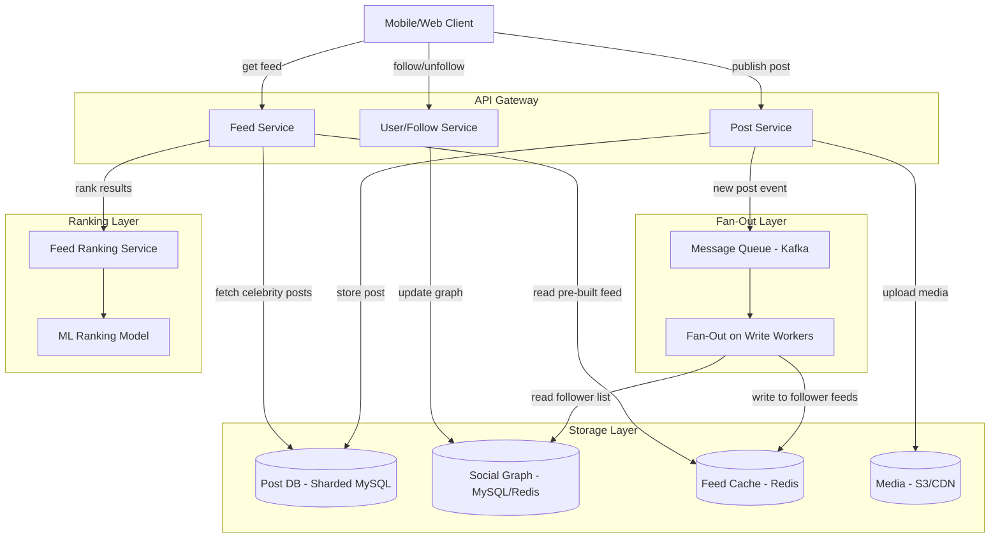

# Chapter 34 - Design a News Feed

> Every time you open Facebook, Twitter, or LinkedIn, a feed appears in under 200ms - personalized, ranked, and assembled from millions of potential posts. Behind that simple scroll is one of the hardest distributed systems problems in tech.

📖 [Read on Medium](#) · 🎬 [Watch on YouTube](#)

---

## 1. Requirements

Before drawing boxes and arrows, pin down what the system actually does. Interviewers want to see you drive this conversation.

### Functional Requirements

| Requirement | Details |
|---|---|
| Publish a post | Text, images, video links. A post belongs to one author. |
| Follow / unfollow users | Directed graph - Alice follows Bob, Bob doesn't have to follow Alice. |
| View home feed | Reverse-chronological (or ranked) stream of posts from people you follow. |
| View user profile feed | All posts by a single user, newest first. |
| Like / comment on posts | Engagement signals that feed ranking can use later. |

### Non-Functional Requirements

| Requirement | Target |
|---|---|
| Feed latency | p99 under 200ms |
| Availability | 99.99% - feed downtime is front-page news |
| Consistency | Eventual is fine - a 5-second delay on a new post is acceptable |
| Scale | 500M daily active users, 1B+ posts/day in reads |

### Out of Scope

Ads injection, Stories/Reels, direct messaging, hashtag search. Real systems have all of these, but scoping them out keeps the interview focused.

---

## 2. Capacity Estimation

Back-of-the-envelope math grounds the design in reality. Don't skip it.

### Assumptions

- 500M DAU
- Average user follows 200 people
- Average user publishes 2 posts/day
- Average user refreshes their feed 10 times/day
- Each post is roughly 1 KB (text + metadata, excluding media)

### Write Load

```
500M users * 2 posts/day = 1B posts/day
1B / 86,400 seconds = ~11,500 posts/second
```

That's manageable. Writes aren't the bottleneck.

### Read Load

```
500M users * 10 refreshes/day = 5B feed requests/day
5B / 86,400 = ~58,000 feed reads/second
```

Read-heavy by a factor of 5x. This shapes every decision we make.

### Storage

```
1B posts/day * 1 KB = 1 TB/day
365 TB/year (text + metadata only)
```

Media (images, videos) dwarfs this - but media lives in object storage (S3), not in the feed database. The feed stores references, not blobs.

---

## 3. Fan-Out on Write vs Fan-Out on Read

This is the core architectural decision. Get this right and the rest falls into place.

### Fan-Out on Write (Push Model)

When a user publishes a post, immediately push it into every follower's pre-computed feed (a "mailbox").

```
User A publishes post -> Fan-out service reads A's follower list
  -> Write post_id into follower_1's feed cache
  -> Write post_id into follower_2's feed cache
  -> Write post_id into follower_3's feed cache
  -> ... (repeat for all followers)
```

**Pros:**
- Feed reads are dirt cheap - just read the pre-built list
- p99 latency for reads is excellent
- Simple read path

**Cons:**
- Celebrity problem: a user with 50M followers triggers 50M writes per post
- Wasted work for inactive users who never check their feed
- Higher write amplification and storage

### Fan-Out on Read (Pull Model)

Do nothing at write time. When a user opens their feed, fetch posts from all followed users on the fly.

```
User B opens feed -> Feed service reads B's follow list (200 users)
  -> Query each user's post list for recent posts
  -> Merge, rank, return top N
```

**Pros:**
- No wasted writes for inactive followers
- Celebrities don't cause write storms
- Freshest possible data

**Cons:**
- Slow reads - merging 200+ sorted lists at read time is expensive
- High read latency under load
- More complex read path

### The Tradeoff Table

| Factor | Fan-Out on Write | Fan-Out on Read |
|---|---|---|
| Write latency | Higher (N writes per post) | Low (1 write) |
| Read latency | Low (pre-computed) | Higher (compute at read time) |
| Celebrity users | Painful | Handles well |
| Inactive followers | Wasted writes | No waste |
| Storage | Higher (duplicated feeds) | Lower |
| Freshness | Slight delay | Always fresh |

Neither approach wins outright. That's why real systems use a hybrid.

---

## 4. The Hybrid Approach

Facebook, Twitter/X, and Instagram all converge on the same pattern: split users into two buckets.

### Normal Users (fan-out on write)

A user with 500 followers? Push the post into all 500 mailboxes immediately. The write cost is trivial, and reads stay fast.

### Celebrity Users (fan-out on read)

A user with 10M+ followers? Don't push. Instead, when a follower opens their feed, the feed service pulls the celebrity's recent posts and merges them with the pre-computed feed in real time.

### The Threshold

Where do you draw the line? There's no universal answer, but a common heuristic:

- **Under 10,000 followers** - fan-out on write
- **Over 10,000 followers** - fan-out on read
- The threshold is tunable and can be adjusted based on system load

### Feed Assembly (Hybrid)

```
User opens feed:
  1. Read pre-computed feed from cache (posts from normal users)
  2. Fetch recent posts from celebrity users the reader follows
  3. Merge the two lists
  4. Rank
  5. Return top 50 posts
```

Step 2 adds maybe 5-10ms if celebrity posts are cached in Redis. The tradeoff is worth it.

---

## 5. High-Level Architecture



### Component Responsibilities

| Component | Role |
|---|---|
| Post Service | Accepts new posts, stores in Post DB, emits event to Kafka |
| Fan-Out Workers | Consume post events, push post IDs into follower feed caches |
| Feed Service | Assembles feed from cache + celebrity posts, calls ranker |
| User/Follow Service | Manages the social graph (follow/unfollow) |
| Feed Cache (Redis) | Sorted sets per user - stores post IDs sorted by timestamp |
| Post DB | Source of truth for post content, sharded by post_id |
| Social Graph DB | Adjacency list of follow relationships |
| Ranking Service | Scores and reorders posts before returning to client |

---

## 6. Feed Generation Service

The feed service is the heart of the system. Let's walk through its logic in detail.

### Write Path (Post Publication)

1. User submits a post via the Post Service.
2. Post is written to Post DB (the durable source of truth).
3. A `PostCreated` event is published to Kafka with `{post_id, author_id, timestamp}`.
4. Fan-out workers consume the event:
   - Look up the author's follower list from the Social Graph DB.
   - If the author has fewer than 10K followers, push `post_id` into each follower's Redis sorted set (score = timestamp).
   - If the author has 10K+ followers, skip fan-out. Celebrity posts are pulled at read time.
5. Trim each follower's sorted set to the most recent 800 entries (no one scrolls past 800).

### Read Path (Feed Request)

1. User requests their feed via the Feed Service.
2. Feed Service reads the user's pre-computed feed from Redis (post IDs + timestamps).
3. Feed Service checks if the user follows any celebrity accounts.
4. If yes, fetch the celebrity's recent posts from Post DB (or a celebrity post cache).
5. Merge the two lists by timestamp.
6. Pass merged list to the Ranking Service for scoring.
7. Return the top 50 posts with full content hydrated from Post DB.

### Post ID Design

Use a time-sortable ID like Twitter's Snowflake:

```
| 41 bits: timestamp (ms) | 10 bits: machine ID | 12 bits: sequence |
```

This gives you chronological ordering for free - no need for a secondary sort key. You get roughly 69 years of unique IDs before the timestamp bits run out.

---

## 7. Feed Ranking

Chronological feeds are simple but suboptimal. Users miss important posts if they don't check frequently. Algorithmic ranking solves this - but it's controversial.

### Chronological Ranking

Just sort by timestamp. Done. Twitter offered this as "Latest Tweets" for years. It works, it's predictable, and users who want it should have the option.

### Engagement-Based Ranking

Score each post based on signals:

| Signal | Weight | Rationale |
|---|---|---|
| Post age | Decay over time | Freshness matters |
| Author affinity | How often the reader interacts with this author | Relevance |
| Post engagement | Likes, comments, shares | Social proof |
| Content type | Image/video posts get a boost | Higher engagement historically |
| Author relationship | Close friend vs acquaintance | Stronger ties surface first |

A simple scoring function:

```
score = (engagement_score * 0.3)
      + (affinity_score * 0.3)
      + (recency_score * 0.3)
      + (content_type_bonus * 0.1)
```

In production, this becomes an ML model trained on click-through rates, dwell time, and explicit feedback (hide post, "see less like this"). But for an interview, the formula above demonstrates the concept.

### The Recency Decay Curve

A 1-hour-old post shouldn't score the same as a 24-hour-old post. Use exponential decay:

```
recency_score = e^(-lambda * age_in_hours)
```

With lambda = 0.1, a post loses about 10% of its recency score per hour. After 24 hours it's at ~9% of its original recency score. Tune lambda to control how aggressively old content drops.

---

## 8. Feed Caching

Caching makes or breaks feed performance. Without it, you're doing expensive database queries on every feed refresh.

### Cache Structure

Use Redis sorted sets. One sorted set per user:

```
Key:    feed:{user_id}
Member: post_id
Score:  timestamp (Unix epoch in milliseconds)
```

`ZREVRANGE feed:user_123 0 49` gives you the 50 most recent post IDs in O(log N + 50).

### Cache Size Limits

Keep only the most recent 800 posts per user feed. Why 800?

- Nobody scrolls past a few hundred posts
- At 8 bytes per entry (post_id), that's 6.4 KB per user
- 500M users * 6.4 KB = 3.2 TB of Redis
- Spread across a Redis cluster, that's reasonable

### Cache Invalidation

When does a feed cache entry go stale?

1. **New post by a followed user** - the fan-out worker handles this by pushing the new post_id.
2. **Post deleted** - remove the post_id from all follower feeds. Fan-out the deletion the same way.
3. **Unfollow** - don't bother removing old posts. They'll naturally fall off as new posts push them out. Just stop future fan-outs.
4. **Follow** - backfill the new followee's recent posts into the feed cache. Grab their last 20 posts and merge.

### Cache Miss Strategy

If a user's feed isn't in cache (cold start, cache eviction):

1. Fall back to the pull model - query the Post DB for recent posts from all followed users.
2. Build the feed, cache it, return it.
3. This is slower (maybe 500ms instead of 50ms) but it only happens once.

---

## 9. Notification on New Posts

Users expect to know when new content is available - but you can't push a notification for every single post.

**"X new posts" banner:** Client opens a WebSocket/SSE connection. When the fan-out worker pushes a post into a user's feed cache, it publishes to a notification channel. The client shows a banner; user taps it and the feed refreshes.

**Batching:** Aggregate new post counts over a 30-second window. Send one notification with the total. This cuts WebSocket traffic by 10-50x during peak hours.

**Mobile push:** Be selective - only notify for close friends (high affinity), viral posts, and @mentions. Notify on every post and users will uninstall your app.

---

## 10. Media Handling

Text is cheap. Media is the expensive part.

**Upload flow:** Client gets a pre-signed S3 URL from the Post Service and uploads directly to S3 - don't proxy large files through your API servers. S3 triggers a worker to generate thumbnails and transcode video. The post record stores the S3 URL, not the binary data.

**Feed display:** Post text/metadata comes from the Feed Service. Media URLs point to a CDN. Client loads images lazily (only in-viewport) with progressive loading - thumbnails first, then full resolution.

**CDN:** Cache at edge locations with long TTLs (media is immutable). Use content-based hashing for deduplication.

---

## 11. Scaling Considerations

### Database Sharding

**Post DB** - shard by `post_id` using consistent hashing. This distributes writes evenly. For user profile feeds (all posts by user X), maintain a secondary index sharded by `author_id`.

**Social Graph DB** - shard by `user_id`. A follow relationship `(follower_id, followee_id)` is stored in the follower's shard. Lookups like "who does user X follow?" hit one shard. "Who follows user X?" requires a scatter-gather or a reverse index.

### Redis Cluster

Shard feed caches by `user_id` across a Redis cluster. Use consistent hashing so adding/removing nodes doesn't invalidate everything.

- **Read replicas** for feed reads (which dominate traffic)
- **Primary** for writes from fan-out workers
- Monitor memory usage - one runaway user with a broken follow list shouldn't OOM a node

### Fan-Out Worker Scaling

Fan-out is embarrassingly parallel. Each Kafka partition handles a subset of post events. Add more partitions and workers to scale horizontally.

Key concern: ordering. Posts from the same author should be processed in order (so feeds reflect correct chronological order). Use `author_id` as the Kafka partition key.

### Rate Limiting

- Post creation: max 50 posts/day per user (spam prevention)
- Feed refresh: max 100 requests/minute per user (API abuse prevention)
- Follow: max 200 follows/day (bot prevention)

### Geographic Distribution

Deploy feed caches in multiple regions. Users read from the nearest one. Fan-out workers replicate writes asynchronously. Accept 1-2 seconds of cross-region staleness for much lower read latency.

---

## 12. Interview Tips

### Common Follow-Up Questions

**"How do you handle a celebrity with 100M followers posting 10 times a day?"**

Hybrid approach. Don't fan out for celebrities. Pull their posts at read time. Cache celebrity posts aggressively - they have a very high cache hit rate because millions of users request the same posts.

**"What happens when a user unfollows someone mid-feed?"**

The feed is a snapshot. Don't retroactively remove posts from already-served pages. On the next refresh, the unfollowed user's posts won't appear because fan-out has stopped.

**"How do you handle a new user with zero followers?"**

Cold start problem. Recommend popular accounts to follow. Show a "trending" or "discover" feed until they follow enough users to generate a personalized feed.

**"How would you add ads to the feed?"**

Treat ads as posts with a special type. The ranking service inserts them at positions determined by an ad auction. Every Nth post is an ad slot. The ad service is a separate system that the feed service calls during ranking.

### What Interviewers Are Really Testing

1. **Can you identify the core tradeoff?** Fan-out on write vs read is the anchor of this design.
2. **Do you think about scale?** The celebrity problem separates good answers from great ones.
3. **Can you design a caching strategy?** Redis sorted sets, TTLs, invalidation - these details matter.
4. **Do you understand ranking?** Moving beyond "sort by timestamp" shows depth.
5. **Can you communicate tradeoffs clearly?** Every decision has a cost. Name it.

---

## Summary

| Decision | Choice | Why |
|---|---|---|
| Fan-out strategy | Hybrid (write for normal, read for celebrities) | Balances write amplification and read latency |
| Feed storage | Redis sorted sets | O(log N) reads, natural ordering, fits in memory |
| Post ID | Snowflake-style time-sortable IDs | Free chronological ordering |
| Ranking | Engagement + recency + affinity scoring | Better than pure chronological for retention |
| Media | S3 + CDN, lazy loading | Don't bloat the feed service with binary data |
| Notifications | WebSocket with batching | Real-time feel without overwhelming the client |
| Sharding | Post DB by post_id, Graph DB by user_id | Aligns with access patterns |

The news feed looks simple on the surface - just a list of posts, right? But it touches almost every hard problem in distributed systems: fan-out, caching, ranking, real-time delivery, and scale. That's exactly why it's one of the most common system design interview questions.

---

## Code Lab

The `code/` directory contains hands-on demos:

| File | What It Demonstrates |
|---|---|
| `news_feed.py` | Flask-based social feed with posts, follows, and timeline generation |
| `fanout_comparison.py` | Benchmarks fan-out-on-write vs fan-out-on-read strategies |
| `feed_ranking.py` | Engagement-based ranking with recency decay |
| `feed_cache.py` | Cached feed with invalidation on new posts |

```bash
cd code
pip install flask
python news_feed.py        # Social feed API on port 5000
python fanout_comparison.py # Side-by-side fan-out benchmarks
python feed_ranking.py      # Ranking algorithm demo
python feed_cache.py        # Cache with invalidation demo
```

---

## What's Next?

- **Chapter 35:** [Design a Video Streaming Platform](../35-video-streaming/)
- **Chapter 36:** [Design a Search Autocomplete System](../36-search-autocomplete/)
