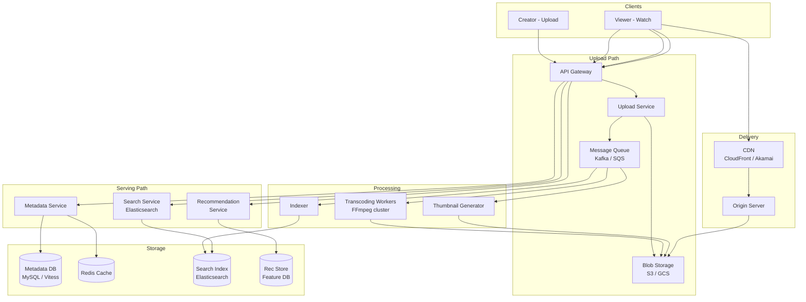

# Chapter 35 - Design a Video Streaming Platform

> YouTube ingests 500 hours of video every single minute. Netflix delivers 17% of all downstream internet traffic in North America during peak hours. Behind both sits the same brutal engineering challenge: accept a raw video file, chop it into dozens of format-resolution-bitrate combinations, scatter the pieces across a global CDN, and reassemble them on the viewer's screen with zero buffering. This chapter builds that system from scratch.

📖 [Read on Medium](#) · 🎬 [Watch on YouTube](#)

---

## 1. Requirements

Video platforms serve two very different user populations - creators uploading content and viewers consuming it. Both need scoping before you draw a single box.

### Functional Requirements

| Feature | Details |
|---|---|
| Video upload | Creators upload videos up to 12 hours long, files up to 256 GB |
| Transcoding | Convert raw uploads into multiple resolutions (1080p, 720p, 480p, 360p) and codecs (H.264, VP9, AV1) |
| Adaptive streaming | Serve video via HLS/DASH so players switch quality based on bandwidth |
| Video playback | Low-latency start, seek support, resume from last position |
| Search and discovery | Full-text search on titles, descriptions, tags |
| Recommendations | Surface relevant videos based on watch history and content similarity |
| Thumbnails | Auto-generate thumbnail sprites for preview scrubbing |
| Metadata | Title, description, tags, view count, like/dislike, comments |

### Non-Functional Requirements

| Requirement | Target |
|---|---|
| Upload availability | 99.9% - creators tolerate occasional retry |
| Playback availability | 99.99% - viewers leave after 2 seconds of buffering |
| Start latency | < 2 seconds from click to first frame |
| Transcoding latency | < 30 minutes for a 1-hour video |
| Storage durability | 99.999999999% (11 nines) - losing a creator's video is unacceptable |
| Scale | 1B DAU, 500 hours uploaded/minute, 1B hours watched/day |

### Out of Scope

- Live streaming (different pipeline - real-time transcoding, ultra-low latency)
- Short-form video (TikTok-style - different UX but similar backend)
- DRM and content protection (important but a rabbit hole)
- Monetization and ad insertion

---

## 2. Capacity Estimation

The numbers for video are staggering compared to text-based systems. Getting these right shapes every architecture decision.

### Upload Volume

```
500 hours of video uploaded per minute (YouTube's actual number)
Average video length: 5 minutes
= 6,000 uploads/minute = 100 uploads/second

Average raw file size: 1.5 GB (1080p, H.264)
= 750 GB/minute raw upload bandwidth
= 45 TB/hour
```

### Storage

```
500 hours/min x 60 min x 24 hours = 720,000 hours of video/day

Each hour of video after transcoding (all resolutions + codecs):
  1080p H.264:  ~2.5 GB
  720p  H.264:  ~1.2 GB
  480p  H.264:  ~0.6 GB
  360p  H.264:  ~0.3 GB
  + VP9/AV1 variants: ~3 GB total
  = ~7.6 GB per hour of source video

720,000 hours/day x 7.6 GB = ~5.5 PB/day of new transcoded content
Per year: ~2 EB (exabytes)
```

### Streaming Bandwidth

```
1B hours watched/day
Average bitrate: 5 Mbps (mix of mobile and desktop)
= 5 Mbps x 1B / 24 = ~208 Tbps average
Peak (3x average): ~625 Tbps
```

No single data center handles 625 Tbps. This is why CDNs exist.

### Transcoding Compute

```
100 uploads/second x 12 renditions each = 1,200 transcoding jobs/second
With average job length of 10 minutes = 720,000 concurrent transcoding jobs
```

Those numbers explain why YouTube runs one of the largest computing clusters on Earth.

---

## 3. Video Upload and Processing Pipeline

Uploading a multi-gigabyte file over a consumer internet connection is inherently unreliable. The pipeline must handle interruptions gracefully.

### Resumable Upload Protocol

The client requests an upload session, receives an `upload_id`, then sends the file in 5 MB chunks. Each chunk is acknowledged independently. If the connection drops, the client queries which chunks were received and resumes from the gap. After all chunks arrive, the client calls a completion endpoint that reassembles them and triggers the processing pipeline.

Every serious video platform uses this pattern. Google's implementation is the open-standard resumable upload protocol (tus.io is a popular open-source alternative).

### Processing Pipeline

Once the raw file lands in blob storage, an asynchronous pipeline kicks in:

```
Raw Upload -> Validation -> Transcoding -> Thumbnail Gen -> Indexing -> Available
     |            |             |               |              |
     v            v             v               v              v
  Blob Store   Format OK?   Multiple       Sprite sheet    Search index
  (S3/GCS)     Codec OK?    resolutions    Key frames      Metadata DB
               Duration?    Multiple       Preview GIFs    CDN push
               File size?   codecs
```

Each stage is a separate service consuming from a message queue. If transcoding fails, it doesn't block thumbnail generation. If indexing is slow, the video can still play - it just won't show up in search yet.

---

## 4. Video Transcoding

Transcoding is the most compute-intensive part of the system. It's where you convert a creator's raw upload into dozens of playable formats.

### Why Transcode at All?

A creator uploads a 4K ProRes file at 50 Mbps. A viewer on a phone with 3G can handle maybe 500 Kbps. You can't serve the same file. Transcoding creates a version matrix:

| Resolution | H.264 Bitrate | VP9 Bitrate | AV1 Bitrate |
|---|---|---|---|
| 1080p | 4,500 Kbps | 3,000 Kbps | 2,000 Kbps |
| 720p | 2,500 Kbps | 1,800 Kbps | 1,200 Kbps |
| 480p | 1,000 Kbps | 750 Kbps | 500 Kbps |
| 360p | 500 Kbps | 400 Kbps | 300 Kbps |

That's 12 renditions per video. Each requires a full decode-reencode pass.

### Codec Tradeoffs

| Codec | Compression | Encode Speed | Device Support |
|---|---|---|---|
| H.264 | Baseline | Fast | Everything - browsers, phones, smart TVs |
| VP9 | 30-40% better than H.264 | 10x slower | Chrome, Firefox, Android, newer smart TVs |
| AV1 | 30% better than VP9 | 100x slower | Chrome, newer devices, growing support |

YouTube invested heavily in VP9 to save bandwidth costs. Netflix pushes AV1 for the same reason. The codec choice directly impacts CDN bills.

### Parallel Transcoding with Chunked Encoding

A naive approach transcodes sequentially - one rendition at a time. A 1-hour video takes 30 minutes per rendition times 12 renditions = 6 hours. Too slow.

The production approach: split the video into segments (2-10 second chunks), transcode segments in parallel across many machines, then stitch the results:

```
Input video (1 hour)
  -> Split into 1,800 segments (2 seconds each)
  -> Distribute across 100 workers
  -> Each worker transcodes 18 segments x 12 renditions
  -> Stitch segments back into complete files
  -> Total wall-clock time: ~5 minutes instead of 6 hours
```

This is embarrassingly parallel. The main complexity is in the stitching step - segment boundaries must align perfectly for seamless playback.

---

## 5. High-Level Architecture



### Component Responsibilities

| Component | Role |
|---|---|
| **API Gateway** | Auth, rate limiting, request routing. Separates upload and playback traffic |
| **Upload Service** | Handles resumable uploads, chunk reassembly, triggers processing |
| **Blob Storage** | Raw uploads + transcoded outputs. S3 or GCS with cross-region replication |
| **Message Queue** | Decouples upload from processing. Each stage consumes independently |
| **Transcoding Workers** | Stateless FFmpeg containers. Auto-scale based on queue depth |
| **Thumbnail Generator** | Extracts key frames, generates sprite sheets for preview scrubbing |
| **Indexer** | Writes video metadata to Elasticsearch for search |
| **Metadata Service** | CRUD for video metadata - titles, descriptions, view counts |
| **Search Service** | Full-text search over video metadata via Elasticsearch |
| **Recommendation Service** | Content-based and collaborative filtering for video suggestions |
| **CDN** | Edge caches worldwide. Serves 95%+ of video bytes without hitting origin |

---

## 6. Adaptive Bitrate Streaming

This is the technology that lets you watch a video without buffering even when your bandwidth fluctuates. It's the single most important viewer-facing feature.

### How It Works

Instead of serving one monolithic video file, the server provides:

1. A **manifest file** listing all available quality levels and their segment URLs
2. The video split into **small segments** (2-10 seconds each) at each quality level

The player downloads the manifest, estimates bandwidth, picks a quality level, and starts downloading segments. If bandwidth drops mid-video, the player switches to a lower quality for the next segment. If bandwidth improves, it switches up.

### HLS vs. DASH

| Feature | HLS (Apple) | DASH (MPEG) |
|---|---|---|
| Manifest format | .m3u8 (playlist) | .mpd (XML) |
| Segment format | .ts or .fmp4 | .m4s (fmp4) |
| Codec support | H.264, HEVC, limited AV1 | Any codec |
| DRM | FairPlay | Widevine, PlayReady |
| Browser support | Safari native, others via hls.js | All modern browsers via dash.js |
| Adoption | Dominant on Apple, widely supported | YouTube, Netflix |

YouTube uses DASH. Netflix uses both (DASH for most devices, HLS for Apple). In practice, most platforms support both.

### HLS Manifest Example

```
#EXTM3U
#EXT-X-STREAM-INF:BANDWIDTH=4500000,RESOLUTION=1920x1080
1080p/playlist.m3u8
#EXT-X-STREAM-INF:BANDWIDTH=2500000,RESOLUTION=1280x720
720p/playlist.m3u8
#EXT-X-STREAM-INF:BANDWIDTH=1000000,RESOLUTION=854x480
480p/playlist.m3u8
#EXT-X-STREAM-INF:BANDWIDTH=500000,RESOLUTION=640x360
360p/playlist.m3u8
```

### ABR Algorithm

The player measures download time per segment, estimates bandwidth via EWMA, and picks the highest quality whose bitrate fits within `estimated_bandwidth x 0.85`. Buffer level acts as a modifier - below 10 seconds the player drops quality aggressively; above 30 seconds it tries stepping up.

Netflix goes further with throughput prediction, buffer-based heuristics, and per-title encoding ladders where quality levels are tuned to each video's visual complexity.

---

## 7. CDN for Video Delivery

A video platform without a CDN is a data center with a bandwidth bill that will bankrupt you. CDNs are non-negotiable at scale.

### Why CDN for Video Specifically?

- **Bandwidth cost** - Serving 208 Tbps from origin servers would cost hundreds of millions per month. CDN edge caches absorb 95-99% of traffic.
- **Latency** - A viewer in Tokyo shouldn't wait for packets from Virginia. Edge servers in Tokyo serve cached content in milliseconds.
- **Reliability** - If the origin goes down, the CDN continues serving cached content.

### CDN Architecture for Video

```
Viewer -> Nearest Edge PoP -> Regional Cache -> Origin Shield -> Origin (Blob Storage)
              |                     |                 |
         Cache HIT?           Cache HIT?         Cache HIT?
         (90% of requests)    (8% of requests)   (1.5% of requests)
```

Most video platforms use a tiered caching strategy:

| Tier | Location | Cache Hit Rate | Content |
|---|---|---|---|
| Edge PoP | 200+ cities worldwide | ~90% | Popular video segments |
| Regional Cache | 10-20 regional data centers | ~8% | Less popular content |
| Origin Shield | 1-3 central locations | ~1.5% | Single point of contact to origin |
| Origin | Blob storage | 0.5% | Everything |

### Cache Efficiency

Video popularity follows a power law - the top 1% of videos account for 30%+ of views. A small cache absorbs most traffic. But each video exists in 12+ renditions split into hundreds of segments, so the key space is enormous.

**Key optimization:** cache only the first few segments aggressively at every edge. Most viewers decide within 30 seconds whether to keep watching. Later segments can live at regional tier only.

---

## 8. Video Metadata and Search

### Metadata Schema

| Field | Type | Notes |
|---|---|---|
| video_id | UUID | Globally unique, used in URLs |
| creator_id | UUID | Foreign key to users table |
| title | VARCHAR(200) | Searchable, indexed |
| description | TEXT | Searchable, up to 5000 chars |
| tags | TEXT[] | Array of strings, searchable |
| duration_seconds | INT | Set after transcoding |
| upload_status | ENUM | pending, processing, ready, failed |
| visibility | ENUM | public, unlisted, private |
| view_count | BIGINT | Denormalized counter |
| like_count | BIGINT | Denormalized counter |
| thumbnail_url | VARCHAR | CDN URL for poster image |
| manifest_url | VARCHAR | CDN URL for HLS/DASH manifest |
| created_at | TIMESTAMP | Upload timestamp |

### View Count at Scale

"Increment a counter" sounds trivial until you have a viral video getting 100K views per second. Writing to a single database row 100K times per second will melt any RDBMS.

**Solution: batched counter updates.**

```
1. Viewer watches video -> increment Redis counter
2. Background job flushes Redis counters to MySQL every 30 seconds
3. Batch update: UPDATE videos SET view_count = view_count + 4,782 WHERE video_id = X
4. Display uses Redis value (real-time-ish) for popular videos, DB value for others
```

YouTube famously showed "301 views" for hours because they verified view legitimacy before committing counts. The verification pipeline (filtering bots, repeated views, click farms) is a system design problem in itself.

### Search Architecture

Video metadata (title, description, tags) feeds into an Elasticsearch index. Queries return ranked video_ids, which the Metadata Service hydrates with thumbnails, durations, and view counts.

Ranking factors: text relevance (BM25, title weighted 3x), popularity (views, watch time), freshness, creator authority (subscribers, channel age), and engagement (click-through rate, average watch duration).

---

## 9. Recommendation Engine Basics

Recommendations drive 70%+ of views on YouTube. The rec system is arguably more important than search.

### Content-Based Filtering

Match videos to users based on video attributes:

```
Video A: tags=[python, tutorial, flask], category=education
User watched: [python videos, web dev tutorials]
-> Recommend Video A because tags overlap
```

This works for cold-start (new users with little history) but misses non-obvious connections.

### Collaborative Filtering

"Users who watched X also watched Y":

```
User A watched: [V1, V2, V3, V5]
User B watched: [V1, V2, V3, V4]
-> Recommend V4 to User A, V5 to User B
```

At YouTube scale, you don't compare individual users - you use matrix factorization or neural embeddings to compress millions of users and videos into a shared vector space.

### Two-Stage Architecture

Production recommendation systems use a funnel:

```
Candidate Generation (broad, fast)
  -> Retrieve 1000 candidates from multiple sources
  -> Sources: collaborative filtering, content similarity,
     trending, subscriptions, topic model

Ranking (precise, expensive)
  -> Score each candidate with a neural network
  -> Features: watch history, time of day, device type,
     video age, creator relationship, engagement predictions
  -> Output: ranked list of ~50 videos
```

The candidate generation step must be fast (< 50ms) because it runs on every page load. The ranking step is more expensive but only scores 1000 candidates, not millions.

---

## 10. Thumbnail Generation

Thumbnails directly impact click-through rate. The pipeline extracts frames at 1-second intervals, scores them for brightness, sharpness, and face detection, then presents the top 3 candidates to the creator. Each thumbnail ships at multiple sizes (1280x720 down to 120x90).

For preview scrubbing (hovering over the seek bar), the system generates **sprite sheets** - grids of 25 thumbnails packed into a single JPEG. A 10-minute video needs about 12 sprite sheets totaling ~600 KB. The player uses CSS background-position offsets to display the correct frame. Far more efficient than loading 300 individual images.

---

## 11. Scaling: Storage, CDN, Processing

### Storage Strategy

| Tier | Technology | Content | Cost |
|---|---|---|---|
| Hot | SSD-backed object store | Videos < 30 days old, popular videos | $$$ |
| Warm | HDD-backed object store | Videos 30-365 days old | $$ |
| Cold | Glacier / Archive | Videos > 1 year, rarely accessed | $ |

Netflix stores popular content on SSDs at edge locations. Long-tail content lives in centralized storage and gets pulled to edge on demand.

**Deduplication** - If 1000 people upload the same clip, store it once. Use perceptual hashing (not cryptographic) to detect near-duplicates even with slight differences in encoding.

### CDN Scaling

- **Multi-CDN** - Don't rely on one provider. Netflix uses their own Open Connect appliances plus AWS CloudFront as backup. YouTube uses Google's private backbone.
- **Origin offloading** - Push popular content proactively to edge caches before demand spikes (pre-warming for a big premiere).
- **Bandwidth scheduling** - Pre-fill caches during off-peak hours (2-6 AM local time) to reduce peak origin load.

### Processing Scaling

Transcoding demand is bursty. A big creator uploading a 4K, 3-hour video generates hours of compute work. The infrastructure must auto-scale:

```
Queue depth > threshold -> spin up more transcoding workers
Queue depth < threshold -> scale down after cooldown period
Use spot/preemptible instances for transcoding (stateless, restartable)
Cost savings: 60-80% vs. on-demand instances
```

FFmpeg running on a spot instance that gets terminated? No problem - the pipeline retries from the last completed segment, not from scratch.

### Global Architecture

Deploy upload servers, transcoding clusters, and CDN origins in every major region (US-East, EU-West, AP-Southeast). Uploads land in the nearest region. Transcoded content replicates to all regions. Metadata uses single-primary with read replicas - video metadata changes are infrequent so eventual consistency is fine.

---

## Interview Tips

1. **Start with the two paths.** Upload path and playback path have completely different requirements. Separate them early.
2. **Know the numbers.** 500 hours/minute, 5.5 PB/day, 625 Tbps peak - these drive every decision.
3. **Transcoding parallelism is the key insight.** Splitting video into chunks and transcoding in parallel is what makes 30-minute turnaround possible.
4. **ABR streaming is non-negotiable.** If you serve a single bitrate, your system doesn't work for most viewers.
5. **CDN is the real serving infrastructure.** Your origin handles less than 5% of actual video traffic.
6. **Mention the encoding ladder.** Different codecs for different devices shows you understand the compression-compatibility tradeoff.
7. **Recommendations matter more than search.** 70%+ of YouTube views come from recommendations. At least mention the two-stage architecture.

---

## Code Lab

The `code/` directory contains four runnable Python demos:

| File | What It Demonstrates |
|---|---|
| `video_platform.py` | Flask API for video upload, metadata CRUD, search, and view tracking |
| `transcoding_pipeline.py` | Simulates parallel video transcoding across multiple resolutions and codecs |
| `adaptive_streaming.py` | Adaptive bitrate selection algorithm responding to bandwidth fluctuations |
| `recommendation.py` | Content-based recommendation engine using TF-IDF similarity |

See [`code/README.md`](code/README.md) for setup and usage.

---

## What's Next?

- **Chapter 36:** [Design a Notification System](../36-notification-system/) - Push, pull, and priority-based notification delivery at scale.
- **Chapter 37:** [Design a Search Autocomplete](../37-search-autocomplete/) - Trie data structures, query prediction, and real-time ranking.
