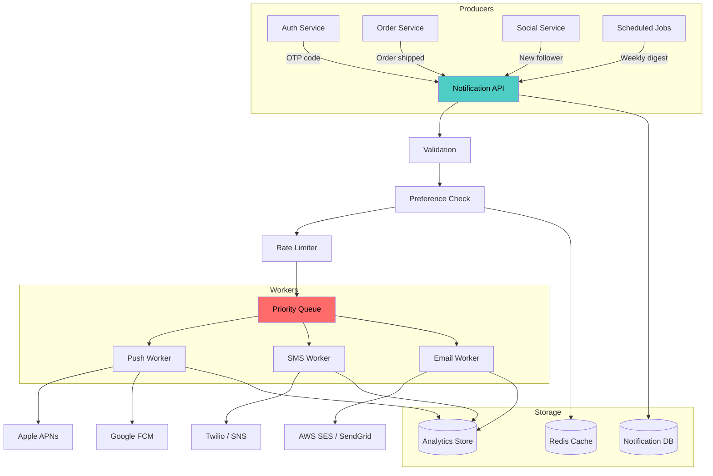
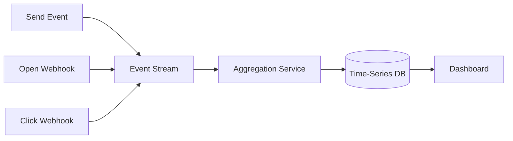

# Chapter 36 - Design a Notification System

> Every app eventually needs to poke its users - order shipped, password reset, friend request. The hard part isn't sending one notification. It's sending billions without annoying people or losing messages.

📖 [Read on Medium](#) · 🎬 [Watch on YouTube](#)

---

## Requirements

### Functional Requirements

| Requirement | Details |
|-------------|---------|
| Multi-channel delivery | Push notifications, SMS, and email |
| Templated messages | Reusable templates with variable substitution |
| User preferences | Per-user channel opt-in/opt-out |
| Priority levels | Urgent (OTP codes) vs. low priority (marketing) |
| Delivery tracking | Know if a notification was delivered, opened, or clicked |
| Rate limiting | Prevent notification spam per user |

### Non-Functional Requirements

| Requirement | Target |
|-------------|--------|
| Availability | 99.99% - users expect notifications to just work |
| Latency | Urgent: under 1 second. Normal: under 30 seconds |
| Throughput | 10M+ notifications per day |
| At-least-once delivery | Never silently drop a notification |
| Ordering | Best-effort - strict ordering isn't worth the cost |

### Back-of-the-Envelope

```
10M notifications/day
= ~115 notifications/second average
= ~1,000/second peak (10x burst)

Each notification payload: ~1 KB
Daily storage: 10M x 1 KB = 10 GB
Monthly storage: 300 GB
```

Not massive numbers. The complexity comes from reliability, preferences, and multi-channel fanout - not raw throughput.

---

## Notification Types and Channels

### Three Delivery Channels

| Channel | Best For | Latency | Cost | Open Rate |
|---------|----------|---------|------|-----------|
| **Push** | Real-time alerts, social updates | Milliseconds | Free (via APNs/FCM) | 3-10% |
| **SMS** | OTP codes, critical alerts | 1-5 seconds | $0.01-0.05/msg | 90%+ |
| **Email** | Receipts, newsletters, reports | Seconds-minutes | $0.001-0.01/msg | 15-25% |

### Notification Categories

| Category | Examples | Default Channels | Priority |
|----------|----------|-------------------|----------|
| Transactional | OTP, password reset, payment confirm | SMS + Email | Critical |
| Social | Friend request, comment, like | Push | Normal |
| Promotional | Sale, new feature, weekly digest | Email | Low |
| System | Maintenance window, policy update | Email + Push | Normal |

The category matters because it determines which channels to use, whether the user can opt out (they can't opt out of OTP codes), and how aggressively you retry.

---

## High-Level Architecture



The key insight: producers don't send notifications directly. They publish an intent ("tell user X about Y"), and the notification system handles channel selection, preferences, rate limiting, and delivery. This decoupling is what makes the system manageable.

---

## Contact Info Gathering

Before you can notify anyone, you need their contact details. This sounds obvious, but it's a data modeling problem worth thinking about.

### Contact Info Schema

```
User Contact Info
-----------------
user_id:        "u_12345"
email:          "alice@example.com"    (verified: true)
phone:          "+1-555-0123"          (verified: true)
device_tokens:  [
    { token: "abc123", platform: "ios",     app: "main", updated: "2025-01-15" },
    { token: "def456", platform: "android", app: "main", updated: "2025-02-20" }
]
```

A few things to get right:

1. **Verification status** - Don't send SMS to unverified phone numbers. You'll burn money and annoy strangers.
2. **Multiple devices** - One user can have several phones/tablets. Push notifications go to all of them.
3. **Token expiry** - Device tokens go stale. APNs and FCM will tell you when a token is invalid. Remove it immediately or you'll waste API calls.
4. **Phone number format** - Always store E.164 format (`+15550123`). No formatting, no dashes, no country-specific quirks.

---

## Notification Template System

Hardcoding notification text in every service is a maintenance disaster. Use templates.

### Template Structure

```json
{
    "template_id": "order_shipped",
    "category": "transactional",
    "channels": {
        "email": {
            "subject": "Your order {{order_id}} has shipped!",
            "body": "Hi {{user_name}}, your order is on its way. Track it here: {{tracking_url}}"
        },
        "sms": {
            "body": "Your order {{order_id}} shipped. Track: {{tracking_url}}"
        },
        "push": {
            "title": "Order Shipped",
            "body": "{{order_id}} is on its way!",
            "deep_link": "/orders/{{order_id}}"
        }
    }
}
```

### Why Templates Matter

| Without Templates | With Templates |
|-------------------|----------------|
| Copy changes require code deploys | Copy changes are a config update |
| Each service formats its own messages | Consistent formatting across all services |
| Localization is scattered everywhere | Translations live in one place |
| No way to A/B test notification text | Swap templates without touching code |

Templates also give you a natural place to enforce character limits. SMS messages over 160 characters get split into multiple segments (and cost more). Push notification bodies over ~178 characters get truncated. Your template system should warn about these limits at creation time, not at send time.

---

## Delivery Pipeline

This is the core of the system. Every notification walks through these stages:

```
Receive -> Validate -> Check Preferences -> Rate Limit -> Enqueue -> Deliver -> Track
```

### Stage 1: Validation

Reject bad requests early. Check that:
- The `user_id` exists
- The `template_id` exists
- All required template variables are provided
- The requested channels are valid

This prevents garbage from entering the queue and wasting worker time.

### Stage 2: Preference Check

Look up the user's notification preferences. If they've opted out of promotional push notifications, don't enqueue a promotional push. Simple - but skipping this step is how companies end up in the news for spamming users who explicitly opted out.

Transactional notifications (OTP, password reset) bypass preference checks. The user can't opt out of their own security.

### Stage 3: Rate Limiting

Rate limiting prevents notification fatigue and protects downstream providers:

| Limit | Scope | Example |
|-------|-------|---------|
| Per-user | Max notifications per hour per user | 10/hour |
| Per-channel | Max SMS per day per user | 5/day |
| Per-category | Max promotional per week per user | 3/week |
| Global | Max total notifications per second | 1,000/sec |

Rate-limited notifications aren't dropped - they're deferred. Put them back in the queue with a future execution time.

### Stage 4: Priority Queue

Not all notifications are equal. An OTP code that arrives 30 seconds late is useless. A marketing email that's delayed 5 minutes is fine.

| Priority | SLA | Examples |
|----------|-----|---------|
| **P0 - Critical** | Under 1 second | OTP codes, security alerts |
| **P1 - High** | Under 10 seconds | Payment confirmation, chat message |
| **P2 - Normal** | Under 5 minutes | Social updates, order status |
| **P3 - Low** | Under 1 hour | Marketing, weekly digest |

Use separate queues per priority so that a flood of marketing emails can't delay OTP codes. This is a real failure mode - if you use a single queue and marketing pushes 100K messages, your OTP codes sit behind them.

### Stage 5: Delivery

Each channel has its own worker pool because they have different:
- Connection pooling requirements (HTTP/2 for APNs, REST for others)
- Throughput limits (FCM allows 600K/min, Twilio varies by account)
- Response handling (APNs returns per-device status, SES returns per-email)
- Retry behavior (SMS providers have their own retry logic)

### Stage 6: Tracking

After sending, record the delivery status:

| Status | Meaning |
|--------|---------|
| `queued` | In the priority queue, not yet sent |
| `sent` | Handed off to the provider (APNs, Twilio, SES) |
| `delivered` | Provider confirmed delivery to device/inbox |
| `opened` | User opened the notification (email/push only) |
| `clicked` | User clicked a link or CTA |
| `failed` | Delivery failed after all retries |
| `rate_limited` | Deferred due to rate limiting |

---

## Retry and Failure Handling

Notifications fail. Provider outages, invalid tokens, network blips. Your system needs to handle this gracefully.

### Retry Strategy

Use exponential backoff with jitter:

```
Attempt 1: immediate
Attempt 2: 1 second  + random(0, 500ms)
Attempt 3: 4 seconds + random(0, 2s)
Attempt 4: 16 seconds + random(0, 8s)
Attempt 5: give up, mark as failed
```

The jitter prevents a thundering herd when a provider comes back online and thousands of retries fire simultaneously.

### Failure Categories

| Failure Type | Action | Example |
|-------------|--------|---------|
| Transient | Retry with backoff | 500 error, timeout, rate limit |
| Permanent | Don't retry, log and alert | Invalid token, bad phone number |
| Provider down | Circuit break, failover | APNs outage |

Permanent failures require cleanup. If APNs tells you a device token is invalid, remove it from your database. If an email bounces hard (address doesn't exist), mark that email as undeliverable.

### Circuit Breaker

If a provider starts failing consistently (say 50%+ failure rate over 30 seconds), stop sending to it temporarily. This:
- Prevents wasting resources on doomed requests
- Reduces load on the struggling provider (helping it recover)
- Lets you failover to a backup provider if you have one

---

## User Preferences and Opt-Out

### Preference Schema

```json
{
    "user_id": "u_12345",
    "global_enabled": true,
    "quiet_hours": { "start": "22:00", "end": "08:00", "timezone": "America/New_York" },
    "channels": {
        "email": { "enabled": true, "frequency": "instant" },
        "sms": { "enabled": true, "frequency": "instant" },
        "push": { "enabled": true, "frequency": "instant" }
    },
    "categories": {
        "social": { "email": false, "sms": false, "push": true },
        "promotional": { "email": true, "sms": false, "push": false },
        "transactional": { "email": true, "sms": true, "push": true }
    }
}
```

### Preference Rules

1. **Global kill switch** - User can disable all non-transactional notifications
2. **Per-channel control** - "Email me but don't text me"
3. **Per-category control** - "Push for social, email for promotions"
4. **Quiet hours** - Buffer notifications during sleep hours, deliver in batch when quiet hours end
5. **Frequency digest** - "Send me a daily summary instead of individual notifications"

### Legal Requirements

| Regulation | Requirement |
|------------|-------------|
| CAN-SPAM | Unsubscribe link in every marketing email. Honor within 10 days. |
| GDPR | Explicit consent for marketing. Easy withdrawal. Data deletion. |
| TCPA | Written consent for marketing SMS. Opt-out on every message. |

Don't treat legal compliance as an afterthought. Build unsubscribe into the template system. Every marketing email gets an unsubscribe link. Every SMS gets "Reply STOP to opt out." This isn't optional.

---

## Analytics

### Key Metrics

| Metric | Formula | Healthy Target |
|--------|---------|----------------|
| Delivery rate | Delivered / Sent | > 98% for email, > 99% for push |
| Open rate | Opened / Delivered | 15-25% email, 3-10% push |
| Click-through rate | Clicked / Opened | 2-5% |
| Unsubscribe rate | Unsubscribed / Delivered | < 0.5% per campaign |
| Bounce rate | Bounced / Sent | < 2% (hard bounce < 0.5%) |
| Time to deliver | P99 delivery latency | Under SLA per priority |

### Analytics Pipeline



Track open rates by template, channel, time of day, and user segment. This data tells you which notifications are valuable and which are noise. If a notification type has a 0.1% open rate, it's not providing value - cut it.

---

## Preventing Notification Fatigue

This is the hardest problem in notifications. Every product team thinks their notification is important. None of them consider the cumulative effect on the user.

### Fatigue Prevention Strategies

| Strategy | How It Works |
|----------|--------------|
| **Global rate cap** | Max N non-transactional notifications per user per day |
| **Intelligent batching** | Group related notifications: "3 people liked your post" instead of 3 separate pushes |
| **Frequency capping** | Same template to same user at most once per X hours |
| **Engagement scoring** | Track per-user engagement. Reduce frequency for disengaged users. |
| **Channel escalation** | Start with push. If not opened in 1 hour, send email. Don't do both immediately. |

### Notification Grouping

Instead of:
```
10:01 - Alice liked your photo
10:03 - Bob liked your photo
10:05 - Carol liked your photo
10:07 - Dave liked your photo
```

Send:
```
10:10 - Alice, Bob, and 2 others liked your photo
```

This requires a short delay (aggregation window) before sending. For social notifications, a 5-10 minute window is fine. For transactional notifications, don't aggregate - send immediately.

### Engagement-Based Throttling

Track how often a user interacts with notifications. If they haven't opened a push notification in 30 days, they're probably ignoring them. Reduce push frequency and lean on email instead. If they're not opening emails either, you're one step away from an unsubscribe.

```
Engagement Score:
  High (opened 5+ in last 7 days)   -> Full notification frequency
  Medium (opened 1-4 in last 7 days) -> Reduce to important only
  Low (0 opens in last 14 days)      -> Weekly digest only
  Dead (0 opens in 30+ days)         -> Stop non-transactional entirely
```

---

## Scaling Considerations

### Multi-Region Delivery

For global users, notifications need to be timezone-aware and region-aware:

- **Quiet hours** respect the user's timezone, not your server's
- **SMS routing** goes through regional providers (cheaper, faster)
- **Push notifications** go through Apple/Google regardless of region
- **Email sending IPs** need regional warm-up for deliverability

### Database Design

```sql
-- Core notifications table
notifications (
    id              UUID PRIMARY KEY,
    user_id         VARCHAR(64),
    template_id     VARCHAR(64),
    channel         ENUM('email', 'sms', 'push'),
    priority        INT,
    status          ENUM('queued', 'sent', 'delivered', 'opened', 'clicked', 'failed'),
    payload         JSONB,
    created_at      TIMESTAMP,
    sent_at         TIMESTAMP,
    delivered_at    TIMESTAMP,
    retry_count     INT DEFAULT 0,
    next_retry_at   TIMESTAMP
)

-- Partition by created_at (monthly) for efficient cleanup
-- Index on (user_id, created_at) for user history
-- Index on (status, next_retry_at) for retry worker
```

Partition the notifications table by month. Notification data has a short useful life - you don't need three-year-old delivery records in your hot path. Archive to cold storage after 90 days.

### Provider Abstraction

Never couple your code directly to Twilio or SendGrid. Wrap each provider behind an interface:

```
Channel Interface:
    send(recipient, message) -> DeliveryResult
    check_status(message_id) -> Status
    validate_recipient(address) -> bool
```

This lets you:
- Swap providers without changing business logic
- A/B test providers for cost and deliverability
- Failover automatically when one provider goes down
- Run a mock provider in development

---

## Common Interview Mistakes

| Mistake | Why It's Wrong | What to Say Instead |
|---------|---------------|---------------------|
| Single queue for all priorities | OTP codes stuck behind marketing blasts | Separate queues per priority level |
| No rate limiting | Users get 50 notifications in an hour | Per-user, per-channel, per-category limits |
| Ignoring preferences | "Just send to all channels" | Check preferences before enqueueing |
| No retry logic | First failure = permanent loss | Exponential backoff with max retries |
| Synchronous sending | API blocks until SMS is delivered | Async via queue, return 202 Accepted |
| No template system | Message text hardcoded everywhere | Centralized templates with variable substitution |
| Forgetting quiet hours | 3 AM promotional push notifications | Timezone-aware delivery windows |

---

## Key Takeaways

1. **Decouple producers from delivery** - Services publish notification intents, the notification system handles the rest
2. **Separate queues by priority** - A marketing flood should never delay an OTP code
3. **Templates are non-negotiable** - Centralize message content, enable localization, allow A/B testing
4. **Preferences are a feature, not an afterthought** - Per-channel, per-category, with quiet hours
5. **Retry with exponential backoff** - But know the difference between transient and permanent failures
6. **Fight notification fatigue actively** - Rate caps, batching, engagement scoring. Your users will thank you.
7. **Abstract your providers** - You will switch SMS/email providers. Make it painless.

---

## What's Next?

- **Chapter 37:** [Design a Distributed Cache](../37-distributed-cache/) - How Redis and Memcached work under the hood, and how to design one from scratch
