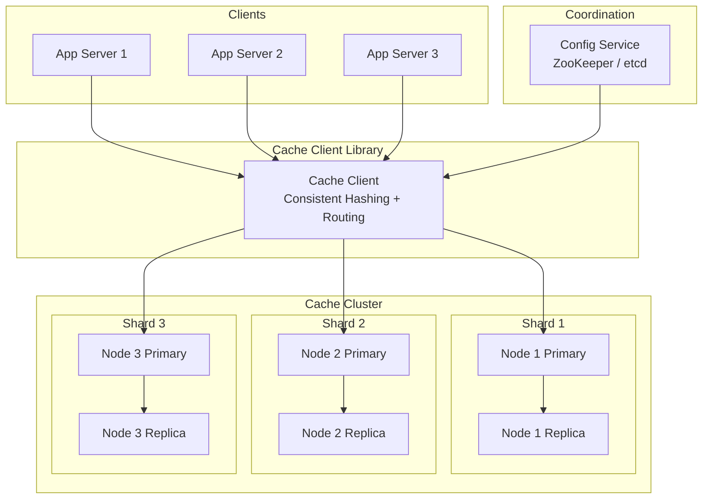

# Chapter 37 - Design a Distributed Cache

> Memcached handles 200 billion requests per day at Facebook. A single Redis instance tops out at ~100K operations per second. To serve millions of users with sub-millisecond reads, you don't need a faster cache - you need more caches working together.

[Read on Medium](#) | [Watch on YouTube](#)

---

## Table of Contents

1. [Requirements](#requirements)
2. [Single Node Cache vs Distributed Cache](#single-node-cache-vs-distributed-cache)
3. [Data Partitioning](#data-partitioning)
4. [High-Level Architecture](#high-level-architecture)
5. [Cache Client and Routing](#cache-client-and-routing)
6. [Replication for Fault Tolerance](#replication-for-fault-tolerance)
7. [Eviction Policies](#eviction-policies)
8. [Cache Warming and Preloading](#cache-warming-and-preloading)
9. [Hot Key Problem and Solutions](#hot-key-problem-and-solutions)
10. [Monitoring Cache Hit/Miss Ratio](#monitoring-cache-hitmiss-ratio)
11. [Memcached vs Redis Cluster](#memcached-vs-redis-cluster)
12. [Hands-On Code Labs](#hands-on-code-labs)
13. [What's Next?](#whats-next)

---

## Requirements

Before drawing boxes and arrows, pin down what the system actually needs to do.

### Functional Requirements

- **GET(key)** - retrieve a value by key, return null on miss
- **SET(key, value, ttl)** - store a key-value pair with an optional time-to-live
- **DELETE(key)** - remove a key explicitly
- Support for arbitrary byte strings as values (serialized JSON, protobuf, raw bytes)

### Non-Functional Requirements

| Requirement | Target | Why |
|---|---|---|
| Read latency | < 1ms p99 | Whole point of caching - if it's slow, skip it |
| Write latency | < 5ms p99 | Writes are less frequent but still need to be fast |
| Availability | 99.99% | Cache downtime means database overload |
| Throughput | 1M+ ops/sec | Must absorb traffic spikes without breaking a sweat |
| Scalability | Linear | Adding 2x nodes should give ~2x capacity |
| Data size | 1 byte to 1MB per value | Small metadata and medium-sized serialized objects |

### Out of Scope

- Complex query operations (that's a database, not a cache)
- Transactions across multiple keys
- Durable persistence (caches are ephemeral by design)

---

## Single Node Cache vs Distributed Cache

A single Redis instance is simple. One process, one hash table, no coordination. But it has hard limits:

| Constraint | Single Node | Distributed Cache |
|---|---|---|
| Memory | Limited to one machine (say, 256GB) | Aggregate memory across many machines |
| Throughput | ~100K ops/sec (Redis) | Millions of ops/sec across the cluster |
| Availability | Single point of failure | Survives node failures |
| Data set size | Fits in one server's RAM | Terabytes across the fleet |

The jump from single-node to distributed introduces three new problems: **partitioning** (which node holds which key), **routing** (how clients find the right node), and **replication** (what happens when a node dies). Everything in this chapter addresses one of these three.

---

## Data Partitioning

You have N cache nodes and millions of keys. Each key needs to live on exactly one node (before replication). The naive approach:

```
node = hash(key) % N
```

This distributes keys evenly - until you change N. Adding one server remaps roughly `(N-1)/N` of all keys. For a 10-node cluster, that's 90% of your keys suddenly pointing at the wrong server. Every remapped key becomes a cache miss, and your database gets buried under a thundering herd.

### Consistent Hashing Fixes This

Consistent hashing (covered in depth in [Chapter 20](../20-consistent-hashing/)) arranges nodes on a hash ring. Each key maps to the first node clockwise from its hash position. When you add or remove a node, only `K/N` keys move - the theoretical minimum.

```
                        0
                        |
                   N3 --+-- K1
                  /           \
                /               \
              K4                 N1
              |                   |
              |    HASH RING      |
              |                   |
              N2                 K2
                \               /
                  \           /
                   K3 --+--
                        |
                      2^32
```

**Virtual nodes** improve balance. Instead of one position per physical node, each node gets 100-200 positions on the ring. This prevents the "one node gets 40% of keys" problem that plagues small clusters with simple consistent hashing.

| Approach | Keys Moved on Node Add | Distribution Uniformity |
|---|---|---|
| Modulo hashing | ~90% (10 nodes) | Even |
| Consistent hashing (no vnodes) | ~10% | Uneven - some nodes get 3x more |
| Consistent hashing (150 vnodes) | ~10% | Within 5-10% of perfect balance |

For this design, we'll use consistent hashing with 150 virtual nodes per physical server.

---

## High-Level Architecture



The architecture has four layers:

1. **App servers** - your application code that needs cached data
2. **Cache client library** - embedded in each app server, handles hashing and routing
3. **Cache nodes** - the actual servers holding data in memory, organized as primary/replica pairs
4. **Configuration service** - tracks which nodes are alive and their ring positions

The cache client is the brains. It maintains a local copy of the hash ring, hashes each key to find the right node, and sends requests directly to that node. No proxy, no coordinator in the hot path. This is how Memcached achieves sub-millisecond latency - the client-side routing skips any extra network hop.

---

## Cache Client and Routing

The cache client library runs inside every app server. It's responsible for three things:

### 1. Ring Management

On startup, the client fetches the current cluster topology from the configuration service (ZooKeeper, etcd, or Consul). It builds a local hash ring with all node positions. When nodes join or leave, the configuration service pushes updates and the client rebuilds its ring.

### 2. Key Routing

For every GET/SET/DELETE, the client:
1. Hashes the key using a consistent hash function (e.g., xxHash, MurmurHash)
2. Finds the ring position
3. Walks clockwise to find the owning node
4. Sends the request directly to that node via TCP

```
Client request flow:

  SET("user:42", data)
       |
       v
  hash("user:42") = 0x7A3F...
       |
       v
  Ring lookup -> Node 2 (position 0x7B00)
       |
       v
  TCP connection to Node 2
       |
       v
  Node 2 stores in local hash table
```

### 3. Connection Pooling

Opening a new TCP connection for every request would be absurd. The client maintains a pool of persistent connections to each cache node. A typical pool size is 4-8 connections per node. Requests multiplex across these connections using pipelining.

### Failure Handling

When a request to a node times out or the connection breaks:

1. Mark the node as suspect
2. Retry the request on the next node clockwise (the replica, if replication is set up)
3. After 3 consecutive failures, mark the node as dead and remove it from the local ring
4. Background health checks periodically probe dead nodes and re-add them when they recover

Memcached's official clients (libmemcached, pymemcache) all implement this pattern. Redis Cluster takes a different approach - the server itself redirects clients with MOVED/ASK responses, so the client doesn't need to know the full topology upfront.

---

## Replication for Fault Tolerance

Without replication, a dead node means lost data. Every key on that node becomes a cache miss, and the database absorbs the full load. For a large cluster, losing one of ten nodes means 10% of your cache disappears instantly.

### Replication Strategy

Each key gets stored on the primary node and replicated to R-1 additional nodes (typically R=2 or R=3). The replicas are the next nodes clockwise on the hash ring, skipping nodes on the same physical rack to survive rack failures.

```
Ring with replication factor R=3:

  Key X hashes to position P
  Primary:  Node at position P (first clockwise)
  Replica 1: Next node clockwise (different rack)
  Replica 2: Next-next node clockwise (different rack)
```

### Sync vs Async Replication

| Mode | Write latency | Consistency | Data loss risk |
|---|---|---|---|
| Synchronous | Higher (wait for replicas) | Strong | None |
| Asynchronous | Lower (fire and forget) | Eventual | Small window |

For a cache, async replication is the right default. Caches are ephemeral - if you lose the last 100ms of writes, clients just get cache misses and refetch from the database. The latency savings from async replication are worth it.

### Failover

When the primary dies:
1. Replicas detect the failure (heartbeat timeout)
2. The configuration service promotes one replica to primary
3. Clients update their ring and route to the new primary
4. When the old primary recovers, it rejoins as a replica and syncs from the new primary

This is exactly how Redis Sentinel works. The failover typically completes in 1-5 seconds. During that window, requests to the affected shard either fail or get served stale data from a replica (depending on whether you allow reads from replicas).

---

## Eviction Policies

Every cache node has a fixed amount of memory. When it's full and a new key arrives, something has to go. The eviction policy decides what gets thrown out.

### LRU - Least Recently Used

Evicts the key that hasn't been accessed for the longest time. The assumption: if you haven't read it recently, you probably won't read it soon.

**Implementation:** A doubly-linked list ordered by access time, plus a hash map for O(1) lookups. Every access moves the key to the head of the list. Eviction pops from the tail.

**Pros:** Simple, works well for most workloads. Redis uses an approximated LRU (samples 5 random keys and evicts the oldest) to avoid the overhead of maintaining a full linked list.

**Cons:** Vulnerable to scan pollution. If a batch job reads every key once, it pushes all the hot keys out of cache, replacing them with cold data that never gets read again.

### LFU - Least Frequently Used

Evicts the key with the fewest total accesses. Better than LRU when access frequency matters more than recency.

**Implementation:** A frequency counter per key, with keys organized by frequency buckets. Redis 4.0+ supports LFU eviction with a decaying counter so old popularity doesn't stick forever.

**Pros:** Resistant to scan pollution. A batch scan that touches each key once won't displace a key that's been accessed 10,000 times.

**Cons:** New keys start with low frequency and get evicted immediately - even if they'd become popular given time. Redis addresses this with a "new key bonus" that gives freshly inserted keys a small initial frequency.

### TTL - Time-to-Live

Not really an eviction policy - more of a complement to one. Each key gets an expiration timestamp. When the TTL expires, the key is eligible for removal.

**Active expiration:** A background thread periodically scans for expired keys and deletes them. Redis does this 10 times per second, sampling 20 random keys with TTLs and deleting any that are expired.

**Lazy expiration:** Check the TTL on every access. If expired, delete it and return a miss. This catches keys the background scan missed.

Production systems use TTL + LRU together. TTL handles staleness (don't serve data older than 5 minutes), and LRU handles memory pressure (when full, drop the coldest data).

### Policy Comparison

| Policy | Best For | Weakness |
|---|---|---|
| LRU | General-purpose, most workloads | Scan pollution |
| LFU | Stable popularity distributions | Cold start for new keys |
| FIFO | Simple, low overhead | Ignores access patterns entirely |
| Random | Surprisingly decent, zero overhead | Unpredictable |
| TTL | Staleness control | Doesn't handle memory pressure alone |

**Recommendation:** Use LRU with TTLs. It's what Redis defaults to, what Memcached uses, and what works for 90% of real-world workloads. Switch to LFU only if you can prove scan pollution is hurting your hit rate.

---

## Cache Warming and Preloading

A cold cache is a dangerous cache. After a restart or deployment, every request is a cache miss. If your cluster handles 500K requests per second and the cache is empty, that's 500K requests per second hitting your database. Most databases won't survive that.

### Warming Strategies

**1. Preload from access logs**

Analyze yesterday's access logs, find the top 10,000 most-requested keys, and load them into the cache before routing traffic. This covers the Pareto principle - 20% of keys typically serve 80% of traffic.

```python
# Pseudocode for cache warming
top_keys = analyze_access_logs(yesterday, limit=10000)
for key in top_keys:
    value = database.get(key)
    cache.set(key, value, ttl=3600)
```

**2. Shadow traffic**

Before a new cache node takes live traffic, replay recorded production requests against it. The node fills up organically with real access patterns. Netflix does this with EVCache - new nodes warm for several minutes before entering the serving fleet.

**3. Buddy system**

A new node copies data from an existing warm node that owns adjacent ring positions. This works when you're adding capacity, not replacing a dead node.

**4. Gradual traffic shift**

Route 1% of traffic to the new node, then 5%, then 25%, then 100%. The cache fills up proportionally to the traffic it receives. The database absorbs the extra miss load from the small initial percentage without breaking a sweat.

### Warming Priority

Not all keys are equally important. Warm in this order:
1. Authentication/session tokens (every single request needs these)
2. Configuration and feature flags (checked on every page load)
3. User profile data (personalization depends on this)
4. Most-accessed content (trending items, popular products)

---

## Hot Key Problem and Solutions

Even with perfect partitioning, some keys are orders of magnitude more popular than others. A celebrity's profile, a viral tweet, a flash sale product - one key can get 100,000 requests per second while the average key gets 10. The node holding that key melts while others sit idle.

### Detecting Hot Keys

You can't fix what you can't see. Track request counts per key on each cache node. When a key's request rate exceeds a threshold (say, 1000 requests/second), flag it as hot.

Redis's `OBJECT FREQ` command returns the LFU frequency counter for a key. Memcached doesn't have this built in - you'd need client-side tracking or proxy-level metrics.

### Solution 1: Local Cache (L1 Cache)

Add a small in-process cache in each app server. Before hitting the distributed cache, check the local cache first. Hot keys get served from the app server's own memory - no network hop at all.

```
Request flow with L1 cache:

  GET("viral_tweet:123")
       |
       v
  L1 (local) cache check     <- 0.01ms, in-process
       |
   HIT? --> return
       |
   MISS
       |
       v
  L2 (distributed) cache     <- 0.5ms, network hop
       |
   HIT? --> store in L1, return
       |
   MISS
       |
       v
  Database                   <- 5ms, disk I/O
```

Keep the L1 cache small (1,000-10,000 entries) with short TTLs (5-30 seconds). You're trading consistency for throughput - the L1 cache might serve slightly stale data. For most use cases, that's a fine trade.

### Solution 2: Key Replication

Replicate the hot key across multiple cache nodes. Instead of `cache.get("viral_tweet:123")`, the client appends a random suffix: `cache.get("viral_tweet:123#3")` where `#3` is randomly chosen from 0-7. This spreads the load across 8 different cache nodes.

The write path sets all 8 copies:
```python
for i in range(8):
    cache.set(f"viral_tweet:123#{i}", value)
```

The read path picks one at random:
```python
shard = random.randint(0, 7)
value = cache.get(f"viral_tweet:123#{shard}")
```

### Solution 3: Rate Limiting + Coalescing

When multiple concurrent requests ask for the same key and all miss the cache, only let one request through to the database. The rest wait for that one request to complete and share the result. This is request coalescing (also called single-flight or collapse-forwarding).

### Which Solution to Use

| Approach | Complexity | Latency impact | Staleness risk |
|---|---|---|---|
| L1 local cache | Low | Best (no network) | Yes (short TTL) |
| Key replication | Medium | Good (distributed) | No (write to all) |
| Request coalescing | Medium | Moderate (waiting) | No |

Start with L1 local caching. It's the simplest, fastest, and handles most hot key scenarios. Add key replication if L1 isn't enough because the key changes frequently and you can't tolerate even 5 seconds of staleness.

---

## Monitoring Cache Hit/Miss Ratio

A cache you don't monitor is a cache that's silently failing. The single most important metric is the **hit ratio** - what percentage of requests find data in the cache without going to the database.

### Key Metrics

| Metric | Target | Alert Threshold |
|---|---|---|
| Hit ratio | > 95% | < 90% |
| p50 latency | < 0.5ms | > 1ms |
| p99 latency | < 2ms | > 5ms |
| Eviction rate | Low and stable | Sudden spike |
| Memory usage | < 80% of max | > 90% |
| Connection count | Stable | Sudden drop (node failure) |

### Hit Ratio Math

```
Hit ratio = cache_hits / (cache_hits + cache_misses) * 100

Effective latency = (hit_ratio * cache_latency) + (miss_ratio * db_latency)

Example:
  95% hit ratio, 0.5ms cache, 10ms DB
  = (0.95 * 0.5) + (0.05 * 10)
  = 0.475 + 0.5
  = 0.975ms effective latency    (10x better than no cache)
```

### What a Dropping Hit Rate Tells You

- **Gradual decline:** Your working set is growing beyond cache capacity. Add more nodes or increase memory.
- **Sudden drop:** A new code path is accessing keys that aren't cached yet. Check recent deployments.
- **Periodic drops:** A batch job is polluting the cache. Switch to LFU eviction or isolate batch traffic.
- **Drop after restart:** Cache warming isn't working. Fix your preloading strategy.

### Dashboard Essentials

Every distributed cache should expose these in Prometheus/Grafana or equivalent:

1. **Hit ratio over time** - the primary health indicator
2. **Latency percentiles** (p50, p95, p99) - per node and aggregate
3. **Evictions per second** - shows memory pressure
4. **Memory usage per node** - identify imbalanced shards
5. **Operations per second by type** - GET vs SET vs DELETE
6. **Connection count per node** - detect client connection issues
7. **Replication lag** - how far behind replicas are

---

## Memcached vs Redis Cluster

Both are battle-tested in production at massive scale. But they make fundamentally different trade-offs.

### Architecture Differences

| Aspect | Memcached | Redis Cluster |
|---|---|---|
| Threading | Multi-threaded | Single-threaded per shard (multi-threaded I/O in 6.0+) |
| Data structures | Strings only | Strings, hashes, lists, sets, sorted sets, streams |
| Partitioning | Client-side (consistent hashing) | Server-side (hash slots) |
| Replication | None built-in | Built-in primary/replica |
| Persistence | None | RDB snapshots + AOF append-only file |
| Memory efficiency | Slab allocator, very efficient | Overhead per key (~70 bytes) |
| Max value size | 1MB default | 512MB |
| Cluster protocol | Clients own the routing | MOVED/ASK redirections |

### When to Choose Memcached

- You only need simple key-value GET/SET
- Memory efficiency is critical (Memcached wastes less RAM per key)
- You want multi-threaded performance on beefy hardware
- You're caching serialized objects and don't need server-side data manipulation
- You need simplicity - Memcached's codebase is a fraction of Redis's

Facebook runs Memcached at enormous scale. Their TAO system uses Memcached as the caching layer for the social graph, handling billions of requests per day across thousands of servers. They chose Memcached specifically because of its memory efficiency and simplicity.

### When to Choose Redis Cluster

- You need data structures beyond strings (sorted sets for leaderboards, lists for queues)
- Built-in replication and failover matter to you
- You want Lua scripting for atomic server-side operations
- You need pub/sub messaging
- Persistence is a nice-to-have (not a requirement, but useful for cache warming)
- You want the server to handle partitioning instead of building it into every client

Twitter, GitHub, Instagram, and Pinterest all run Redis in production. Redis Cluster's built-in sharding (16,384 hash slots distributed across nodes) means you don't need a smart client library - the server tells clients where to go.

### Performance Comparison

| Benchmark | Memcached | Redis |
|---|---|---|
| GET throughput (single thread) | ~120K ops/sec | ~100K ops/sec |
| SET throughput (single thread) | ~120K ops/sec | ~80K ops/sec |
| GET throughput (multi-thread) | ~600K ops/sec | ~100K ops/sec (per shard) |
| Memory per key (100-byte value) | ~150 bytes | ~220 bytes |
| p99 latency | < 1ms | < 1ms |

Memcached wins on raw throughput because it's multi-threaded. Redis wins on features. For a pure caching use case with no data structure needs, Memcached is slightly better. For everything else, Redis Cluster is more practical because you don't have to build replication, failover, and cluster management yourself.

### The Pragmatic Answer

Use Redis Cluster unless you have a specific reason not to. The ecosystem is better (more client libraries, more monitoring tools, more operational knowledge in the industry), the feature set handles edge cases Memcached can't, and the built-in replication means one less thing to build yourself.

Use Memcached if you're at Facebook-scale and have a team to build the operational tooling around it. At that scale, the memory efficiency savings across thousands of servers justify the engineering investment.

---

## Hands-On Code Labs

The `code/` directory contains runnable Python demos:

| File | Description |
|---|---|
| `distributed_cache.py` | Multi-node cache with consistent hashing, GET/SET/DELETE operations |
| `cache_cluster.py` | Cache cluster with replication and automatic failover |
| `hot_key_solution.py` | Detecting and handling hot keys with local L1 caching |
| `cache_benchmark.py` | Benchmarks hit ratio, latency, and throughput under different workloads |

Run any lab:

```bash
cd code/
python distributed_cache.py
python cache_cluster.py
python hot_key_solution.py
python cache_benchmark.py
```

No external dependencies required - all demos use Python's standard library.

---

## What's Next?

- **Chapter 38:** [Design a Search Autocomplete](../38-autocomplete/) - Build a system that suggests search queries as the user types, handling prefix matching at scale with tries and precomputed results.

---

*Every tech giant's architecture diagram has the same box somewhere between the app servers and the database: "Cache Cluster." It's not optional at scale. The only question is how many nodes and what eviction policy.*
