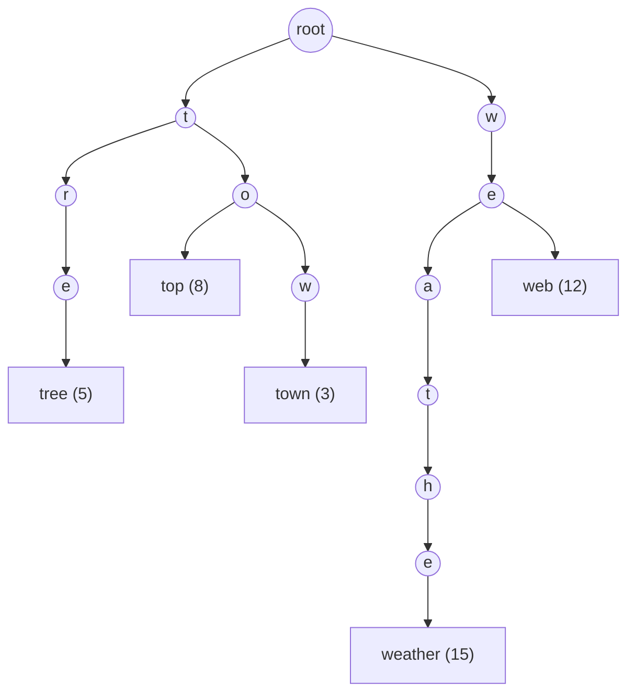
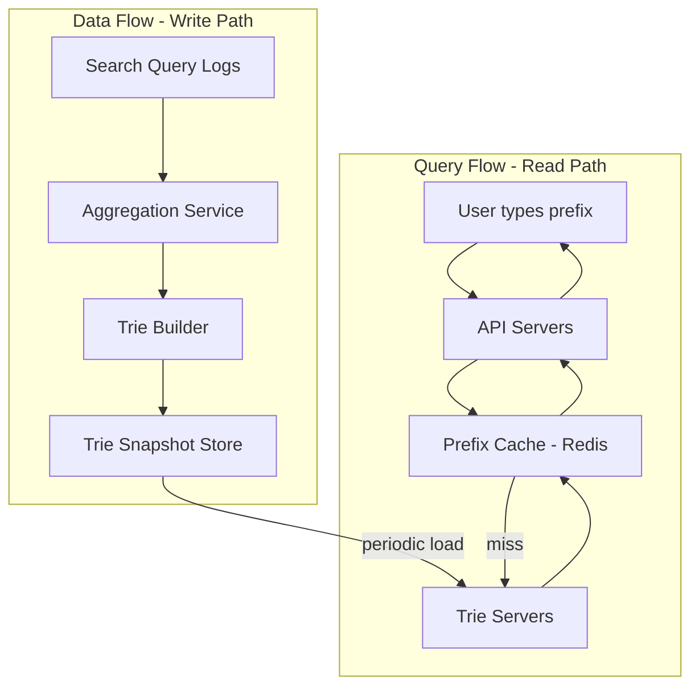
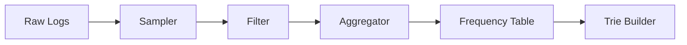
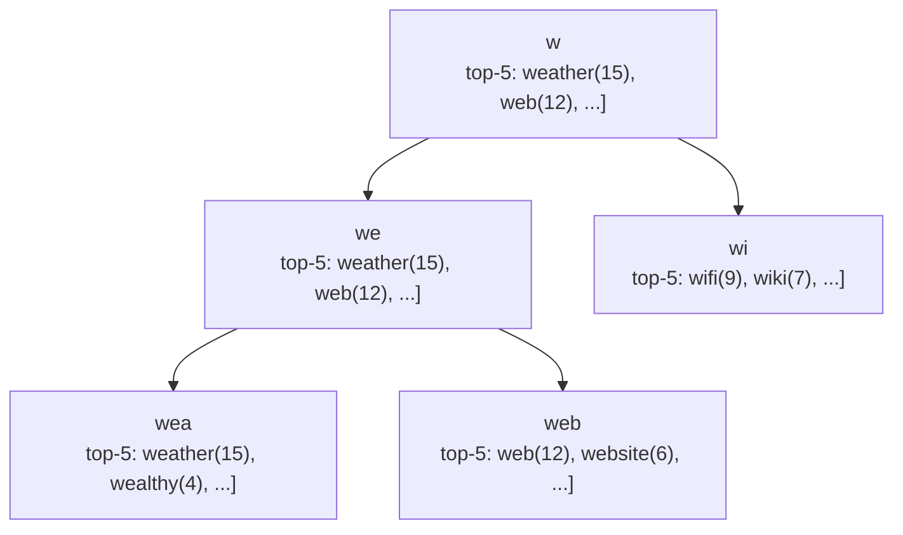
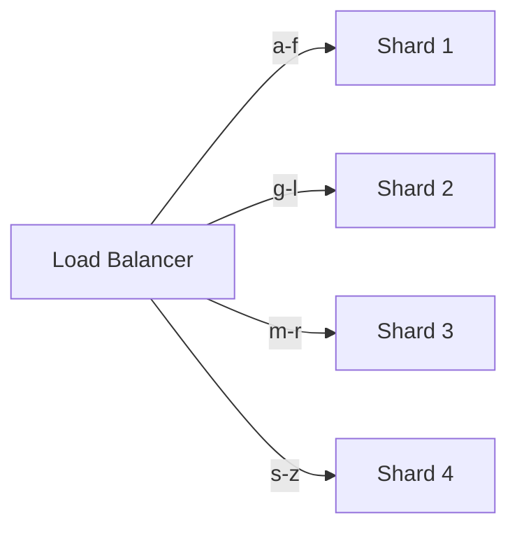
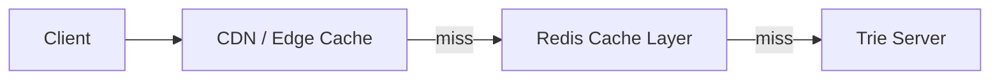
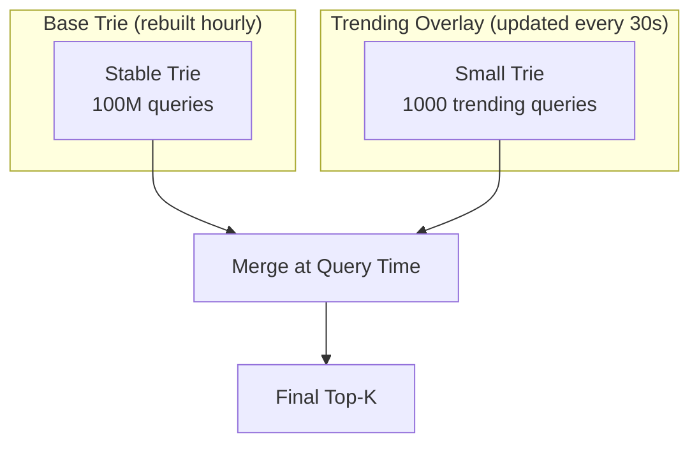
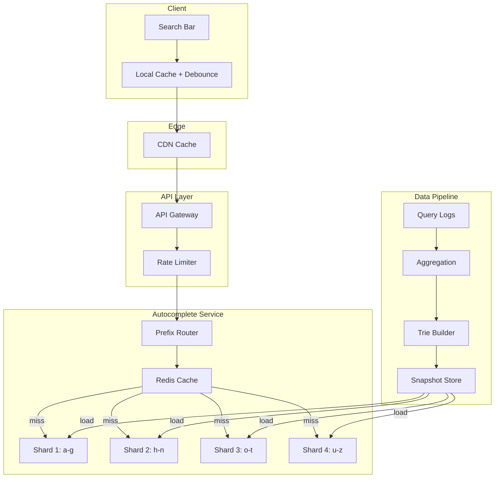

# Chapter 38 - Design a Search Autocomplete

> You type "how to" into Google and before your third keystroke, ten suggestions appear - ranked, personalized, and delivered in under 100ms. Behind that instant response is one of the most elegant data structures in computer science.

📖 [Read on Medium](#) · 🎬 [Watch on YouTube](#)

---

## What Are We Building?

A search autocomplete system - the kind you see on Google, Amazon, YouTube, and basically every search bar built after 2005. The user types a partial query, and the system returns the top-k most relevant completions in real time.

This isn't a toy problem. Google handles 8.5 billion searches per day. That's roughly 100,000 queries per second, and each query generates multiple autocomplete requests as the user types each character. The autocomplete system itself handles an order of magnitude more traffic than the actual search engine.

### Functional Requirements

| Requirement | Details |
|-------------|---------|
| Prefix matching | Given "wea", return "weather", "weather tomorrow", "wearing" |
| Top-k results | Return the k most relevant suggestions (typically k=10) |
| Low latency | Under 100ms response time - users notice anything slower |
| Personalization | Optionally factor in the user's search history |
| Multi-language | Handle queries in any language, not just English |

### Non-Functional Requirements

| Requirement | Target |
|-------------|--------|
| Availability | 99.99% - autocomplete down means the search bar feels broken |
| Scalability | 100K+ QPS at peak |
| Consistency | Eventual is fine - stale suggestions for a few minutes won't hurt |
| Storage | Billions of query strings with frequency data |

### Back-of-the-Envelope Math

Assume 10 billion queries per day, and each query triggers 5 autocomplete lookups (one per keystroke):

```
Autocomplete QPS = (10B * 5) / 86,400 = ~580,000 QPS
Peak (2x average) = ~1.16M QPS
```

If we store 100 million unique queries averaging 20 characters each:

```
Storage = 100M * 20 bytes = ~2 GB (just the strings)
With frequency counts and metadata = ~10 GB
```

That's small enough to fit in a single machine's memory, but the QPS demands sharding.

---

## The Core Data Structure: Tries

A trie (from "re**trie**val") is a tree where each node represents a character. Paths from root to leaf spell out stored strings. It's the natural choice here because prefix lookup is O(p) where p is the prefix length - completely independent of how many strings you've stored.

### Why Not a Hash Map?

A hash map can tell you if "weather" exists in O(1), but it can't tell you "give me everything that starts with 'wea'" without scanning every key. That's O(n), which is useless at 100 million entries.

A sorted array with binary search gets you to the right neighborhood in O(log n), then you scan forward. Better, but still not great when you need sub-millisecond lookups.

A trie gets you to the prefix node in O(p) and then all completions live in the subtree below. Nothing wasted.

### Basic Trie Structure



Each leaf stores the full query string and its frequency count. A search for "to" traverses root -> t -> o, then collects all completions in the subtree: "top" (8), "town" (3).

---

## High-Level Architecture

The system splits into two independent paths: the data gathering pipeline that builds the trie, and the query service that reads from it.



The read and write paths are completely decoupled. The trie servers load prebuilt snapshots - they never mutate the trie in real time. This separation is critical for performance.

---

## Data Gathering Service

Raw search logs are noisy. People misspell things, search for offensive content, and repeat queries. The aggregation pipeline cleans this up.

### Pipeline Stages



**Sampler** - You don't need every query. Sampling 1-in-10 at Google's scale still gives you statistically significant frequency data while reducing pipeline load by 10x.

**Filter** - Strip offensive queries, bot traffic, and queries below a minimum frequency threshold. A query searched once in a month isn't worth autocomplete space.

**Aggregator** - Group identical queries and sum their frequencies. Use time-weighted decay so recent queries rank higher than old ones.

### Time-Weighted Frequency

Raw frequency counts have a problem: a query that was popular six months ago but irrelevant today still ranks high. Time-weighted decay fixes this.

```
weighted_score = sum(frequency_i * decay^(t_now - t_i))
```

With a decay factor of 0.9 per week, a query's contribution halves roughly every 7 weeks. This naturally promotes trending queries and demotes stale ones.

| Query | Raw Frequency | Weighted Score | Why |
|-------|--------------|----------------|-----|
| "super bowl 2025" | 50,000 | 2,100 | Old event, decayed heavily |
| "super bowl 2026" | 12,000 | 11,400 | Recent, minimal decay |
| "weather tomorrow" | 30,000 | 28,500 | Evergreen, always searched |

---

## Trie Optimizations

A naive trie works for toy datasets but falls apart at scale. Three optimizations make it production-ready.

### 1. Compressed Trie (Patricia Trie)

A standard trie creates one node per character. Most internal nodes only have one child, wasting memory on long strings with unique prefixes.

A compressed trie merges single-child chains into one node:

```
Standard Trie:          Compressed Trie:

  w                       w
  |                       |
  e                      "eath"
  |                       |
  a                      "er"
  |
  t
  |
  h
  |
  e
  |
  r
```

This cuts node count by 50-80% in practice. For 100 million queries, that's the difference between 40 GB and 10 GB of memory.

### 2. Top-K at Each Node

The naive approach: for prefix "we", traverse to node 'e' under 'w', then DFS the entire subtree to find all completions, sort by frequency, return top 10.

The problem: if "we" has 50,000 completions, you're sorting 50,000 items per keystroke. That's way over 100ms.

The fix: precompute and cache the top-k results at every node during trie construction.



Now a lookup is O(p) to reach the node plus O(1) to read the cached results. No subtree traversal at all.

The cost: more memory (each node stores k extra strings) and longer build times. Worth it. Memory is cheap; latency isn't.

### 3. Prefix Hash Map Shortcut

For the most common prefixes (single characters, two-character combinations), skip the trie traversal entirely and use a hash map:

```
"a" -> [amazon, apple, airbnb, ...]
"am" -> [amazon, american airlines, amc, ...]
"b" -> [best buy, bank of america, bing, ...]
```

There are only 26 single-char and 676 two-char prefixes for English. Precompute all of them. This handles a disproportionate share of traffic because many users haven't typed much when autocomplete fires.

---

## Query Ranking

Frequency alone produces boring suggestions. A good autocomplete ranks by multiple signals.

### Ranking Signals

| Signal | Weight | Example |
|--------|--------|---------|
| Historical frequency | High | "weather" always popular |
| Trending / recency | Medium | "election results" spikes during elections |
| User personalization | Medium | A developer searching "python" vs a pet owner |
| Geographic relevance | Low-Medium | "pizza near me" depends on location |
| Query length | Low | Prefer shorter, more general completions |
| Freshness penalty | Negative | Suppress stale trending queries |

### Personalization

Two approaches, both practical:

**Client-side reranking** - The server returns top-20 generic suggestions. The client reranks them using locally stored search history. No privacy concerns since the history never leaves the device. This is what Google does for signed-out users.

**Server-side personalization** - For logged-in users, the server stores a per-user trie (or frequency overlay) and blends it with the global trie. The blend ratio matters - too much personalization creates a filter bubble.

```
final_score = 0.7 * global_score + 0.3 * personal_score
```

Keep it simple. A 70/30 blend works well in practice.

---

## Multi-Language and Typo Tolerance

### Multi-Language Support

Unicode makes tries language-agnostic in theory. In practice, you need to handle:

| Challenge | Solution |
|-----------|----------|
| CJK languages (no spaces) | Character-level tries instead of word-level |
| Mixed-script queries | Normalize to a canonical form (NFC) |
| RTL languages (Arabic, Hebrew) | Store left-to-right internally, render RTL at display |
| Transliteration | Index both native script and romanized forms |

The simplest approach: one trie per language/locale. Route the user to the right trie based on their language settings.

### Typo Tolerance

Autocomplete traditionally doesn't correct typos - that's the search engine's job. But users expect it now.

**Edit distance** - For each prefix, also check prefixes within edit distance 1 (one insertion, deletion, or substitution). A prefix "wether" would also match the "weather" branch.

The cost is high: edit distance 1 from a 5-char prefix generates ~130 candidate prefixes. At scale, this is too expensive to do at query time.

**Practical approach**: Precompute common misspellings during trie construction. If "wheather" appears 500 times in the logs, add it as an alias pointing to "weather". The logs already contain the typos people actually make.

---

## Scaling the System

### Sharding by Prefix

A single trie server can handle maybe 50K QPS with everything in memory. For 1M QPS, you need sharding.

Shard by the first one or two characters of the prefix:



**Problem**: Uneven distribution. Prefixes starting with 's' are far more common than 'x' in English. Naive alphabetical sharding creates hot spots.

**Fix**: Use query frequency data to split shards at balanced boundaries. Instead of a-f/g-l/m-r/s-z, it might be a-d/e-j/k-q/r-z so each shard handles roughly equal traffic.

Or better: use consistent hashing on the first two characters. This gives you automatic rebalancing when adding/removing shards.

### Caching Strategy

Most autocomplete queries hit a tiny fraction of possible prefixes. The top 10,000 prefixes cover 90%+ of traffic.



**CDN layer** - Cache autocomplete results at the edge. The response for "wea" is the same for every user in the same locale. Set TTL to 1 hour.

**Redis layer** - Cache the top 100K prefixes with a 15-minute TTL. This absorbs 95% of cache misses from the CDN.

**Browser cache** - If the user typed "wea" and then "weat", the client already has the results for "wea". The client can filter locally (if "weat" results are a subset of "wea" results) without making another request.

This last optimization is powerful. Once the client has results for a 3-character prefix, it often doesn't need to contact the server again for 4+ characters - just filter the existing list.

---

## Real-Time Updates vs Periodic Rebuilds

### Periodic Rebuild (The Standard Approach)

Most production systems don't update the trie in real time. They rebuild it periodically:

```
Every 15 minutes:
1. Aggregate new query logs
2. Merge with existing frequency data
3. Build new trie snapshot
4. Push snapshot to trie servers
5. Servers atomically swap old trie for new
```

**Why this works**: Autocomplete doesn't need to be real-time. If a query becomes trending, a 15-minute delay before it appears in suggestions is acceptable.

**Why this is better than real-time**: Concurrent writes to a trie are hard. You'd need locks, which kill read performance. Periodic rebuilds keep the read path lock-free.

### Real-Time Updates (For Trending Topics)

Sometimes 15 minutes is too slow. During breaking news, you want "earthquake" to appear in suggestions within seconds.

The hybrid approach:



Keep a small, separate trie for trending queries updated every 30 seconds. At query time, merge results from both tries. The trending trie is tiny (hundreds or thousands of entries), so updates are fast.

---

## Putting It All Together



### Request Flow

1. User types "wea" in the search bar
2. Client debounces (waits 100ms for more keystrokes), checks local cache
3. On cache miss, request goes to CDN edge
4. CDN miss forwards to API gateway
5. API gateway rate-limits and routes to autocomplete service
6. Prefix router determines shard (shard 4 handles w-z)
7. Shard checks Redis cache, then in-memory trie
8. Returns top-10 suggestions sorted by blended score
9. Response cached at every layer on the way back

Total latency budget:

| Stage | Time |
|-------|------|
| Client debounce | 100ms (intentional delay) |
| Network to CDN | 5-20ms |
| CDN to origin (on miss) | 20-50ms |
| Trie lookup | <1ms |
| Response back | 5-20ms |
| **Total (cache miss)** | **~50-90ms** |
| **Total (cache hit)** | **~5-25ms** |

---

## Common Interview Mistakes

| Mistake | Why It's Wrong | Better Answer |
|---------|---------------|---------------|
| Using a database for lookups | SQL LIKE 'wea%' at 100K QPS will melt any database | In-memory trie with precomputed top-k |
| Updating the trie in real time | Concurrent writes need locks, killing read performance | Periodic rebuild with atomic swap |
| Ignoring the debounce | Without it, every keystroke triggers a request - 10x the QPS | 100-200ms debounce on the client |
| No caching layer | The same prefixes get queried millions of times | CDN + Redis covers 95%+ of queries |
| Sorting at query time | Sorting 50K completions per request blows the latency budget | Precompute top-k at each trie node |
| Naive alphabetical sharding | "s" gets 5x more traffic than "x" | Shard by frequency-balanced ranges |

---

## Key Takeaways

1. **Tries are non-negotiable** for prefix matching at scale - hash maps and databases can't compete on prefix lookups
2. **Precompute top-k at each node** during trie construction so queries are O(prefix_length) with no sorting
3. **Separate read and write paths** - the trie servers should never mutate state; they load immutable snapshots
4. **Cache aggressively** - CDN, Redis, and client-side caching together eliminate 99% of trie lookups
5. **Debounce on the client** - this single optimization cuts QPS by 5-10x with zero infrastructure cost
6. **Shard by frequency, not alphabet** - traffic distribution across prefixes is wildly uneven

---

## What's Next?

- **Chapter 39:** [Design a File Storage System](../39-file-storage/) - how Google Drive and Dropbox sync files across devices at scale
