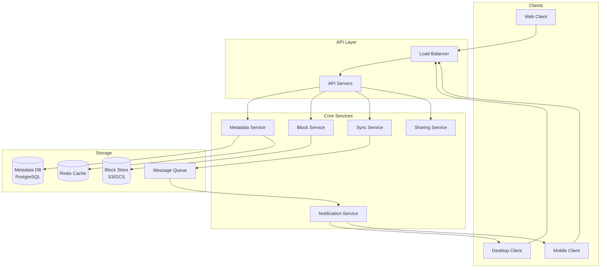
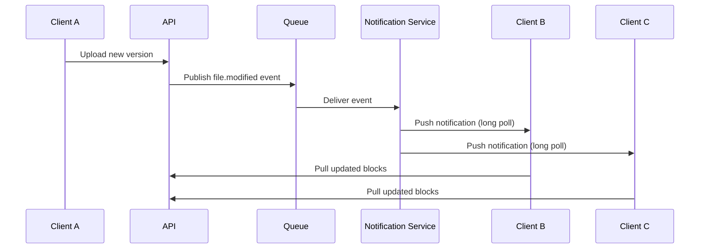

# Chapter 39 - Design a File Storage System

> Google Drive handles 2 billion files uploaded per day. Dropbox syncs 1.2 billion files daily across hundreds of millions of devices. Behind the simple "drag and drop" interface sits one of the hardest distributed systems problems - keeping billions of files consistent, available, and fast across every device on the planet.

📖 [Read on Medium](#) / 🎬 [Watch on YouTube](#)

---

## 1. Requirements

### Functional Requirements

| Feature | Description |
|---------|-------------|
| **Upload** | Users upload files up to 10 GB through web or desktop clients |
| **Download** | Users download any file they own or have access to |
| **Sync** | Changes on one device propagate to all linked devices |
| **Share** | Users share files/folders with specific people or via public links |
| **Versioning** | The system keeps a configurable number of previous versions |
| **Organization** | Users create folders and move files in a tree structure |

### Non-Functional Requirements

- **Consistency over availability** - users must never see stale files or lose data
- **Low latency sync** - changes should propagate within 5 seconds for small files
- **Durability** - 99.999999999% (eleven 9s) - losing a user's file is unforgivable
- **Bandwidth efficiency** - only transfer what actually changed, not the whole file
- **Offline support** - clients work offline and sync when connectivity returns

### Out of Scope

- Real-time collaborative editing (that's Google Docs, a different beast)
- Media transcoding or preview generation
- Full-text search across file contents

---

## 2. Capacity Estimation

### Assumptions

| Metric | Value |
|--------|-------|
| Total users | 500 million |
| Daily active users | 100 million |
| Average files per user | 200 |
| Average file size | 500 KB |
| New files uploaded per day | 2 billion |
| Peak upload rate | 50,000 files/sec |

### Storage

```
Total files:       500M users x 200 files = 100 billion files
Raw storage:       100B files x 500 KB    = 50 PB
With replication:  50 PB x 3 replicas     = 150 PB
Daily new storage: 2B files x 500 KB      = 1 PB/day
```

### Bandwidth

```
Upload bandwidth:  50,000 files/sec x 500 KB = 25 GB/sec
Download:          ~3x upload (reads > writes) = 75 GB/sec
Total bandwidth:   ~100 GB/sec = 800 Gbps
```

### Metadata

```
Metadata per file: ~500 bytes (name, path, timestamps, permissions, checksums)
Total metadata:    100B files x 500 bytes = 50 TB
```

50 TB of metadata fits comfortably in a sharded database. The real challenge is the 150 PB of raw file data - that's where block storage and deduplication earn their keep.

---

## 3. High-Level Architecture



### Component Responsibilities

| Component | Role |
|-----------|------|
| **API Servers** | Handle HTTP requests, authenticate users, route to services |
| **Metadata Service** | Manage file tree, permissions, version history |
| **Block Service** | Store and retrieve file chunks from object storage |
| **Sync Service** | Detect changes, resolve conflicts, coordinate sync |
| **Sharing Service** | Manage access control lists and shared links |
| **Notification Service** | Push real-time updates to connected clients |

---

## 4. Block Storage and Chunking

Uploading a 1 GB file as a single blob is a terrible idea. If the upload fails at 99%, you start over. If one byte changes, you re-upload the entire file. Chunking solves both problems.

### How Chunking Works

1. The client splits the file into fixed-size blocks (typically 4 MB)
2. Each block gets a SHA-256 hash as its identifier
3. The client sends the list of hashes to the server
4. The server responds with which hashes it doesn't already have
5. The client uploads only the missing blocks
6. The server records the ordered list of block hashes as the file's "recipe"

### Why 4 MB Blocks?

| Block Size | Pros | Cons |
|-----------|------|------|
| 256 KB | Fine-grained dedup, small uploads | Too many blocks per file, metadata overhead |
| 4 MB | Good balance of dedup and overhead | Slightly more re-upload on small changes |
| 64 MB | Few blocks per large file | Poor dedup, wasted bandwidth on small edits |

4 MB is the sweet spot. Dropbox uses 4 MB. Google Drive uses similar sizes internally.

### Block Upload Flow

```
Client                          Server
  |                               |
  |--- Compute block hashes ----> |
  |                               |--- Check block store
  |<-- "Need blocks 3, 7" -----  |
  |                               |
  |--- Upload block 3 ---------> |--- Store in S3
  |--- Upload block 4 ---------> |--- Store in S3
  |                               |
  |--- Commit file metadata ----> |--- Save block list to DB
  |<-- "Upload complete" ------   |
```

This approach means editing one paragraph of a 100 MB document only transfers the single 4 MB block that changed.

---

## 5. Metadata Database

### Schema Design

The metadata database stores everything except the actual file bytes. Here's the core schema:

```sql
-- Users
CREATE TABLE users (
    user_id      UUID PRIMARY KEY,
    email        VARCHAR(255) UNIQUE,
    storage_used BIGINT DEFAULT 0,
    storage_limit BIGINT DEFAULT 15737418240,  -- 15 GB free tier
    created_at   TIMESTAMP DEFAULT NOW()
);

-- Files and folders in a tree structure
CREATE TABLE file_metadata (
    file_id      UUID PRIMARY KEY,
    owner_id     UUID REFERENCES users(user_id),
    parent_id    UUID REFERENCES file_metadata(file_id),
    name         VARCHAR(255),
    is_folder    BOOLEAN DEFAULT FALSE,
    size_bytes   BIGINT,
    mime_type    VARCHAR(127),
    checksum     VARCHAR(64),
    version      INTEGER DEFAULT 1,
    created_at   TIMESTAMP DEFAULT NOW(),
    updated_at   TIMESTAMP DEFAULT NOW(),
    deleted_at   TIMESTAMP,  -- soft delete for trash
    UNIQUE(parent_id, name)  -- no duplicate names in same folder
);

-- Block list for each file version
CREATE TABLE file_blocks (
    file_id      UUID,
    version      INTEGER,
    block_index  INTEGER,
    block_hash   VARCHAR(64),
    block_size   INTEGER,
    PRIMARY KEY (file_id, version, block_index)
);

-- Version history
CREATE TABLE file_versions (
    file_id      UUID,
    version      INTEGER,
    size_bytes   BIGINT,
    checksum     VARCHAR(64),
    modified_by  UUID REFERENCES users(user_id),
    created_at   TIMESTAMP DEFAULT NOW(),
    PRIMARY KEY (file_id, version)
);

-- Sharing permissions
CREATE TABLE sharing (
    share_id     UUID PRIMARY KEY,
    file_id      UUID REFERENCES file_metadata(file_id),
    shared_with  UUID REFERENCES users(user_id),
    permission   VARCHAR(10),  -- 'viewer', 'editor', 'owner'
    shared_by    UUID REFERENCES users(user_id),
    created_at   TIMESTAMP DEFAULT NOW()
);
```

### Why PostgreSQL?

File metadata is inherently relational - files belong to folders, folders nest inside folders, permissions reference both files and users. A document store would make tree traversal painful. PostgreSQL with its recursive CTE support handles `"give me every file under /Documents"` elegantly:

```sql
WITH RECURSIVE subtree AS (
    SELECT file_id, name, is_folder
    FROM file_metadata
    WHERE file_id = :folder_id

    UNION ALL

    SELECT f.file_id, f.name, f.is_folder
    FROM file_metadata f
    JOIN subtree s ON f.parent_id = s.file_id
)
SELECT * FROM subtree;
```

### Sharding Strategy

Shard the metadata database by `owner_id`. This keeps all of a user's files on the same shard, making folder listings and tree traversals local operations. Shared files require cross-shard lookups, but sharing is far less frequent than browsing your own files.

---

## 6. Sync Protocol

Sync is the hardest part of file storage. Getting it wrong means data loss - the one thing users will never forgive.

### Change Detection

Desktop clients detect local changes using:

1. **File system watchers** - OS-level notifications (inotify on Linux, FSEvents on macOS, ReadDirectoryChangesW on Windows)
2. **Periodic polling** - a full scan every few minutes as a fallback
3. **Checksum comparison** - SHA-256 of file contents to confirm actual changes vs. just timestamp updates

### Sync Flow

```
1. Client detects local change
2. Client computes new block hashes
3. Client sends sync request: {file_id, new_version, block_hashes, parent_version}
4. Server checks parent_version matches current version
   - If match: accept update, increment version, notify other clients
   - If mismatch: CONFLICT - return current server version to client
5. Client downloads conflicting version and resolves
```

### Conflict Resolution

When two clients edit the same file simultaneously, you have three options:

| Strategy | How It Works | Used By |
|----------|-------------|---------|
| **Last-writer-wins** | Latest timestamp wins, other changes lost | Simple but dangerous |
| **Fork on conflict** | Create "file (conflict copy)" alongside original | Dropbox |
| **Merge** | Attempt automatic merge of changes | Git, Google Docs |

For a file storage system, **fork on conflict** is the right call. Automatic merging only works for text files with structured formats. Binary files like images or PDFs can't be merged. Creating a conflict copy preserves both versions and lets the user decide.

```
photos/
  vacation.jpg              <- Server version (Bob's edit)
  vacation (conflict).jpg   <- Client version (Alice's edit)
```

### Long Polling for Real-Time Updates

Clients maintain a long-poll connection to the notification service. When another device changes a file:

1. The sync service publishes a change event to the message queue
2. The notification service picks it up and pushes it to all connected clients of that user
3. Each client pulls the updated metadata and downloads changed blocks

WebSockets work too, but long polling is simpler to load balance and survives proxy configurations better.

---

## 7. Deduplication

Deduplication is free storage. If 10,000 users upload the same PDF, you store it once and keep 10,000 pointers.

### Content-Addressable Storage

Every block is identified by its SHA-256 hash. The hash IS the address. Two identical blocks - regardless of who uploaded them, what file they belong to, or what they're named - produce the same hash and map to the same stored object.

```
Block content  ->  SHA-256  ->  Storage key
"Hello world"  ->  a591a6d  ->  s3://blocks/a5/91/a591a6d...
```

### Dedup Levels

| Level | Scope | Savings |
|-------|-------|---------|
| **File-level** | Skip upload if entire file hash exists | 10-20% |
| **Block-level** | Skip upload of individual matching blocks | 30-50% |
| **Cross-user** | Same blocks across all users stored once | 50-70% |

Block-level cross-user deduplication is the most effective. In practice, Dropbox reported 75% storage savings from deduplication in their early years.

### Security Consideration

Cross-user dedup has a side channel: if the server says "I already have this block," an attacker learns that someone else has the same content. The mitigation is to require the client to prove they have the full file (not just the hash) before the server confirms the block exists. This is called a **proof of ownership** challenge.

---

## 8. File Versioning

### Version Storage

Every save creates a new version entry. But you don't duplicate the entire file - you only store the new or changed blocks. Unchanged blocks are shared across versions.

```
Version 1: [block_A, block_B, block_C, block_D]
Version 2: [block_A, block_B, block_E, block_D]  <- only block_E is new
Version 3: [block_A, block_F, block_E, block_D]  <- only block_F is new
```

Three versions of a 16 MB file (4 blocks each) only require 24 MB of storage instead of 48 MB because blocks A, B, and D are shared.

### Version Limits

| Tier | Versions Kept | Retention |
|------|--------------|-----------|
| Free | 30 days | Auto-purge after 30 days |
| Pro | 180 days | Auto-purge after 180 days |
| Business | Unlimited | Never purged unless user deletes |

### Garbage Collection

When a version is purged, its block references are removed. A background garbage collector periodically scans for blocks with zero references and deletes them from object storage. This is the same approach Git uses for loose objects - reference counting plus periodic cleanup.

---

## 9. Notifications for File Changes

### Event Types

```json
{
    "event_type": "file.modified",
    "file_id": "abc-123",
    "user_id": "user-456",
    "timestamp": "2025-01-15T10:30:00Z",
    "metadata": {
        "name": "report.docx",
        "version": 5,
        "size": 245760
    }
}
```

| Event | Trigger |
|-------|---------|
| `file.created` | New file uploaded |
| `file.modified` | Existing file updated |
| `file.deleted` | File moved to trash |
| `file.moved` | File renamed or moved to different folder |
| `file.shared` | New sharing permission added |
| `share.revoked` | Sharing permission removed |

### Notification Flow



### Fan-Out Strategy

When a file shared with 1,000 users changes, you need to notify all 1,000. Two approaches:

- **Fan-out on write** - immediately push to all 1,000 clients' notification queues. Fast delivery but expensive for widely shared files.
- **Fan-out on read** - clients periodically poll for changes. Cheaper but slower.

Hybrid approach: fan-out on write for files shared with fewer than 100 users, fan-out on read for larger groups. This is the same trade-off Twitter makes with celebrity tweets.

---

## 10. Scaling

### Block Storage Scaling

Object storage (S3, GCS) scales horizontally by design. You don't manage shards or replicas - the cloud provider handles it. The block service layer in front of it needs to scale for throughput:

- **Upload workers** - scale based on upload queue depth
- **Download workers** - scale based on download request rate
- **CDN** - cache frequently accessed blocks at edge locations

### Metadata Scaling

| Strategy | When |
|----------|------|
| **Read replicas** | Read-heavy workloads (browsing files) |
| **Sharding by user_id** | Beyond single-node write capacity |
| **Caching** | Frequently accessed folder listings |

Redis caches hot metadata - the top-level folder listings that users see on every app open. Cache invalidation triggers on any file change event.

### CDN for Downloads

Static files are perfect CDN candidates. When a user in Tokyo downloads a file originally uploaded in Virginia, the CDN serves it from its Tokyo edge node after the first request. For popular shared files (company-wide documents, public links), CDN hit rates exceed 90%.

### Rate Limiting

| Operation | Limit |
|-----------|-------|
| Upload | 100 files/min per user |
| Download | 200 files/min per user |
| API calls | 1,000 req/min per user |
| Sync polling | 1 req/sec per device |

### Storage Tiering

Not all files deserve the same storage class:

| Tier | Use Case | Cost |
|------|----------|------|
| **Hot (SSD)** | Files accessed in last 30 days | $$$ |
| **Warm (HDD)** | Files accessed in last 90 days | $$ |
| **Cold (Archive)** | Files not accessed in 90+ days | $ |

A background job migrates files between tiers based on access patterns. This alone can cut storage costs by 60% since most files are rarely accessed after the first week.

---

## Summary

| Component | Technology Choice | Why |
|-----------|------------------|-----|
| Block storage | S3/GCS | Infinite scale, 11 nines durability |
| Metadata DB | PostgreSQL (sharded) | Relational data, recursive queries |
| Cache | Redis | Sub-ms folder listings |
| Message queue | Kafka | Ordered events, replay capability |
| Notifications | Long polling | Proxy-friendly, simple to load balance |
| CDN | CloudFront/Cloudflare | Edge caching for downloads |

The key insight behind file storage design is the separation of metadata and content. Metadata is small, relational, and needs strong consistency. File content is large, immutable (blocks never change), and benefits from content-addressable storage. Treating them as two different problems with two different storage systems is what makes the architecture work.

---

## What's Next?

- **Chapter 40:** [Design a Ticket Booking System](../40-ticket-booking/) - handle seat locking, double-booking prevention, and high-concurrency flash sales for events and flights.
