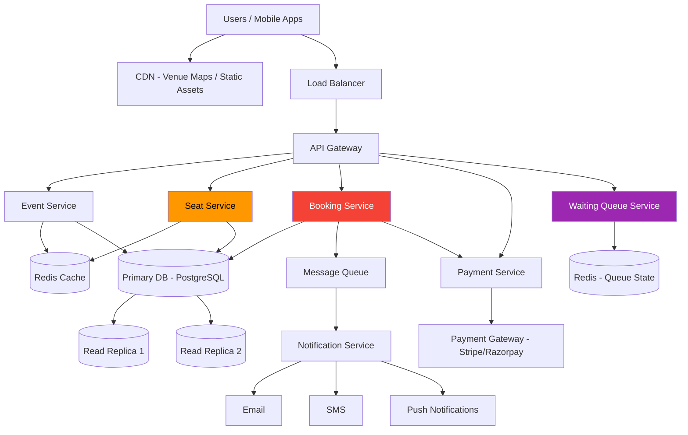
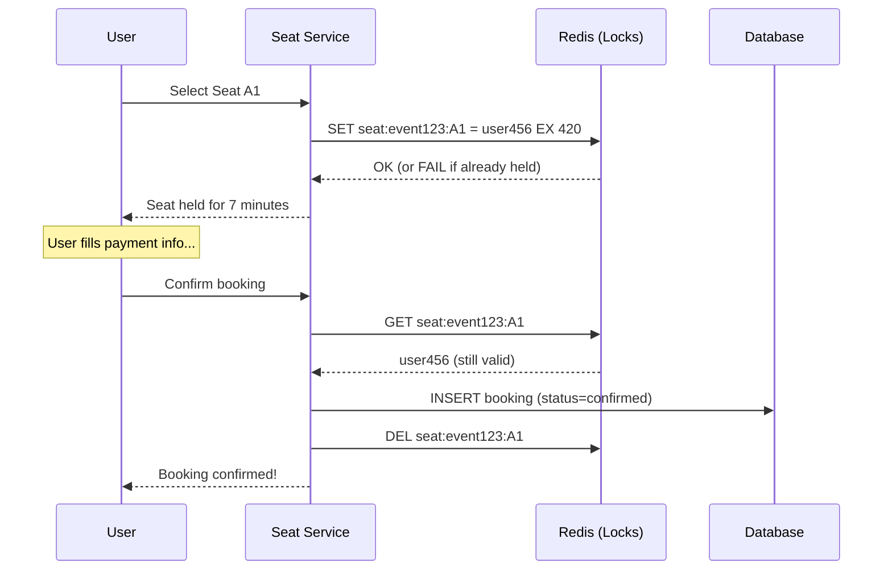
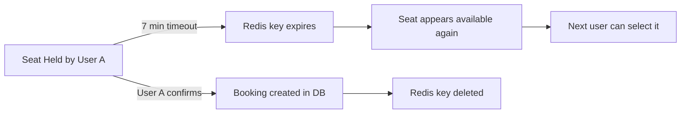
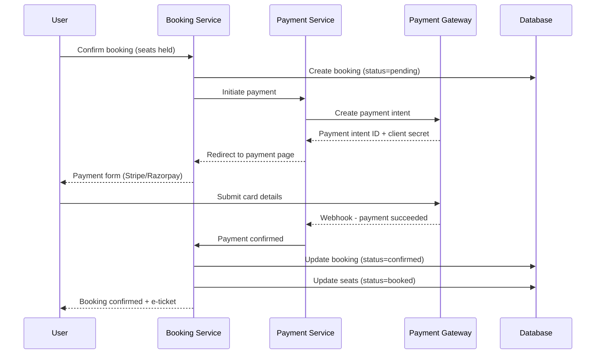
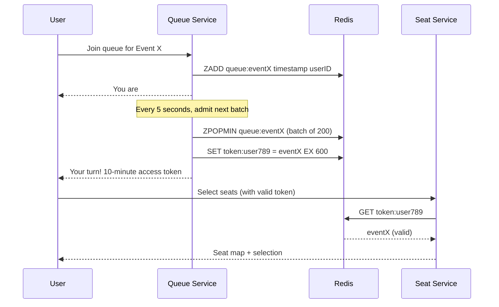
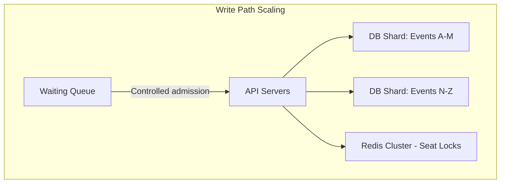
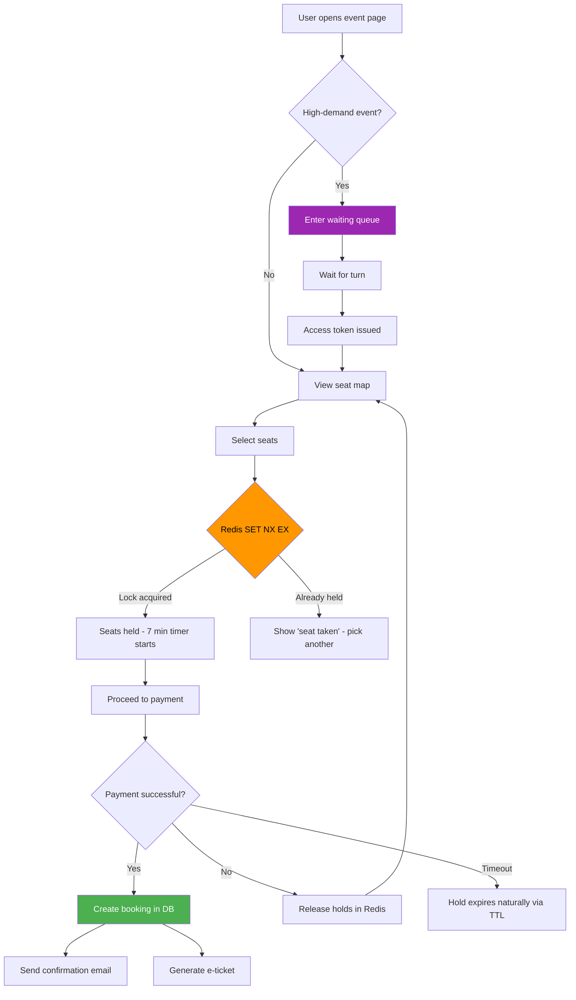

# Chapter 40 - Design a Ticket Booking System

> Every time a major concert or cricket match goes on sale, millions of users slam the system at once. Ticketmaster's Taylor Swift debacle in 2022 crashed under 14 million users fighting for 2 million seats. BookMyShow handles 10+ million concurrent users during IPL ticket drops. The ticket booking problem is the ultimate concurrency challenge - and a perfect capstone for this series.

📖 [Read on Medium](#) · 🎬 [Watch on YouTube](#)

---

## 1. Requirements

### Functional Requirements

| Requirement | Details |
|-------------|---------|
| Browse events | Search by city, date, category, artist |
| View venue map | See sections, rows, individual seats with pricing |
| Select seats | Pick specific seats or get best-available |
| Hold seats temporarily | Lock selected seats for a checkout window (e.g., 7 minutes) |
| Book and pay | Complete payment and confirm booking |
| View bookings | Users see their past and upcoming tickets |
| Cancel/refund | Time-limited cancellation policy |

### Non-Functional Requirements

| Requirement | Target |
|-------------|--------|
| Availability | 99.99% - downtime during a sale is catastrophic |
| Consistency | Strong - you can't sell the same seat twice |
| Latency | Seat map loads in under 200ms, booking confirms in under 2s |
| Concurrency | Handle 500K+ users hitting one event simultaneously |
| Fairness | First-come, first-served during high demand |
| Durability | Zero lost bookings after payment confirmation |

**The core tension:** availability vs consistency. In ticket booking, we pick consistency every time. Selling the same seat to two people is worse than a brief slowdown.

---

## 2. Capacity Estimation

Let's size a system like BookMyShow during a major event drop.

### Traffic Numbers

```
Platform stats:
- 50 million registered users
- 5 million daily active users
- 200,000 events listed at any time
- Average event: 500 seats
- Hot event (stadium concert): 80,000 seats

Peak event drop (e.g., popular artist tour):
- 2 million users hit the page in 60 seconds
- 500K concurrent seat selection attempts
- Sustained 50K booking attempts per minute for 10 minutes
```

### Storage Estimates

```
Events table:        200K events x 2 KB = 400 MB
Venues + seat maps:  5,000 venues x 50 KB avg = 250 MB
Seat inventory:      200K events x 500 seats avg = 100M rows x 100 bytes = 10 GB
Bookings:            50M bookings/year x 500 bytes = 25 GB/year
User data:           50M users x 1 KB = 50 GB

Total active storage: ~90 GB (fits comfortably in a single database)
Hot data (active events): ~2 GB (fits entirely in Redis)
```

### Bandwidth

```
Normal day:
- 5M DAU x 10 requests x 2 KB avg = 100 GB/day = ~10 Mbps

Peak event drop (60-second burst):
- 2M users x 5 requests x 5 KB = 50 GB in 60 seconds = ~7 Gbps
- This is the spike that kills naive architectures
```

**Key insight:** the storage is small, the compute is manageable, but the concurrency spike is brutal. This is a write-contention problem, not a storage problem.

---

## 3. High-Level Architecture



### Service Breakdown

| Service | Responsibility | Why it's separate |
|---------|---------------|-------------------|
| Event Service | CRUD for events, search, filtering | Read-heavy, cacheable, scales independently |
| Seat Service | Seat map, availability, temporary holds | The hottest service - needs its own scaling strategy |
| Booking Service | Orchestrates reservation-to-confirmation | Handles the critical write path |
| Payment Service | Payment gateway integration | Isolates PCI compliance scope |
| Waiting Queue Service | Fair queuing during high-demand drops | Only active during spikes, can scale to zero otherwise |
| Notification Service | Booking confirmations, reminders | Async, tolerates delay |

---

## 4. Seat Selection and Temporary Reservation

This is where most ticket systems fail. The problem: 10,000 users click on the same seat within a 2-second window. Only one gets it.

### The Hold Timer Pattern



### Hold Timer Rules

1. **Hold duration:** 7 minutes is the sweet spot. Shorter frustrates slow typers. Longer blocks inventory from other buyers.
2. **Atomic lock acquisition:** Use Redis `SET key value NX EX 420`. The `NX` flag means "only set if not exists" - this is your mutex.
3. **User identity in the lock:** Store the user ID as the value so only the holder can confirm or release.
4. **Automatic expiry:** Redis TTL handles cleanup. No cron jobs, no background sweepers.
5. **Maximum holds per user:** Cap at 6 seats to prevent hoarding.

### What Happens When a Hold Expires



**No race condition:** Redis `SET NX` is atomic. Two users clicking "select" simultaneously - one gets the lock, the other gets a "seat unavailable" response. No ambiguity.

---

## 5. Database Schema

```sql
-- Venues are reusable across events
CREATE TABLE venues (
    id          UUID PRIMARY KEY,
    name        VARCHAR(200) NOT NULL,
    city        VARCHAR(100) NOT NULL,
    capacity    INT NOT NULL,
    seat_map    JSONB NOT NULL  -- section/row/seat layout
);

-- Events happen at venues
CREATE TABLE events (
    id          UUID PRIMARY KEY,
    venue_id    UUID REFERENCES venues(id),
    title       VARCHAR(300) NOT NULL,
    artist      VARCHAR(200),
    category    VARCHAR(50),
    event_date  TIMESTAMPTZ NOT NULL,
    sale_start  TIMESTAMPTZ NOT NULL,
    status      VARCHAR(20) DEFAULT 'upcoming',  -- upcoming, on_sale, sold_out, completed
    created_at  TIMESTAMPTZ DEFAULT NOW()
);

-- Every seat for every event gets a row
CREATE TABLE event_seats (
    id          UUID PRIMARY KEY,
    event_id    UUID REFERENCES events(id),
    section     VARCHAR(20) NOT NULL,
    row         VARCHAR(10) NOT NULL,
    seat_number INT NOT NULL,
    price       DECIMAL(10,2) NOT NULL,
    status      VARCHAR(20) DEFAULT 'available',  -- available, held, booked
    version     INT DEFAULT 0,  -- for optimistic locking
    held_by     UUID,
    held_until  TIMESTAMPTZ,
    UNIQUE(event_id, section, row, seat_number)
);

-- Confirmed bookings
CREATE TABLE bookings (
    id              UUID PRIMARY KEY,
    user_id         UUID NOT NULL,
    event_id        UUID REFERENCES events(id),
    total_amount    DECIMAL(10,2) NOT NULL,
    status          VARCHAR(20) DEFAULT 'pending',  -- pending, confirmed, cancelled, refunded
    payment_id      VARCHAR(100),
    booked_at       TIMESTAMPTZ DEFAULT NOW()
);

-- Which seats belong to which booking
CREATE TABLE booking_seats (
    booking_id  UUID REFERENCES bookings(id),
    seat_id     UUID REFERENCES event_seats(id),
    price       DECIMAL(10,2) NOT NULL,
    PRIMARY KEY(booking_id, seat_id)
);

-- Index for fast seat availability queries
CREATE INDEX idx_event_seats_status ON event_seats(event_id, status);
CREATE INDEX idx_bookings_user ON bookings(user_id, booked_at DESC);
```

### Why a Row Per Seat?

You might think storing seat availability as a bitmap or a count is simpler. It's not, because:

- Users need to pick **specific seats** (not just "any 2 tickets")
- Different seats have different prices (front row vs balcony)
- The status of individual seats changes independently
- You need row-level locking for concurrency control

For a stadium with 80,000 seats across 40 events per year, that's 3.2 million rows. PostgreSQL handles this without breaking a sweat.

---

## 6. Concurrency Control

This is the heart of the system. Two strategies, each with clear trade-offs.

### Option A: Optimistic Locking (Version Numbers)

```sql
-- Read the seat and its current version
SELECT id, status, version FROM event_seats
WHERE event_id = ? AND section = ? AND row = ? AND seat_number = ?;

-- Returns: id=abc, status='available', version=3

-- Try to claim it - only succeeds if version hasn't changed
UPDATE event_seats
SET status = 'held', held_by = ?, held_until = NOW() + INTERVAL '7 minutes', version = 4
WHERE id = 'abc' AND version = 3 AND status = 'available';

-- If 0 rows updated: someone else got it first. Retry or fail.
```

**When to use optimistic locking:** low-to-medium contention. If most events have thousands of seats and hundreds of buyers, collisions are rare enough that the occasional retry is cheap.

### Option B: Pessimistic Locking (SELECT FOR UPDATE)

```sql
BEGIN;

-- Lock the row - other transactions block here
SELECT id, status FROM event_seats
WHERE event_id = ? AND section = ? AND row = ? AND seat_number = ?
FOR UPDATE;

-- If available, claim it
UPDATE event_seats
SET status = 'held', held_by = ?, held_until = NOW() + INTERVAL '7 minutes'
WHERE id = ? AND status = 'available';

COMMIT;
```

**When to use pessimistic locking:** high contention. When 10,000 users target the same 50 front-row seats, optimistic locking degenerates into a retry storm. Pessimistic locking queues them up - slower per request, but predictable throughput.

### Comparison

| Factor | Optimistic | Pessimistic |
|--------|-----------|-------------|
| Contention handling | Retry on conflict | Queue/block on conflict |
| Throughput (low contention) | Higher - no lock overhead | Lower - lock acquisition cost |
| Throughput (high contention) | Degrades (retry storms) | Stable (serialized) |
| Deadlock risk | None | Possible (mitigate with lock ordering) |
| Best for | General seat inventory | Hot seats during popular drops |

**My recommendation:** use optimistic locking as the default, and switch to pessimistic locking for events flagged as "high demand" based on waitlist size or pre-registration numbers.

---

## 7. Payment Integration Flow

Payment is the most failure-prone part of the booking pipeline. Networks drop, gateways time out, users close their browsers mid-payment. Design for every failure mode.



### Handling Payment Failures

| Failure | What Happens | Resolution |
|---------|-------------|------------|
| User abandons payment page | Hold timer expires after 7 min | Seats auto-released via Redis TTL |
| Payment gateway timeout | Booking stays in "pending" | Background job checks payment status after 30s |
| Payment declined | User notified immediately | Seats released, user can retry with different card |
| Double webhook delivery | Idempotency key on payment_id | Second webhook is a no-op |
| System crash after payment but before DB update | Inconsistent state | Reconciliation job matches payments to bookings every 5 min |

### The Idempotency Key

Every payment attempt gets a unique idempotency key (typically `booking_id + attempt_number`). If the payment gateway receives the same key twice, it returns the original result instead of charging again. This is non-negotiable - without it, you'll double-charge users during retries.

---

## 8. Preventing Double Booking and Overselling

Double booking - selling the same seat to two different users - is the cardinal sin of ticket platforms. Here's a defense-in-depth strategy.

### Layer 1: Application-Level Lock (Redis)

```
SET seat:event123:A1 user456 NX EX 420
```

First line of defense. Fast, handles 90% of concurrent access. But Redis isn't durable - if it crashes between the lock and the DB write, you lose the lock.

### Layer 2: Database Constraint

```sql
-- Unique constraint prevents two confirmed bookings for the same seat
ALTER TABLE booking_seats
ADD CONSTRAINT unique_seat_booking
UNIQUE(seat_id);

-- Only enforced for non-cancelled bookings via partial index
CREATE UNIQUE INDEX idx_active_seat_booking
ON booking_seats(seat_id)
WHERE booking_id IN (SELECT id FROM bookings WHERE status != 'cancelled');
```

Even if the Redis lock fails, the database won't allow two active bookings for the same seat. This is your safety net.

### Layer 3: Optimistic Lock in event_seats

```sql
UPDATE event_seats SET status = 'booked', version = version + 1
WHERE id = ? AND status = 'held' AND held_by = ?;
```

The status check (`status = 'held'`) and ownership check (`held_by = ?`) ensure only the rightful holder can finalize.

### Layer 4: Reconciliation Job

A background job runs every 5 minutes:

1. Find seats with `status = 'held'` where `held_until < NOW()`
2. Check if a booking exists for those seats
3. If no booking: release the seat (`status = 'available'`)
4. If booking exists but payment failed: release the seat
5. Alert on any seat that appears in two active bookings (should never happen)

**Four layers might seem excessive.** It isn't. Ticketmaster's 2022 failure showed what happens when concurrency control has gaps. Each layer catches failures that slip past the previous one.

---

## 9. Waiting Queue for High-Demand Events

When 2 million users hit a 50,000-seat event, you don't let all 2 million into the seat selection page. You queue them.

### How the Queue Works



### Queue Design Decisions

| Decision | Choice | Reasoning |
|----------|--------|-----------|
| Data structure | Redis sorted set (ZADD) | O(log N) insert, O(1) pop, natural ordering by timestamp |
| Batch size | 200 users every 5 seconds | Matches seat service throughput without overwhelming it |
| Access token TTL | 10 minutes | Enough to browse and select, short enough to cycle through queue |
| Queue position updates | Poll every 5 seconds | WebSocket is fancier but adds infrastructure complexity for a temporary feature |
| Fairness | Strict FIFO by join timestamp | Random or lottery models anger users who waited |

### Adaptive Batch Sizing

Don't use a fixed batch size. Monitor the seat service's response latency and adjust:

```
If avg response time < 100ms: increase batch to 300
If avg response time > 500ms: decrease batch to 100
If error rate > 5%: pause admissions for 10 seconds
```

This backpressure mechanism prevents the queue from overwhelming the booking pipeline.

---

## 10. Scaling Strategies

### Read Path Optimization

Most traffic is reading - browsing events, viewing seat maps, checking availability. This is the easy part.

| Strategy | What It Helps | Implementation |
|----------|--------------|----------------|
| CDN for venue maps | Static seat layout images | Serve SVG/PNG venue maps from CloudFront/Akamai |
| Redis cache for event listings | Event search and browse pages | Cache with 60s TTL, invalidate on event update |
| Read replicas | Event details, booking history | Route all SELECT queries to replicas |
| Pre-computed availability counts | "X seats remaining" badge | Redis counter decremented on booking, no DB query needed |

### Write Path Optimization

The write path - holding and booking seats - is where the real scaling challenge lives.



| Strategy | What It Helps | Trade-off |
|----------|--------------|-----------|
| Event-based sharding | Isolates hot events to dedicated DB shards | Cross-event queries need scatter-gather |
| Queue-based admission | Caps concurrent write load | Users wait in line (but it's fair) |
| Async booking confirmation | Decouple payment from seat finalization | User sees "processing" for a few seconds |
| Connection pooling (PgBouncer) | Prevent DB connection exhaustion | Adds another component to manage |

### Hot Event Isolation

When a massive event goes on sale, it shouldn't impact users booking tickets for a local comedy show. Isolate hot events:

1. **Dedicated Redis instance** for the hot event's seat locks
2. **Dedicated API server pool** behind a separate load balancer
3. **Dedicated database shard** (or even a dedicated PostgreSQL instance)
4. **Separate queue** with its own admission rate

This is over-provisioning, but for a Taylor Swift concert generating $100M+ in revenue, the infrastructure cost is negligible.

---

## System Design Interview Tips

### How to Structure Your Answer

```
1. Clarify requirements (2 min)
   - "Is this a reserved-seating or general-admission system?"
   - "Do we need real-time seat maps or just ticket counts?"
   - "What's the peak concurrency we're designing for?"

2. Capacity estimation (3 min)
   - Show you understand the spike pattern
   - Identify that this is a write-contention problem

3. High-level design (5 min)
   - Draw the core services
   - Emphasize the seat service as the critical path

4. Deep dive on concurrency (10 min)
   - Hold timer pattern with Redis
   - Optimistic vs pessimistic locking
   - Defense-in-depth against double booking

5. Scaling and trade-offs (5 min)
   - Queue-based admission for hot events
   - Eventual consistency where acceptable (read path)
   - Strong consistency where required (write path)
```

### Common Follow-Up Questions

| Question | Key Points |
|----------|-----------|
| "How do you handle 10M users for one event?" | Waiting queue with controlled admission, not raw concurrency |
| "What if Redis goes down during a sale?" | Fall back to pessimistic DB locking (slower but correct) |
| "How do you prevent bots/scalpers?" | Rate limiting, CAPTCHA, device fingerprinting, purchase limits per account |
| "What about general admission (no seat selection)?" | Simpler - just an atomic counter. `DECR available_tickets` in Redis |
| "How do you handle partial failures in payment?" | Saga pattern with compensating transactions, reconciliation jobs |

---

## Architecture Decision Records

### ADR 1: Redis for Seat Holds vs Database

**Decision:** Use Redis with `SET NX EX` for temporary seat holds.

**Why not just use the database?**
- DB transactions for 500K concurrent seat selections would create lock contention hell
- Redis handles 100K+ SET operations per second on a single node
- TTL-based expiry is built into Redis - no background sweeper needed
- If Redis loses a hold (crash/restart), the seat becomes available again - safe failure mode

**When to fall back to DB:** If Redis is down, the booking service switches to `SELECT FOR UPDATE` on the event_seats table. Throughput drops from 100K/s to 5K/s, but correctness is maintained.

### ADR 2: Waiting Queue vs Rate Limiting

**Decision:** Use a fair waiting queue instead of pure rate limiting for high-demand events.

**Why?** Rate limiting (HTTP 429) just tells users to retry, creating a thundering herd. A queue gives users a position and an estimated wait time. It converts an uncontrolled stampede into a controlled flow. Users prefer "you're #45,231, estimated wait: 8 minutes" over "try again later."

### ADR 3: Row-Per-Seat vs Availability Counter

**Decision:** One row in `event_seats` for every seat in every event.

**Why?** General admission systems can use a simple counter. But reserved seating requires per-seat state: which specific seat is held by whom, at what price, in what status. The overhead (3.2M rows for a busy venue's annual events) is trivial for PostgreSQL.

---

## Complete Request Flow

Here's the full journey from "I want tickets" to "booking confirmed":



---

## Series Complete!

Forty chapters. From "what is a load balancer?" to designing systems that handle millions of concurrent users fighting over the same seats.

Here's what you've built up across this series:

| Part | Chapters | What You Learned |
|------|----------|-----------------|
| **Fundamentals** | 1-10 | Scalability, networking, APIs, databases, caching, load balancing, queues, proxies, sharding, replication |
| **Distributed Systems** | 11-22 | CAP theorem, storage engines, search, fault tolerance, rate limiting, circuit breakers, disaster recovery, consensus, transactions, consistent hashing, bloom filters, clocks |
| **Architecture Patterns** | 23-27 | Microservices, event-driven, serverless, service mesh, data pipelines |
| **Security and Ops** | 28-30 | Auth, encryption, observability |
| **Case Studies** | 31-40 | URL shortener, chat system, news feed, and now ticket booking |

The case studies aren't separate from the fundamentals - they're the fundamentals combined. This ticket booking system used caching (Ch 5), load balancing (Ch 6), message queues (Ch 7), sharding (Ch 9), replication (Ch 10), distributed transactions (Ch 19), and rate limiting (Ch 15). Every chapter was a building block for designs like this one.

**What to do now:**
1. Pick any system you use daily - Spotify, Uber, Instagram - and design it from scratch
2. Practice with a 45-minute timer (real interview conditions)
3. Focus on trade-offs, not perfect answers - interviewers want to see your reasoning
4. Revisit specific chapters when you're weak on a concept

You don't need to memorize architectures. You need to understand the building blocks well enough to assemble them on the fly. That's what this series gave you.

Go build something.

---

## Code Lab

Hands-on demos covering the core mechanics of a ticket booking system.

| File | What It Demonstrates |
|------|---------------------|
| [`booking_system.py`](code/booking_system.py) | Flask API for events, seats, and reservations |
| [`seat_lock.py`](code/seat_lock.py) | Temporary seat holds with automatic expiry |
| [`concurrency_test.py`](code/concurrency_test.py) | Concurrent booking attempts and locking behavior |
| [`waiting_queue.py`](code/waiting_queue.py) | Fair queue with position tracking for high-demand events |

```bash
cd code/
pip install flask requests
```

See [`code/README.md`](code/README.md) for setup and running instructions.
